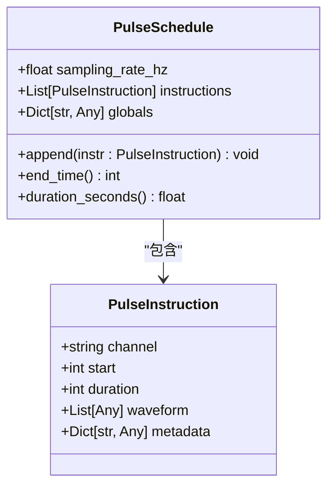
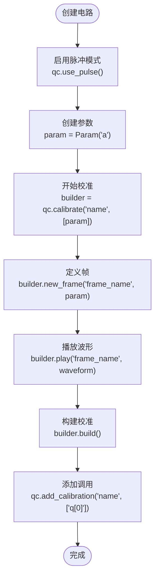
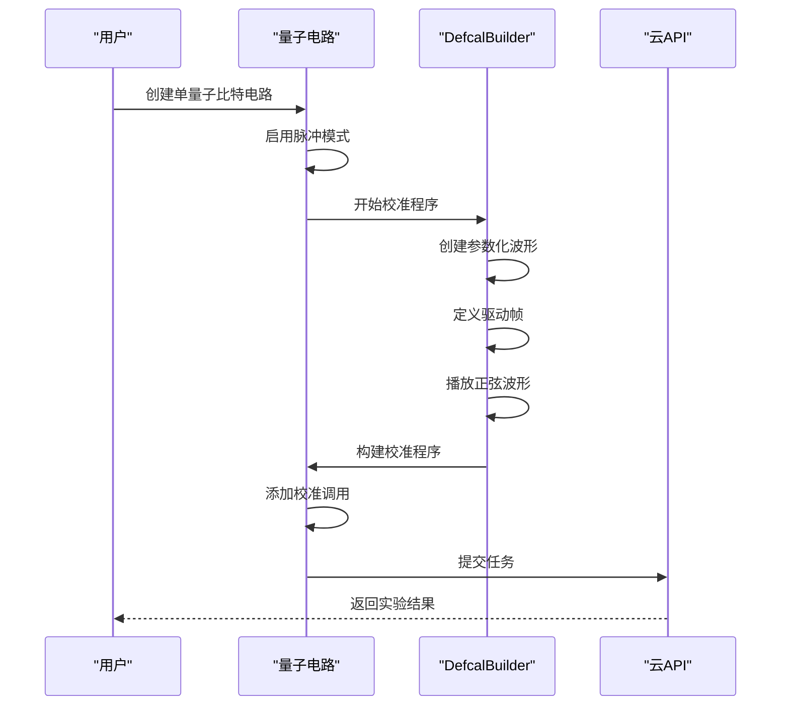

# 脉冲级控制中间表示

<cite>
**本文档引用的文件**
- [pulse.py](file://src/tyxonq/core/ir/pulse.py)
- [waveforms.py](file://src/tyxonq/waveforms.py)
- [pulse_demo.py](file://examples/pulse_demo.py)
- [pulse_demo_scan.py](file://examples/pulse_demo_scan.py)
- [pulse_support_cn.md](file://docs/pulse_support_cn.md)
</cite>

## 目录
1. [引言](#引言)
2. [脉冲级IR核心结构](#脉冲级ir核心结构)
3. [波形类型与参数详解](#波形类型与参数详解)
4. [TQASM 0.2语法规范](#tqasm-02语法规范)
5. [DefcalBuilder使用方法](#defcalbuilder使用方法)
6. [实际应用示例](#实际应用示例)
7. [最佳实践与参数约束](#最佳实践与参数约束)
8. [总结](#总结)

## 引言

TyxonQ框架提供了先进的脉冲级控制中间表示（IR），支持对量子比特进行精确的微波控制。该系统通过TQASM 0.2语法规范实现了从高级量子电路到底层脉冲指令的完整映射，使研究人员能够直接操控量子硬件的物理层信号。脉冲级控制允许用户定义自定义波形、管理帧系统并构建复杂的校准程序，从而实现高精度的量子门操作和量子态制备。

本框架的核心优势在于其灵活性和精确性，能够支持多种波形类型（如cosine_drag、flattop、gaussian、sine等），并通过参数化设计实现动态控制。这种底层访问能力对于实现高级量子算法、优化量子门保真度以及进行量子硬件表征至关重要。

## 脉冲级IR核心结构

TyxonQ的脉冲级IR由两个核心数据结构组成：PulseInstruction和PulseSchedule，它们共同构成了脉冲控制的基础。



**图示来源**
- [pulse.py](file://src/tyxonq/core/ir/pulse.py#L7-L63)

**脉冲指令（PulseInstruction）** 是最基本的控制单元，包含以下字段：
- **channel**: 硬件通道标识符（如"d0"、"u1"）
- **start**: 以采样单位表示的开始时间（整数ticks）
- **duration**: 以采样单位表示的持续时间（ticks）
- **waveform**: 实数或复数幅度样本
- **metadata**: 描述脉冲的任意元数据（形状、振幅、sigma等）

**脉冲时序（PulseSchedule）** 是定时脉冲指令的集合，包含：
- **sampling_rate_hz**: 用于时间转换的赫兹采样频率
- **instructions**: 按顺序排列的脉冲指令列表
- **globals**: 用于模板扩展或后端的可选全局参数

PulseSchedule提供了append方法来添加指令，end_time方法返回时序结束时间，duration_seconds方法基于采样率返回以秒为单位的时序持续时间。

**本节来源**
- [pulse.py](file://src/tyxonq/core/ir/pulse.py#L7-L63)

## 波形类型与参数详解

TyxonQ支持多种预定义的脉冲波形类型，每种波形都有特定的物理意义和应用场景。以下是所有支持波形的详细参数定义。

### 波形参数总览

| 序号 | 波形类型 | 参数结构 | 主要用途 |
|------|----------|----------|----------|
| 1 | cosine_drag | CosineDrag(振幅, 持续时间, 相位, α系数) | 抑制泄漏态跃迁的精确控制 |
| 2 | flattop | Flattop(振幅, 宽度, 持续时间) | 平顶脉冲，量子态制备 |
| 3 | gaussian | Gaussian(振幅, 持续时间, 标准差) | 高斯脉冲，平滑过渡 |
| 4 | sine | Sine(振幅, 频率, 持续时间) | 正弦脉冲，周期性振荡 |
| 5 | drag | Drag(振幅, 持续时间, 标准差, β参数) | DRAG协议，超导量子比特控制 |
| 6 | constant | Constant(振幅, 持续时间) | 常数脉冲，直流偏置 |
| 7 | gaussian_square | GaussianSquare(振幅, 持续时间, 标准差, 宽度) | 高斯边缘方波 |

### 详细参数说明

#### CosineDrag波形
- **amp**: 波形振幅，控制强度，约束条件为|amp| ≤ 2
- **duration**: 脉冲长度（以采样周期为单位），约束条件为0 < duration < 10000
- **phase**: 相位角（弧度），控制波形相位偏移
- **alpha**: DRAG系数，用于抑制泄漏态跃迁，约束条件为|alpha| ≤ 10

数学表达式：
- g(x) = (Amp / 2) × e^(i × phase) × [cos((2πx / duration) - π) + 1]
- output(x) = g(x) + i × alpha × g'(x)
- 定义域: x ∈ [0, duration)

#### Flattop波形
- **amp**: 波形振幅，控制整体强度，约束条件为amp ≤ 2
- **width**: 高斯分量的半高全宽(FWHM)，控制高斯边缘宽度，约束条件为width ≤ 100
- **duration**: 脉冲持续时间，控制平顶部分长度，约束条件为duration ≤ 100,000

数学表达式：
- σ = width / √(4 log 2) (标准差)
- output(x) = (A / 2) × [erf((w + T - x) / σ) - erf((w - x) / σ)]
- 定义域: x ∈ [0, T + 2w)

#### Gaussian波形
- **amp**: 波形振幅，控制强度，约束条件为|amp| ≤ 2
- **duration**: 脉冲持续时间（以采样周期为单位），约束条件为0 < duration < 10000
- **sigma**: 高斯波形的标准差，控制波形宽度

数学表达式：
- f'(x) = exp(- (1/2) × ((x - duration/2)² / sigma²))
- f(x) = A × f'(x) 当 0 ≤ x < duration
- A = amp × exp(i × angle)

#### Sine波形
- **amp**: 正弦波振幅，波形范围为[-amp, amp]，约束条件为|amp| ≤ 2
- **frequency**: 正弦波频率（采样周期的倒数）
- **duration**: 脉冲长度（以采样周期为单位），约束条件为0 < duration < 10000

数学表达式：
- f(x) = A sin(2π × freq × x + phase) 当 0 ≤ x < duration
- A = amp × exp(i × angle)

**本节来源**
- [waveforms.py](file://src/tyxonq/waveforms.py#L1-L97)
- [pulse_support_cn.md](file://docs/pulse_support_cn.md#L150-L300)

## TQASM 0.2语法规范

TQASM 0.2是TyxonQ框架的脉冲级量子汇编语言，采用巴科斯-诺尔范式(BNF)定义语法结构，提供了一种标准化的方式来描述脉冲级量子操作。

### 语法结构

```bnf
<pulse> ::= <defcal>

<defcal> ::= "defcal" <id> <idlist> { <calgrammar> }

<calgrammar> ::= <calstatement>
               | <calgrammar> <calstatement>

<calstatement> ::= <framedecl>
                | <waveformplay>

<framedecl> ::= "frame" <id> "=" "newframe" (<idlist>);

<waveformplay> ::= "play" (<id>, <waveform>);

<waveform> ::= <id> (<explist>)
```

### 关键字说明

| 关键字 | 功能描述 | 语法格式 |
|--------|----------|----------|
| `defcal` | 定义自定义参数化波形量子门 | `defcal <门名称> <参数列表> { <校准语句> }` |
| `frame` | 声明一个变量为帧类型 | `frame <帧名称> = newframe(<量子比特>);` |
| `newframe` | 在目标量子比特上创建新帧，用于承载波形 | `newframe(<量子比特标识>)` |
| `play` | 在指定帧上播放波形 | `play(<帧名称>, <波形函数>(<参数>));` |

### 完整示例

```tqasm
TQASM 0.2;
QREG q[1];

defcal hello_world a {
  frame drive_frame = newframe(a);
  play(drive_frame, cosine_drag(50, 0.2, 0.0, 0.0));
}

hello_world q[0];
```

代码解析：
1. **TQASM 0.2;** - 声明使用TQASM 0.2版本
2. **QREG q[1];** - 定义1个量子比特的寄存器
3. **defcal hello_world a { ... }** - 定义名为"hello_world"的校准程序，参数为"a"
4. **frame drive_frame = newframe(a);** - 在量子比特"a"上创建名为"drive_frame"的帧
5. **play(drive_frame, cosine_drag(50, 0.2, 0.0, 0.0));** - 在帧上播放余弦DRAG波形
6. **hello_world q[0];** - 调用校准程序，作用于量子比特q[0]

**本节来源**
- [pulse_support_cn.md](file://docs/pulse_support_cn.md#L50-L150)

## DefcalBuilder使用方法

DefcalBuilder是创建量子比特校准程序的核心工具，提供了构建复杂脉冲序列的高级API。

### 基本工作流程



**图示来源**
- [pulse_demo.py](file://examples/pulse_demo.py#L30-L50)
- [pulse_support_cn.md](file://docs/pulse_support_cn.md#L350-L376)

### 代码实现

```python
from tyxonq import Circuit, Param

# 创建电路并启用脉冲模式
qc = Circuit(1)
qc.use_pulse()

# 创建参数
param0 = Param("a")

# 开始构建校准程序
builder = qc.calibrate("calibration_name", [param0])

# 定义帧
builder.new_frame("drive_frame", param0)

# 播放波形
builder.play("drive_frame", waveforms.CosineDrag(param0, 0.2, 0.0, 0.0))

# 构建校准程序
builder.build()
```

DefcalBuilder的工作流程包括：
1. 通过`calibrate`方法开始定义校准程序，指定名称和参数列表
2. 使用`new_frame`方法在指定量子比特上创建新的帧
3. 通过`play`方法在帧上播放指定波形
4. 调用`build`方法完成校准程序的构建
5. 使用`add_calibration`方法在电路中调用校准程序

**本节来源**
- [pulse_demo.py](file://examples/pulse_demo.py#L30-L50)
- [pulse_support_cn.md](file://docs/pulse_support_cn.md#L350-L376)

## 实际应用示例

### Rabi振荡实验

Rabi振荡实验是量子控制中的基础实验，用于测量量子比特的Rabi频率。通过参数扫描不同脉冲持续时间，可以观察量子态在|0⟩和|1⟩之间的周期性振荡。



**图示来源**
- [pulse_demo_scan.py](file://examples/pulse_demo_scan.py#L1-L48)
- [pulse_support_cn.md](file://docs/pulse_support_cn.md#L500-L550)

### DRAG脉冲优化

DRAG（Derivative Removal by Adiabatic Gate）脉冲是一种高级控制技术，用于抑制量子比特从|1⟩态到|2⟩态的泄漏跃迁。通过优化DRAG参数，可以显著提高量子门的保真度。

```python
def create_optimized_drag_pulse():
    """创建优化的DRAG脉冲"""
    qc = Circuit(1)
    qc.use_pulse()
    
    param_qubit = Param("q")
    
    # 使用DRAG协议抑制泄漏态跃迁
    drag_wave = waveforms.Drag(
        duration=100,    
        amp=1.0,         # 振幅
        sigma=20,        # 高斯标准差
        beta=0.5         # DRAG参数，抑制泄漏态
    )
    
    builder = qc.calibrate("optimized_drag", [param_qubit])
    builder.new_frame("drive_frame", param_qubit)
    builder.play("drive_frame", drag_wave)
    builder.build()
    
    qc.add_calibration('optimized_drag', ['q[0]'])
    return qc
```

**本节来源**
- [pulse_demo_scan.py](file://examples/pulse_demo_scan.py#L1-L48)
- [pulse_support_cn.md](file://docs/pulse_support_cn.md#L550-L600)

## 最佳实践与参数约束

### 参数使用注意事项

1. **时间单位**: 所有时间相关参数（duration, width等）都以采样周期为单位
2. **振幅限制**: 大多数波形的振幅都限制在[-2, 2]范围内
3. **参数类型**: 支持数值和参数化两种输入方式
4. **约束检查**: 系统会自动检查参数是否满足约束条件
5. **物理意义**: 参数值应根据具体的量子硬件特性进行调整
6. **复数相位**: 部分波形支持复数相位因子（angle参数），用于精细相位控制
7. **定义域**: 注意每种波形的定义域范围，确保参数设置合理

### 波形选择指南

- **CosineDrag**: 适用于需要抑制泄漏态跃迁的精确控制，如单比特门操作
- **Flattop**: 适用于需要平顶脉冲的应用，如量子态制备
- **Gaussian**: 适用于需要平滑过渡的脉冲，如绝热演化
- **Sine**: 适用于需要周期性振荡的应用，如Rabi振荡实验
- **Drag**: 适用于超导量子比特的精确控制
- **Constant**: 适用于简单的常数脉冲，如直流偏置
- **GaussianSquare**: 适用于需要高斯边缘的方波脉冲

### 故障排除

**常见问题及解决方案：**
1. **波形类型不支持**: 确保使用预定义的波形类型
2. **参数类型错误**: 检查参数是否为Param类型或数值
3. **帧未定义**: 确保在播放波形前定义了帧
4. **TQASM生成失败**: 检查校准程序的构建顺序

**本节来源**
- [pulse_support_cn.md](file://docs/pulse_support_cn.md#L300-L350)

## 总结

TyxonQ框架的脉冲级控制中间表示提供了一套完整的工具链，用于实现对量子比特的精确微波控制。通过PulseInstruction和PulseSchedule数据结构，系统能够精确描述脉冲时序和波形特征。支持的多种波形类型（如cosine_drag、flattop、gaussian、sine等）满足了不同量子控制场景的需求。

TQASM 0.2语法规范为脉冲级操作提供了标准化的描述语言，而DefcalBuilder则提供了高级API来构建复杂的校准程序。这些功能的结合使得研究人员能够实现从基础的Rabi振荡实验到高级的DRAG脉冲优化等各种量子控制应用。

最佳实践建议从简单的示例开始，逐步构建更复杂的脉冲序列，并注意参数约束和物理意义。随着量子硬件的发展，脉冲级控制将在提高量子门保真度、实现新型量子算法和进行量子硬件表征方面发挥越来越重要的作用。

**本节来源**
- [pulse_support_cn.md](file://docs/pulse_support_cn.md#L600-L619)