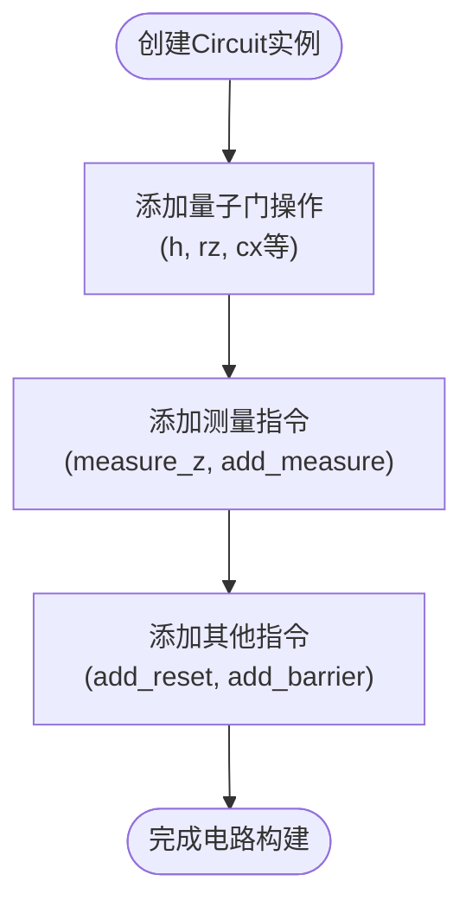
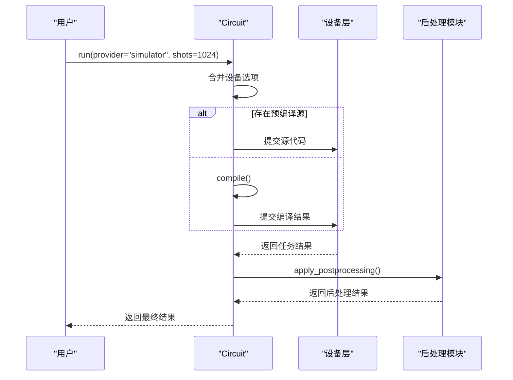

# 量子电路中间表示

<cite>
**本文档引用的文件**
- [circuit.py](file://src/tyxonq/core/ir/circuit.py)
- [test_core_ir.py](file://tests_core_module/test_core_ir.py)
- [circuit_chain_demo.py](file://examples/circuit_chain_demo.py)
</cite>

## 目录
1. [引言](#引言)
2. [Circuit类结构与核心属性](#circuit类结构与核心属性)
3. [电路构建与不可变性设计](#电路构建与不可变性设计)
4. [链式API实现机制](#链式api实现机制)
5. [电路验证与辅助方法](#电路验证与辅助方法)
6. [核心方法详解](#核心方法详解)
7. [使用示例](#使用示例)
8. [结论](#结论)

## 引言
TyxonQ框架中的量子电路中间表示（IR）是连接编译器、设备和后处理模块的核心契约。`Circuit`类作为该IR的实现，提供了一个轻量级、灵活且结构稳定的接口，用于描述量子电路的结构和行为。本文档深入解析`Circuit`类的设计原理、核心属性和关键方法，为开发者提供对底层工作原理的清晰理解。

## Circuit类结构与核心属性
`Circuit`类是量子电路的最小中间表示，其设计旨在保持结构的简洁性和灵活性，同时为编译器、设备和后处理模块提供一个稳定的契约。

### 核心字段
`Circuit`类定义了四个核心字段，用于描述电路的基本信息和操作序列。

**Section sources**
- [circuit.py](file://src/tyxonq/core/ir/circuit.py#L64-L70)

- **num_qubits**: 表示电路中的量子比特数量。该属性在初始化时必须指定，且必须为非负整数。
- **ops**: 一个操作描述符序列，其具体类型由后端或编译器解释（例如，门元组、IR节点对象）。保持其通用性允许IR在演进的同时，测试可以锻炼结构契约。
- **metadata**: 一个字典，用于存储电路的元数据。默认为空字典，可通过`with_metadata`方法进行更新。
- **instructions**: 一个指令列表，每个指令由一个名称和一个量子比特索引元组组成。用于表示测量、重置和屏障等非门操作。

### 配置选项字典
除了核心字段，`Circuit`类还维护了三个内部字典，用于存储链式配置阶段的选项。

**Section sources**
- [circuit.py](file://src/tyxonq/core/ir/circuit.py#L110-L140)

- **_compile_opts**: 存储编译阶段的选项，如编译引擎、输出格式和目标设备。
- **_device_opts**: 存储设备阶段的选项，如设备提供者、设备名称和采样次数。
- **_post_opts**: 存储后处理阶段的选项，如后处理方法和相关参数。

这些字典在`__init__`方法中通过全局默认值和构造函数参数进行初始化，确保了配置的灵活性和一致性。

## 电路构建与不可变性设计
`Circuit`类提供了多种方式来构建和修改量子电路，同时遵循不可变性设计原则。

### 电路构建
量子电路可以通过`Circuit`类的构造函数和一系列链式方法进行构建。

**Section sources**
- [circuit.py](file://src/tyxonq/core/ir/circuit.py#L576-L612)
- [circuit_chain_demo.py](file://examples/circuit_chain_demo.py#L48-L55)



**Diagram sources**
- [circuit.py](file://src/tyxonq/core/ir/circuit.py#L576-L612)

### 不可变性设计
`Circuit`类在设计上遵循不可变性原则，即一旦创建，其核心属性（如`num_qubits`、`ops`、`metadata`和`instructions`）不应被直接修改。相反，修改操作通过返回一个新的`Circuit`实例来实现。

**Section sources**
- [circuit.py](file://src/tyxonq/core/ir/circuit.py#L555-L573)
- [circuit.py](file://src/tyxonq/core/ir/circuit.py#L203-L214)

例如，`add_measure`方法通过`replace`函数创建一个新的`Circuit`实例，并更新其`instructions`属性，而不是直接修改原实例。

```python
def add_measure(self, *qubits: int) -> "Circuit":
    new_inst = list(self.instructions)
    for q in qubits:
        new_inst.append(("measure", (int(q),)))
    return replace(self, instructions=new_inst)
```

这种设计确保了电路的稳定性和可预测性，避免了意外的副作用。

## 链式API实现机制
`Circuit`类通过链式API提供了一种流畅的配置方式，允许开发者以链式调用的形式设置编译、设备和后处理选项。

### device方法
`device`方法用于设置设备阶段的选项。它通过更新`_device_opts`字典来实现，并返回`self`以支持链式调用。

**Section sources**
- [circuit.py](file://src/tyxonq/core/ir/circuit.py#L178-L181)

```python
def device(self, **options: Any) -> "Circuit":
    """Set device options for chainable configuration."""
    self._device_opts.update(dict(options))
    return self
```

### postprocessing方法
`postprocessing`方法用于设置后处理阶段的选项。它通过更新`_post_opts`字典来实现，并返回`self`以支持链式调用。

**Section sources**
- [circuit.py](file://src/tyxonq/core/ir/circuit.py#L183-L188)

```python
def postprocessing(self, **options: Any) -> "Circuit":
    """Set postprocessing options for chainable configuration."""
    self._post_opts.update(dict(options))
    if "method" not in self._post_opts:
        self._post_opts["method"] = None
    return self
```

### run方法
`run`方法是链式API的终点，用于执行电路。它根据当前的配置选项，将电路提交给相应的设备进行执行。

**Section sources**
- [circuit.py](file://src/tyxonq/core/ir/circuit.py#L404-L515)



**Diagram sources**
- [circuit.py](file://src/tyxonq/core/ir/circuit.py#L404-L515)

## 电路验证与辅助方法
`Circuit`类在初始化后通过`__post_init__`方法进行结构验证，确保电路的正确性。

### 电路验证机制
`__post_init__`方法对电路的结构进行轻量级验证，包括检查量子比特索引是否在有效范围内、操作描述符是否为元组或列表等。

**Section sources**
- [circuit.py](file://src/tyxonq/core/ir/circuit.py#L142-L169)

```python
def __post_init__(self) -> None:
    if self.num_qubits < 0:
        raise ValueError("num_qubits must be non-negative")
    # Lightweight structural validation: ints used as qubit indices are in range
    for op in self.ops:
        if not isinstance(op, tuple) and not isinstance(op, list):
            raise TypeError("op must be a tuple or list")
        if not op:
            raise ValueError("op cannot be empty")
        if not isinstance(op[0], str):
            raise TypeError("op name must be a string")
        # Validate any int-like argument as qubit index
        for arg in op[1:]:
            if isinstance(arg, int):
                if arg < 0 or arg >= self.num_qubits:
                    raise ValueError("qubit index out of range in op")
    # Validate instructions
    for inst in self.instructions:
        if not isinstance(inst, tuple) or len(inst) != 2:
            raise TypeError("instruction must be (name, (indices,)) tuple")
        iname, idxs = inst
        if not isinstance(iname, str):
            raise TypeError("instruction name must be a string")
        if not isinstance(idxs, tuple):
            raise TypeError("instruction indices must be a tuple")
        for q in idxs:
            if not isinstance(q, int) or q < 0 or q >= self.num_qubits:
                raise ValueError("instruction qubit index out of range")
```

### 辅助方法
`Circuit`类提供了一系列辅助方法，用于分析和操作电路。

**Section sources**
- [circuit.py](file://src/tyxonq/core/ir/circuit.py#L191-L200)
- [circuit.py](file://src/tyxonq/core/ir/circuit.py#L319-L342)

- **gate_count**: 计算指定门操作的数量。
- **inverse**: 返回电路的逆电路，支持`h`、`cx`和`rz`等操作。

## 核心方法详解
本节详细解析`Circuit`类的核心方法，包括`compile`、`run`和`inverse`。

### compile方法
`compile`方法用于将电路编译为目标格式。它有两种模式：链式模式和编译模式。

**Section sources**
- [circuit.py](file://src/tyxonq/core/ir/circuit.py#L373-L402)

- **链式模式**: 当所有参数均为`None`时，返回`self`，仅标记意图。
- **编译模式**: 转发到`compiler.api.compile`，合并选项后执行编译。

### run方法
`run`方法是执行电路的核心方法。它根据当前配置，将电路提交给设备层执行，并处理后处理逻辑。

**Section sources**
- [circuit.py](file://src/tyxonq/core/ir/circuit.py#L404-L515)

### inverse方法
`inverse`方法返回电路的逆电路。它通过反转操作序列并应用逆操作来实现。

**Section sources**
- [circuit.py](file://src/tyxonq/core/ir/circuit.py#L319-L342)

```python
def inverse(self, *, strict: bool = False) -> "Circuit":
    """Return a unitary inverse circuit for supported ops (h, cx, rz).

    Non-unitary ops like measure/reset/barrier are skipped unless strict=True (then error).
    Unknown ops raise if strict=True, else skipped.
    """
    inv_ops: List[tuple] = []
    for op in reversed(self.ops):
        name = str(op[0]).lower()
        if name == "h":
            inv_ops.append(("h", int(op[1])))
        elif name == "cx":
            inv_ops.append(("cx", int(op[1]), int(op[2])))
        elif name == "rz":
            inv_ops.append(("rz", int(op[1]), -float(op[2])))
        elif name in ("measure_z", "reset", "barrier"):
            if strict:
                raise ValueError(f"non-unitary op not invertible: {name}")
            continue
        else:
            if strict:
                raise NotImplementedError(f"inverse not implemented for op: {name}")
            continue
    return Circuit(num_qubits=self.num_qubits, ops=inv_ops, metadata=dict(self.metadata), instructions=list(self.instructions))
```

## 使用示例
以下示例展示了如何使用`Circuit`类构建和执行量子电路。

**Section sources**
- [circuit_chain_demo.py](file://examples/circuit_chain_demo.py#L48-L55)

```python
# 创建一个2量子比特的贝尔态电路
circuit = Circuit(2).h(0).cx(0, 1)

# 链式配置并执行
result = (
    circuit
    .compile(compile_engine="qiskit")
    .device(provider="simulator", device="statevector", shots=1024)
    .postprocessing(method="none")
    .run()
)
```

## 结论
`Circuit`类作为TyxonQ框架中量子电路的中间表示，通过其简洁的结构、灵活的配置和稳定的契约，为量子计算应用的开发提供了坚实的基础。其不可变性设计和链式API使得电路的构建和配置变得直观和高效。通过对核心属性和方法的深入理解，开发者可以更好地利用TyxonQ框架进行量子算法的设计和实现。