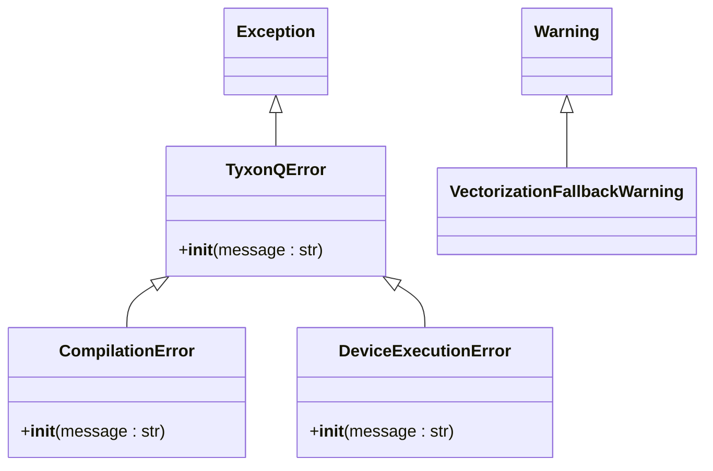
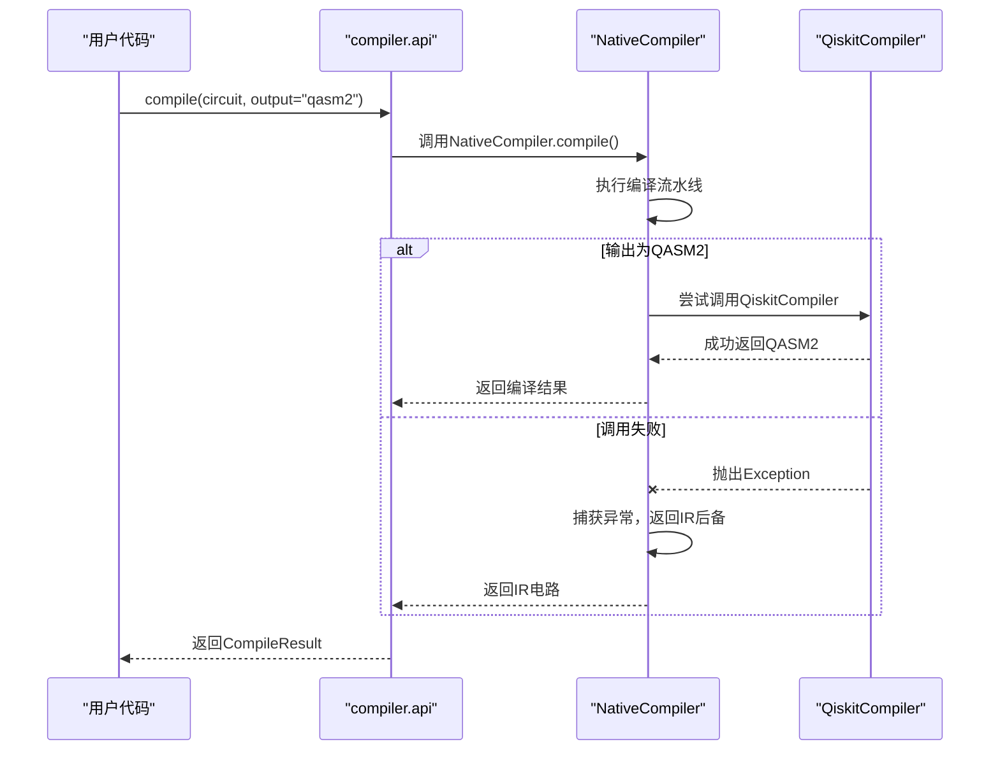

# 错误处理机制

<cite>
**Referenced Files in This Document**   
- [errors.py](file://src/tyxonq/core/errors.py)
- [native_compiler.py](file://src/tyxonq/compiler/compile_engine/native/native_compiler.py)
- [api.py](file://src/tyxonq/compiler/api.py)
- [session.py](file://src/tyxonq/devices/session.py)
</cite>

## 目录
1. [引言](#引言)
2. [异常层次结构](#异常层次结构)
3. [核心异常类型](#核心异常类型)
4. [编译器模块中的错误处理](#编译器模块中的错误处理)
5. [设备层中的错误处理](#设备层中的错误层)
6. [异常处理代码示例](#异常处理代码示例)
7. [常见错误排查指南](#常见错误排查指南)
8. [结论](#结论)

## 引言

TyxonQ 框架设计了一套健壮且用户友好的错误处理机制，旨在为开发者提供清晰、一致的错误反馈。该机制以自定义的 `TyxonQError` 为基类，构建了一个结构化的异常层次体系，覆盖了从核心中间表示（IR）、编译器到设备执行等各个模块。通过精确的异常分类和继承关系，框架能够准确地传达错误的性质和来源，帮助开发者快速定位和解决问题。本文档将详细阐述这一错误处理架构，包括异常的定义、触发场景、在不同模块中的抛出与处理方式，并提供实用的代码示例和排查指南。

## 异常层次结构

TyxonQ 的异常体系以 `TyxonQError` 为所有自定义异常的基类，确保了框架内错误处理的一致性。所有特定于框架的异常都直接或间接继承自该基类，从而可以被统一捕获和处理。这种设计不仅便于框架内部的错误管理，也方便了用户编写通用的错误处理逻辑。



**Diagram sources**
- [errors.py](file://src/tyxonq/core/errors.py#L0-L16)

**Section sources**
- [errors.py](file://src/tyxonq/core/errors.py#L0-L16)

## 核心异常类型

### TyxonQError
`TyxonQError` 是所有 TyxonQ 框架自定义异常的基类。它继承自 Python 的 `Exception` 类，为框架内的所有错误提供了一个统一的根。任何与 TyxonQ 相关的、非标准的 Python 异常都应从此类派生。这使得用户可以通过捕获 `TyxonQError` 来处理所有可能由框架引发的错误。

### CompilationError
`CompilationError` 继承自 `TyxonQError`，专门用于表示编译过程中的错误。当编译器在将高级量子电路转换为特定目标（如设备原生门集或 QASM 代码）时遇到问题，便会抛出此异常。其触发场景包括但不限于：编译计划（compile plan）配置无效、无法将某些量子门分解为目标设备支持的门集、优化过程失败或生成的输出不符合预期格式。

### DeviceExecutionError
`DeviceExecutionError` 同样继承自 `TyxonQError`，用于表示在量子设备或模拟器上执行电路时发生的错误。这类错误通常与运行时环境相关，例如设备连接超时、硬件资源不可用、执行任务被拒绝或在执行过程中发生通信故障。

### VectorizationFallbackWarning
虽然不是一个异常，但 `VectorizationFallbackWarning` 是一个重要的警告类，继承自 Python 的 `Warning`。当框架在尝试进行向量化计算时，由于某些限制（如不兼容的操作或数据类型）而被迫回退到逐个执行（eager execution）模式时，会发出此警告。这有助于用户识别性能瓶颈。

**Section sources**
- [errors.py](file://src/tyxonq/core/errors.py#L0-L16)

## 编译器模块中的错误处理

编译器模块是 `CompilationError` 的主要抛出者。在 `native_compiler.py` 文件中，`NativeCompiler` 类负责执行编译流程。虽然在提供的代码片段中未直接看到 `raise CompilationError` 的语句，但其设计模式清晰地表明了错误处理的意图。

编译流程涉及多个阶段，如门变换、测量重写和调度。在 `native_compiler.py` 的 `compile` 方法中，可以看到对 `QiskitCompiler` 的调用被包裹在 `try...except Exception` 块中。这表明，当尝试将电路降级为 QASM 或 Qiskit 格式时，如果发生任何异常（例如，Qiskit 库未安装或调用失败），编译器不会直接崩溃，而是会捕获异常并优雅地降级，最终返回中间表示（IR）作为后备方案。



**Diagram sources**
- [api.py](file://src/tyxonq/compiler/api.py#L0-L65)
- [native_compiler.py](file://src/tyxonq/compiler/compile_engine/native/native_compiler.py#L0-L101)

**Section sources**
- [api.py](file://src/tyxonq/compiler/api.py#L0-L65)
- [native_compiler.py](file://src/tyxonq/compiler/compile_engine/native/native_compiler.py#L0-L101)

## 设备层中的错误处理

设备层的错误处理主要体现在 `devices/session.py` 文件中的 `device_job_plan` 函数。该函数负责协调在设备上执行分段的执行计划。虽然在提供的代码中未显式抛出 `DeviceExecutionError`，但其设计为错误处理提供了基础。

该函数通过循环执行计划中的每个段（segment），并调用设备的 `run` 方法。如果 `run` 方法在执行过程中失败（例如，抛出连接错误或超时），这个异常会从 `device.run` 向上传播。在更高层的调用栈中，这些底层异常（可能是 `ConnectionError`, `TimeoutError` 等）应被捕获，并包装成一个更具体的 `DeviceExecutionError`，然后重新抛出，以保持框架错误接口的一致性。这种方式将底层的、可能不一致的异常，统一为框架定义的、语义明确的 `DeviceExecutionError`。

**Section sources**
- [session.py](file://src/tyxonq/devices/session.py#L0-L50)

## 异常处理代码示例

以下代码示例展示了如何在使用 TyxonQ 框架时，捕获和处理不同类型的错误。

```python
from tyxonq.core.errors import TyxonQError, CompilationError, DeviceExecutionError
from tyxonq.compiler import compile
from tyxonq.devices import get_device

# 示例1: 处理编译错误
try:
    # 尝试使用一个不存在的编译引擎
    result = compile(my_circuit, compile_engine="nonexistent_engine")
except CompilationError as e:
    print(f"编译失败: {e}")
    # 可以在此处记录日志或尝试使用默认编译器
except TyxonQError as e:
    # 捕获其他所有TyxonQ相关的错误
    print(f"TyxonQ错误: {e}")
except Exception as e:
    # 捕获所有未预期的错误
    print(f"未知错误: {e}")

# 示例2: 处理设备执行错误
try:
    device = get_device("cloud_device")
    job_plan = {"circuit": compiled_circuit, "segments": [{"shots": 1000}]}
    result = device_job_plan(device, job_plan)
except DeviceExecutionError as e:
    print(f"设备执行失败: {e}")
    # 可能需要检查设备状态或网络连接
except ConnectionError:
    print("无法连接到设备。请检查网络设置。")
except TimeoutError:
    print("设备响应超时。请稍后重试。")
except TyxonQError as e:
    print(f"TyxonQ错误: {e}")
```

**Section sources**
- [errors.py](file://src/tyxonq/core/errors.py#L0-L16)
- [api.py](file://src/tyxonq/compiler/api.py#L0-L65)
- [session.py](file://src/tyxonq/devices/session.py#L0-L50)

## 常见错误排查指南

| 错误类型 | 可能原因 | 解决方案 |
| :--- | :--- | :--- |
| `CompilationError` | 1. `compile_engine` 参数拼写错误或不支持。<br>2. `output` 格式不被支持。<br>3. 电路包含无法分解的门。 | 1. 检查 `compile_engine` 是否为 'default', 'tyxonq', 'native' 或 'qiskit'。<br>2. 确认 `output` 为 'ir', 'qasm2' 或 'qiskit'。<br>3. 简化电路或检查 `basis_gates` 选项。 |
| `DeviceExecutionError` | 1. 设备离线或维护中。<br>2. 网络连接问题。<br>3. 执行任务参数（如shots）超出限制。 | 1. 检查设备状态。<br>2. 验证网络连接。<br>3. 减少 `shots` 数量或联系服务提供商。 |
| `VectorizationFallbackWarning` | 1. 使用了不支持向量化的操作。<br>2. 数据类型不兼容。 | 1. 查看警告信息，检查是哪个操作导致回退。<br>2. 考虑重构代码以使用支持向量化的操作。 |

**Section sources**
- [errors.py](file://src/tyxonq/core/errors.py#L0-L16)

## 结论

TyxonQ 框架通过精心设计的 `TyxonQError` 异常层次结构，实现了模块化和一致性的错误处理。`CompilationError` 和 `DeviceExecutionError` 等具体异常类型清晰地划分了错误的来源，使得开发者能够快速理解问题所在。框架在编译器和设备层都采用了防御性编程策略，通过捕获底层异常并将其包装为框架特定的异常，保证了对外接口的稳定性。结合提供的代码示例和排查指南，开发者可以有效地利用这套机制来构建更健壮的量子计算应用。