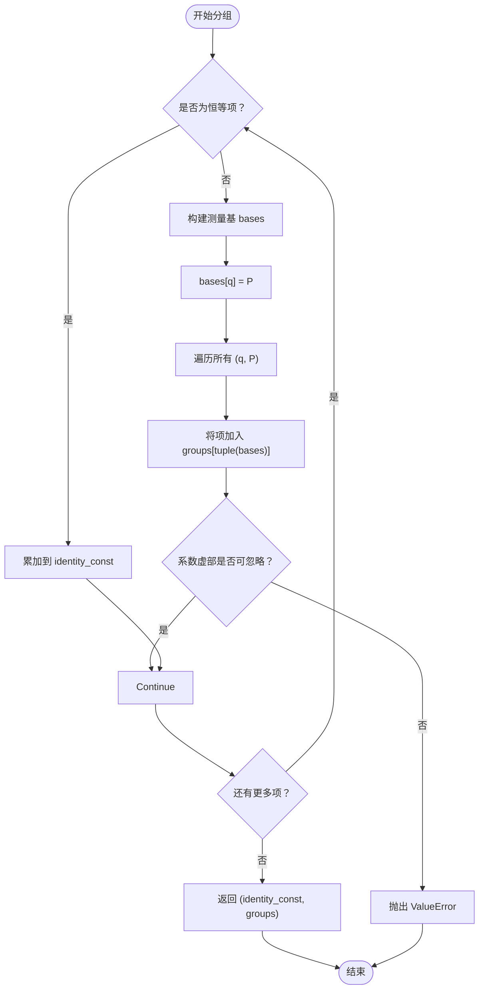
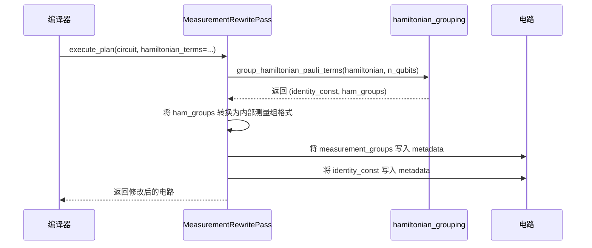

# 编译器工具

<cite>
**本文档引用的文件**
- [hamiltonian_grouping.py](file://src/tyxonq/libs/hamiltonian_encoding/hamiltonian_grouping.py)
- [hamiltonian_grouping.py](file://src/tyxonq/compiler/utils/hamiltonian_grouping.py)
- [measurement.py](file://src/tyxonq/compiler/stages/rewrite/measurement.py)
- [uccsd.py](file://src/tyxonq/applications/chem/algorithms/uccsd.py)
- [hea.py](file://src/tyxonq/applications/chem/algorithms/hea.py)
- [test_measurement_rewrite_grouping.py](file://tests_core_module/test_measurement_rewrite_grouping.py)
</cite>

## 目录
1. [引言](#引言)
2. [哈密顿量分组功能概述](#哈密顿量分组功能概述)
3. [分组算法实现细节](#分组算法实现细节)
4. [编译阶段集成与测量重写](#编译阶段集成与测量重写)
5. [在UCCSD与HEA算法中的应用示例](#在uccsd与hea算法中的应用示例)
6. [性能影响分析](#性能影响分析)
7. [测试验证](#测试验证)
8. [结论](#结论)

## 引言
本文档旨在详细说明TyxonQ量子计算框架中编译器工具模块的哈密顿量分组功能。该功能通过将量子哈密顿量中的泡利项进行有效分组，使得同一组内的项可以同时测量（即相互对易），从而显著减少变分量子本征求解器（VQE）等算法所需的独立电路运行次数。文档将深入解析`hamiltonian_grouping.py`模块的实现机制，阐述其在编译流程中的集成方式，并通过UCCSD和HEA等典型算法展示其应用价值与性能提升效果。

## 哈密顿量分组功能概述
哈密顿量分组是量子算法优化中的关键技术，其核心目标是识别并合并可同时测量的泡利项，以最小化测量开销。在TyxonQ框架中，该功能由`src/tyxonq/libs/hamiltonian_encoding/hamiltonian_grouping.py`模块提供，主要包含两个核心函数：`group_qubit_operator_terms`和`group_hamiltonian_pauli_terms`。这些函数接收一个哈密顿量（以OpenFermion的`QubitOperator`形式或泡利项列表形式）和量子比特数作为输入，输出一个常数项和一个分组字典。字典的键是长度为`n_qubits`的泡利基元组（如`('I', 'X', 'Y', 'Z')`），值是属于该测量基的泡利项及其系数的列表。通过这种方式，原本需要为每个泡利项单独运行电路的测量过程，被优化为只需为每个独立的测量基运行一次电路。

**Section sources**
- [hamiltonian_grouping.py](file://src/tyxonq/libs/hamiltonian_encoding/hamiltonian_grouping.py#L11-L66)

## 分组算法实现细节
### 基于泡利基的分组策略
TyxonQ采用了一种基于泡利基（Pauli Basis）的简单而高效的分组策略，而非更复杂的图着色方法。其核心思想是：**如果两个泡利项在所有量子比特上都使用相同的非恒等泡利算符（X, Y, Z），则它们可以被归入同一组进行测量**。例如，项`X0 Z1`和`Y0 Z1`不能同时测量，因为它们在第0个量子比特上分别使用了X和Y基；而`X0 Z1`和`X0 Z1 Z2`则可以同时测量，因为它们在共享的量子比特0和1上使用的基（X和Z）完全一致。

#### 算法流程
1.  **初始化**：创建一个空字典`groups`用于存储分组结果，并初始化`identity_const`用于累加哈密顿量中的恒等项（即`I`项）。
2.  **遍历哈密顿量项**：对于哈密顿量中的每一项，首先检查其是否为恒等项（`term == ()`）。如果是，则将其系数加到`identity_const`中。
3.  **构建测量基**：对于非恒等项，创建一个长度为`n_qubits`的列表`bases`，初始值全为`"I"`。然后遍历该项中的每一个泡利算符`(q, p)`，将`bases[q]`更新为`p`（如X, Y, Z）。
4.  **分组**：将`bases`列表转换为元组（作为字典的键），并将当前的泡利项（及其系数）追加到该键对应的列表中。`setdefault`方法确保了新组的自动创建。
5.  **复数处理**：算法会检查每一项的系数，确保其虚部可以忽略不计（`abs(c.imag) > 1e-10`时抛出异常），以保证哈密顿量的厄米性。

此策略的优势在于其**线性时间复杂度**和**确定性**，非常适合在编译阶段快速执行。虽然它可能无法达到图着色算法的最优分组数，但其简单性和高效性使其成为实际应用中的理想选择。

**Diagram sources**
- [hamiltonian_grouping.py](file://src/tyxonq/libs/hamiltonian_encoding/hamiltonian_grouping.py#L11-L66)

**Section sources**
- [hamiltonian_grouping.py](file://src/tyxonq/libs/hamiltonian_encoding/hamiltonian_grouping.py#L11-L66)

## 编译阶段集成与测量重写
哈密顿量分组功能并非孤立存在，而是深度集成在TyxonQ的编译流水线中，作为**测量重写（Measurement Rewrite）** 优化的基础。

### 测量重写通道（MeasurementRewritePass）
该功能在`src/tyxonq/compiler/stages/rewrite/measurement.py`中的`MeasurementRewritePass`类中被调用。当编译器执行此通道时，它会检查传入的电路是否包含哈密顿量信息（通过`opts`参数中的`hamiltonian_terms`或`qubit_operator`）。

#### 集成流程
1.  **调用分组函数**：如果检测到哈密顿量信息，`MeasurementRewritePass`会从`src/tyxonq/compiler/utils/hamiltonian_grouping.py`导入并调用`group_hamiltonian_pauli_terms`或`group_qubit_operator_terms`函数。`compiler/utils`下的文件仅作为`libs/hamiltonian_encoding`中实际实现的薄层封装。
2.  **生成测量组**：分组函数返回的`ham_groups`会被转换为编译器内部的测量组格式。每个组包含`basis_map`（指定每个量子比特的测量基）、`wires`（涉及的量子比特）和`items`（组内的泡利项）。
3.  **附加元数据**：生成的测量组列表被附加到电路的`metadata`中，键为`"measurement_groups"`。同时，恒等项常数`identity_const`也被存储，以便在后续计算总能量时使用。

这种设计使得测量分组成为一个**可插拔的编译优化**。它不改变电路的语义，但通过提供明确的分组信息，为下游的调度器（如`shot_scheduler`）提供了优化依据，从而实现测量设置的复用，显著减少总运行时间。

**Diagram sources**
- [measurement.py](file://src/tyxonq/compiler/stages/rewrite/measurement.py#L45-L67)
- [hamiltonian_grouping.py](file://src/tyxonq/compiler/utils/hamiltonian_grouping.py#L15-L16)

**Section sources**
- [measurement.py](file://src/tyxonq/compiler/stages/rewrite/measurement.py#L45-L67)
- [hamiltonian_grouping.py](file://src/tyxonq/compiler/utils/hamiltonian_grouping.py#L15-L16)

## 在UCCSD与HEA算法中的应用示例
### UCCSD算法中的应用
在`src/tyxonq/applications/chem/algorithms/uccsd.py`中，UCCSD类在初始化时会构建一个量子哈密顿量`hq`（`QubitOperator`类型）。当该算法在设备上运行时，其能量评估过程会触发编译器的测量重写通道。此时，`MeasurementRewritePass`会利用`hamiltonian_grouping`模块对`hq`进行分组。例如，对于一个氢分子（H2）的哈密顿量，原本可能包含数十个独立的泡利项，经过分组后可能被合并为仅需3-5次独立测量即可完成。这极大地加速了VQE循环中的能量评估步骤。

### HEA算法中的应用
在`src/tyxonq/applications/chem/algorithms/hea.py`中，HEA类直接接收一个哈密顿量项列表`hamiltonian`。其`energy`方法在设备路径上运行时，会创建一个`HEADeviceRuntime`实例。该运行时会将哈密顿量传递给编译器，从而触发相同的测量重写和分组流程。文档中明确指出，`energy`方法“内部对哈密顿量进行按基分组的测量流程”，这正是`hamiltonian_grouping`功能的直接体现。用户无需关心分组细节，框架会自动优化测量过程。

**Section sources**
- [uccsd.py](file://src/tyxonq/applications/chem/algorithms/uccsd.py#L150-L155)
- [hea.py](file://src/tyxonq/applications/chem/algorithms/hea.py#L85-L90)

## 性能影响分析
哈密顿量分组对算法性能的影响是**革命性**的。在VQE等需要反复评估能量的算法中，测量开销往往是主要的瓶颈。通过将测量次数从哈密顿量中泡利项的数量级（可能为O(N^4)）减少到测量基的数量级（通常为O(N)或更少），整体算法的执行时间可以缩短数个数量级。

-   **减少电路运行次数**：这是最直接的收益。一次电路运行可以获取一个测量基下所有泡利项的期望值。
-   **降低采样噪声**：由于总采样次数（shots）可以在更少的运行中分配，每次运行可以使用更多的shots，从而获得更精确的期望值估计。
-   **提高资源利用率**：在真实量子设备上，减少了宝贵的设备时间占用。

虽然分组本身会引入少量计算开销，但与量子电路执行时间相比，这部分开销可以忽略不计。因此，哈密顿量分组是提升量子算法实用性的关键优化技术。

## 测试验证
该功能的正确性通过`tests_core_module/test_measurement_rewrite_grouping.py`中的单元测试进行验证。这些测试会构造包含已知哈密顿量的电路，执行`MeasurementRewritePass`，然后断言生成的`measurement_groups`元数据是否符合预期的分组逻辑。例如，测试会验证相互对易的项是否被正确分组，以及恒等项是否被正确提取。这些自动化测试确保了分组功能的稳定性和可靠性。

**Section sources**
- [test_measurement_rewrite_grouping.py](file://tests_core_module/test_measurement_rewrite_grouping.py)

## 结论
TyxonQ框架中的哈密顿量分组功能是一个高效且关键的编译器优化。它通过基于泡利基的简单策略，将可同时测量的哈密顿量项进行分组，并深度集成到测量重写编译通道中。该功能在UCCSD和HEA等核心化学算法中被广泛应用，能够显著减少独立电路运行次数，从而大幅提升算法的整体执行效率。其设计体现了编译器优化在连接高级算法与底层硬件执行之间的桥梁作用，是实现实用化量子计算的重要一环。