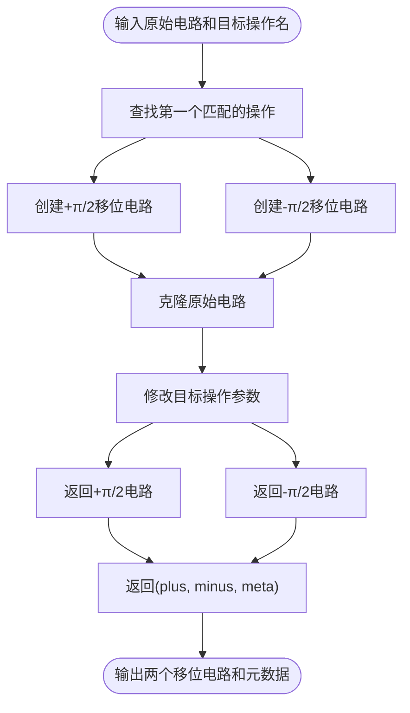
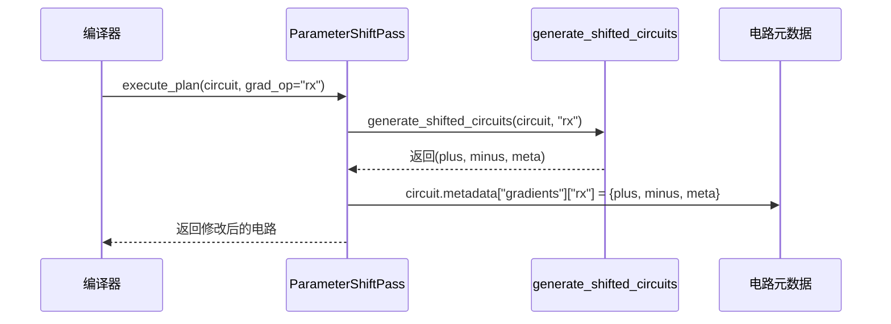

# 梯度计算

<cite>
**本文档中引用的文件**  
- [parameter_shift.py](file://src/tyxonq/compiler/gradients/parameter_shift.py)
- [parameter_shift_pass.py](file://src/tyxonq/compiler/stages/gradients/parameter_shift_pass.py)
- [circuit.py](file://src/tyxonq/core/ir/circuit.py)
- [pytorch_backend.py](file://src/tyxonq/numerics/backends/pytorch_backend.py)
- [api.py](file://src/tyxonq/compiler/api.py)
- [native_compiler.py](file://src/tyxonq/compiler/compile_engine/native/native_compiler.py)
- [parameter_shift.py](file://examples/parameter_shift.py)
- [test_example_parameter_shift.py](file://tests_examples/test_example_parameter_shift.py)
</cite>

## 目录
1. [引言](#引言)
2. [核心组件分析](#核心组件分析)
3. [参数移位法实现机制](#参数移位法实现机制)
4. [编译阶段集成：ParameterShiftPass](#编译阶段集成parametershiftpass)
5. [梯度计算流程与电路结构](#梯度计算流程与电路结构)
6. [在变分量子算法中的应用](#在变分量子算法中的应用)
7. [与有限差分法的精度对比](#与有限差分法的精度对比)
8. [实际量子化学优化示例](#实际量子化学优化示例)
9. [与数值后端的协同工作模式](#与数值后端的协同工作模式)
10. [结论](#结论)

## 引言
TyxonQ 的梯度计算系统采用参数移位法（Parameter Shift）为变分量子电路提供精确的解析梯度。该方法通过在电路层面生成参数正负移位的副本，并测量其期望值之差来计算梯度，避免了传统有限差分法的数值不稳定性。本文件全面文档化该系统的实现机制，涵盖从核心函数 `generate_shifted_circuits` 到编译阶段 `ParameterShiftPass` 的集成路径，并说明其在 VQE、QAOA 等变分算法中的实际应用。

## 核心组件分析

TyxonQ 的梯度系统由多个核心模块协同工作，包括梯度生成器、编译阶段插件、中间表示（IR）电路以及数值后端接口。

**Section sources**
- [parameter_shift.py](file://src/tyxonq/compiler/gradients/parameter_shift.py#L8-L35)
- [parameter_shift_pass.py](file://src/tyxonq/compiler/stages/gradients/parameter_shift_pass.py#L18-L28)
- [circuit.py](file://src/tyxonq/core/ir/circuit.py#L48-L727)

## 参数移位法实现机制

参数移位法的核心实现在 `src/tyxonq/compiler/gradients/parameter_shift.py` 中的 `generate_shifted_circuits` 函数。该函数接收一个量子电路和一个目标操作名称（如 `"rx"`），生成两个新的电路副本：一个将目标参数增加 π/2，另一个减少 π/2。

该函数遍历原始电路的操作列表，找到第一个匹配指定名称的操作，并对其参数应用 ±π/2 的移位。移位后的电路与原始电路具有相同的量子比特数和其余操作。函数返回正移位电路、负移位电路以及包含梯度系数（通常为 0.5）的元数据字典。



**Diagram sources**
- [parameter_shift.py](file://src/tyxonq/compiler/gradients/parameter_shift.py#L8-L35)

**Section sources**
- [parameter_shift.py](file://src/tyxonq/compiler/gradients/parameter_shift.py#L8-L35)

## 编译阶段集成：ParameterShiftPass

参数移位逻辑通过编译阶段 `ParameterShiftPass` 集成到 TyxonQ 的编译流水线中。该类位于 `src/tyxonq/compiler/stages/gradients/parameter_shift_pass.py`，实现了 `execute_plan` 方法。

当编译器执行此阶段时，它会调用 `generate_shifted_circuits` 函数生成移位电路，并将结果存储在原始电路的元数据（metadata）中。具体而言，它在 `circuit.metadata["gradients"]` 下以目标操作名为键，存储一个包含 `plus`、`minus` 和 `meta` 字段的字典。这使得后续的梯度计算可以直接访问这些预生成的电路，而无需重复编译。



**Diagram sources**
- [parameter_shift_pass.py](file://src/tyxonq/compiler/stages/gradients/parameter_shift_pass.py#L18-L28)
- [parameter_shift.py](file://src/tyxonq/compiler/gradients/parameter_shift.py#L8-L35)

**Section sources**
- [parameter_shift_pass.py](file://src/tyxonq/compiler/stages/gradients/parameter_shift_pass.py#L18-L28)

## 梯度计算流程与电路结构

梯度计算流程始于用户定义的变分电路。通过在编译流水线中插入 `ParameterShiftPass`，系统自动为指定的可微参数（如 `rx` 或 `rzz`）生成正负移位的电路副本。这些副本随后被提交到量子设备或模拟器以测量期望值。

最终的梯度值由以下公式计算：
`∂⟨ψ(θ)|O|ψ(θ)⟩/∂θ = (⟨ψ(θ+π/2)|O|ψ(θ+π/2)⟩ - ⟨ψ(θ-π/2)|O|ψ(θ-π/2)⟩) * coeff`
其中 `coeff` 是由 `generate_shifted_circuits` 提供的系数（通常为 0.5）。

```mermaid
graph TD
A[原始变分电路] --> B[应用ParameterShiftPass]
B --> C[正移位电路 θ+π/2]
B --> D[负移位电路 θ-π/2]
C --> E[测量期望值 E+]
D --> F[测量期望值 E-]
E --> G[计算梯度 ∂E/∂θ = (E+ - E-) * 0.5]
F --> G
```

**Diagram sources**
- [parameter_shift_pass.py](file://src/tyxonq/compiler/stages/gradients/parameter_shift_pass.py#L18-L28)
- [parameter_shift.py](file://src/tyxonq/compiler/gradients/parameter_shift.py#L8-L35)

## 在变分量子算法中的应用

参数移位法特别适用于变分量子算法（VQA），如变分量子本征求解器（VQE）和量子近似优化算法（QAOA）。在这些算法中，哈密顿量的期望值作为损失函数，其梯度用于经典优化器更新电路参数。

例如，在 `examples/parameter_shift.py` 中，`f1` 和 `f2` 函数分别构建了包含 `rx` 和 `rzz` 门的层状电路，并计算目标量子比特的 Y 期望值。`parameter_shift_grad_f1` 和 `parameter_shift_grad_f2` 函数利用参数移位法计算这些函数的梯度，为 VQE 等任务提供了精确的优化信号。

**Section sources**
- [parameter_shift.py](file://examples/parameter_shift.py#L40-L183)

## 与有限差分法的精度对比

与有限差分法相比，参数移位法具有显著的精度优势。有限差分法使用一个很小的步长 `ε`（如 1e-6）来近似梯度，其结果容易受到噪声和舍入误差的影响，尤其是在有噪量子设备上。

相反，参数移位法利用量子门的解析性质，使用固定的 π/2 移位，其梯度计算是精确的（在无噪情况下）。`examples/parameter_shift.py` 中的 `main` 函数通过 `finite_difference_grad_f1` 和 `parameter_shift_grad_f1` 的对比验证了这一点，断言两者在解析期望值下高度一致，但参数移位法在采样场景下更稳定。

```mermaid
flowchart LR
subgraph 有限差分法
A[原始参数 θ] --> B[θ + ε]
A --> C[θ - ε]
B --> D[测量 E+]
C --> E[测量 E-]
D --> F[梯度 ≈ (E+ - E-)/(2ε)]
E --> F
end
subgraph 参数移位法
G[原始参数 θ] --> H[θ + π/2]
G --> I[θ - π/2]
H --> J[测量 E+]
I --> K[测量 E-]
J --> L[梯度 = (E+ - E-) * 0.5]
K --> L
end
```

**Diagram sources**
- [parameter_shift.py](file://examples/parameter_shift.py#L100-L183)

**Section sources**
- [parameter_shift.py](file://examples/parameter_shift.py#L100-L183)

## 实际量子化学优化示例

在量子化学计算中，如使用 VQE 求解分子基态能量，参数移位法可用于优化 UCCSD 等变分波函数的参数。`examples/parameter_shift.py` 提供了一个简化示例，展示了如何为层状 `rx` 电路计算梯度。在实际应用中，该流程可扩展到更复杂的化学哈密顿量和 ansatz 电路，通过 `tyxonq.apps.chem` 模块进行集成。

**Section sources**
- [parameter_shift.py](file://examples/parameter_shift.py#L40-L183)

## 与数值后端的协同工作模式

TyxonQ 的梯度系统与数值后端（如 PyTorch）协同工作。`src/tyxonq/numerics/backends/pytorch_backend.py` 中的 `PyTorchBackend` 类提供了 `value_and_grad` 方法，该方法优先尝试使用 PyTorch Autograd 进行自动微分。如果 Autograd 失败（例如，由于不可微操作），它会优雅地回退到数值方法，包括参数移位法或有限差分法。

这种设计允许用户在纯经典数值模式和混合量子-经典自动微分模式之间无缝切换，为算法开发和调试提供了灵活性。

```mermaid
graph TD
A[用户调用 value_and_grad(fn)] --> B{Autograd 可用?}
B --> |是| C[使用 PyTorch Autograd]
B --> |否| D[使用数值梯度]
D --> E[参数移位法]
D --> F[有限差分法]
C --> G[返回 (值, 梯度)]
E --> G
F --> G
```

**Diagram sources**
- [pytorch_backend.py](file://src/tyxonq/numerics/backends/pytorch_backend.py#L200-L259)

**Section sources**
- [pytorch_backend.py](file://src/tyxonq/numerics/backends/pytorch_backend.py#L200-L259)

## 结论
TyxonQ 的梯度计算系统通过参数移位法为变分量子算法提供了高效且精确的梯度评估能力。其核心在于 `generate_shifted_circuits` 函数和 `ParameterShiftPass` 编译阶段的紧密结合，实现了在电路级别自动插入梯度计算逻辑。该方法在精度上优于有限差分法，并能与 PyTorch 等数值后端协同工作，支持从纯数值模拟到混合自动微分的多种计算模式，为量子机器学习和量子化学等应用奠定了坚实的基础。