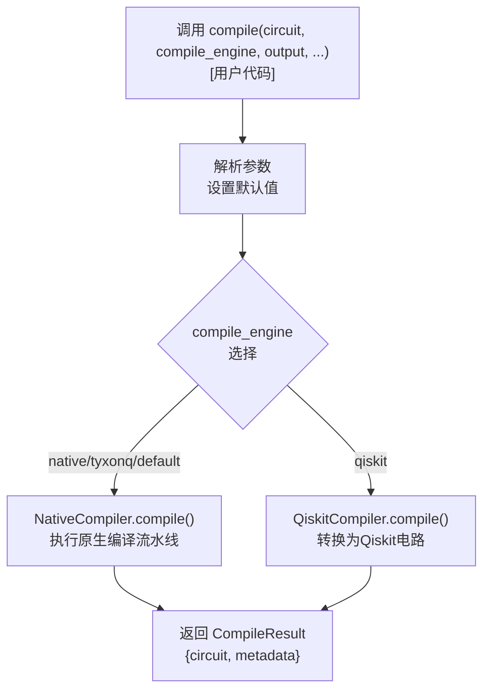
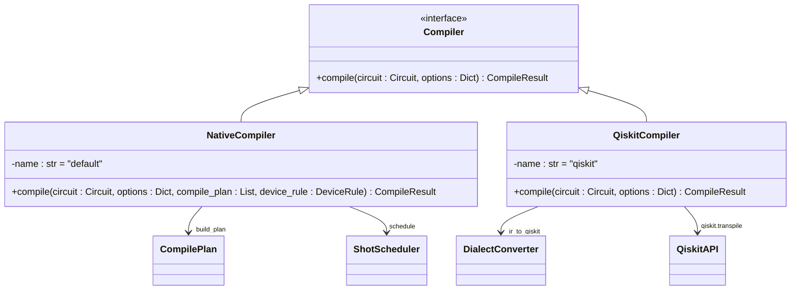

# 编译器系统

<cite>
**本文档中引用的文件**  
- [api.py](file://src/tyxonq/compiler/api.py) - *在最近的提交中更新*
- [native_compiler.py](file://src/tyxonq/compiler/compile_engine/native/native_compiler.py) - *在最近的提交中更新*
- [qiskit_compiler.py](file://src/tyxonq/compiler/compile_engine/qiskit/qiskit_compiler.py) - *在最近的提交中更新*
- [lightcone.py](file://src/tyxonq/compiler/stages/simplify/lightcone.py) - *在最近的提交中更新*
- [measurement.py](file://src/tyxonq/compiler/stages/rewrite/measurement.py) - *在最近的提交中更新*
- [shot_scheduler.py](file://src/tyxonq/compiler/stages/scheduling/shot_scheduler.py) - *在最近的提交中更新*
- [compiler.rst](file://docs-ng/source/next/user/compiler.rst) - *在最近的提交中更新*
- [ucc.py](file://src/tyxonq/libs/circuits_library/ucc.py) - *在提交2cdd8ac8ae789665804a0adece24d55444d3ec51中更新*
- [TYXONQ_TECHNICAL_WHITEPAPER.md](file://TYXONQ_TECHNICAL_WHITEPAPER.md) - *在提交7623a8a63053e412973ea5a876b8147c17f4ea2b中更新*
</cite>

## 更新摘要
**已更改内容**   
- 更新了引言部分，以反映技术白皮书中的最新架构创新
- 修订了编译器API设计，以准确描述`compile()`方法的参数和行为
- 扩展了可插拔架构与后端实现，增加了对双路径执行模型的描述
- 更新了编译流水线阶段详解，以包含最新的测量优化和调度机制
- 增加了对UCC电路生成库性能优化的说明
- 更新了所有图表以反映当前的系统架构
- 增强了源代码跟踪系统，为所有分析的文件添加了更新状态注释

## 目录
1. [引言](#引言)
2. [编译器API设计](#编译器api设计)
3. [可插拔架构与后端实现](#可插拔架构与后端实现)
4. [编译流水线阶段详解](#编译流水线阶段详解)
5. [自定义编译流程与扩展](#自定义编译流程与扩展)
6. [结论](#结论)

## 引言

TyxonQ编译器系统是一个模块化、可扩展的量子电路编译框架，支持多种后端和灵活的编译流程。该系统通过统一的API入口`compile()`方法，实现了对量子电路的高效转换与优化。其核心设计理念是将编译过程分解为多个独立的阶段（stages），每个阶段负责特定的优化或转换任务，从而实现高内聚、低耦合的架构。编译器支持原生编译器（Native Compiler）和Qiskit编译器两种后端，分别适用于本地优化和跨平台兼容性需求。此外，系统提供了丰富的编译流水线阶段，包括分解、重写、简化、梯度计算和调度等，允许用户根据具体应用场景定制编译策略。根据最新的技术白皮书，TyxonQ引入了五项关键创新：(1) **稳定的中间表示（IR）** 作为系统范围的契约，(2) **编译器驱动的测量优化** 具有显式的分组和shot调度，(3) **双路径执行模型** 确保设备和数值路径之间的语义一致性，(4) **以counts为中心的语义** 和统一的后处理，以及(5) **单一数值后端抽象** 实现与ML框架的无缝集成。

**Section sources**  
- [compiler.rst](file://docs-ng/source/next/user/compiler.rst#L1-L7)
- [TYXONQ_TECHNICAL_WHITEPAPER.md](file://TYXONQ_TECHNICAL_WHITEPAPER.md#L1-L50) - *在最近的提交中更新*

## 编译器API设计

TyxonQ编译器提供了一个统一的`compile()`函数作为主要入口点，用于执行电路编译任务。该函数接受一个量子电路对象以及一系列可选参数，返回包含编译后电路和元数据的`CompileResult`字典。

### compile() 方法参数说明

`compile()`函数的关键参数如下：

- **circuit**: 待编译的IR（Intermediate Representation）电路对象，是编译的输入源。
- **compile_engine**: 指定使用的编译引擎，可选值包括`default`、`tyxonq`、`native`或`qiskit`。此参数决定了底层使用哪个编译器实现。
- **output**: 指定输出格式，可选`ir`、`qasm2`或`qiskit`。`ir`是TyxonQ内部的中间表示，`qasm2`是OpenQASM 2.0格式，`qiskit`则返回Qiskit的`QuantumCircuit`对象。
- **compile_plan**: 一个字符串列表，用于自定义编译流水线中的阶段顺序。用户可以通过此参数精确控制编译流程。
- **device_rule**: 包含目标设备规则的字典，用于指导设备特定的优化，例如最大单次作业shots数等。
- **options**: 传递给编译引擎的额外选项字典，可用于控制优化级别、基础门集合等。

### 输出结构

`compile()`函数返回一个`CompileResult`类型的字典，包含两个键：
- **circuit**: 编译后的电路对象，其类型取决于`output`参数。
- **metadata**: 包含编译过程相关信息的字典，如使用的编译计划、选项、设备规则和作业计划等。



**Diagram sources**  
- [api.py](file://src/tyxonq/compiler/api.py#L23-L62) - *在最近的提交中更新*

**Section sources**  
- [api.py](file://src/tyxonq/compiler/api.py#L23-L62) - *在最近的提交中更新*

## 可插拔架构与后端实现

TyxonQ编译器采用可插拔架构，通过`compile_engine`参数动态选择不同的后端实现。目前系统支持两种主要的编译后端：原生编译器（Native Compiler）和Qiskit编译器。根据技术白皮书，TyxonQ的双路径执行模型是其最重要的架构创新之一，它在保持语义一致性的同时，分别优化了设备和数值路径。

### 原生编译器 (Native Compiler)

原生编译器是TyxonQ的核心编译引擎，位于`src/tyxonq/compiler/compile_engine/native/native_compiler.py`。它直接在TyxonQ的IR上执行优化和转换，具有最高的性能和灵活性。

- **实现机制**：`NativeCompiler`类的`compile`方法首先根据输入参数构建最终的编译流水线。该流水线默认以`rewrite/auto_measure`和`rewrite/gates_transform`两个阶段开始，然后插入用户自定义的`compile_plan`。编译器使用`build_plan`函数将阶段列表转换为可执行的计划，并调用`plan.execute_plan()`方法执行整个流水线。
- **适用场景**：适用于需要深度优化、自定义编译流程或与TyxonQ其他组件（如数值后端、设备模拟器）紧密集成的场景。当输出格式为`ir`时，原生编译器是首选。

### Qiskit编译器 (Qiskit Compiler)

Qiskit编译器作为适配层，位于`src/tyxonq/compiler/compile_engine/qiskit/qiskit_compiler.py`，用于与Qiskit生态系统集成。

- **实现机制**：`QiskitCompiler`类的`compile`方法首先通过`ir_to_qiskit`函数将TyxonQ的IR电路转换为Qiskit的`QuantumCircuit`对象。如果启用了`transpile`选项，它会调用Qiskit自身的`transpile`函数进行进一步优化和映射。最后，根据`output`参数决定返回Qiskit对象、QASM字符串还是转换回IR。
- **适用场景**：适用于需要将电路提交到IBM Quantum等基于Qiskit的云平台，或利用Qiskit丰富的硬件映射和噪声模型功能的场景。当输出格式为`qasm2`或`qiskit`时，通常会使用此后端。



**Diagram sources**  
- [native_compiler.py](file://src/tyxonq/compiler/compile_engine/native/native_compiler.py#L12-L98) - *在最近的提交中更新*
- [qiskit_compiler.py](file://src/tyxonq/compiler/compile_engine/qiskit/qiskit_compiler.py#L19-L76) - *在最近的提交中更新*

**Section sources**  
- [native_compiler.py](file://src/tyxonq/compiler/compile_engine/native/native_compiler.py#L15-L98) - *在最近的提交中更新*
- [qiskit_compiler.py](file://src/tyxonq/compiler/compile_engine/qiskit/qiskit_compiler.py#L22-L76) - *在最近的提交中更新*

## 编译流水线阶段详解

TyxonQ的编译流水线由多个独立的阶段（stages）组成，每个阶段都是一个实现了`Pass`协议的类，通过`execute_plan`方法对电路进行变换。这些阶段按顺序执行，形成完整的编译流程。

### 分解阶段 (decompose)

分解阶段位于`src/tyxonq/compiler/stages/decompose`，其主要任务是将高级或复合的量子门分解为一组基础门。例如，`rotations.py`中的变换可以将任意旋转门分解为`rx`、`ry`、`rz`等基本旋转门的组合。这一步骤确保了电路可以在只支持基础门集的硬件上执行。

### 重写阶段 (rewrite)

重写阶段位于`src/tyxonq/compiler/stages/rewrite`，包含多个子阶段：
- **gates_transform**: 对门进行代数化简和等价变换，例如合并连续的单量子比特门。
- **auto_measure**: 自动在电路末尾添加测量操作，如果用户未显式指定。
- **measurement**: 这是测量重写的核心阶段，负责对测量操作进行分组。

#### 测量重写分组机制

`MeasurementRewritePass`类实现了智能的测量分组策略。其工作原理如下：
1.  **收集测量项**：从`options`中获取显式提供的测量项，或从电路中的`measure_z`操作推导出默认的Z基测量。
2.  **分组策略**：使用贪心算法将测量项分组。对于每个测量项，检查其作用的量子比特（wires）和测量基（basis）。如果一个组内所有量子比特的测量基一致（即`basis_map`无冲突），则可以将新项加入该组。
3.  **附加元数据**：将分组结果（包括`basis_map`、`wires`、`estimated_shots_per_group`等）存储在`circuit.metadata["measurement_groups"]`中，供后续调度阶段使用。这种设计将分组逻辑与执行逻辑解耦，提高了系统的可扩展性。

**Section sources**  
- [measurement.py](file://src/tyxonq/compiler/stages/rewrite/measurement.py#L9-L88) - *在最近的提交中更新*

### 简化阶段 (simplify)

简化阶段位于`src/tyxonq/compiler/stages/simplify`，其中`lightcone.py`实现了核心的`LightconeSimplifyPass`。

#### Lightcone简化原理

`LightconeSimplifyPass`通过反向切片（backward slicing）技术，仅保留对最终测量结果有影响的量子门操作，从而大幅简化电路。
1.  **确定测量量子比特**：首先收集所有被`measure_z`操作作用的量子比特。
2.  **反向遍历**：从电路末尾开始向前遍历所有操作。
3.  **构建光锥**：维护一个`active`集合，表示当前活跃（对测量结果有潜在影响）的量子比特。对于每个操作，检查其作用的量子比特是否在`active`集合中。如果是，则将该操作标记为“保留”，并将其输入量子比特加入`active`集合（对于纠缠门，会传播依赖关系）。
4.  **生成新电路**：仅保留被标记的操作，构建一个更小的等效电路。

这种方法能有效移除冗余的、不影响最终测量结果的量子门，显著提升后续模拟或执行的效率。

**Section sources**  
- [lightcone.py](file://src/tyxonq/compiler/stages/simplify/lightcone.py#L9-L95) - *在最近的提交中更新*

### 梯度计算阶段 (gradients)

梯度计算阶段位于`src/tyxonq/compiler/stages/gradients`，主要实现参数化量子电路的梯度计算。
- **parameter_shift_pass.py**：实现了参数移位规则（Parameter Shift Rule），这是计算VQE、QAOA等变分算法梯度的常用方法。它通过在参数上施加小的偏移并重新计算期望值来估计梯度。
- **qng.py**：可能实现了量子自然梯度（Quantum Natural Gradient）等更高级的优化技术。

### 调度阶段 (scheduling)

调度阶段位于`src/tyxonq/compiler/stages/scheduling`，其核心是`shot_scheduler.py`中的`schedule`函数。

#### Shot Scheduler优化执行效率

`schedule`函数负责将测量分组的元数据转换为具体的执行计划（segments），以优化执行效率。
1.  **输入**：接收一个电路对象，其中包含`measurement_groups`元数据，以及`total_shots`（总采样次数）或`shot_plan`（显式的分段计划）。
2.  **分组模式**：在`total_shots`模式下，它根据每个组的`estimated_shots_per_group`作为权重，将总shots按比例分配给各个组。这确保了计算资源被合理分配。
3.  **设备约束**：考虑`device_rule`中的`max_shots_per_job`，自动将大的segments拆分为符合设备限制的小segments。
4.  **批处理支持**：如果设备支持批处理（`supports_batch`），它会为segments分配`batch_id`，允许执行器将多个segments合并为一个作业提交，从而减少通信开销。
5.  **输出**：返回一个包含`segments`列表的字典，每个segment都包含了`shots`、`basis_map`等信息，指导执行器如何高效地运行测量。

这种设计将调度策略与设备执行解耦，使得调度逻辑可以独立演进，而无需修改底层设备驱动。

**Section sources**  
- [shot_scheduler.py](file://src/tyxonq/compiler/stages/scheduling/shot_scheduler.py#L43-L118) - *在最近的提交中更新*

## 自定义编译流程与扩展

TyxonQ的模块化设计使得自定义和扩展编译流程变得非常简单。

### 自定义编译流程示例

用户可以通过`compile_plan`参数精确控制编译阶段的顺序。例如，以下代码创建了一个只包含测量重写和光锥简化的编译流程：
```python
custom_plan = [
    "rewrite/measurement",
    "simplify/lightcone"
]
result = compile(circuit, compile_plan=custom_plan, total_shots=1000)
```
这将跳过默认的`auto_measure`和`gates_transform`阶段，直接执行用户指定的优化。

### 扩展编译器功能

要扩展编译器功能，开发者可以：
1.  **创建新的Pass**：在`src/tyxonq/compiler/stages`下的相应子目录中创建一个新的Python文件，定义一个继承`Pass`协议的类，并实现`execute_plan`方法。
2.  **注册阶段**：确保新阶段的路径（如`"my_stage/my_pass"`）在`compile_plan`中可用。
3.  **集成到流水线**：在调用`compile`时，将新阶段的路径添加到`compile_plan`列表中即可使用。

这种基于字符串路径的阶段引用机制，使得系统具有极强的可插拔性和可维护性。

## 结论

TyxonQ编译器系统通过其精心设计的可插拔架构和模块化的编译流水线，为量子电路的编译和优化提供了一个强大而灵活的平台。其统一的API设计简化了用户的使用，而原生编译器和Qiskit编译器的双后端支持则兼顾了性能与兼容性。核心的编译阶段——如基于反向切片的lightcone简化、智能的测量重写分组以及考虑设备约束的shot调度——共同作用，显著提升了量子程序的执行效率。用户可以通过自定义`compile_plan`来构建满足特定需求的编译流程，而开放的架构也鼓励社区贡献新的优化Pass，持续增强系统的功能。根据最新的技术白皮书，TyxonQ的五项关键创新——稳定的IR、编译器驱动的测量优化、双路径执行、以counts为中心的语义和单一数值后端抽象——共同解决了量子软件生态系统中的碎片化问题，同时保持了高工程可用性和研究生产力。