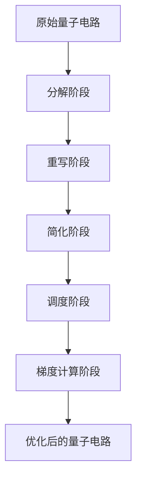
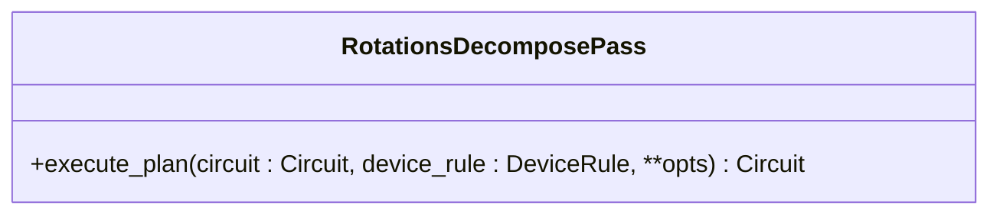
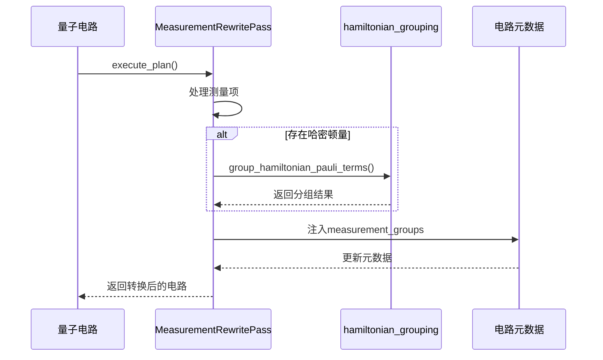
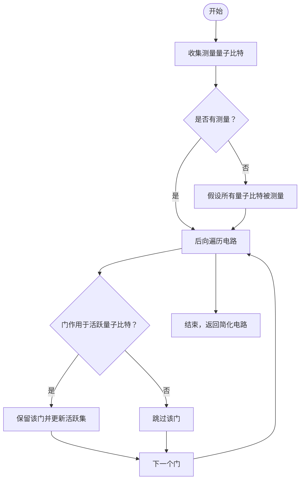
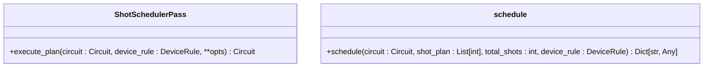
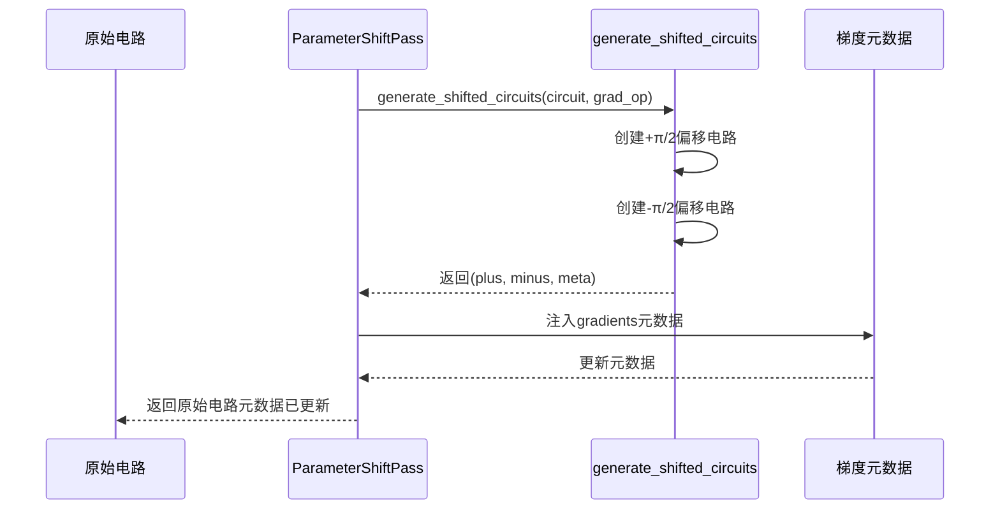

<cite>
**Referenced Files in This Document**   
- [rotations.py](file://src/tyxonq/compiler/stages/decompose/rotations.py)
- [measurement.py](file://src/tyxonq/compiler/stages/rewrite/measurement.py)
- [lightcone.py](file://src/tyxonq/compiler/stages/simplify/lightcone.py)
- [shot_scheduler.py](file://src/tyxonq/compiler/stages/scheduling/shot_scheduler.py)
- [parameter_shift_pass.py](file://src/tyxonq/compiler/stages/gradients/parameter_shift_pass.py)
- [hamiltonian_grouping.py](file://src/tyxonq/libs/hamiltonian_encoding/hamiltonian_grouping.py)
- [parameter_shift.py](file://src/tyxonq/compiler/gradients/parameter_shift.py)
- [compile_plan.py](file://src/tyxonq/compiler/compile_engine/native/compile_plan.py)
- [native_compiler.py](file://src/tyxonq/compiler/compile_engine/native/native_compiler.py)
- [api.py](file://src/tyxonq/compiler/api.py)
</cite>

# 编译阶段

## Table of Contents
1. [引言](#引言)
2. [编译阶段概览](#编译阶段概览)
3. [分解阶段：decompose/rotations](#分解阶段decomposerotations)
4. [重写阶段：rewrite/measurement](#重写阶段rewritemeasurement)
5. [简化阶段：simplify/lightcone](#简化阶段simplifylightcone)
6. [调度阶段：scheduling/shot_scheduler](#调度阶段schedulingshot_scheduler)
7. [梯度计算阶段：gradients/parameter_shift_pass](#梯度计算阶段gradientsparameter_shift_pass)
8. [编译流程集成与数据传递](#编译流程集成与数据传递)
9. [结论](#结论)

## 引言

TyxonQ 编译器采用模块化流水线设计，将量子电路从高级表示逐步转换为可在特定硬件上高效执行的低级指令。该流水线由多个独立的编译阶段（stages）组成，每个阶段负责一项特定的优化或转换任务。本文档深入解析其中五个核心编译阶段：分解（decompose）、重写（rewrite）、简化（simplify）、调度（scheduling）和梯度计算（gradients）。我们将详细阐述每个阶段的功能、实现原理及其在整体编译流程中的作用，旨在为开发者和研究人员提供一份全面的技术参考。

**Section sources**
- [api.py](file://src/tyxonq/compiler/api.py#L1-L65)

## 编译阶段概览

TyxonQ 的编译流水线由一系列可组合的“编译阶段”（Pass）构成。这些阶段被组织在一个 `CompilePlan` 中，按照预定义的顺序依次执行。每个阶段都是一个实现了 `execute_plan` 方法的类，接收一个量子电路（`Circuit`）和一组选项（`opts`），并输出一个转换后的电路。这种设计保证了流水线的灵活性和可扩展性。



**Diagram sources**
- [compile_plan.py](file://src/tyxonq/compiler/compile_engine/native/compile_plan.py#L1-L97)

**Section sources**
- [compile_plan.py](file://src/tyxonq/compiler/compile_engine/native/compile_plan.py#L1-L97)
- [native_compiler.py](file://src/tyxonq/compiler/compile_engine/native/native_compiler.py#L1-L101)

## 分解阶段：decompose/rotations

### 功能与目标
`decompose/rotations` 阶段的核心目标是将通用的参数化旋转门（如 RX, RY, RZZ, RXX, RYY）分解为硬件原生支持的基础门集合，通常是 {H, RZ, CX}。这是实现硬件兼容性的关键一步，因为大多数量子处理器并不直接支持所有类型的旋转门。

### 实现原理
该阶段通过 `RotationsDecomposePass` 类实现。它遍历电路中的所有操作，当遇到一个旋转门时，根据预定义的恒等式将其替换为一系列基础门。例如：
- **RX(θ)** 被分解为 `H · RZ(θ) · H`
- **RY(θ)** 被分解为 `S† · H · RZ(θ) · H · S`
- **RZZ(θ)** 被分解为 `CX · RZ(θ) · CX`

这些分解规则基于标准的量子门恒等式，确保了分解前后电路的量子行为完全等价。



**Diagram sources**
- [rotations.py](file://src/tyxonq/compiler/stages/decompose/rotations.py#L1-L69)

**Section sources**
- [rotations.py](file://src/tyxonq/compiler/stages/decompose/rotations.py#L1-L69)

## 重写阶段：rewrite/measurement

### 功能与目标
`rewrite/measurement` 阶段负责处理与测量相关的逻辑，其主要功能是实现**测量重写**和**哈密顿量项分组**（measurement_groups）。在变分量子算法（如VQE）中，需要测量哈密顿量的期望值，这通常涉及大量不同的测量基。该阶段通过将可同时测量的项分组，显著减少了所需的独立测量设置（measurement settings）数量，从而降低了总实验时间。

### 实现原理
该阶段由 `MeasurementRewritePass` 类执行。其工作流程如下：
1.  **输入处理**：接受一个测量项列表（`measurements`），或从电路中推导出测量操作（如 `measure_z`）。
2.  **分组策略**：采用一种贪心算法，将测量项按“非重叠量子比特”或“兼容测量基”进行分组。如果两个测量项作用在不同的量子比特上，或者作用在相同量子比特但测量基相同（例如都测Z基），则它们可以被分到同一组。
3.  **哈密顿量分组**：如果提供了哈密顿量（`hamiltonian_terms` 或 `qubit_operator`），该阶段会调用 `group_hamiltonian_pauli_terms` 函数，将哈密顿量中的项按可同时测量的乘积基进行分组。
4.  **元数据注入**：最终，分组结果以 `measurement_groups` 的形式存储在电路的 `metadata` 字典中，供后续阶段使用。



**Diagram sources**
- [measurement.py](file://src/tyxonq/compiler/stages/rewrite/measurement.py#L1-L164)
- [hamiltonian_grouping.py](file://src/tyxonq/libs/hamiltonian_encoding/hamiltonian_grouping.py#L1-L66)

**Section sources**
- [measurement.py](file://src/tyxonq/compiler/stages/rewrite/measurement.py#L1-L164)
- [hamiltonian_grouping.py](file://src/tyxonq/libs/hamiltonian_encoding/hamiltonian_grouping.py#L1-L66)

## 简化阶段：simplify/lightcone

### 功能与目标
`simplify/lightcone` 阶段旨在通过**前向和后向光锥分析**来消除电路中的冗余门操作，从而提升电路的执行效率。它识别出那些对最终测量结果没有贡献的“死代码”（dead code），并将它们从电路中移除。

### 实现原理
该阶段通过 `LightconeSimplifyPass` 类实现，其核心是**后向切片**（backward slicing）算法：
1.  **确定测量量子比特**：首先，它扫描电路，找出所有被显式测量（`measure_z`）的量子比特。如果选项 `assume_measure_all` 为真，则假设所有量子比特都会被测量。
2.  **构建光锥**：从测量点开始，向后遍历电路。一个量子比特被标记为“活跃”（active），如果它直接被测量，或者它被一个作用于“活跃”量子比特上的门所影响。
3.  **保留关键操作**：只有那些作用于“活跃”量子比特上的门操作才会被保留在最终的电路中。所有不影响测量结果的前缀操作（例如，对未测量量子比特的初始化或操作）都会被移除。

这种方法确保了电路的语义不变，同时最大限度地减少了不必要的门操作。



**Diagram sources**
- [lightcone.py](file://src/tyxonq/compiler/stages/simplify/lightcone.py#L1-L98)

**Section sources**
- [lightcone.py](file://src/tyxonq/compiler/stages/simplify/lightcone.py#L1-L98)

## 调度阶段：scheduling/shot_scheduler

### 功能与目标
`scheduling/shot_scheduler` 阶段负责根据 `rewrite/measurement` 阶段产生的分组信息，为每个测量组分配具体的采样次数（shots）。其目标是实现最优的资源利用，在满足实验需求的前提下，合理分配有限的总采样次数。

### 实现原理
该阶段的核心是一个名为 `schedule` 的函数，它有两种工作模式：
1.  **显式模式**：如果用户直接提供了 `shot_plan`（一个整数列表），则直接为每个分组分配指定的采样次数。
2.  **分组模式**：如果用户只提供了 `total_shots`（总采样次数），则根据每个测量组的 `estimated_shots_per_group`（估计采样权重）按比例分配。权重通常与组内项的数量和涉及的量子比特数成正比。分配过程采用确定性舍入，确保总和等于 `total_shots`。

此外，该阶段还会考虑设备的约束，例如 `max_shots_per_job`，将一个大任务拆分成多个符合设备限制的小任务。



**Diagram sources**
- [shot_scheduler.py](file://src/tyxonq/compiler/stages/scheduling/shot_scheduler.py#L1-L136)

**Section sources**
- [shot_scheduler.py](file://src/tyxonq/compiler/stages/scheduling/shot_scheduler.py#L1-L136)

## 梯度计算阶段：gradients/parameter_shift_pass

### 功能与目标
`gradients/parameter_shift_pass` 阶段用于实现**参数移位法**（Parameter Shift Rule），这是一种在量子硬件上计算变分电路梯度的精确方法。它为后续的优化器提供梯度信息。

### 实现原理
该阶段通过 `ParameterShiftPass` 类实现：
1.  **目标识别**：它接收一个 `grad_op` 参数，指定需要计算梯度的门操作类型（如 "rz"）。
2.  **电路生成**：调用 `generate_shifted_circuits` 函数，为原始电路生成两个变体：一个将目标参数增加 π/2，另一个减少 π/2。
3.  **元数据存储**：将这两个偏移电路（`plus` 和 `minus`）以及相关的元数据（如梯度系数 `coeff`）存储在原始电路的 `metadata["gradients"]` 字典中。

优化器随后可以使用这些信息，通过计算 `(E(θ+π/2) - E(θ-π/2)) / 2` 来获得梯度。



**Diagram sources**
- [parameter_shift_pass.py](file://src/tyxonq/compiler/stages/gradients/parameter_shift_pass.py#L1-L31)
- [parameter_shift.py](file://src/tyxonq/compiler/gradients/parameter_shift.py#L1-L38)

**Section sources**
- [parameter_shift_pass.py](file://src/tyxonq/compiler/stages/gradients/parameter_shift_pass.py#L1-L31)
- [parameter_shift.py](file://src/tyxonq/compiler/gradients/parameter_shift.py#L1-L38)

## 编译流程集成与数据传递

上述各个阶段并非孤立运行，而是通过 `NativeCompiler` 和 `CompilePlan` 机制紧密集成在一个完整的编译流程中。

1.  **编译计划构建**：`compile_plan.py` 文件中的 `build_plan` 函数根据用户指定的阶段名称列表，动态地导入并实例化相应的 `Pass` 对象，构建一个 `CompilePlan`。
2.  **流水线执行**：`native_compiler.py` 中的 `NativeCompiler` 负责执行这个计划。它首先构建一个包含预处理阶段（如 `rewrite/auto_measure`）和用户指定阶段的完整流水线，然后按顺序调用每个阶段的 `execute_plan` 方法。
3.  **数据传递**：各阶段之间的数据传递主要通过两种方式：
    -   **电路对象**：转换后的电路作为 `execute_plan` 的返回值，传递给下一个阶段。
    -   **元数据字典**：`circuit.metadata` 是一个共享的字典，用于在不同阶段间传递非电路结构的信息。例如，`rewrite/measurement` 将分组信息写入 `metadata["measurement_groups"]`，而 `scheduling/shot_scheduler` 则从中读取这些信息来制定调度计划。

这种设计实现了高内聚、低耦合，使得每个阶段可以独立开发和测试，同时又能无缝协作。

```mermaid
graph TB
subgraph "编译器核心"
A[NativeCompiler] --> B[CompilePlan]
B --> C[Pass 1]
B --> D[Pass 2]
B --> E[...]
B --> F[Pass N]
end
subgraph "数据流"
G[原始电路] --> A
A --> H[转换后电路]
I[元数据] < --> A
I < --> C
I < --> D
I < --> F
end
H --> J[最终输出]
```

**Diagram sources**
- [native_compiler.py](file://src/tyxonq/compiler/compile_engine/native/native_compiler.py#L1-L101)
- [compile_plan.py](file://src/tyxonq/compiler/compile_engine/native/compile_plan.py#L1-L97)

**Section sources**
- [native_compiler.py](file://src/tyxonq/compiler/compile_engine/native/native_compiler.py#L1-L101)
- [compile_plan.py](file://src/tyxonq/compiler/compile_engine/native/compile_plan.py#L1-L97)

## 结论

TyxonQ 的编译流水线通过一系列精心设计的阶段，实现了从高级量子算法到硬件可执行指令的高效转换。`decompose/rotations` 确保了硬件兼容性，`rewrite/measurement` 通过智能分组优化了测量效率，`simplify/lightcone` 消除了冗余操作，`scheduling/shot_scheduler` 实现了资源的最优分配，而 `gradients/parameter_shift_pass` 则为变分算法提供了精确的梯度计算能力。这些阶段通过 `CompilePlan` 机制被灵活地组合在一起，其间的通信主要依赖于电路对象和元数据字典，构成了一个强大、可扩展且高效的量子编译框架。