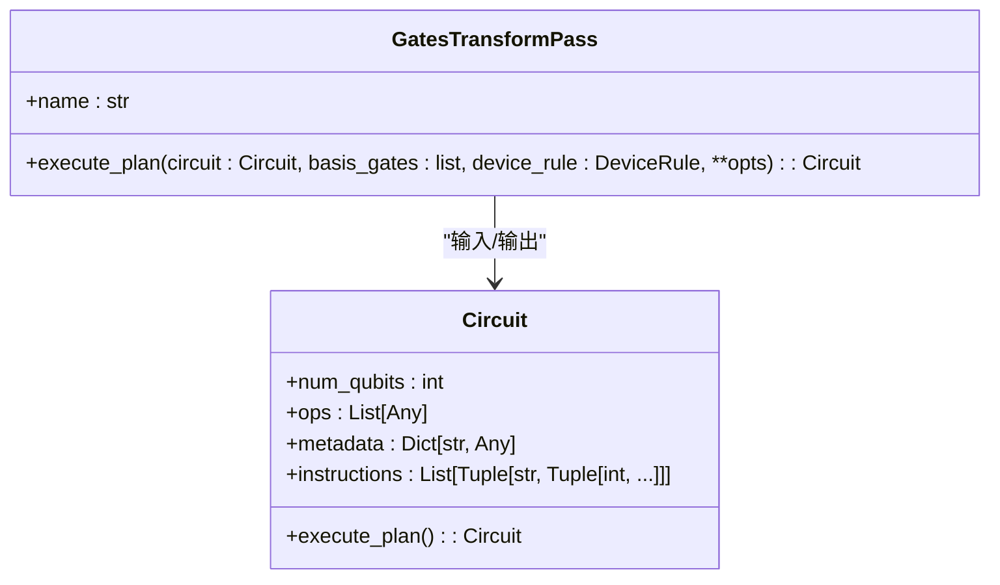
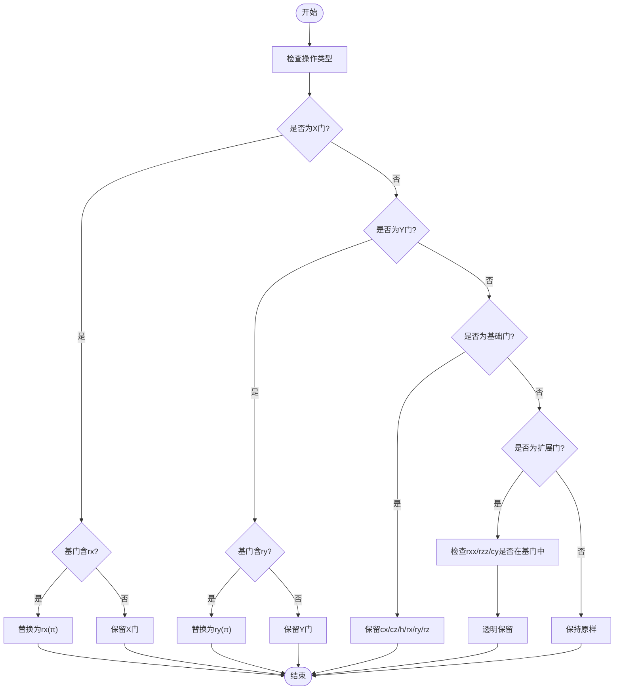

# 量子门变换

<cite>
**本文档引用的文件**  
- [gates_transform.py](file://src/tyxonq/compiler/stages/rewrite/gates_transform.py)
- [circuit.py](file://src/tyxonq/core/ir/circuit.py)
</cite>

## 目录
1. [引言](#引言)
2. [核心组件分析](#核心组件分析)
3. [GatesTransformPass类详解](#gatestransformpass类详解)
4. [execute_plan方法执行流程](#execute_plan方法执行流程)
5. [基门集合设计考量](#基门集合设计考量)
6. [电路变换示例](#电路变换示例)
7. [硬件兼容性提升机制](#硬件兼容性提升机制)
8. [结论](#结论)

## 引言
在量子计算编译器中，将高级量子电路转换为特定量子硬件可执行的低级指令是关键步骤。`GatesTransformPass` 类作为编译流程中的重写阶段，负责根据目标设备的基门集合（basis_gates）对电路中的量子门进行标准化重写。该过程确保了量子电路能够适配不同硬件平台的原生门集，从而提升执行效率与兼容性。

## 核心组件分析

**Section sources**
- [gates_transform.py](file://src/tyxonq/compiler/stages/rewrite/gates_transform.py#L9-L49)
- [circuit.py](file://src/tyxonq/core/ir/circuit.py#L48-L727)

## GatesTransformPass类详解

`GatesTransformPass` 是一个编译阶段类，其主要职责是依据用户指定或默认的基门集合，对量子电路中的操作进行等价变换和标准化处理。该类通过 `execute_plan` 方法实现具体的门重写逻辑。

该类的设计遵循最小化规则原则，仅对特定门执行变换，其余门则保持不变或透明保留。其核心功能包括：
- 将单量子比特X门和Y门分别转换为RX(π)和RY(π)
- 保留标准基门（如H、RX、RZ、CX、CZ）
- 对扩展门（如RXX、RZZ、CY）提供透明保留机制
- 支持自定义基门集合以适配不同硬件架构



**Diagram sources**
- [gates_transform.py](file://src/tyxonq/compiler/stages/rewrite/gates_transform.py#L9-L49)
- [circuit.py](file://src/tyxonq/core/ir/circuit.py#L48-L727)

**Section sources**
- [gates_transform.py](file://src/tyxonq/compiler/stages/rewrite/gates_transform.py#L9-L49)

## execute_plan方法执行流程

`execute_plan` 方法是 `GatesTransformPass` 的核心执行逻辑，接收一个 `Circuit` 对象和基门列表作为输入，并返回经过变换的新电路。

执行流程如下：
1. 遍历原始电路中的所有操作（ops）
2. 对每个操作进行类型检查与名称标准化
3. 根据预定义规则进行门重写：
   - 若操作为X门且"rx"在基门集中，则替换为`("rx", q, π)`
   - 若操作为Y门且"ry"在基门集中，则替换为`("ry", q, π)`
   - 若操作属于{cx, cz, h, rx, ry, rz}之一，则直接保留
   - 若操作为rxx/rzz/cy且对应门在基门集中，则透明保留
   - 其他情况保持原样
4. 构造并返回新的 `Circuit` 实例

此方法确保了变换后的电路在语义上与原电路等价，同时满足目标硬件的门集约束。



**Diagram sources**
- [gates_transform.py](file://src/tyxonq/compiler/stages/rewrite/gates_transform.py#L23-L49)

**Section sources**
- [gates_transform.py](file://src/tyxonq/compiler/stages/rewrite/gates_transform.py#L23-L49)

## 基门集合设计考量

默认基门集 `['h','rx','rz','cx','cz']` 的设计基于以下考量：

1. **通用性**：该集合覆盖了大多数超导量子处理器支持的基本门类型。
2. **完备性**：结合单量子比特旋转门（RX、RZ）和双量子比特纠缠门（CX、CZ），可近似实现任意量子操作。
3. **硬件友好性**：H门常用于叠加态制备，CX/CZ门为常见纠缠门，RX/RZ门可通过微波脉冲精确控制。
4. **简化编译**：避免使用平台特定门（如U3），提高跨平台兼容性。

当用户提供扩展门（如rxx、rzz、cy）时，系统采用透明保留策略，即只要这些门存在于用户指定的基门集中，就直接保留在输出电路中，不进行任何变换。这种机制支持高级门的直接映射，适用于支持原生高阶门的先进量子设备。

**Section sources**
- [gates_transform.py](file://src/tyxonq/compiler/stages/rewrite/gates_transform.py#L12-L18)

## 电路变换示例

考虑以下原始量子电路：
```python
原始电路操作序列：
[("x", 0), ("y", 1), ("h", 0), ("cx", 0, 1), ("rxx", 1, 2, 0.5)]
```

当使用默认基门集 `['h','rx','rz','cx','cz']` 进行变换时，结果如下：
```python
变换后电路操作序列：
[("rx", 0, π), ("ry", 1, π), ("h", 0), ("cx", 0, 1), ("rxx", 1, 2, 0.5)]
```

其中：
- `("x", 0)` 被重写为 `("rx", 0, π)`
- `("y", 1)` 被重写为 `("ry", 1, π)`
- `("h", 0)` 和 `("cx", 0, 1)` 属于基础门，直接保留
- `("rxx", 1, 2, 0.5)` 因"rxx"在基门集中，故透明保留

该示例展示了 `GatesTransformPass` 如何在保持电路功能完整性的同时，将其转换为更符合硬件执行要求的形式。

**Section sources**
- [gates_transform.py](file://src/tyxonq/compiler/stages/rewrite/gates_transform.py#L23-L49)

## 硬件兼容性提升机制

`GatesTransformPass` 在提升电路与硬件兼容性方面发挥着关键作用：

1. **门集适配**：通过将非标准门转换为目标硬件支持的基门，确保电路可在特定设备上执行。
2. **误差最小化**：使用硬件原生门可减少额外的分解误差，提高执行精度。
3. **性能优化**：避免在运行时进行动态门分解，降低延迟。
4. **灵活性支持**：允许用户自定义基门集，适配不同量子处理器架构（如IBM、Rigetti、IonQ等）。

此外，该阶段还为后续的布局映射、调度等编译步骤提供了标准化的输入，构成了完整量子编译流水线的重要一环。

**Section sources**
- [gates_transform.py](file://src/tyxonq/compiler/stages/rewrite/gates_transform.py#L9-L49)

## 结论
`GatesTransformPass` 类通过精确的门重写规则，实现了量子电路向目标硬件基门集的高效转换。其设计兼顾了通用性与灵活性，既支持标准门的等价变换，又允许扩展门的透明保留。该机制显著提升了量子程序的跨平台兼容性与执行效率，是量子编译器中不可或缺的核心组件。未来可进一步扩展支持更多门类型及更复杂的优化策略，以适应不断发展的量子硬件生态。