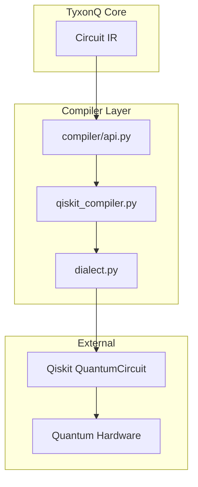
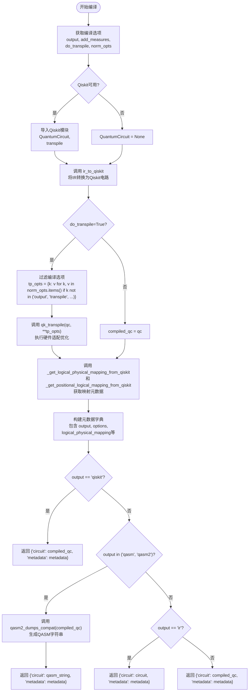
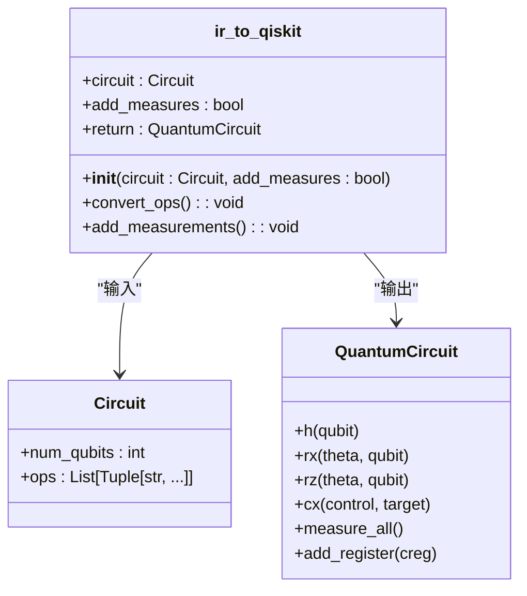
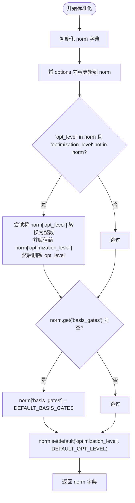
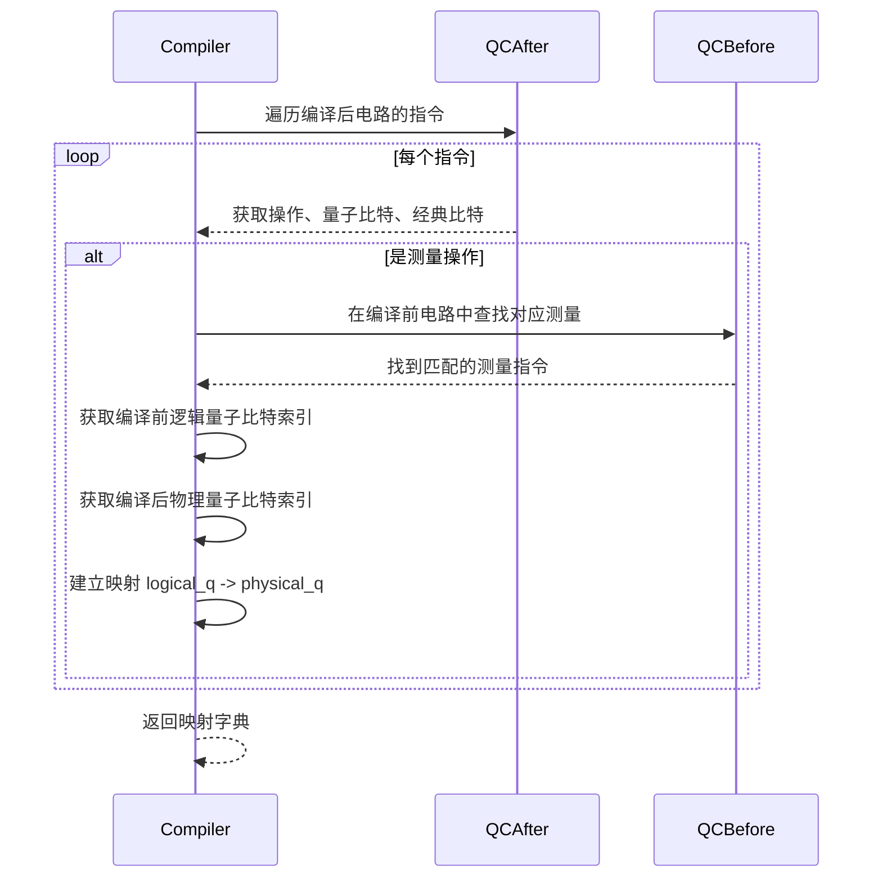
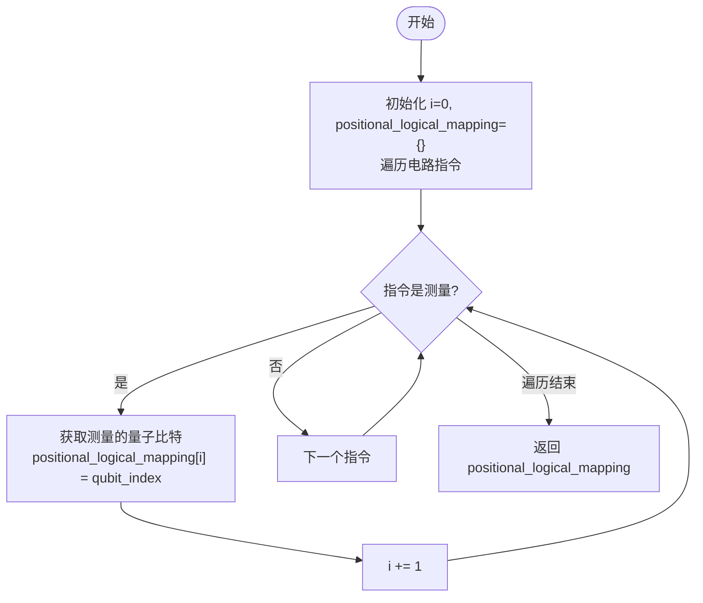
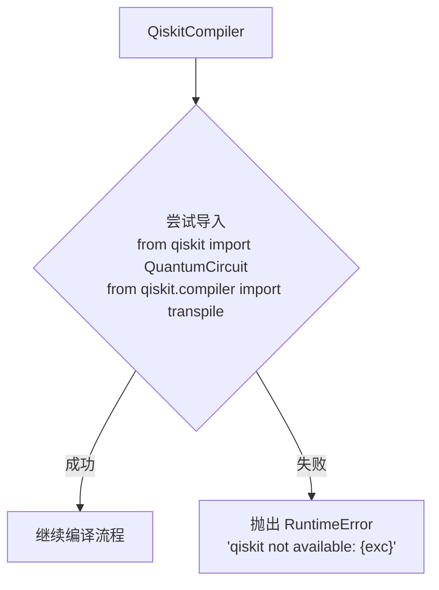

# Qiskit编译器

<cite>
**Referenced Files in This Document**   
- [qiskit_compiler.py](file://src/tyxonq/compiler/compile_engine/qiskit/qiskit_compiler.py)
- [dialect.py](file://src/tyxonq/compiler/compile_engine/qiskit/dialect.py)
- [api.py](file://src/tyxonq/compiler/api.py)
- [circuit.py](file://src/tyxonq/core/ir/circuit.py)
</cite>

## 目录
1. [简介](#简介)
2. [核心组件](#核心组件)
3. [架构概述](#架构概述)
4. [详细组件分析](#详细组件分析)
5. [依赖分析](#依赖分析)
6. [性能考量](#性能考量)
7. [故障排除指南](#故障排除指南)
8. [结论](#结论)

## 简介

TyxonQ Qiskit编译器（QiskitCompiler）是TyxonQ框架与外部量子硬件（特别是IBM Quantum设备）集成的关键桥梁。该编译器的核心职责是将TyxonQ内部的中间表示（IR）电路转换为Qiskit QuantumCircuit对象，从而利用Qiskit强大的transpile功能，实现针对特定量子硬件的门集映射、拓扑适配和深度优化。本文档将深入剖析其设计与实现，重点阐述其编译流程、关键功能和与原生编译器的差异。

## 核心组件

Qiskit编译器的核心功能由`QiskitCompiler`类实现，其`compile`方法是整个编译流程的入口。该方法通过`ir_to_qiskit`函数将TyxonQ的IR转换为Qiskit对象，并根据`transpile`参数决定是否触发Qiskit的优化流程。编译过程产生的`logical_physical_mapping`和`positional_logical_mapping`元数据对于结果解析至关重要。

**Section sources**
- [qiskit_compiler.py](file://src/tyxonq/compiler/compile_engine/qiskit/qiskit_compiler.py#L19-L76)

## 架构概述

Qiskit编译器作为TyxonQ编译引擎的一部分，位于核心IR与外部硬件之间。它通过`compiler/api.py`提供的统一入口被调用，将TyxonQ的`Circuit`对象作为输入，最终输出一个包含编译后电路和元数据的`CompileResult`。其主要依赖于`dialect.py`中定义的转换函数和辅助工具。



**Diagram sources**
- [qiskit_compiler.py](file://src/tyxonq/compiler/compile_engine/qiskit/qiskit_compiler.py#L19-L76)
- [dialect.py](file://src/tyxonq/compiler/compile_engine/qiskit/dialect.py#L26-L244)
- [api.py](file://src/tyxonq/compiler/api.py#L23-L62)

## 详细组件分析

### QiskitCompiler类分析

`QiskitCompiler`类是Qiskit编译功能的封装。其`compile`方法是核心，负责协调整个编译流程。

#### 编译流程分析


**Diagram sources**
- [qiskit_compiler.py](file://src/tyxonq/compiler/compile_engine/qiskit/qiskit_compiler.py#L19-L76)

**Section sources**
- [qiskit_compiler.py](file://src/tyxonq/compiler/compile_engine/qiskit/qiskit_compiler.py#L19-L76)

#### IR到Qiskit的转换
`ir_to_qiskit`函数是实现IR到Qiskit转换的关键。它遍历TyxonQ IR中的操作列表，并将其映射为对应的Qiskit门操作。



**Diagram sources**
- [dialect.py](file://src/tyxonq/compiler/compile_engine/qiskit/dialect.py#L200-L240)

#### 编译选项标准化
`normalize_transpile_options`函数负责过滤和标准化传递给Qiskit的编译选项，确保参数兼容性。



**Diagram sources**
- [dialect.py](file://src/tyxonq/compiler/compile_engine/qiskit/dialect.py#L26-L39)

### 元数据映射分析

编译后返回的`logical_physical_mapping`和`positional_logical_mapping`是解析硬件执行结果的关键。

#### 逻辑到物理量子比特映射
`_get_logical_physical_mapping_from_qiskit`函数通过比较编译前后的测量指令，建立逻辑量子比特到物理量子比特的映射关系。



**Diagram sources**
- [dialect.py](file://src/tyxonq/compiler/compile_engine/qiskit/dialect.py#L95-L121)

#### 位置到逻辑量子比特映射
`_get_positional_logical_mapping_from_qiskit`函数根据测量指令在电路中的位置，建立测量结果位置到逻辑量子比特的映射。



**Diagram sources**
- [dialect.py](file://src/tyxonq/compiler/compile_engine/qiskit/dialect.py#L79-L92)

## 依赖分析

Qiskit编译器对Qiskit库有可选依赖。在`compile`方法中，通过`try...except`块尝试导入Qiskit模块。如果导入失败，会抛出`RuntimeError`异常，提示用户Qiskit不可用。



**Diagram sources**
- [qiskit_compiler.py](file://src/tyxonq/compiler/compile_engine/qiskit/qiskit_compiler.py#L30-L37)

## 性能考量

Qiskit编译器的性能主要受Qiskit `transpile`函数的影响。`transpile`过程会根据指定的`optimization_level`进行不同程度的优化，级别越高，优化越彻底，但耗时也越长。用户可以通过`options`参数中的`optimization_level`或`opt_level`来控制优化级别。此外，`basis_gates`的设置也会影响门集映射的效率。

## 故障排除指南

### Qiskit依赖缺失
当系统中未安装Qiskit时，调用`QiskitCompiler.compile`会抛出`RuntimeError`。解决方法是安装Qiskit：
```bash
pip install qiskit
```

### 不支持的操作
`ir_to_qiskit`函数目前仅支持`h`, `rx`, `rz`, `cx`, `measure_z`等基本操作。如果IR中包含不支持的操作，会抛出`NotImplementedError`。需要确保电路中的操作在支持列表内。

### 测量指令问题
如果`add_measures`选项为`True`，但IR中没有`measure_z`操作，编译器会自动调用`qc.measure_all()`添加测量。如果用户希望精确控制测量位置，应在IR中显式添加`measure_z`操作。

**Section sources**
- [qiskit_compiler.py](file://src/tyxonq/compiler/compile_engine/qiskit/qiskit_compiler.py#L30-L37)
- [dialect.py](file://src/tyxonq/compiler/compile_engine/qiskit/dialect.py#L200-L240)

## 结论

TyxonQ Qiskit编译器是一个功能强大且设计精巧的桥梁，它成功地将TyxonQ的IR与Qiskit生态系统连接起来。通过`ir_to_qiskit`和`transpile`机制，它能够将高级量子电路编译并优化为可在真实硬件上执行的指令。其返回的`logical_physical_mapping`和`positional_logical_mapping`元数据为结果解析提供了必要的信息。与原生编译器相比，Qiskit编译器专注于硬件执行，输出Qiskit对象或QASM，而原生编译器则侧重于内部优化，输出TyxonQ IR。这种设计使得TyxonQ框架既能进行高效的内部优化，又能无缝对接外部量子硬件。