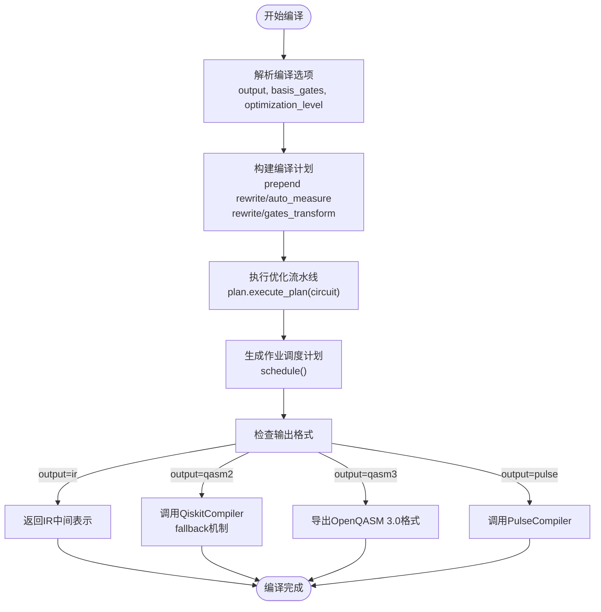
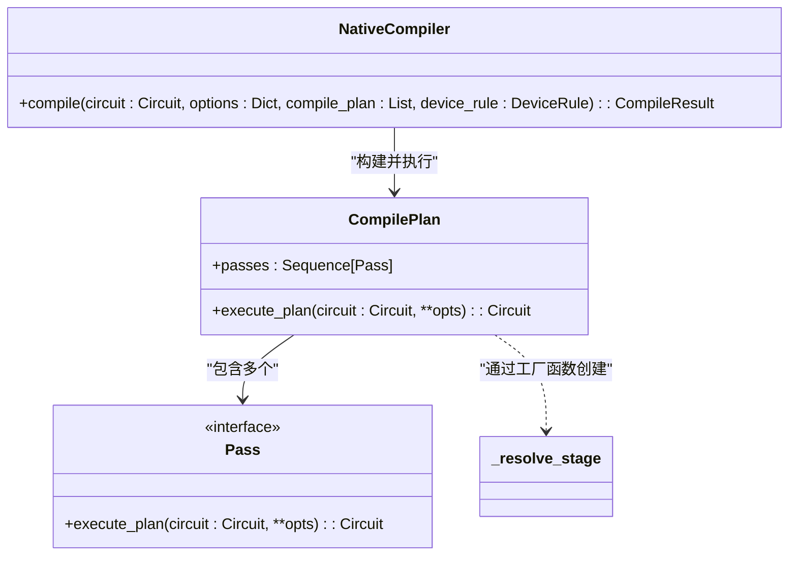
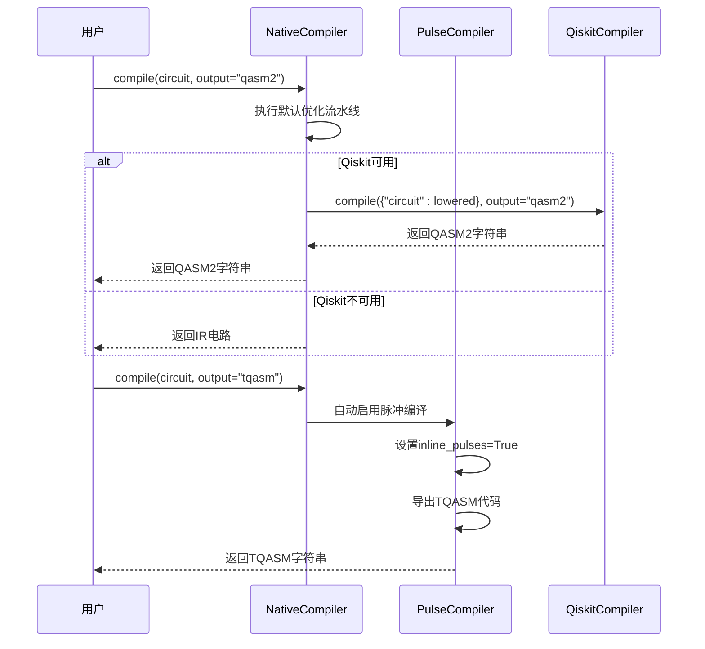
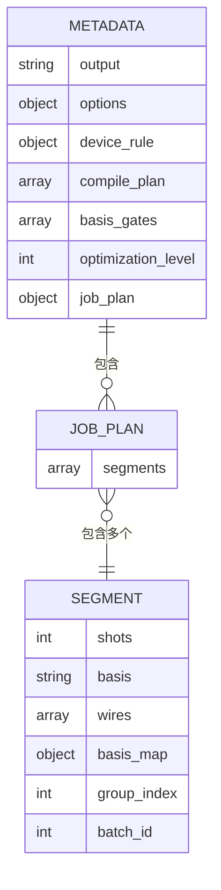
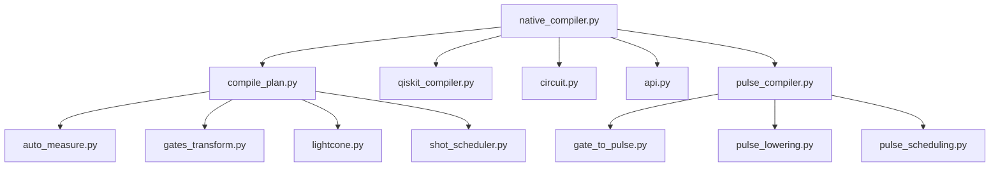

# 原生编译器

<cite>
**本文档中引用的文件**  
- [native_compiler.py](file://src/tyxonq/compiler/compile_engine/native/native_compiler.py) - *更新了compile API的bug修复和脉冲编译优化*
- [compile_plan.py](file://src/tyxonq/compiler/compile_engine/native/compile_plan.py) - *编译计划构建机制*
- [auto_measure.py](file://src/tyxonq/compiler/stages/rewrite/auto_measure.py) - *自动测量插入阶段*
- [gates_transform.py](file://src/tyxonq/compiler/stages/rewrite/gates_transform.py) - *门电路标准化阶段*
- [pulse_compiler.py](file://src/tyxonq/compiler/pulse_compile_engine/native/pulse_compiler.py) - *脉冲编译器核心实现*
- [api.py](file://src/tyxonq/compiler/api.py) - *统一编译入口点*
</cite>

## 更新摘要
**变更内容**   
- 更新了原生编译器的compile API，修复了相关bug
- 增加了脉冲编译API的优化和bug修复
- 更新了编译流程以支持更智能的脉冲编译推断
- 增强了对脉冲编译模式的自动检测和处理
- 优化了TQASM输出格式的处理逻辑

## 目录
1. [简介](#简介)
2. [核心编译流程](#核心编译流程)
3. [编译计划构建机制](#编译计划构建机制)
4. [默认重写阶段详解](#默认重写阶段详解)
5. [输出格式与兼容性支持](#输出格式与兼容性支持)
6. [自定义优化流水线](#自定义优化流水线)
7. [编译元数据结构与用途](#编译元数据结构与用途)
8. [依赖分析](#依赖分析)

## 简介
TyxonQ原生编译器（NativeCompiler）是框架内部的核心编译流水线，负责将高级量子电路转换为可在目标设备上执行的优化表示。该编译器通过模块化、可组合的阶段序列实现灵活的优化策略，支持从IR中间表示到QASM2或Qiskit对象的多种输出格式。其设计强调可扩展性与调试能力，通过编译元数据记录完整的优化路径与调度信息。

**Section sources**
- [native_compiler.py](file://src/tyxonq/compiler/compile_engine/native/native_compiler.py#L1-L101)

## 核心编译流程
原生编译器的核心方法`compile`接收一个`Circuit`对象、编译选项字典以及可选的自定义编译计划和设备规则。该方法首先解析输出格式、基础门集合和优化级别等选项，然后构建一个由多个编译阶段组成的优化流水线。该流水线通过`build_plan`函数实例化为`CompilePlan`对象，并执行`execute_plan`方法对输入电路进行变换。最终，根据`output`参数决定返回IR、QASM2字符串或Qiskit电路对象。

**Diagram sources**
- [native_compiler.py](file://src/tyxonq/compiler/compile_engine/native/native_compiler.py#L15-L98)
- [api.py](file://src/tyxonq/compiler/api.py#L32-L307)

**Section sources**
- [native_compiler.py](file://src/tyxonq/compiler/compile_engine/native/native_compiler.py#L15-L98)
- [api.py](file://src/tyxonq/compiler/api.py#L32-L307)

## 编译计划构建机制
编译计划（`compile_plan`）是用户自定义优化阶段序列的接口。`NativeCompiler.compile`方法优先使用传入的`compile_plan`参数，若未提供则使用空列表。无论何种情况，系统都会在用户计划前**强制插入**两个关键的标准化阶段：`rewrite/auto_measure`和`rewrite/gates_transform`。最终的流水线由`build_plan`函数根据阶段名称列表动态解析并实例化为`Pass`对象序列。

**Diagram sources**
- [compile_plan.py](file://src/tyxonq/compiler/compile_engine/native/compile_plan.py#L0-L97)
- [native_compiler.py](file://src/tyxonq/compiler/compile_engine/native/native_compiler.py#L15-L98)

**Section sources**
- [compile_plan.py](file://src/tyxonq/compiler/compile_engine/native/compile_plan.py#L0-L97)

## 默认重写阶段详解
原生编译器默认插入的两个重写阶段确保了电路的完备性与标准化。

### 自动测量插入（rewrite/auto_measure）
`AutoMeasurePass`检查输入电路是否包含任何`measure_z`操作。如果电路中没有显式测量，该阶段会向所有量子比特（0到num_qubits-1）自动添加`measure_z`操作，并发出非致命警告。此行为确保了所有电路在执行前都有明确的测量定义，避免了因遗漏测量而导致的意外行为。

**Section sources**
- [auto_measure.py](file://src/tyxonq/compiler/stages/rewrite/auto_measure.py#L0-L37)

### 门电路标准化（rewrite/gates_transform）
`GatesTransformPass`根据`options`中的`basis_gates`列表，将电路中的门操作重写为指定的基础门集合。默认基础门为`["h", "rx", "rz", "cx", "cz"]`。例如，`x`门会被转换为`rx(π)`，`y`门会被转换为`ry(π)`。该阶段确保了后续优化和硬件执行的兼容性。

**Section sources**
- [gates_transform.py](file://src/tyxonq/compiler/stages/rewrite/gates_transform.py#L0-L52)

## 输出格式与兼容性支持
编译器通过`output`参数灵活控制输出格式。当`output`为`"ir"`或`"tyxonq"`时，直接返回经过优化的IR电路和元数据。对于`"qasm"`或`"qasm2"`输出，编译器采用**fallback机制**：它会动态导入`QiskitCompiler`，将当前优化后的IR电路作为输入，调用Qiskit的编译流程生成QASM2字符串。此设计避免了在原生编译器中重复实现复杂的QASM降级逻辑，同时保证了与Qiskit生态的兼容性。如果Qiskit不可用，则降级返回IR。

对于脉冲编译，当`output`为`"tqasm"`、`"qasm3"`或`"tyxonq_homebrew_tqasm"`时，系统会自动设置`inline_pulses=True`，确保脉冲定义被完全内联，适合云端提交和序列化。

**Diagram sources**
- [native_compiler.py](file://src/tyxonq/compiler/compile_engine/native/native_compiler.py#L15-L98)
- [pulse_compiler.py](file://src/tyxonq/compiler/pulse_compile_engine/native/pulse_compiler.py#L80-L196)
- [api.py](file://src/tyxonq/compiler/api.py#L32-L307)

**Section sources**
- [native_compiler.py](file://src/tyxonq/compiler/compile_engine/native/native_compiler.py#L15-L98)
- [pulse_compiler.py](file://src/tyxonq/compiler/pulse_compile_engine/native/pulse_compiler.py#L80-L196)
- [api.py](file://src/tyxonq/compiler/api.py#L32-L307)

## 自定义优化流水线
用户可以通过`compile_plan`参数完全控制优化阶段的序列。例如，可以插入`simplify/lightcone`阶段来执行前向切片优化，或添加`scheduling/shot_scheduler`来规划测量任务。同时，`basis_gates`和`optimization_level`选项允许精细控制优化的强度和目标架构。`optimization_level`为0时执行最小优化，更高的级别可触发更激进的简化策略。

对于脉冲编译，用户可以通过`device_params`提供设备物理参数（如qubit_freq、anharmonicity等），并通过`calibrations`提供自定义脉冲校准。系统会自动补足缺失的`device_params`，并根据输出格式自动设置`inline_pulses`参数。

**Section sources**
- [compile_plan.py](file://src/tyxonq/compiler/compile_engine/native/compile_plan.py#L0-L97)
- [lightcone.py](file://src/tyxonq/compiler/stages/simplify/lightcone.py#L0-L98)
- [shot_scheduler.py](file://src/tyxonq/compiler/stages/scheduling/shot_scheduler.py#L0-L136)
- [pulse_compiler.py](file://src/tyxonq/compiler/pulse_compile_engine/native/pulse_compiler.py#L80-L196)

## 编译元数据结构与用途
编译结果中的`metadata`字典包含了丰富的调试和分析信息。其关键字段包括：
- `output`: 请求的输出格式
- `options`: 合并后的编译选项
- `device_rule`: 设备约束规则
- `compile_plan`: 实际执行的完整阶段序列
- `basis_gates`: 使用的基础门集合
- `optimization_level`: 优化级别
- `job_plan`: 作业调度计划，包含分段的shots、测量基和批次ID

这些元数据对于理解编译过程、复现问题和性能分析至关重要。例如，通过检查`compile_plan`可以确认`auto_measure`阶段是否被正确插入；通过分析`job_plan`可以评估测量任务的调度效率。

**Diagram sources**
- [native_compiler.py](file://src/tyxonq/compiler/compile_engine/native/native_compiler.py#L15-L98)
- [shot_scheduler.py](file://src/tyxonq/compiler/stages/scheduling/shot_scheduler.py#L0-L136)

**Section sources**
- [native_compiler.py](file://src/tyxonq/compiler/compile_engine/native/native_compiler.py#L15-L98)
- [shot_scheduler.py](file://src/tyxonq/compiler/stages/scheduling/shot_scheduler.py#L0-L136)

## 依赖分析
原生编译器的设计高度模块化，其核心依赖清晰分离。

**Diagram sources**
- [native_compiler.py](file://src/tyxonq/compiler/compile_engine/native/native_compiler.py#L1-L101)
- [compile_plan.py](file://src/tyxonq/compiler/compile_engine/native/compile_plan.py#L0-L97)
- [pulse_compiler.py](file://src/tyxonq/compiler/pulse_compile_engine/native/pulse_compiler.py#L23-L315)

**Section sources**
- [native_compiler.py](file://src/tyxonq/compiler/compile_engine/native/native_compiler.py#L1-L101)
- [compile_plan.py](file://src/tyxonq/compiler/compile_engine/native/compile_plan.py#L0-L97)
- [circuit.py](file://src/tyxonq/core/ir/circuit.py#L48-L727)
- [api.py](file://src/tyxonq/compiler/api.py#L10-L14)
- [pulse_compiler.py](file://src/tyxonq/compiler/pulse_compile_engine/native/pulse_compiler.py#L23-L315)