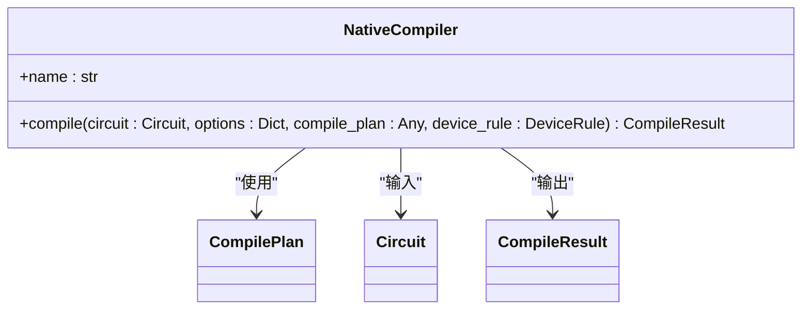
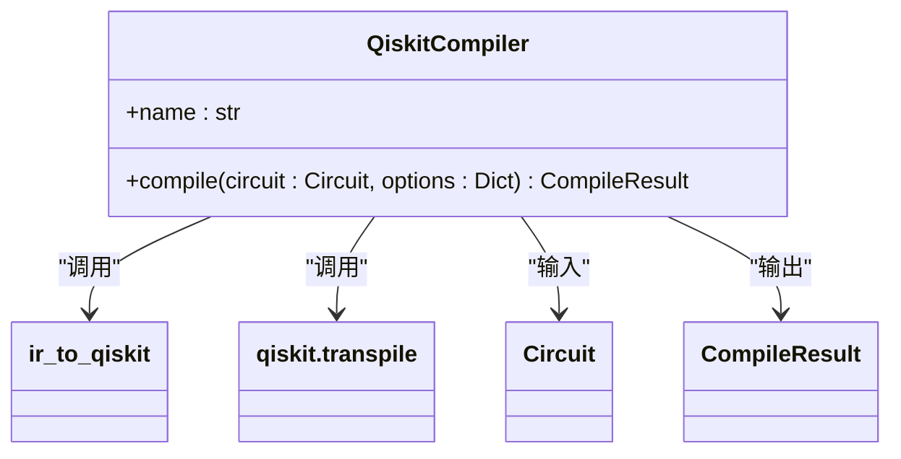
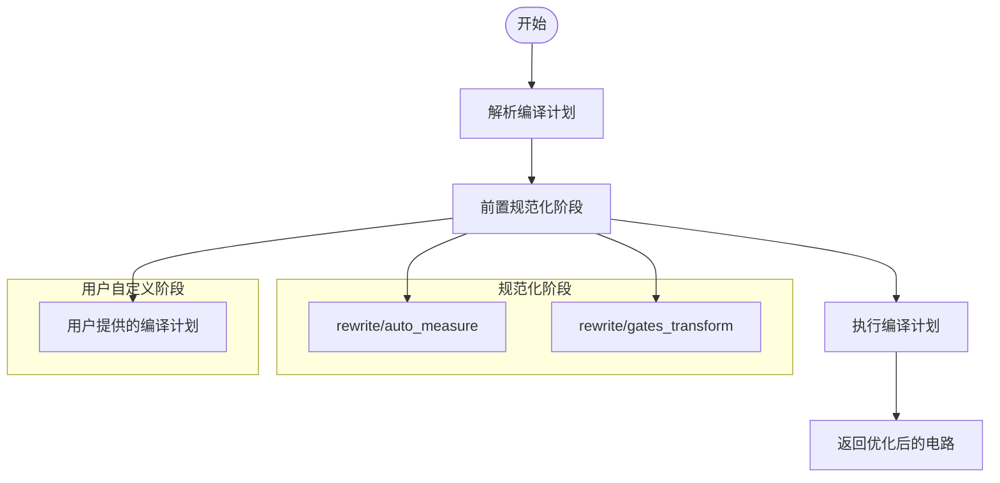
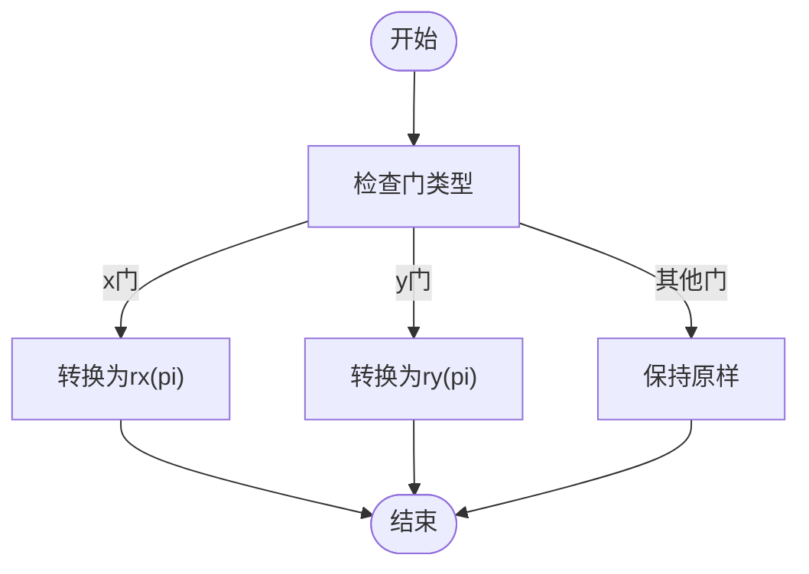
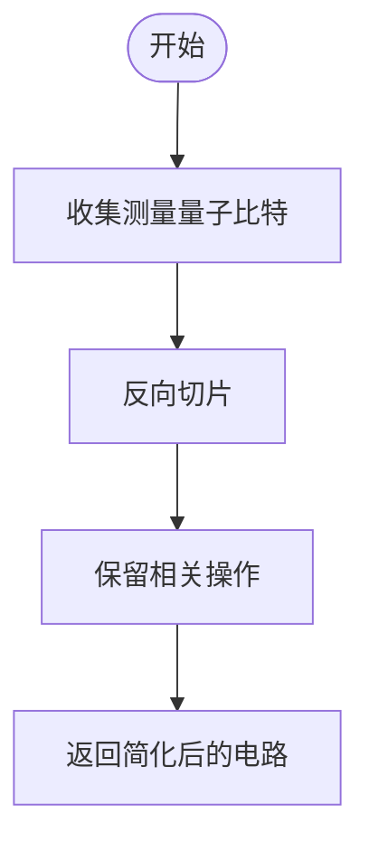
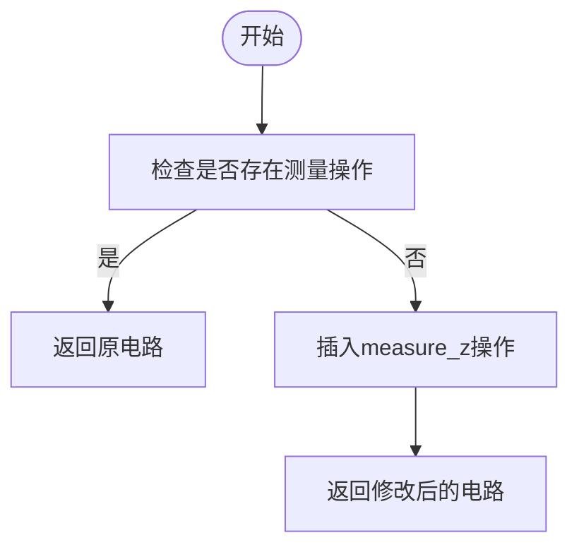
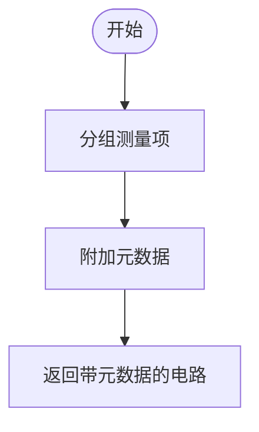
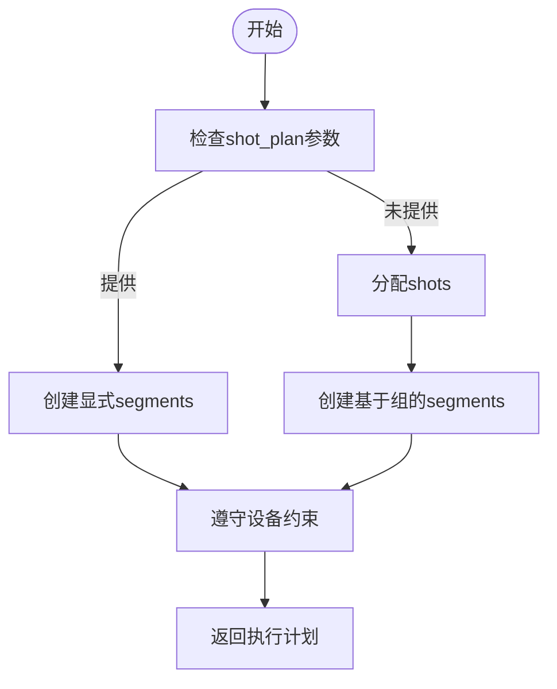
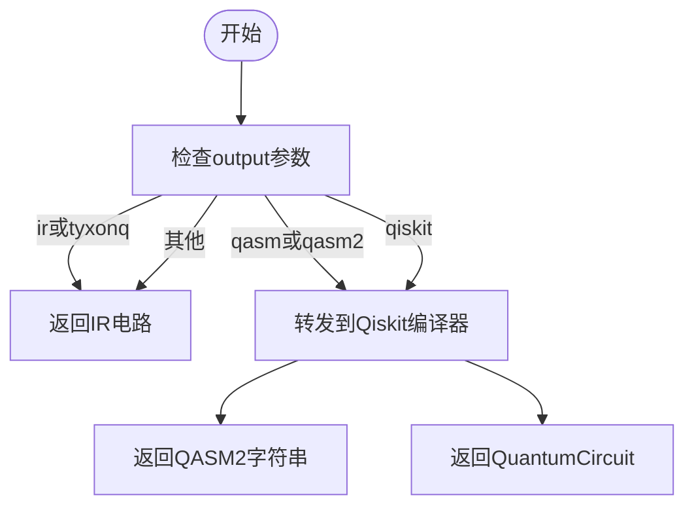
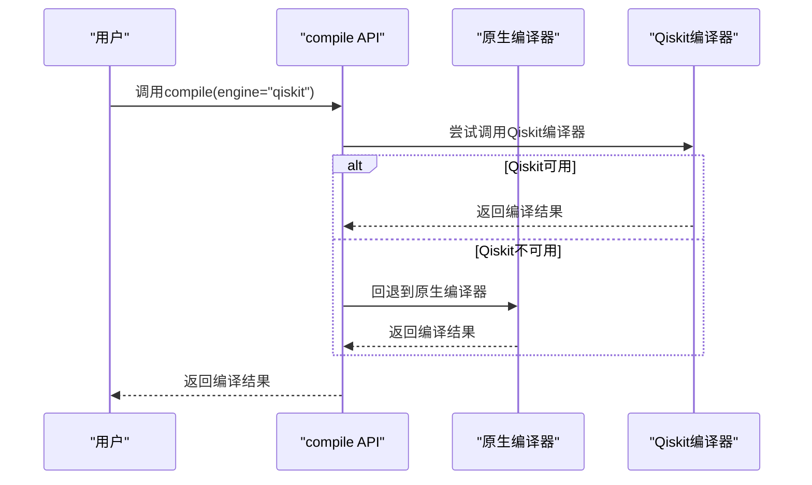

# 编译引擎

<cite>
**本文档中引用的文件**
- [native_compiler.py](file://src/tyxonq/compiler/compile_engine/native/native_compiler.py)
- [qiskit_compiler.py](file://src/tyxonq/compiler/compile_engine/qiskit/qiskit_compiler.py)
- [compile_plan.py](file://src/tyxonq/compiler/compile_engine/native/compile_plan.py)
- [api.py](file://src/tyxonq/compiler/api.py)
- [circuit.py](file://src/tyxonq/core/ir/circuit.py)
- [gates_transform.py](file://src/tyxonq/compiler/stages/rewrite/gates_transform.py)
- [lightcone.py](file://src/tyxonq/compiler/stages/simplify/lightcone.py)
- [auto_measure.py](file://src/tyxonq/compiler/stages/rewrite/auto_measure.py)
- [measurement.py](file://src/tyxonq/compiler/stages/rewrite/measurement.py)
- [shot_scheduler.py](file://src/tyxonq/compiler/stages/scheduling/shot_scheduler.py)
- [dialect.py](file://src/tyxonq/compiler/compile_engine/qiskit/dialect.py)
- [DeviceRule](file://src/tyxonq/devices/base.py)
</cite>

## 目录
1. [引言](#引言)
2. [原生编译器实现机制](#原生编译器实现机制)
3. [Qiskit编译器实现机制](#qiskit编译器实现机制)
4. [编译流水线构建与优化阶段](#编译流水线构建与优化阶段)
5. [输出格式与灵活转换](#输出格式与灵活转换)
6. [引擎对比与适用场景](#引擎对比与适用场景)
7. [API使用与回退机制](#api使用与回退机制)
8. [结论](#结论)

## 引言
TyxonQ编译引擎为量子电路提供统一的编译接口，支持两种核心编译模式：原生编译器（NativeCompiler）和Qiskit编译器（QiskitCompiler）。原生编译器专注于内部优化和快速执行，通过构建可定制的编译流水线对电路进行优化；Qiskit编译器则用于与IBM量子硬件集成，利用Qiskit的transpile功能进行硬件适配和门集映射。本技术文档详细阐述两种编译引擎的实现机制、架构设计及使用方式。

## 原生编译器实现机制
原生编译器（`NativeCompiler`）是TyxonQ的核心编译组件，负责执行电路优化和编译流水线。其主要功能包括构建编译计划、执行优化阶段以及根据输出参数生成不同格式的电路表示。



**图源**
- [native_compiler.py](file://src/tyxonq/compiler/compile_engine/native/native_compiler.py#L12-L98)

**本节源**
- [native_compiler.py](file://src/tyxonq/compiler/compile_engine/native/native_compiler.py#L12-L98)

## Qiskit编译器实现机制
Qiskit编译器（`QiskitCompiler`）通过`ir_to_qiskit`函数将TyxonQ的IR电路转换为Qiskit的`QuantumCircuit`对象，并调用`qiskit.transpile`进行硬件适配和门集映射。该编译器主要用于与IBM量子硬件集成。



**图源**
- [qiskit_compiler.py](file://src/tyxonq/compiler/compile_engine/qiskit/qiskit_compiler.py#L19-L76)

**本节源**
- [qiskit_compiler.py](file://src/tyxonq/compiler/compile_engine/qiskit/qiskit_compiler.py#L19-L76)

## 编译流水线构建与优化阶段
原生编译器通过`build_plan`函数构建编译流水线，该流水线由多个优化阶段组成，包括重写（rewrite）、简化（simplify）和调度（scheduling）等。

### 编译流水线构建
`build_plan`函数接收一个阶段名称列表，并将其转换为`CompilePlan`对象。每个阶段名称对应一个具体的优化Pass，如`rewrite/auto_measure`、`rewrite/gates_transform`等。



**图源**
- [compile_plan.py](file://src/tyxonq/compiler/compile_engine/native/compile_plan.py#L91-L94)

**本节源**
- [compile_plan.py](file://src/tyxonq/compiler/compile_engine/native/compile_plan.py#L91-L94)

### 优化阶段详解
#### 门变换重写（GatesTransformPass）
该阶段根据`basis_gates`选项将电路中的门转换为目标门集合。例如，将`x`门转换为`rx(pi)`，将`y`门转换为`ry(pi)`。



**图源**
- [gates_transform.py](file://src/tyxonq/compiler/stages/rewrite/gates_transform.py#L9-L49)

**本节源**
- [gates_transform.py](file://src/tyxonq/compiler/stages/rewrite/gates_transform.py#L9-L49)

#### 光锥简化（LightconeSimplifyPass）
该阶段通过反向遍历电路操作，识别并保留影响测量结果的“光锥”区域内的操作，从而简化电路。



**图源**
- [lightcone.py](file://src/tyxonq/compiler/stages/simplify/lightcone.py#L9-L95)

**本节源**
- [lightcone.py](file://src/tyxonq/compiler/stages/simplify/lightcone.py#L9-L95)

#### 自动测量插入（AutoMeasurePass）
当电路中没有显式测量操作时，该阶段会自动在所有量子比特上插入`measure_z`操作。



**图源**
- [auto_measure.py](file://src/tyxonq/compiler/stages/rewrite/auto_measure.py#L10-L34)

**本节源**
- [auto_measure.py](file://src/tyxonq/compiler/stages/rewrite/auto_measure.py#L10-L34)

#### 测量重写（MeasurementRewritePass）
该阶段处理与测量相关的构造，将测量项分组并附加元数据，以便下游调度器进行设置重用。



**图源**
- [measurement.py](file://src/tyxonq/compiler/stages/rewrite/measurement.py#L9-L88)

**本节源**
- [measurement.py](file://src/tyxonq/compiler/stages/rewrite/measurement.py#L9-L88)

#### 调度（ShotSchedulerPass）
该阶段根据`shot_plan`或`total_shots`参数创建执行计划（segments），用于测量执行。



**图源**
- [shot_scheduler.py](file://src/tyxonq/compiler/stages/scheduling/shot_scheduler.py#L43-L118)

**本节源**
- [shot_scheduler.py](file://src/tyxonq/compiler/stages/scheduling/shot_scheduler.py#L43-L118)

## 输出格式与灵活转换
原生编译器支持多种输出格式，包括IR、QASM2和Qiskit格式。输出格式由`output`参数控制。



**图源**
- [native_compiler.py](file://src/tyxonq/compiler/compile_engine/native/native_compiler.py#L15-L98)

**本节源**
- [native_compiler.py](file://src/tyxonq/compiler/compile_engine/native/native_compiler.py#L15-L98)

## 引擎对比与适用场景
| 特性 | 原生编译器 | Qiskit编译器 |
|------|------------|-------------|
| **主要用途** | 内部优化和快速执行 | 与IBM量子硬件集成 |
| **优化能力** | 支持自定义编译流水线 | 依赖Qiskit的transpile功能 |
| **输出格式** | IR、QASM2、Qiskit | Qiskit QuantumCircuit、QASM2 |
| **硬件适配** | 有限 | 强大，支持多种IBM设备 |
| **依赖** | 无外部依赖 | 需要安装Qiskit |

**本节源**
- [native_compiler.py](file://src/tyxonq/compiler/compile_engine/native/native_compiler.py#L12-L98)
- [qiskit_compiler.py](file://src/tyxonq/compiler/compile_engine/qiskit/qiskit_compiler.py#L19-L76)

## API使用与回退机制
用户可以通过`compile()` API切换编译引擎。当指定的编译引擎不可用时，系统会自动回退到原生编译器。

### API调用示例
```python
# 使用原生编译器
result = compile(circuit, compile_engine="native", output="ir")

# 使用Qiskit编译器
result = compile(circuit, compile_engine="qiskit", output="qiskit")

# 使用默认编译器（原生）
result = compile(circuit)
```

### 回退机制
当指定的编译引擎不可用时，系统会自动回退到原生编译器。例如，当`compile_engine`为`qiskit`但Qiskit未安装时，系统会使用原生编译器。



**图源**
- [api.py](file://src/tyxonq/compiler/api.py#L23-L62)

**本节源**
- [api.py](file://src/tyxonq/compiler/api.py#L23-L62)

## 结论
TyxonQ编译引擎提供了灵活且强大的编译能力，支持原生编译器和Qiskit编译器两种模式。原生编译器通过可定制的编译流水线实现了高效的电路优化，适用于内部优化和快速执行；Qiskit编译器则通过与Qiskit的集成，实现了与IBM量子硬件的无缝对接。用户可以根据具体需求选择合适的编译引擎，并通过统一的API进行调用。当指定的编译引擎不可用时，系统会自动回退到原生编译器，确保编译过程的可靠性。