# 编译引擎

<cite>
**本文档中引用的文件**
- [native_compiler.py](file://src/tyxonq/compiler/compile_engine/native/native_compiler.py)
- [qiskit_compiler.py](file://src/tyxonq/compiler/compile_engine/qiskit/qiskit_compiler.py)
- [guodun_compiler.py](file://src/tyxonq/compiler/compile_engine/guodun/compiler.py)
- [guodun_pulse.py](file://src/tyxonq/compiler/compile_engine/guodun/pulse.py)
- [compile_plan.py](file://src/tyxonq/compiler/compile_engine/native/compile_plan.py)
- [api.py](file://src/tyxonq/compiler/api.py)
- [circuit.py](file://src/tyxonq/core/ir/circuit.py)
- [gates_transform.py](file://src/tyxonq/compiler/stages/rewrite/gates_transform.py)
- [lightcone.py](file://src/tyxonq/compiler/stages/simplify/lightcone.py)
- [auto_measure.py](file://src/tyxonq/compiler/stages/rewrite/auto_measure.py)
- [measurement.py](file://src/tyxonq/compiler/stages/rewrite/measurement.py)
- [shot_scheduler.py](file://src/tyxonq/compiler/stages/scheduling/shot_scheduler.py)
- [dialect.py](file://src/tyxonq/compiler/compile_engine/qiskit/dialect.py)
- [DeviceRule](file://src/tyxonq/devices/base.py)
</cite>

## 更新摘要
**变更内容**
- 新增Guodun编译器引擎，支持国盾量子硬件平台的QCIS格式编译
- 增强编译流水线，支持X/H/RZ/CZ/M门序列处理和脉冲-QCIS操作集成
- 扩展API以支持新的编译引擎选择和回退机制
- 添加原生脉冲编程支持和安全验证机制

## 目录
1. [引言](#引言)
2. [原生编译器实现机制](#原生编译器实现机制)
3. [Qiskit编译器实现机制](#qiskit编译器实现机制)
4. [Guodun编译器实现机制](#guodun编译器实现机制)
5. [编译流水线构建与优化阶段](#编译流水线构建与优化阶段)
6. [输出格式与灵活转换](#输出格式与灵活转换)
7. [引擎对比与适用场景](#引擎对比与适用场景)
8. [API使用与回退机制](#api使用与回退机制)
9. [结论](#结论)

## 引言
TyxonQ编译引擎为量子电路提供统一的编译接口，支持三种核心编译模式：原生编译器（NativeCompiler）、Qiskit编译器（QiskitCompiler）和Guodun编译器（GuodunCompiler）。原生编译器专注于内部优化和快速执行，通过构建可定制的编译流水线对电路进行优化；Qiskit编译器用于与IBM量子硬件集成，利用Qiskit的transpile功能进行硬件适配和门集映射；Guodun编译器专为国盾量子硬件平台设计，支持QCIS格式编译和原生脉冲编程。本技术文档详细阐述三种编译引擎的实现机制、架构设计及使用方式。

## 原生编译器实现机制
原生编译器（`NativeCompiler`）是TyxonQ的核心编译组件，负责执行电路优化和编译流水线。其主要功能包括构建编译计划、执行优化阶段以及根据输出参数生成不同格式的电路表示。

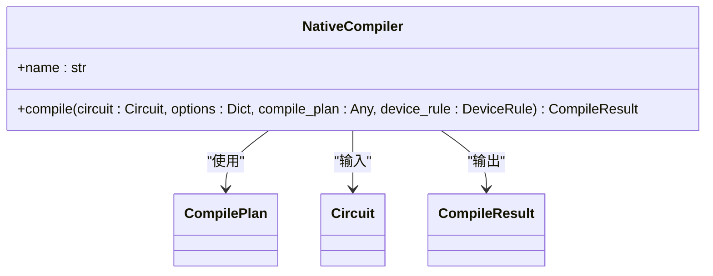
```mermaid
classDiagram
class NativeCompiler {
+name : str
+compile(circuit : Circuit, options : Dict, compile_plan : Any, device_rule : DeviceRule) CompileResult
}
NativeCompiler --> CompilePlan : "使用"
NativeCompiler --> Circuit : "输入"
NativeCompiler --> CompileResult : "输出"
```

**图源**
- [native_compiler.py:12-98](file://src/tyxonq/compiler/compile_engine/native/native_compiler.py#L12-L98)

**本节源**
- [native_compiler.py:12-98](file://src/tyxonq/compiler/compile_engine/native/native_compiler.py#L12-L98)

## Qiskit编译器实现机制
Qiskit编译器（`QiskitCompiler`）通过`ir_to_qiskit`函数将TyxonQ的IR电路转换为Qiskit的`QuantumCircuit`对象，并调用`qiskit.transpile`进行硬件适配和门集映射。该编译器主要用于与IBM量子硬件集成。

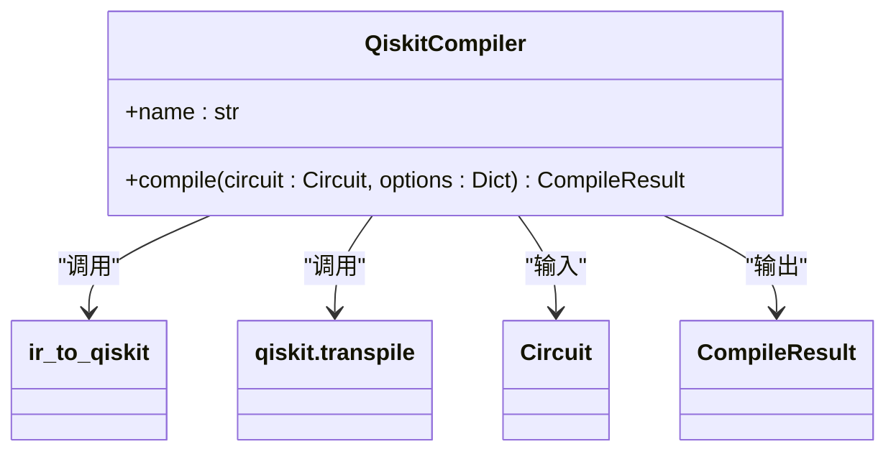
```mermaid
classDiagram
class QiskitCompiler {
+name : str
+compile(circuit : Circuit, options : Dict) CompileResult
}
QiskitCompiler --> ir_to_qiskit : "调用"
QiskitCompiler --> qiskit.transpile : "调用"
QiskitCompiler --> Circuit : "输入"
QiskitCompiler --> CompileResult : "输出"
```

**图源**
- [qiskit_compiler.py:19-76](file://src/tyxonq/compiler/compile_engine/qiskit/qiskit_compiler.py#L19-L76)

**本节源**
- [qiskit_compiler.py:19-76](file://src/tyxonq/compiler/compile_engine/qiskit/qiskit_compiler.py#L19-L76)

## Guodun编译器实现机制
Guodun编译器（`GuodunCompiler`）是专门为国盾量子硬件平台设计的编译引擎，将TyxonQ电路转换为平台使用的QCIS格式。它支持完整的门级QCIS操作和原生脉冲编程功能。

### 门级QCIS编译
Guodun编译器通过以下步骤将TyxonQ电路转换为QCIS：

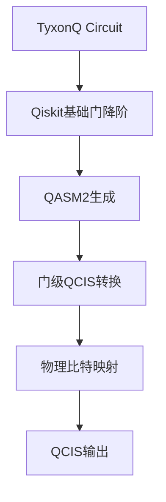
```mermaid
flowchart TD
A[TyxonQ Circuit] --> B[Qiskit基础门降阶]
B --> C[QASM2生成]
C --> D[门级QCIS转换]
D --> E[物理比特映射]
E --> F[QCIS输出]
```

**图源**
- [guodun_compiler.py:128-216](file://src/tyxonq/compiler/compile_engine/guodun/compiler.py#L128-L216)

### 支持的QCIS指令
Guodun编译器支持以下QCIS指令：
- **X**: X门操作
- **H**: Hadamard门操作  
- **RZ**: RZ旋转门操作
- **CZ**: CZ纠缠门操作
- **M**: 测量操作

### 原生脉冲编程支持
Guodun编译器还提供原生脉冲编程功能，支持以下脉冲指令：
- **PXY/PZ/PZ0**: 脉冲控制指令
- **G**: 耦合器控制指令
- **I**: 延迟指令
- **B**: 绑定指令
- **RZ**: 虚拟Z门指令

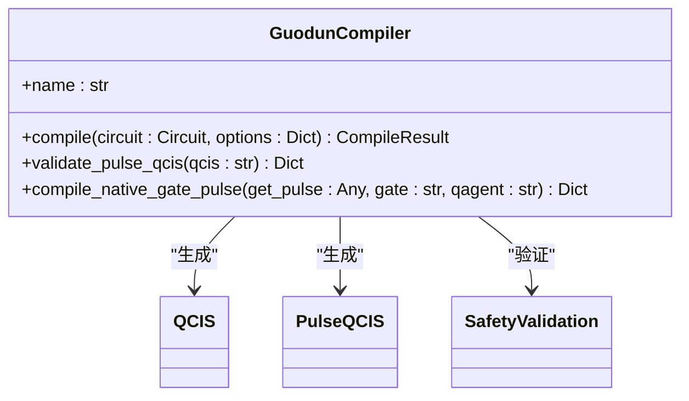
```mermaid
classDiagram
class GuodunCompiler {
+name : str
+compile(circuit : Circuit, options : Dict) CompileResult
+validate_pulse_qcis(qcis : str) Dict
+compile_native_gate_pulse(get_pulse : Any, gate : str, qagent : str) Dict
}
GuodunCompiler --> QCIS : "生成"
GuodunCompiler --> PulseQCIS : "生成"
GuodunCompiler --> SafetyValidation : "验证"
```

**图源**
- [guodun_compiler.py:128-216](file://src/tyxonq/compiler/compile_engine/guodun/compiler.py#L128-L216)
- [guodun_pulse.py:233-427](file://src/tyxonq/compiler/compile_engine/guodun/pulse.py#L233-L427)

**本节源**
- [guodun_compiler.py:128-216](file://src/tyxonq/compiler/compile_engine/guodun/compiler.py#L128-L216)
- [guodun_pulse.py:233-427](file://src/tyxonq/compiler/compile_engine/guodun/pulse.py#L233-L427)

## 编译流水线构建与优化阶段
原生编译器通过`build_plan`函数构建编译流水线，该流水线由多个优化阶段组成，包括重写（rewrite）、简化（simplify）和调度（scheduling）等。

### 编译流水线构建
`build_plan`函数接收一个阶段名称列表，并将其转换为`CompilePlan`对象。每个阶段名称对应一个具体的优化Pass，如`rewrite/auto_measure`、`rewrite/gates_transform`等。

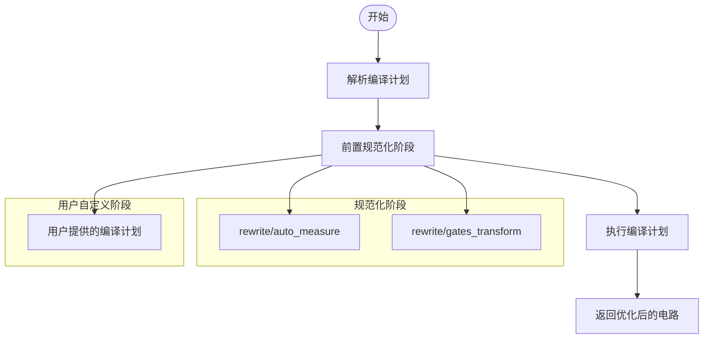
```mermaid
flowchart TD
Start([开始]) --> ResolvePlan["解析编译计划"]
ResolvePlan --> PrependNormalization["前置规范化阶段"]
PrependNormalization --> ExecutePlan["执行编译计划"]
ExecutePlan --> ReturnResult["返回优化后的电路"]
subgraph "规范化阶段"
A["rewrite/auto_measure"]
B["rewrite/gates_transform"]
end
subgraph "用户自定义阶段"
C["用户提供的编译计划"]
end
PrependNormalization --> A
PrependNormalization --> B
PrependNormalization --> C
```

**图源**
- [compile_plan.py:91-94](file://src/tyxonq/compiler/compile_engine/native/compile_plan.py#L91-L94)

**本节源**
- [compile_plan.py:91-94](file://src/tyxonq/compiler/compile_engine/native/compile_plan.py#L91-L94)

### 优化阶段详解
#### 门变换重写（GatesTransformPass）
该阶段根据`basis_gates`选项将电路中的门转换为目标门集合。例如，将`x`门转换为`rx(pi)`，将`y`门转换为`ry(pi)`。

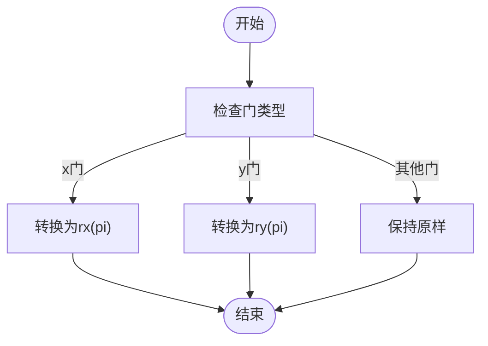
```mermaid
flowchart TD
Start([开始]) --> CheckGate["检查门类型"]
CheckGate --> |x门| TransformToRX["转换为rx(pi)"]
CheckGate --> |y门| TransformToRY["转换为ry(pi)"]
CheckGate --> |其他门| KeepOriginal["保持原样"]
TransformToRX --> End([结束])
TransformToRY --> End
KeepOriginal --> End
```

**图源**
- [gates_transform.py:9-49](file://src/tyxonq/compiler/stages/rewrite/gates_transform.py#L9-L49)

**本节源**
- [gates_transform.py:9-49](file://src/tyxonq/compiler/stages/rewrite/gates_transform.py#L9-L49)

#### 光锥简化（LightconeSimplifyPass）
该阶段通过反向遍历电路操作，识别并保留影响测量结果的"光锥"区域内的操作，从而简化电路。

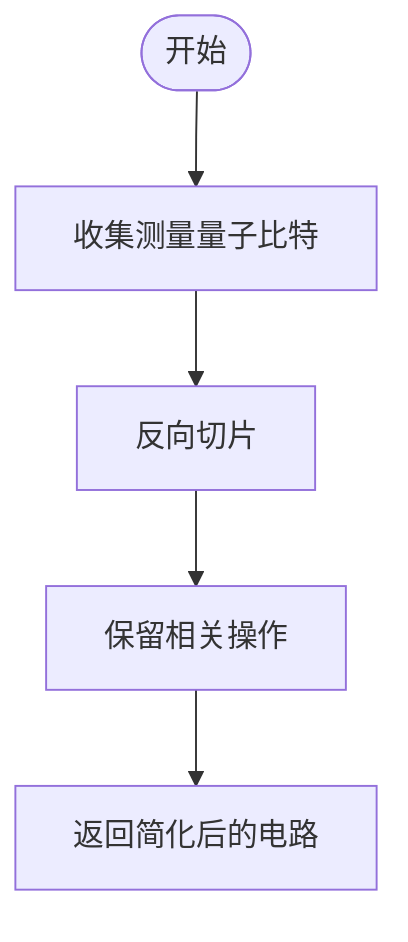
```mermaid
flowchart TD
Start([开始]) --> CollectMeasured["收集测量量子比特"]
CollectMeasured --> BackwardSlice["反向切片"]
BackwardSlice --> KeepOps["保留相关操作"]
KeepOps --> ReturnSimplified["返回简化后的电路"]
```

**图源**
- [lightcone.py:9-95](file://src/tyxonq/compiler/stages/simplify/lightcone.py#L9-L95)

**本节源**
- [lightcone.py:9-95](file://src/tyxonq/compiler/stages/simplify/lightcone.py#L9-L95)

#### 自动测量插入（AutoMeasurePass）
当电路中没有显式测量操作时，该阶段会自动在所有量子比特上插入`measure_z`操作。

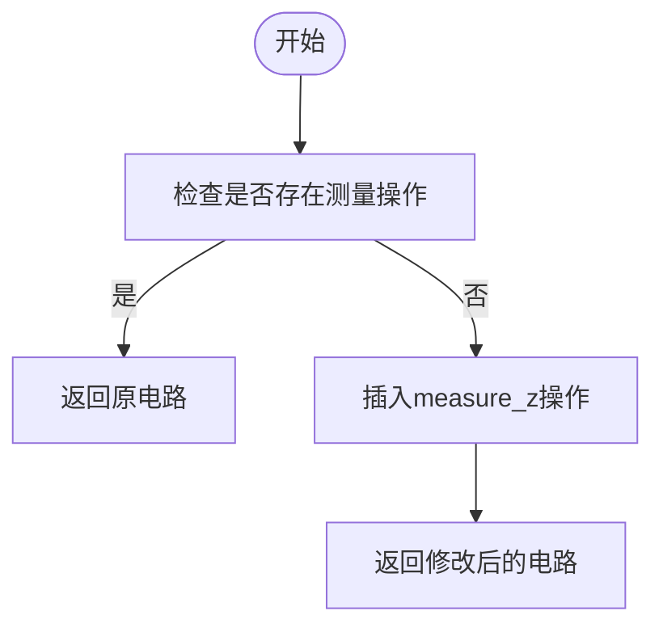
```mermaid
flowchart TD
Start([开始]) --> HasMeasure["检查是否存在测量操作"]
HasMeasure --> |是| ReturnOriginal["返回原电路"]
HasMeasure --> |否| InsertMeasure["插入measure_z操作"]
InsertMeasure --> ReturnModified["返回修改后的电路"]
```

**图源**
- [auto_measure.py:10-34](file://src/tyxonq/compiler/stages/rewrite/auto_measure.py#L10-L34)

**本节源**
- [auto_measure.py:10-34](file://src/tyxonq/compiler/stages/rewrite/auto_measure.py#L10-L34)

#### 测量重写（MeasurementRewritePass）
该阶段处理与测量相关的构造，将测量项分组并附加元数据，以便下游调度器进行设置重用。

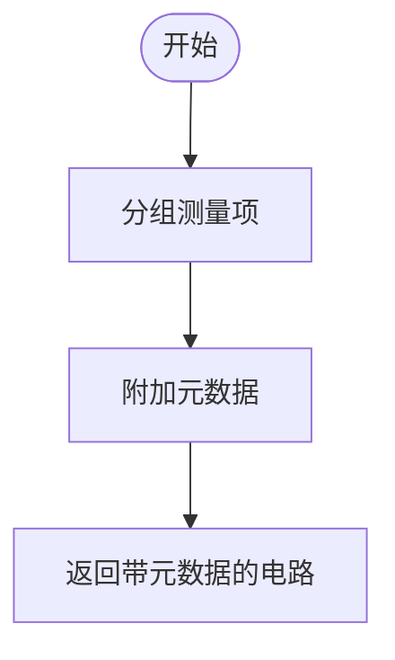
```mermaid
flowchart TD
Start([开始]) --> GroupMeasurements["分组测量项"]
GroupMeasurements --> AttachMetadata["附加元数据"]
AttachMetadata --> ReturnCircuit["返回带元数据的电路"]
```

**图源**
- [measurement.py:9-88](file://src/tyxonq/compiler/stages/rewrite/measurement.py#L9-L88)

**本节源**
- [measurement.py:9-88](file://src/tyxonq/compiler/stages/rewrite/measurement.py#L9-L88)

#### 调度（ShotSchedulerPass）
该阶段根据`shot_plan`或`total_shots`参数创建执行计划（segments），用于测量执行。

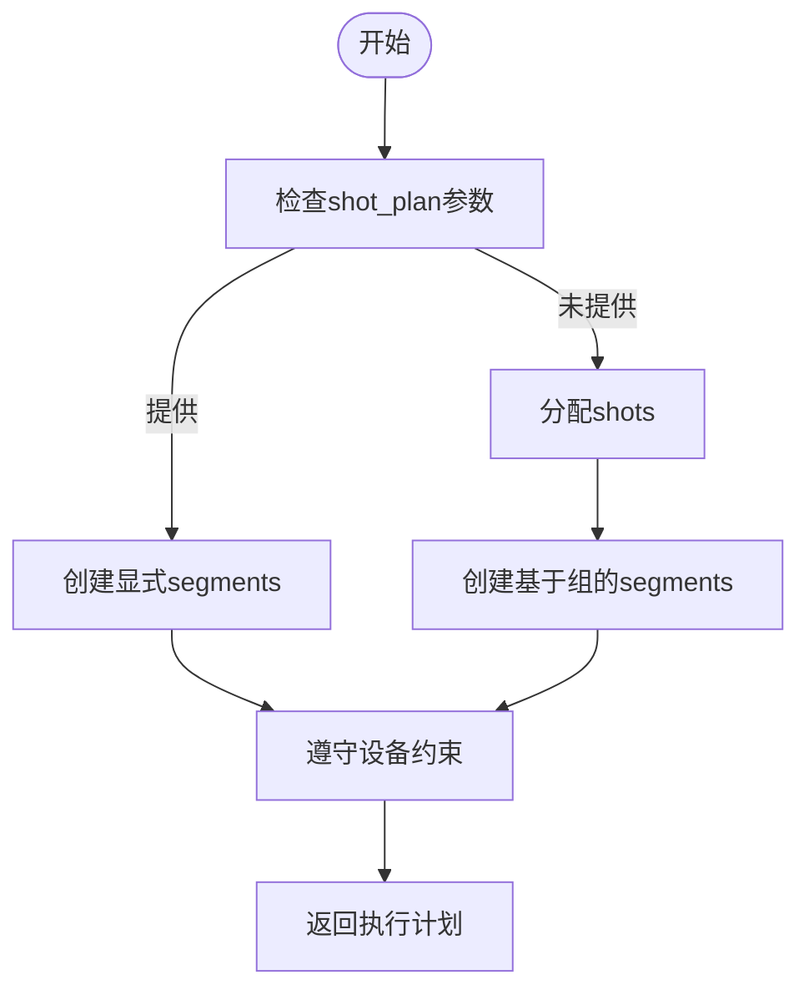
```mermaid
flowchart TD
Start([开始]) --> CheckShotPlan["检查shot_plan参数"]
CheckShotPlan --> |提供| CreateExplicitSegments["创建显式segments"]
CheckShotPlan --> |未提供| DistributeShots["分配shots"]
DistributeShots --> CreateGroupSegments["创建基于组的segments"]
CreateExplicitSegments --> RespectConstraints["遵守设备约束"]
CreateGroupSegments --> RespectConstraints
RespectConstraints --> ReturnPlan["返回执行计划"]
```

**图源**
- [shot_scheduler.py:43-118](file://src/tyxonq/compiler/stages/scheduling/shot_scheduler.py#L43-L118)

**本节源**
- [shot_scheduler.py:43-118](file://src/tyxonq/compiler/stages/scheduling/shot_scheduler.py#L43-L118)

## 输出格式与灵活转换
编译引擎支持多种输出格式，具体取决于所使用的编译器：

### 原生编译器输出格式
- **IR**: TyxonQ中间表示
- **QASM2**: OpenQASM 2.0格式
- **Qiskit**: Qiskit QuantumCircuit对象

### Qiskit编译器输出格式
- **Qiskit**: Qiskit QuantumCircuit对象
- **QASM2**: OpenQASM 2.0格式

### Guodun编译器输出格式
- **QCIS**: 国盾平台专用格式
- **Pulse-QCIS**: 原生脉冲格式

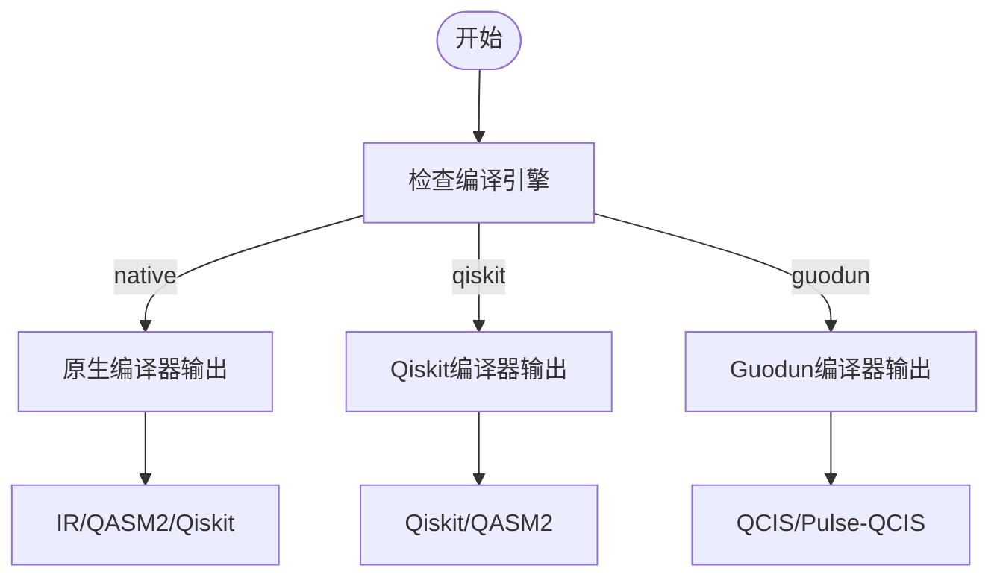
```mermaid
flowchart TD
Start([开始]) --> CheckEngine["检查编译引擎"]
CheckEngine --> |native| NativeOutput["原生编译器输出"]
CheckEngine --> |qiskit| QiskitOutput["Qiskit编译器输出"]
CheckEngine --> |guodun| GuodunOutput["Guodun编译器输出"]
NativeOutput --> IR["IR/QASM2/Qiskit"]
QiskitOutput --> QiskitFormat["Qiskit/QASM2"]
GuodunOutput --> QCIS["QCIS/Pulse-QCIS"]
```

**本节源**
- [native_compiler.py:15-98](file://src/tyxonq/compiler/compile_engine/native/native_compiler.py#L15-L98)
- [qiskit_compiler.py:19-76](file://src/tyxonq/compiler/compile_engine/qiskit/qiskit_compiler.py#L19-L76)
- [guodun_compiler.py:133-216](file://src/tyxonq/compiler/compile_engine/guodun/compiler.py#L133-L216)

## 引擎对比与适用场景
| 特性 | 原生编译器 | Qiskit编译器 | Guodun编译器 |
|------|------------|-------------|-------------|
| **主要用途** | 内部优化和快速执行 | 与IBM量子硬件集成 | 国盾量子硬件平台 |
| **优化能力** | 支持自定义编译流水线 | 依赖Qiskit的transpile功能 | 专用QCIS优化 |
| **输出格式** | IR、QASM2、Qiskit | Qiskit QuantumCircuit、QASM2 | QCIS、Pulse-QCIS |
| **硬件适配** | 有限 | 强大，支持多种IBM设备 | 国盾平台专用 |
| **依赖** | 无外部依赖 | 需要安装Qiskit | 需要cqlib==1.3.11 |
| **脉冲支持** | 基础脉冲编译 | 无直接脉冲支持 | 完整原生脉冲编程 |

**本节源**
- [native_compiler.py:12-98](file://src/tyxonq/compiler/compile_engine/native/native_compiler.py#L12-L98)
- [qiskit_compiler.py:19-76](file://src/tyxonq/compiler/compile_engine/qiskit/qiskit_compiler.py#L19-L76)
- [guodun_compiler.py:128-216](file://src/tyxonq/compiler/compile_engine/guodun/compiler.py#L128-L216)

## API使用与回退机制
用户可以通过`compile()` API切换不同的编译引擎。系统支持智能回退机制，当指定的编译引擎不可用时，会自动选择合适的替代方案。

### API调用示例
```python
# 使用原生编译器
result = compile(circuit, compile_engine="native", output="ir")

# 使用Qiskit编译器
result = compile(circuit, compile_engine="qiskit", output="qiskit")

# 使用Guodun编译器
result = compile(circuit, compile_engine="guodun", output="qcis", 
                options={"physical_qubits": [0, 1]})

# 使用默认编译器（原生）
result = compile(circuit)
```

### 回退机制
当指定的编译引擎不可用时，系统会按以下顺序尝试回退：
1. 如果请求的引擎不可用，尝试原生编译器
2. 如果原生编译器失败，尝试其他可用引擎
3. 最终回退到原生编译器作为最后选择

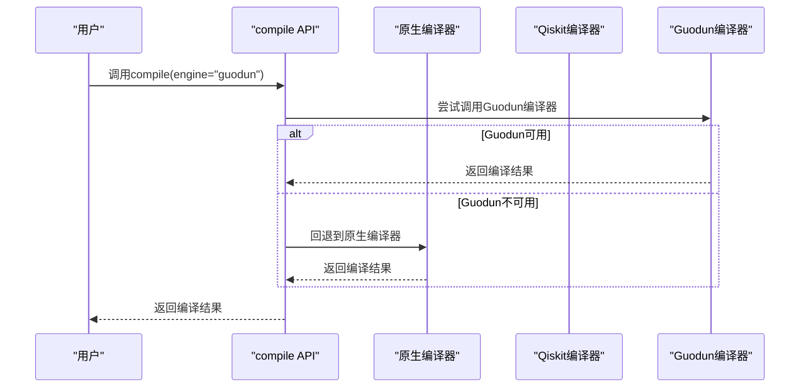
```mermaid
sequenceDiagram
participant User as "用户"
participant API as "compile API"
participant Native as "原生编译器"
participant Qiskit as "Qiskit编译器"
participant Guodun as "Guodun编译器"
User->>API : 调用compile(engine="guodun")
API->>Guodun : 尝试调用Guodun编译器
alt Guodun可用
Guodun-->>API : 返回编译结果
else Guodun不可用
API->>Native : 回退到原生编译器
Native-->>API : 返回编译结果
end
API-->>User : 返回编译结果
```

**图源**
- [api.py:292-314](file://src/tyxonq/compiler/api.py#L292-L314)

**本节源**
- [api.py:292-314](file://src/tyxonq/compiler/api.py#L292-L314)

## 结论
TyxonQ编译引擎提供了灵活且强大的编译能力，支持原生编译器、Qiskit编译器和Guodun编译器三种模式。原生编译器通过可定制的编译流水线实现了高效的电路优化，适用于内部优化和快速执行；Qiskit编译器则通过与Qiskit的集成，实现了与IBM量子硬件的无缝对接；Guodun编译器专为国盾量子硬件平台设计，提供完整的QCIS格式支持和原生脉冲编程能力。用户可以根据具体需求选择合适的编译引擎，并通过统一的API进行调用。当指定的编译引擎不可用时，系统会自动回退到其他可用引擎，确保编译过程的可靠性和灵活性。

新增的Guodun编译器引擎显著增强了TyxonQ在国产量子硬件平台上的支持能力，特别是其完整的脉冲编程功能和严格的安全验证机制，为用户提供了从门级电路到原生脉冲的完整编译链路。