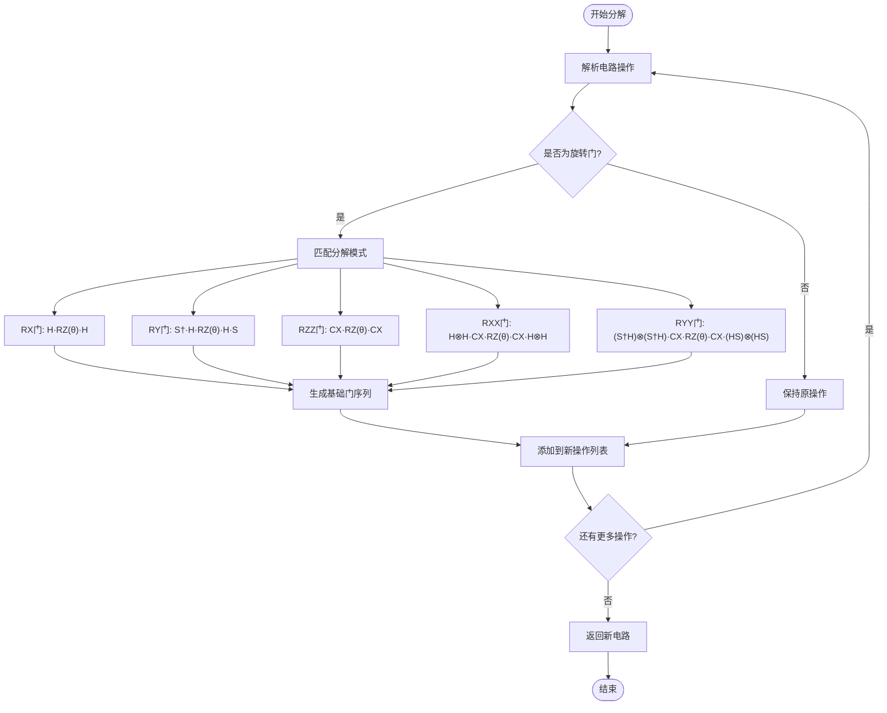
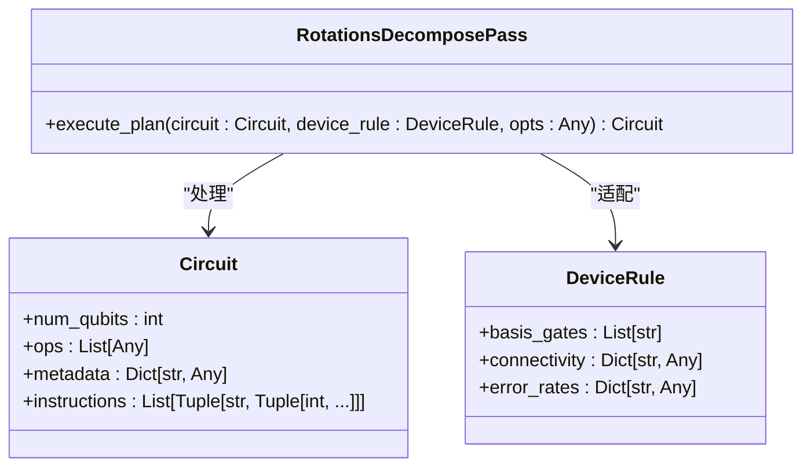
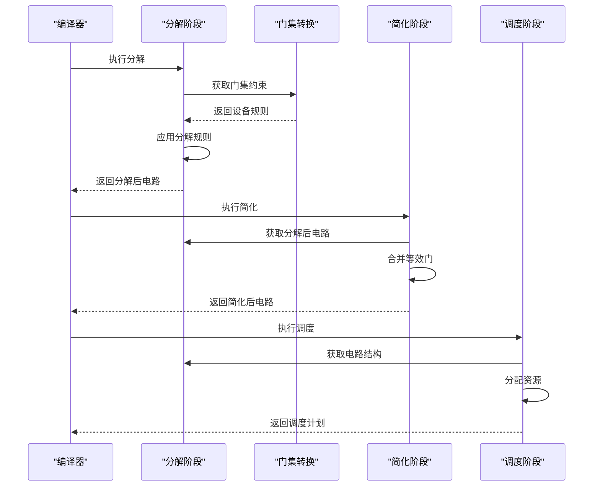

# 分解阶段

<cite>
**本文档中引用的文件**   
- [rotations.py](file://src/tyxonq/compiler/stages/decompose/rotations.py)
- [gates_transform.py](file://src/tyxonq/compiler/stages/rewrite/gates_transform.py)
- [circuit.py](file://src/tyxonq/core/ir/circuit.py)
- [api.py](file://src/tyxonq/compiler/api.py)
- [compile_plan.py](file://src/tyxonq/compiler/compile_engine/native/compile_plan.py)
- [native_compiler.py](file://src/tyxonq/compiler/compile_engine/native/native_compiler.py)
</cite>

## 目录
1. [引言](#引言)
2. [分解阶段概述](#分解阶段概述)
3. [RotationsDecomposePass实现机制](#rotationsdecomposepass实现机制)
4. [门等价变换规则](#门等价变换规则)
5. [与目标设备门集的适配过程](#与目标设备门集的适配过程)
6. [与其他编译阶段的交互关系](#与其他编译阶段的交互关系)
7. [不同设备后端下的行为差异](#不同设备后端下的行为差异)
8. [对后续编译阶段和执行性能的影响](#对后续编译阶段和执行性能的影响)

## 引言
在TyxonQ量子计算框架中，分解阶段是编译流水线中的关键环节，负责将高级量子门操作转换为特定硬件支持的基础门集合。该阶段通过精确的门等价变换规则，确保量子电路能够在不同物理设备上正确执行。特别是对于单量子比特旋转门的分解，需要考虑目标设备的门集约束和量子硬件的物理特性。

## 分解阶段概述
分解阶段在TyxonqQ编译器中扮演着将抽象量子门操作转换为硬件可执行基础门序列的核心角色。该阶段主要通过`RotationsDecomposePass`类实现，其核心功能是将通用单量子比特旋转门（如U3、RX、RY、RZ）以及双量子比特旋转门（如RXX、RYY、RZZ）分解为由{H, RZ, CX}等基础门构成的等效电路。

该阶段的执行流程遵循TyxonQ的模块化编译架构，作为编译流水线中的一个独立阶段被调用。在编译过程中，分解阶段通常位于门集转换和测量重写之后，简化和调度之前，确保电路在进入后续优化阶段前已转换为目标设备支持的基础门集合。

**Section sources**
- [rotations.py](file://src/tyxonq/compiler/stages/decompose/rotations.py#L21-L66)
- [compile_plan.py](file://src/tyxonq/compiler/compile_engine/native/compile_plan.py#L69-L88)

## RotationsDecomposePass实现机制
`RotationsDecomposePass`类是分解阶段的核心实现，通过`execute_plan`方法对量子电路进行门分解操作。该方法遍历电路中的所有操作，识别需要分解的旋转门，并应用相应的等价变换规则。

实现机制的关键特点包括：
- **操作遍历**：逐个处理电路中的操作，保持非旋转门操作不变
- **参数解析**：提取旋转门的操作名称、量子比特索引和旋转角度参数
- **模式匹配**：根据操作名称匹配相应的分解规则
- **序列生成**：为每个匹配的旋转门生成等效的基础门序列

该实现采用函数式编程风格，通过构建新的操作列表来生成转换后的电路，而不是直接修改原电路，确保了操作的不可变性和线程安全性。

**Diagram sources **
- [rotations.py](file://src/tyxonq/compiler/stages/decompose/rotations.py#L21-L66)

**Section sources**
- [rotations.py](file://src/tyxonq/compiler/stages/decompose/rotations.py#L1-L70)

## 门等价变换规则
分解阶段的核心是基于量子门等价性原理的变换规则，将复杂的旋转门分解为由基础门构成的等效序列。这些规则基于量子力学中的门恒等式，确保分解后的电路与原电路具有相同的量子态演化效果。

### 单量子比特旋转门分解
- **RX(θ)分解**：使用Hadamard门和RZ门的组合实现，遵循恒等式RX(θ) = H·RZ(θ)·H
- **RY(θ)分解**：通过S门、Hadamard门和RZ门的组合实现，遵循恒等式RY(θ) = S†·H·RZ(θ)·H·S，其中S=RZ(π/2)

### 双量子比特旋转门分解
- **RZZ(θ)分解**：使用CNOT门和RZ门的组合实现，遵循恒等式RZZ(θ) = CX·RZ(θ)·CX
- **RXX(θ)分解**：通过双量子比特Hadamard门、CNOT门和RZ门的组合实现
- **RYY(θ)分解**：使用S门、Hadamard门、CNOT门和RZ门的复杂组合实现

这些变换规则的选择基于数学等价性和硬件效率的平衡，确保分解后的电路既准确又尽可能简洁。

**Diagram sources **
- [rotations.py](file://src/tyxonq/compiler/stages/decompose/rotations.py#L1-L70)
- [circuit.py](file://src/tyxonq/core/ir/circuit.py#L1-L779)

## 与目标设备门集的适配过程
分解阶段与目标设备门集的适配是一个关键过程，确保生成的量子电路能够在特定硬件上执行。该过程通过`device_rule`参数获取目标设备的约束信息，并据此调整分解策略。

适配过程的主要步骤包括：
1. **设备规则获取**：从编译选项中获取目标设备的门集约束
2. **基础门集验证**：检查目标设备是否支持分解所需的基础门（H、RZ、CX等）
3. **分解策略选择**：根据设备支持的门集选择最优的分解路径
4. **参数优化**：调整分解后门序列的参数以适应设备的精度限制

在TyxonQ框架中，这一适配过程是通过编译流水线的模块化设计实现的，分解阶段与其他阶段（如门集转换）协同工作，共同完成电路到目标设备的映射。

**Section sources**
- [rotations.py](file://src/tyxonq/compiler/stages/decompose/rotations.py#L21-L66)
- [gates_transform.py](file://src/tyxonq/compiler/stages/rewrite/gates_transform.py#L9-L49)

## 与其他编译阶段的交互关系
分解阶段在TyxonQ编译流水线中与其他阶段紧密协作，形成一个完整的优化链条。其主要交互关系包括：

### 与门集转换阶段的交互
分解阶段通常在门集转换阶段之后执行。门集转换阶段首先将电路中的门转换为标准形式，为分解阶段提供一致的输入。例如，`GatesTransformPass`会将X门转换为RX(π)，为后续的RX门分解做准备。

### 与简化阶段的交互
分解后的电路通常包含更多的基础门操作，这为简化阶段提供了优化机会。简化阶段可以识别并合并相邻的等效门操作，减少电路深度。例如，连续的RZ门可以合并为单个RZ门。

### 与调度阶段的交互
分解阶段的输出直接影响调度阶段的决策。分解后的电路结构决定了测量设置和量子比特分配的约束条件，调度阶段需要基于这些信息进行最优的资源分配。

**Diagram sources **
- [rotations.py](file://src/tyxonq/compiler/stages/decompose/rotations.py#L21-L66)
- [gates_transform.py](file://src/tyxonq/compiler/stages/rewrite/gates_transform.py#L9-L49)
- [lightcone.py](file://src/tyxonq/compiler/stages/simplify/lightcone.py#L1-L99)

**Section sources**
- [rotations.py](file://src/tyxonq/compiler/stages/decompose/rotations.py#L1-L70)
- [gates_transform.py](file://src/tyxonq/compiler/stages/rewrite/gates_transform.py#L1-L53)
- [lightcone.py](file://src/tyxonq/compiler/stages/simplify/lightcone.py#L1-L99)

## 不同设备后端下的行为差异
分解阶段的行为会根据目标设备后端的不同而有所差异，主要体现在基础门集的支持和分解策略的选择上。

### 通用设备后端
对于支持{H, RZ, CX}门集的通用设备，分解阶段可以直接应用标准的分解规则，生成高效的等效电路。这种情况下，分解过程相对简单直接。

### 特殊设备后端
对于具有特殊门集约束的设备，分解阶段需要进行额外的适配：
- **仅支持RZ和CZ的设备**：需要将CX门进一步分解为CZ和H门的组合
- **支持原生RXX/RZZ门的设备**：可以跳过相应的分解步骤，保持原门操作
- **具有特定连接拓扑的设备**：需要考虑量子比特间的连接约束，可能需要额外的SWAP门插入

这些差异通过`device_rule`参数传递给分解阶段，使其能够根据具体设备特性调整分解策略。

**Section sources**
- [rotations.py](file://src/tyxonq/compiler/stages/decompose/rotations.py#L21-L66)
- [native_compiler.py](file://src/tyxonq/compiler/compile_engine/native/native_compiler.py#L15-L98)

## 对后续编译阶段和执行性能的影响
分解阶段的输出对后续编译阶段和最终的执行性能有重要影响。

### 对电路复杂度的影响
分解过程通常会增加电路的门数量和深度，这可能影响执行性能。例如，一个RX门的分解会将其转换为三个基础门（H·RZ·H），增加了电路的复杂度。

### 对优化机会的影响
虽然分解增加了电路复杂度，但也为后续的优化阶段创造了机会。简化阶段可以识别并合并分解后产生的相邻等效门，可能实现比原电路更优的压缩效果。

### 对执行性能的影响
分解后的电路在目标设备上的执行性能取决于多个因素：
- **门误差累积**：更多的门操作可能导致更大的累积误差
- **相干时间约束**：增加的电路深度可能超出量子比特的相干时间
- **校准精度**：基础门的校准精度直接影响最终结果的准确性

因此，分解阶段需要在电路准确性和执行效率之间找到平衡，确保生成的电路既正确又尽可能高效。

**Section sources**
- [rotations.py](file://src/tyxonq/compiler/stages/decompose/rotations.py#L1-L70)
- [api.py](file://src/tyxonq/compiler/api.py#L1-L66)
- [native_compiler.py](file://src/tyxonq/compiler/compile_engine/native/native_compiler.py#L15-L98)