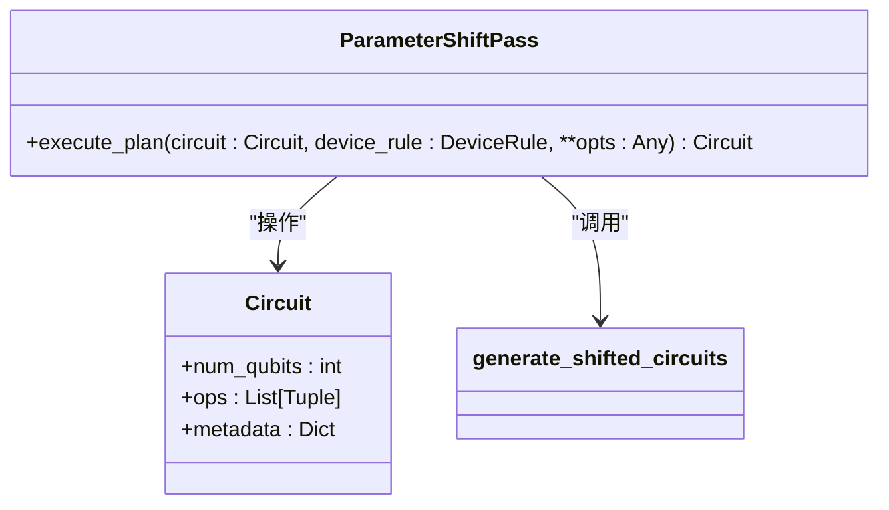
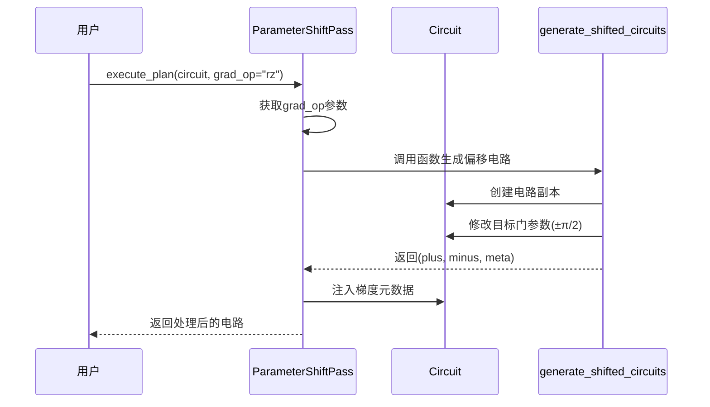
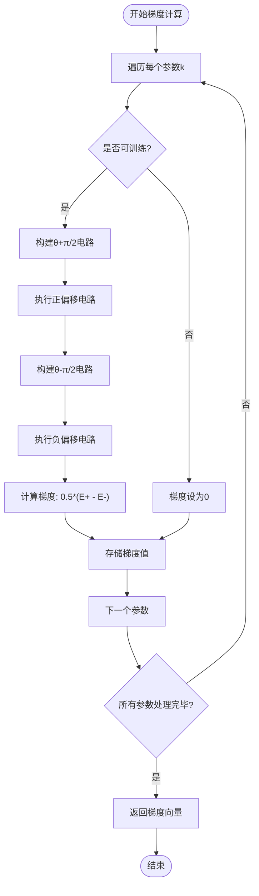

# 参数移位法

<cite>
**Referenced Files in This Document**   
- [parameter_shift_pass.py](file://src/tyxonq/compiler/stages/gradients/parameter_shift_pass.py)
- [parameter_shift.py](file://src/tyxonq/compiler/gradients/parameter_shift.py)
- [vqe.py](file://src/tyxonq/libs/circuits_library/vqe.py)
- [parameter_shift.py](file://examples/parameter_shift.py)
</cite>

## 目录
1. [引言](#引言)
2. [核心组件](#核心组件)
3. [ParameterShiftPass类实现机制](#parametershiftpass类实现机制)
4. [梯度计算流程分析](#梯度计算流程分析)
5. [变分量子算法中的应用](#变分量子算法中的应用)
6. [精度与采样效率权衡](#精度与采样效率权衡)
7. [噪声环境下的稳定性](#噪声环境下的稳定性)
8. [结论](#结论)

## 引言

参数移位法（Parameter Shift Rule）是变分量子算法中计算梯度的核心技术之一。该方法通过构造正负偏移的量子电路来精确估计目标函数对参数的导数，避免了传统数值微分带来的系统性误差。在TyxonQ框架中，`ParameterShiftPass`类实现了这一机制，为量子门参数优化提供了可靠支持。本文将深入解析其内部实现原理，并探讨其在实际应用场景中的表现特性。

## 核心组件

TyxonQ框架中的参数移位机制由多个核心组件协同工作。`ParameterShiftPass`类负责执行电路变换计划，`generate_shifted_circuits`函数实现具体的电路偏移生成逻辑，而`vqe.py`模块则展示了该技术在变分量子本征求解器中的集成方式。这些组件共同构成了一个完整的梯度计算流水线。

**Section sources**
- [parameter_shift_pass.py](file://src/tyxonq/compiler/stages/gradients/parameter_shift_pass.py#L11-L28)
- [parameter_shift.py](file://src/tyxonq/compiler/gradients/parameter_shift.py#L8-L35)
- [vqe.py](file://src/tyxonq/libs/circuits_library/vqe.py#L1-L152)

## ParameterShiftPass类实现机制

`ParameterShiftPass`类作为编译器阶段的梯度处理组件，其主要职责是为指定类型的量子门生成参数移位所需的元数据。该类通过`execute_plan`方法接收电路对象和配置选项，其中`grad_op`参数指定了需要进行梯度计算的量子门类型（如'rz'）。

当调用`execute_plan`方法时，系统首先检查是否存在有效的`grad_op`配置。若存在，则调用`generate_shifted_circuits`函数生成对应的正负偏移电路。这两个新电路与原始电路具有相同的量子比特数和操作序列，仅在目标门的参数值上相差±π/2。生成的电路对及其相关元数据被存储在原始电路的元数据字典中，以便后续梯度计算使用。

**Diagram sources**
- [parameter_shift_pass.py](file://src/tyxonq/compiler/stages/gradients/parameter_shift_pass.py#L11-L28)

**Section sources**
- [parameter_shift_pass.py](file://src/tyxonq/compiler/stages/gradients/parameter_shift_pass.py#L11-L28)

## 梯度计算流程分析

参数移位的执行流程始于操作名称匹配。`execute_plan`方法通过`opts.get("grad_op")`获取目标操作名称，确保只对指定类型的量子门进行处理。这一设计允许用户灵活选择需要优化的参数子集，提高计算效率。

电路扩展过程通过克隆原始电路实现。`generate_shifted_circuits`函数创建两个独立的电路副本，并遍历其操作列表。当遇到第一个匹配`match_op_name`的操作时，将其参数值分别增加和减少π/2，形成正负偏移电路。这种"首次匹配即停止"的策略保证了每个参数移位操作只影响单一门实例。

梯度元数据注入是整个流程的关键步骤。计算得到的正负偏移电路与包含梯度系数（通常为0.5）的元数据字典一起，被存入原始电路的`metadata["gradients"]`字段中。这种设计使得梯度信息与电路本身紧密结合，便于后续优化器直接访问和使用。

**Diagram sources**
- [parameter_shift_pass.py](file://src/tyxonq/compiler/stages/gradients/parameter_shift_pass.py#L18-L28)
- [parameter_shift.py](file://src/tyxonq/compiler/gradients/parameter_shift.py#L8-L35)

**Section sources**
- [parameter_shift_pass.py](file://src/tyxonq/compiler/stages/gradients/parameter_shift_pass.py#L18-L28)
- [parameter_shift.py](file://src/tyxonq/compiler/gradients/parameter_shift.py#L8-L35)

## 变分量子算法中的应用

在变分量子本征求解器（VQE）等应用场景中，参数移位法发挥着至关重要的作用。`vqe.py`模块中的`parameter_shift_gradient`函数展示了完整的集成方式：对于硬件高效型试探电路中的每个RX/RZ门，分别构建参数增加和减少π/2的电路实例，测量其期望值后计算差分梯度。

具体实现中，系统首先确定参数布局，然后逐个处理每个可训练参数。对于每个参数，构造两个偏移电路并执行测量，最后根据公式∇f(θ) = [f(θ+π/2) - f(θ-π/2)]/2计算梯度。这种方法虽然需要两倍的电路执行次数，但提供了比有限差分法更精确的梯度估计。

**Diagram sources**
- [vqe.py](file://src/tyxonq/libs/circuits_library/vqe.py#L1-L152)

**Section sources**
- [vqe.py](file://src/tyxonq/libs/circuits_library/vqe.py#L1-L152)

## 精度与采样效率权衡

参数移位法在精度和采样效率之间呈现出明显的权衡关系。在理想情况下（shots=0，解析期望值），该方法能够提供精确的梯度估计，如`parameter_shift.py`示例中所示，其结果与有限差分法高度一致（相对误差<1e-2）。

然而，在实际硬件或采样模拟中（shots>0），统计噪声会影响梯度质量。增加采样次数可以降低方差，但会显著延长计算时间。例如，在8192次采样的条件下，虽然能得到合理的梯度估计，但计算成本是解析计算的数十倍。这种权衡要求用户根据具体应用场景选择合适的采样策略：在训练初期可使用较少采样快速探索参数空间，而在收敛阶段则需要更多采样以获得精确梯度。

此外，电路深度和纠缠程度也会影响采样效率。深层电路更容易积累噪声，导致相同采样次数下的梯度估计方差更大。因此，在设计试探电路时需要考虑这一因素，平衡表达能力和可训练性。

## 噪声环境下的稳定性

在噪声环境中，参数移位法表现出相对良好的稳定性。由于其基于解析性质的梯度公式，不受梯度步长选择的影响，避免了有限差分法中因步长不当导致的数值不稳定问题。即使在存在门误差和测量噪声的情况下，只要噪声特性在正负偏移电路间保持一致，其差分形式的梯度计算仍能有效抵消部分系统性偏差。

然而，随机噪声会直接影响梯度估计的方差。实验表明，在相同噪声模型下，参数移位法的梯度信噪比优于有限差分法，特别是在小参数变化区域。这是因为参数移位使用固定的π/2偏移量，避免了有限差分中过小步长放大数据噪声的问题。

为了进一步提升稳定性，可以结合误差缓解技术，如零噪声外推或测量误差校正。`postprocessing`模块提供的相关工具可与参数移位流程无缝集成，通过在梯度计算前后应用校正算法，显著改善噪声环境下的优化性能。

## 结论

参数移位法作为变分量子算法的标准梯度计算方法，在TyxonQ框架中得到了高效实现。`ParameterShiftPass`类通过清晰的接口设计和模块化实现，为量子门参数优化提供了可靠支持。尽管存在采样成本较高的缺点，但其在精度和稳定性方面的优势使其成为当前NISQ设备上最实用的梯度估计技术之一。未来的工作可探索参数高效移位策略和自适应采样方法，以进一步提升其在大规模问题上的适用性。