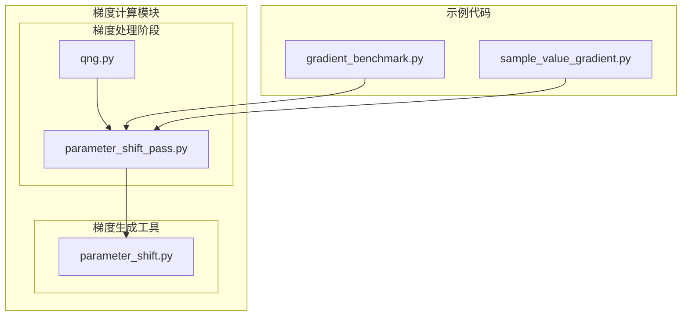
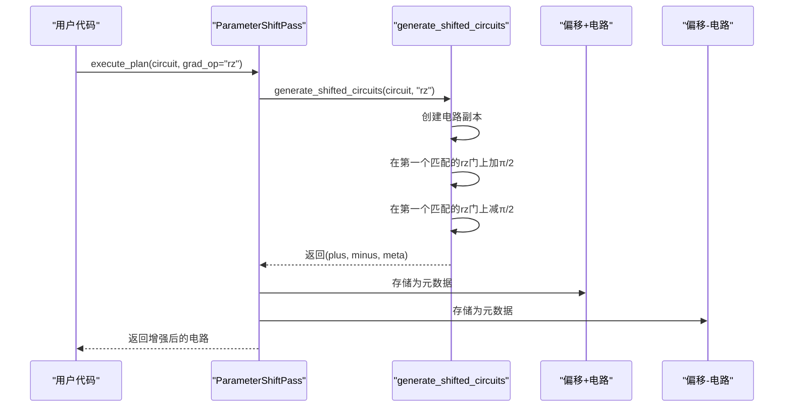
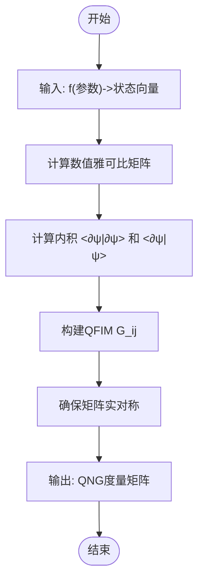

# 梯度计算阶段

<cite>
**本文档引用的文件**  
- [parameter_shift_pass.py](file://src/tyxonq/compiler/stages/gradients/parameter_shift_pass.py)
- [qng.py](file://src/tyxonq/compiler/stages/gradients/qng.py)
- [parameter_shift.py](file://src/tyxonq/compiler/gradients/parameter_shift.py)
- [gradient_benchmark.py](file://examples/gradient_benchmark.py)
- [sample_value_gradient.py](file://examples/sample_value_gradient.py)
</cite>

## 目录
1. [引言](#引言)
2. [项目结构](#项目结构)
3. [核心组件](#核心组件)
4. [参数移位法详解](#参数移位法详解)
5. [量子自然梯度详解](#量子自然梯度详解)
6. [代码示例分析](#代码示例分析)
7. [依赖关系分析](#依赖关系分析)
8. [性能考量](#性能考量)
9. [结论](#结论)

## 引言

在变分量子算法（如VQE、QAOA）的训练过程中，梯度计算是优化变分参数的核心环节。本文件深入探讨了两种关键的梯度计算方法：参数移位法（Parameter Shift Rule）和量子自然梯度（Quantum Natural Gradient）。这两种方法分别通过不同的数学原理和实现机制，为量子电路的优化提供了精确且高效的梯度信息。本文将详细解析它们的实现细节、优势特性以及在整体编译流程中的作用。

## 项目结构

梯度计算相关的功能模块主要位于编译器的梯度处理阶段，其结构清晰地分离了不同的计算策略。



**Diagram sources**
- [parameter_shift_pass.py](file://src/tyxonq/compiler/stages/gradients/parameter_shift_pass.py)
- [qng.py](file://src/tyxonq/compiler/stages/gradients/qng.py)
- [parameter_shift.py](file://src/tyxonq/compiler/gradients/parameter_shift.py)

**Section sources**
- [src/tyxonq/compiler/stages/gradients](file://src/tyxonq/compiler/stages/gradients)

## 核心组件

本系统的核心梯度计算组件由两个主要模块构成：`parameter_shift_pass.py` 和 `qng.py`。前者实现了基于参数偏移的梯度计算，后者则提供了量子自然梯度的数值计算方法。它们共同构成了变分量子算法训练中梯度计算的基础。

**Section sources**
- [parameter_shift_pass.py](file://src/tyxonq/compiler/stages/gradients/parameter_shift_pass.py)
- [qng.py](file://src/tyxonq/compiler/stages/gradients/qng.py)

## 参数移位法详解

参数移位法是一种精确计算量子电路梯度的解析方法。它通过对变分参数进行微小的确定性偏移（通常为±π/2），并执行多次电路运行来获取梯度值。

### 实现机制

该方法的实现分为两个关键部分：
1.  **`ParameterShiftPass` 类**：作为编译器的一个处理阶段，它负责协调梯度计算流程。其 `execute_plan` 方法接收一个量子电路和目标操作符名称（如"rz"），并调用底层函数生成偏移电路。
2.  **`generate_shifted_circuits` 函数**：这是算法的核心。它接收原始电路和操作符名称，创建两个新的电路副本。在第一个副本中，指定操作符的第一个匹配参数被加上 π/2；在第二个副本中，同一参数被减去 π/2。同时，它返回一个包含梯度系数（通常为0.5）的元数据字典。

### 数学原理与流程

参数移位法的数学基础是，对于许多单参数量子门（如RX, RY, RZ），其梯度可以通过以下公式精确计算：
`∂⟨ψ(θ)|O|ψ(θ)⟩/∂θ = c * [⟨ψ(θ+s)|O|ψ(θ+s)⟩ - ⟨ψ(θ-s)|O|ψ(θ-s)⟩]`
其中 `c` 是系数，`s` 是偏移量（π/2）。该方法通过两次（或多次，对于更复杂的门）独立的电路执行来估计梯度，避免了传统有限差分法的数值不稳定性。



**Diagram sources**
- [parameter_shift_pass.py](file://src/tyxonq/compiler/stages/gradients/parameter_shift_pass.py#L18-L28)
- [parameter_shift.py](file://src/tyxonq/compiler/gradients/parameter_shift.py#L8-L35)

**Section sources**
- [parameter_shift_pass.py](file://src/tyxonq/compiler/stages/gradients/parameter_shift_pass.py)
- [parameter_shift.py](file://src/tyxonq/compiler/gradients/parameter_shift.py)

## 量子自然梯度详解

量子自然梯度（QNG）是一种利用量子费雪信息矩阵（Quantum Fisher Information Matrix, QFIM）或Fubini-Study度量来指导参数更新的优化方法。与普通梯度不同，QNG考虑了参数空间的几何结构，通常能实现更快的收敛速度。

### 实现机制

`qng.py` 模块提供了一个后端无关的、基于数值雅可比矩阵的QNG实现：
1.  **`_central_diff_jacobian`**：使用中心差分法计算数值雅可比矩阵。它通过在每个参数上施加一个微小的扰动 `eps`（默认1e-5），并计算状态向量的变化来实现。
2.  **`qng_metric`**：这是核心函数。它首先计算雅可比矩阵 `jac`，然后利用量子力学的内积规则计算QFIM。其计算公式为 `G_ij = <∂ψ/∂θ_i | ∂ψ/∂θ_j> - <∂ψ/∂θ_i|ψ><ψ|∂ψ/∂θ_j>`，确保了结果是一个实对称矩阵。
3.  **`dynamics_matrix`**：一个便捷的别名，用于计算未投影的度量 `<∂ψ/∂θ_i | ∂ψ/∂θ_j>`。

### 优势与特点

量子自然梯度的主要优势在于其收敛性。在参数空间存在强相关性或病态曲率的区域，普通梯度下降可能会陷入缓慢的锯齿状路径，而QNG通过度量矩阵对梯度进行预处理，能够沿着更直接的路径向最优解前进，从而显著加速收敛。



**Diagram sources**
- [qng.py](file://src/tyxonq/compiler/stages/gradients/qng.py#L72-L104)
- [qng.py](file://src/tyxonq/compiler/stages/gradients/qng.py#L107-L111)

**Section sources**
- [qng.py](file://src/tyxonq/compiler/stages/gradients/qng.py)

## 代码示例分析

项目中的示例代码展示了如何在实际应用中使用这些梯度计算方法。

### `gradient_benchmark.py`

该文件是一个性能基准测试脚本。它实现了 `gradient_tq_counts` 函数，该函数使用参数移位法来计算梯度。它通过 `_param_indices_layout` 函数遍历所有变分参数，并对每个参数调用 `_objective_counts` 函数两次（一次加偏移，一次减偏移），最后根据公式计算梯度。此脚本还提供了与Qiskit等其他框架的对比。

### `sample_value_gradient.py`

此示例更直接地展示了参数移位的应用。`parameter_shift_gradient` 函数接收一个参数张量，对其中的每个元素进行±π/2的偏移，然后调用 `exp_val` 函数计算期望值，最终利用差分公式得到梯度。该脚本还包含了与有限差分法的对比，以验证其正确性。

**Section sources**
- [gradient_benchmark.py](file://examples/gradient_benchmark.py)
- [sample_value_gradient.py](file://examples/sample_value_gradient.py)

## 依赖关系分析

梯度计算模块的依赖关系清晰且低耦合。

```mermaid
graph TD
A[parameter_shift_pass.py] --> B[parameter_shift.py]
C[qng.py] --> D[numpy]
C --> E[torch (可选)]
B --> F[Circuit]
A --> C
A --> B
```

`parameter_shift_pass` 依赖于 `parameter_shift` 模块来生成偏移电路，而 `qng` 模块仅依赖于NumPy（和可选的PyTorch）进行数值计算，不依赖于任何特定的后端或设备，保证了其实现的通用性和轻量化。

**Diagram sources**
- [parameter_shift_pass.py](file://src/tyxonq/compiler/stages/gradients/parameter_shift_pass.py)
- [qng.py](file://src/tyxonq/compiler/stages/gradients/qng.py)
- [parameter_shift.py](file://src/tyxonq/compiler/gradients/parameter_shift.py)

**Section sources**
- [parameter_shift_pass.py](file://src/tyxonq/compiler/stages/gradients/parameter_shift_pass.py)
- [qng.py](file://src/tyxonq/compiler/stages/gradients/qng.py)
- [parameter_shift.py](file://src/tyxonq/compiler/gradients/parameter_shift.py)

## 性能考量

两种方法各有性能特点：
- **参数移位法**：计算精确，但需要为每个待优化参数执行至少两次电路（正偏移和负偏移），总电路执行次数与参数数量成正比。在硬件执行中，这会显著增加总运行时间。
- **量子自然梯度**：其计算本身是经典的数值计算，不直接增加量子电路的执行次数。但计算QFIM需要计算一个 `N×N` 的矩阵（N为参数数量），其时间和空间复杂度为 `O(N²)`，当参数数量很大时，经典计算成本会很高。

选择哪种方法取决于具体的应用场景：对于参数较少的电路，参数移位法因其精确性而更受欢迎；对于追求快速收敛且参数较多的场景，QNG可能更优，但需权衡其经典计算开销。

## 结论

参数移位法和量子自然梯度是变分量子算法中两种互补的梯度计算策略。参数移位法通过量子电路的确定性偏移提供精确的梯度估计，是硬件友好型方法的基石。而量子自然梯度则通过利用参数空间的几何信息，为优化过程提供了更智能的更新方向，有望加速收敛。`TyxonQ` 框架通过模块化的设计，将这两种方法清晰地实现并集成到编译流程中，为用户提供了灵活且强大的优化工具。