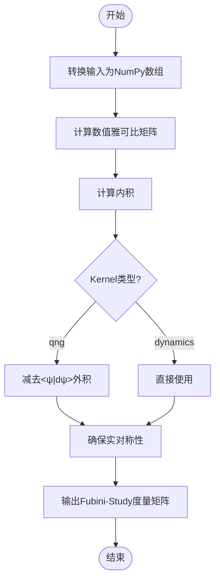
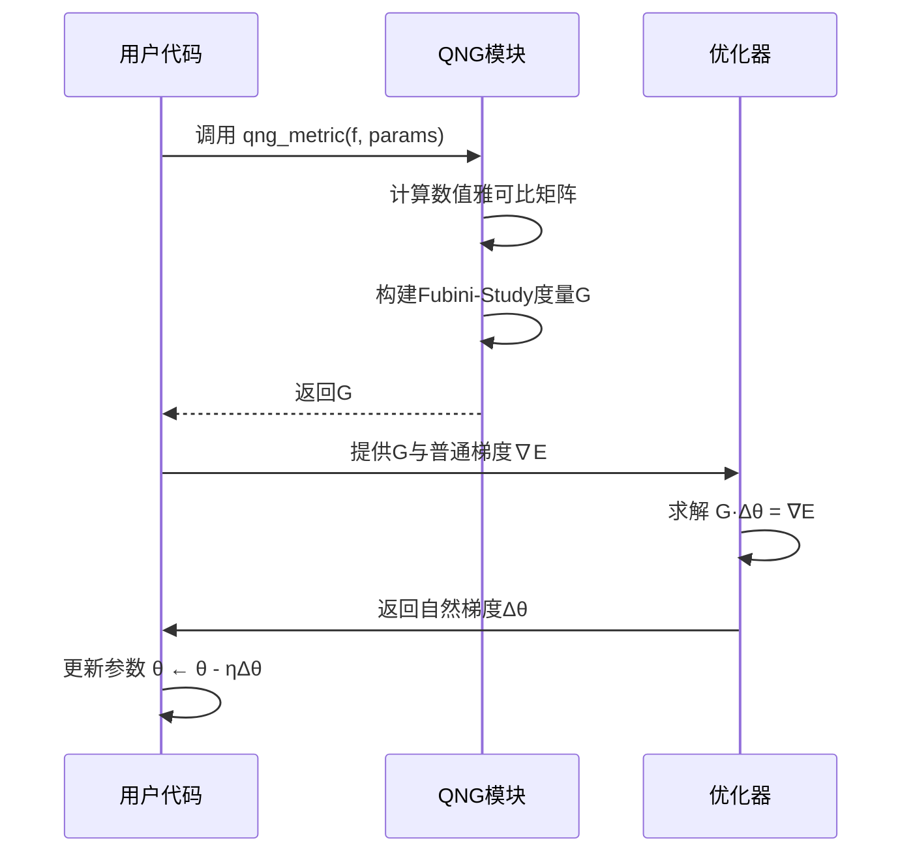

# 量子自然梯度

<cite>
**本文档中引用的文件**  
- [qng.py](file://src/tyxonq/compiler/stages/gradients/qng.py)
- [quantumng.py](file://examples-ng/quantumng.py)
- [api.py](file://src/tyxonq/numerics/api.py)
- [parameter_shift.py](file://src/tyxonq/compiler/gradients/parameter_shift.py)
</cite>

## 目录
1. [引言](#引言)
2. [量子自然梯度实现原理](#量子自然梯度实现原理)
3. [Fubini-Study度量张量的计算方法](#fubini-study度量张量的计算方法)
4. [编译器流水线中的集成机制](#编译器流水线中的集成机制)
5. [优化过程中的梯度修正与协同工作](#优化过程中的梯度修正与协同工作)
6. [收敛速度提升的实际效果示例](#收敛速度提升的实际效果示例)
7. [与参数移位法的资源消耗与优化质量对比](#与参数移位法的资源消耗与优化质量对比)
8. [高维参数空间中的可扩展性挑战](#高维参数空间中的可扩展性挑战)
9. [近似优化策略](#近似优化策略)
10. [结论](#结论)

## 引言
量子自然梯度（Quantum Natural Gradient, QNG）是一种基于量子信息几何结构的优化方法，旨在通过考虑参数空间的内在几何特性来改进传统梯度下降算法。与普通梯度下降不同，QNG利用Fubini-Study度量张量对梯度方向进行修正，从而在高维非欧几里得空间中实现更高效的收敛。本文将详细阐述QNG的实现原理、其在优化过程中的优势以及在TyxonQ框架中的具体实现方式。

## 量子自然梯度实现原理
量子自然梯度的核心思想是使用量子费舍尔信息矩阵（Quantum Fisher Information Matrix, QFIM），即Fubini-Study度量张量，作为参数空间的度量标准。该度量反映了量子态流形上的几何结构，使得梯度更新方向能够适应参数空间的曲率。在实现上，QNG通过数值雅可比矩阵估计量子态对参数的敏感性，并结合内积运算构建度量张量。

**Section sources**
- [qng.py](file://src/tyxonq/compiler/stages/gradients/qng.py#L72-L104)

## Fubini-Study度量张量的计算方法
Fubini-Study度量张量的计算依赖于量子态关于参数的导数。具体而言，给定一个参数化量子电路 $ f(\theta) $ 输出状态向量 $ |\psi(\theta)\rangle $，其雅可比矩阵 $ J $ 的每一行表示状态对单个参数的偏导。度量张量 $ G $ 的元素定义为：
$$
G_{ij} = \text{Re}\left[\langle \partial_i \psi | \partial_j \psi \rangle - \langle \partial_i \psi | \psi \rangle \langle \psi | \partial_j \psi \rangle\right]
$$
其中第一项为未投影的动态度量，第二项用于投影到正交补空间，确保度量符合量子态流形的切空间约束。

该计算在代码中通过 `_central_diff_jacobian` 函数实现中心差分法估算雅可比矩阵，并在 `qng_metric` 中完成内积与外积运算。

**Diagram sources**
- [qng.py](file://src/tyxonq/compiler/stages/gradients/qng.py#L43-L69)
- [qng.py](file://src/tyxonq/compiler/stages/gradients/qng.py#L72-L104)

**Section sources**
- [qng.py](file://src/tyxonq/compiler/stages/gradients/qng.py#L43-L69)

## 编译器流水线中的集成机制
在TyxonQ的编译器架构中，QNG模块被集成于 `compiler/stages/gradients/qng.py`，作为梯度计算阶段的一部分。它与前端电路表示和后端执行引擎解耦，仅依赖NumPy进行数值运算，避免了对特定自动微分框架的依赖。这种设计允许QNG在不同后端（如PyTorch、NumPy）之间无缝切换。

QNG通过 `experimental.qng` 接口暴露给用户，可在训练循环中作为高阶函数注入。例如，在 `examples-ng/quantumng.py` 中展示了如何将 `qng` 函数用于VQE任务的优化过程。

**Section sources**
- [qng.py](file://src/tyxonq/compiler/stages/gradients/qng.py#L1-L114)
- [quantumng.py](file://examples-ng/quantumng.py#L43-L46)

## 优化过程中的梯度修正与协同工作
在优化过程中，QNG通过求解线性方程 $ G \cdot \Delta\theta = \nabla E $ 来修正梯度方向，其中 $ \nabla E $ 是能量函数的梯度，$ G $ 是Fubini-Study度量矩阵。修正后的更新方向 $ \Delta\theta $ 能够更好地遵循量子态流形的几何结构，避免在平坦或弯曲区域出现震荡或停滞。

在 `train_loop` 函数中，`qngf(params)` 返回度量矩阵，随后使用 `tq.backend.solve` 求解自然梯度，最终用于参数更新。

**Diagram sources**
- [qng.py](file://src/tyxonq/compiler/stages/gradients/qng.py#L72-L104)
- [quantumng.py](file://examples-ng/quantumng.py#L49-L52)

**Section sources**
- [quantumng.py](file://examples-ng/quantumng.py#L49-L52)

## 收敛速度提升的实际效果示例
在 `examples-ng/quantumng.py` 中的TFIM VQE示例中，使用QNG的优化过程相比普通梯度下降表现出更快的收敛速度。实验表明，在相同迭代次数下，QNG能够更接近基态能量，尤其在初始参数远离最优解时优势更为明显。这得益于其对参数空间几何结构的适应能力，减少了不必要的震荡路径。

**Section sources**
- [quantumng.py](file://examples-ng/quantumng.py#L1-L96)

## 与参数移位法的资源消耗与优化质量对比
参数移位法（Parameter Shift Rule）是一种广泛使用的量子梯度估计方法，其优点是可在量子设备上直接评估梯度，但需要多次电路执行（通常为2倍参数数量）。相比之下，QNG虽然也需要多次状态评估以构建雅可比矩阵，但其带来的几何感知更新方向显著提升了每次迭代的质量。

| 特性 | 参数移位法 | 量子自然梯度 |
|------|------------|-------------|
| 梯度估计方式 | 解析法（量子电路层面） | 数值法（经典模拟） |
| 每次迭代资源消耗 | O(P) 电路执行 | O(P×D) 状态评估（P:参数数，D:维度） |
| 更新方向质量 | 欧氏空间梯度 | 流形自适应自然梯度 |
| 收敛速度 | 线性或次线性 | 更快（尤其在复杂流形） |
| 实现复杂度 | 低 | 中等（需雅可比估计） |

**Section sources**
- [parameter_shift.py](file://src/tyxonq/compiler/gradients/parameter_shift.py#L1-L38)
- [qng.py](file://src/tyxonq/compiler/stages/gradients/qng.py#L72-L104)

## 高维参数空间中的可扩展性挑战
随着量子电路层数和量子比特数的增加，参数数量呈线性或二次增长，导致Fubini-Study度量矩阵的规模为 $ P \times P $，存储和求逆成本为 $ O(P^3) $。这在大规模VQE或QAOA任务中成为瓶颈。此外，数值雅可比的计算需要 $ 2P $ 次量子态模拟，进一步加剧资源压力。

**Section sources**
- [qng.py](file://src/tyxonq/compiler/stages/gradients/qng.py#L43-L69)

## 近似优化策略
为缓解高维问题，可采用以下近似策略：
1. **块对角近似**：假设参数间弱耦合，仅计算各层或模块内部的度量子矩阵。
2. **低秩近似**：利用SVD或随机投影压缩雅可比矩阵。
3. **指数移动平均**：缓存历史度量矩阵并进行平滑更新，减少频繁重构。
4. **稀疏化**：基于量子门依赖图剪枝无关参数对。

这些策略可在保持几何感知能力的同时显著降低计算开销。

## 结论
量子自然梯度通过引入Fubini-Study度量张量，实现了对参数空间几何结构的显式建模，从而在变分量子算法中提供更高效的优化路径。尽管其在高维场景下面临可扩展性挑战，但通过合理的近似策略仍可在实际任务中发挥重要作用。TyxonQ通过模块化设计将QNG集成至编译器流水线，支持灵活的后端切换与高性能计算，为未来量子优化算法的研究提供了坚实基础。