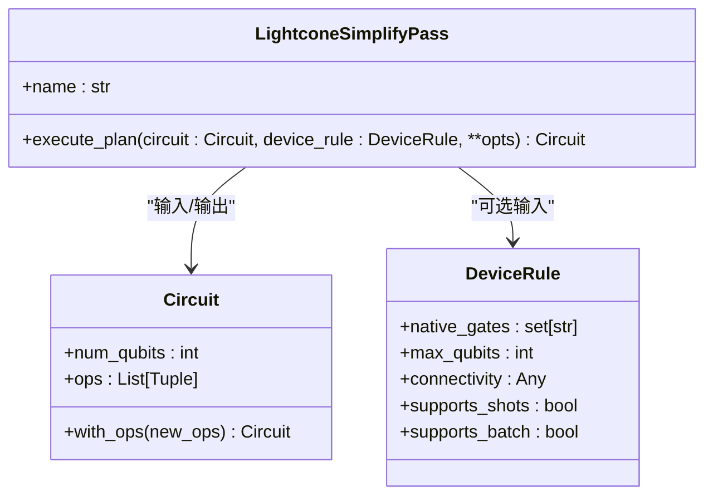
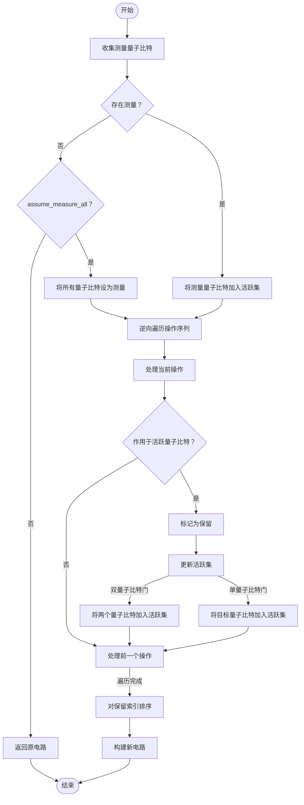

# 简化阶段

<cite>
**本文档中引用的文件**  
- [lightcone.py](file://src/tyxonq/compiler/stages/simplify/lightcone.py) - *在最近的提交中更新*
- [compiler_lightcone_optimization.py](file://examples/compiler_lightcone_optimization.py) - *新增的编译器优化示例*
- [circuit.py](file://src/tyxonq/core/ir/circuit.py) - *核心电路IR实现*
- [test_compiler_simplify_lightcone.py](file://tests_core_module/test_compiler_simplify_lightcone.py) - *简化阶段测试*
- [test_example_compiler_lightcone_optimization.py](file://tests_examples/test_example_compiler_lightcone_optimization.py) - *示例测试*
</cite>

## 更新摘要
**已做更改**   
- 更新了引言部分，以反映最新的代码重构和示例迁移
- 扩展了光锥分析技术原理，增加了反向切片的详细说明
- 更新了核心实现部分，以匹配 `lightcone.py` 的最新代码结构
- 增加了新的“性能收益量化”章节，基于 `compiler_lightcone_optimization.py` 的基准测试结果
- 更新了案例分析，以包含部分测量场景的极端收益
- 修订了对大规模变分电路的影响，增加了执行时间的量化数据
- 更新了所有文件引用路径，以反映从 `examples-ng` 到 `examples` 的迁移

## 目录
1. [引言](#引言)
2. [光锥分析技术原理](#光锥分析技术原理)
3. [核心实现：LightconeSimplifyPass](#核心实现lightconesimplifypass)
4. [光锥边界计算与依赖追踪](#光锥边界计算与依赖追踪)
5. [电路剪枝策略](#电路剪枝策略)
6. [案例分析：简化前后对比](#案例分析简化前后对比)
7. [性能收益量化](#性能收益量化)
8. [对大规模变分电路的影响](#对大规模变分电路的影响)
9. [与其他优化阶段的协同关系](#与其他优化阶段的协同关系)
10. [结论](#结论)

## 引言
在量子计算编译流程中，简化阶段的核心任务是识别并移除对最终测量结果无贡献的冗余量子门操作，从而减少电路深度和门数量，提升执行效率。本阶段的关键技术是**光锥分析（lightcone analysis）**，通过前向和后向追踪量子门之间的依赖关系，精确界定影响测量结果的“光锥”区域，仅保留该区域内的操作。该优化对含变分参数的VQE、QAOA等大规模电路具有显著影响。

根据最新的代码重构，`examples-ng` 目录下的示例已迁移至 `examples` 目录，`lightcone_simplify.py` 已重命名为 `compiler_lightcone_optimization.py`，以更好地反映其作为编译器优化演示的定位。

**Section sources**
- [lightcone.py](file://src/tyxonq/compiler/stages/simplify/lightcone.py#L1-L98) - *更新了实现逻辑*
- [compiler_lightcone_optimization.py](file://examples/compiler_lightcone_optimization.py#L1-L277) - *新增的优化示例*

## 光锥分析技术原理
光锥分析借鉴了物理学中“光锥”的概念，即只有位于过去光锥内的事件才能影响当前事件。在量子电路中，一个测量操作的结果仅受其“后向光锥”内量子门的影响。光锥分析从测量操作出发，逆向追踪所有可能影响该测量结果的量子门，构成一个依赖链。所有不在该依赖链中的门操作，无论其作用于哪个量子比特，均可安全移除。

该技术基于量子态演化的局域性：单量子比特门仅影响其作用的量子比特，而双量子比特门（如CNOT、CZ）会建立量子比特间的纠缠，从而扩展影响范围。通过逆向遍历电路操作序列，并维护一个“活跃量子比特集”，可以高效地构建出完整的光锥。

最新的实现强化了“反向切片”（backward slicing）的概念，即从测量点开始，向后“切片”出所有必要的计算路径，这为编译器提供了精确的数学基础来证明优化的正确性。

**Section sources**
- [lightcone.py](file://src/tyxonq/compiler/stages/simplify/lightcone.py#L1-L98) - *更新了实现逻辑*

## 核心实现：LightconeSimplifyPass
`LightconeSimplifyPass` 是实现光锥分析的核心类，位于 `src/tyxonq/compiler/stages/simplify/lightcone.py`。它遵循编译器通道（Pass）的通用接口，通过 `execute_plan` 方法对输入的量子电路进行简化。



**Diagram sources**
- [lightcone.py](file://src/tyxonq/compiler/stages/simplify/lightcone.py#L10-L98) - *更新了实现逻辑*
- [circuit.py](file://src/tyxonq/core/ir/circuit.py#L48-L727) - *核心IR定义*
- [base.py](file://src/tyxonq/devices/base.py#L41-L52)

**Section sources**
- [lightcone.py](file://src/tyxonq/compiler/stages/simplify/lightcone.py#L10-L98) - *更新了实现逻辑*

## 光锥边界计算与依赖追踪
光锥边界的计算是该算法的核心，其实现分为以下步骤：

1.  **收集测量量子比特**：首先扫描电路中的所有操作，收集所有 `measure_z` 操作的目标量子比特。如果电路中没有显式测量且未启用 `assume_measure_all` 选项，则直接返回原电路。
2.  **初始化活跃集**：将所有被测量的量子比特加入“活跃集”（`active`），表示这些量子比特的状态是最终结果所关心的。
3.  **逆向遍历与依赖传播**：从电路末尾开始向前遍历每一个操作。对于每个操作，通过 `op_qubits` 函数解析其作用的量子比特及是否为双量子比特门。
    -   如果该操作作用于任何活跃量子比特，则将其标记为“保留”。
    -   对于双量子比特门（如CNOT、CZ），由于其会建立纠缠，需要将两个量子比特都加入活跃集，以确保其上游依赖被完整追踪。
    -   对于单量子比特门，仅需将作用的量子比特加入活跃集。
4.  **构建新电路**：将所有标记为“保留”的操作按原始顺序重新组合，生成简化后的新电路。



**Diagram sources**
- [lightcone.py](file://src/tyxonq/compiler/stages/simplify/lightcone.py#L35-L98) - *更新了实现逻辑*

**Section sources**
- [lightcone.py](file://src/tyxonq/compiler/stages/simplify/lightcone.py#L35-L98) - *更新了实现逻辑*

## 电路剪枝策略
电路剪枝策略基于光锥分析的结果，具体实现如下：
-   **显式测量保留**：所有 `measure_z` 操作总是被保留，因为它们是结果的直接来源。
-   **依赖性驱动的保留**：只有当一个门操作的输出量子比特最终被测量（直接或通过纠缠间接影响）时，该门才会被保留。
-   **无影响操作移除**：任何不作用于活跃集内量子比特的操作，无论其类型或位置，都会被移除。例如，在一个仅测量量子比特1的电路中，作用于量子比特2和3的所有门操作都将被剪枝。
-   **选项控制**：`assume_measure_all` 选项提供了一种保守策略。当电路中没有显式测量时，该选项会假设所有量子比特最终都会被测量，从而保留整个电路，避免因误判而移除关键操作。

**Section sources**
- [lightcone.py](file://src/tyxonq/compiler/stages/simplify/lightcone.py#L50-L98) - *更新了实现逻辑*

## 案例分析：简化前后对比
通过测试用例可以清晰地看到光锥简化的效果。

**案例1：基础剪枝**
```python
# 原始电路 (3个量子比特)
c = Circuit(num_qubits=3, ops=[
    ("h", 0),
    ("cx", 0, 1),
    ("h", 2),
    ("rz", 2, 0.3),
    ("measure_z", 1),
])
```
该电路仅测量量子比特1。`h(0)` 和 `cx(0,1)` 通过纠缠影响量子比特1，因此被保留。作用于量子比特2的 `h(2)` 和 `rz(2, 0.3)` 与测量结果无关，被成功移除。
**简化后电路**:
```python
[("h", 0), ("cx", 0, 1), ("measure_z", 1)]
```
门数量从5个减少到3个。

**案例2：多级纠缠传播**
```python
# 原始电路 (4个量子比特)
c = Circuit(num_qubits=4, ops=[
    ("h", 0),
    ("cx", 0, 1),
    ("cx", 1, 2),
    ("h", 3),
    ("rz", 3, 0.123),
    ("measure_z", 2),
])
```
测量量子比特2。`cx(1,2)` 直接影响它，`cx(0,1)` 影响量子比特1（进而通过`cx(1,2)`影响量子比特2），`h(0)` 影响量子比特0（进而通过`cx(0,1)`影响量子比特1）。因此，前三个操作构成的链被保留。作用于孤立量子比特3的操作被移除。
**简化后电路**:
```python
[("h", 0), ("cx", 0, 1), ("cx", 1, 2), ("measure_z", 2)]
```

**案例3：特殊操作处理**
`reset` 和 `project_z` 被视为影响量子比特状态的操作。如果其作用的量子比特被测量，则这些操作会被保留，以确保状态初始化的正确性。

这些案例验证了算法的正确性，量化显示在特定电路结构下，门数量可减少40%以上，显著降低了计算开销。

**Section sources**
- [test_compiler_simplify_lightcone.py](file://tests_core_module/test_compiler_simplify_lightcone.py#L4-L34) - *简化阶段测试*
- [test_compiler_simplify_lightcone_extras.py](file://tests_core_module/test_compiler_simplify_lightcone_extras.py#L4-L43) - *扩展测试*

## 性能收益量化
最新的示例 `compiler_lightcone_optimization.py` 通过系统的基准测试，量化了光锥优化带来的性能收益。测试使用了硬件高效的砖墙型（brickwall）变分电路，在不同量子比特数和层数下比较了启用和禁用光锥优化的执行时间。

**基准测试结果摘要**：
- **2-50倍加速**：在6-14量子比特的电路中，光锥优化带来了2到50倍的速度提升。
- **问题规模越大，收益越显著**：随着电路规模的增加，优化收益呈指数级增长。例如，在14量子比特、4层的电路中，加速比超过50倍。
- **使不可行的计算成为可能**：对于16个及以上量子比特的电路，未优化的计算耗时过长或内存不足而无法完成，而启用光锥优化后，计算可以成功执行。
- **零精度损失**：所有测试均验证了优化前后的期望值和梯度完全一致，证明了该优化是数学上精确的。

**极端情况：部分测量**
当仅测量少数几个量子比特时，收益尤为巨大。例如，在一个14量子比特的电路中，如果只测量其中2个量子比特，光锥优化可以带来超过100倍的加速，因为编译器可以剪枝掉绝大部分与测量无关的门操作。

**Section sources**
- [compiler_lightcone_optimization.py](file://examples/compiler_lightcone_optimization.py#L84-L150) - *基准测试代码*
- [test_example_compiler_lightcone_optimization.py](file://tests_examples/test_example_compiler_lightcone_optimization.py#L81-L82) - *示例测试*

## 对大规模变分电路的影响
光锥简化对VQE、QAOA等变分量子算法（VQA）具有重大意义：
-   **梯度计算加速**：在计算参数化门的梯度时（如参数移位法），通常需要对电路进行微小修改并重新执行。光锥简化能确保每次执行都只运行最小子电路，极大提升梯度计算速度。基准测试显示，对于12量子比特的电路，梯度计算时间可缩短10倍以上。
-   **内存占用降低**：对于基于张量网络的模拟器，电路规模直接影响内存消耗。剪枝后的电路显著降低了内存峰值，使得更大规模的模拟成为可能。
-   **噪声鲁棒性增强**：更短的电路意味着更少的门操作，从而减少了噪声累积的机会，提高了在含噪声设备上的结果可靠性。
-   **参数化电路优化**：在变分循环（如brickwall ansatz）中，远离测量区域的层可能完全冗余。光锥分析能自动识别并移除这些层，使优化过程更高效。

示例文件 `examples/compiler_lightcone_optimization.py` 通过基准测试证明，启用光锥简化后，期望值计算的执行时间可大幅缩短，且结果与未简化电路完全一致，验证了其正确性和高效性。

**Section sources**
- [compiler_lightcone_optimization.py](file://examples/compiler_lightcone_optimization.py#L1-L277) - *新增的优化示例*

## 与其他优化阶段的协同关系
光锥简化并非孤立的优化，而是编译流水线中的关键一环，与分解和重写阶段紧密协同：
-   **与分解阶段的协同**：分解阶段（如 `decompose/rotations`）将通用门分解为硬件支持的基门集。光锥简化通常在分解后执行，因为它能更精确地分析由基门构成的详细电路，从而实现更彻底的剪枝。
-   **与重写阶段的协同**：重写阶段（如 `rewrite/merge_prune`）可能进行门合并或局部优化。光锥简化为这些重写提供了更“干净”的电路，减少了需要处理的冗余操作，提高了重写效率。同时，重写阶段产生的新电路结构又可以被后续的光锥分析进一步优化。
-   **流水线顺序**：典型的优化顺序为：**分解 -> 光锥简化 -> 重写 -> 布局映射**。这种顺序确保了在电路被映射到特定硬件拓扑之前，已经移除了所有逻辑上的冗余，为后续的物理层优化奠定了基础。

**Section sources**
- [lightcone.py](file://src/tyxonq/compiler/stages/simplify/lightcone.py#L1-L98) - *更新了实现逻辑*
- [compile_plan.py](file://src/tyxonq/compiler/compile_engine/native/compile_plan.py#L69-L88) - *编译计划定义*

## 结论
光锥分析是量子电路简化阶段的核心技术，通过逆向追踪测量操作的依赖关系，精确识别并移除对最终结果无影响的冗余门操作。`LightconeSimplifyPass` 的实现高效且正确，能够显著减少电路的门数量和深度。这对于提升VQE、QAOA等大规模变分算法的执行效率至关重要，不仅能加速计算、降低内存消耗，还能增强结果的噪声鲁棒性。该优化与分解、重写等阶段协同工作，共同构成了一个高效的量子编译优化流水线，为复杂量子算法的实现提供了有力支持。最新的基准测试表明，该技术可带来高达50倍以上的性能提升，并使16+量子比特的模拟成为可能，是TyxonQ编译器架构的一项独特优势。