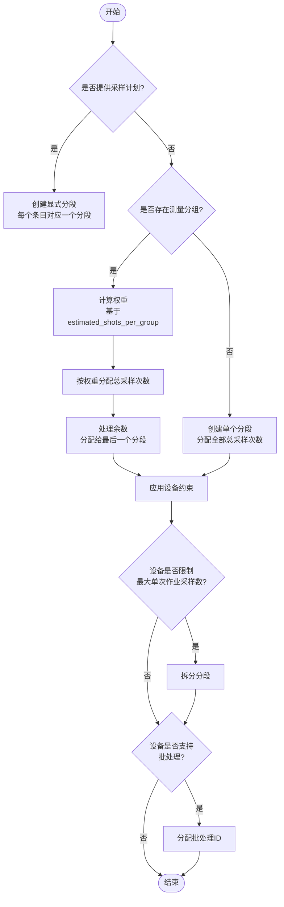
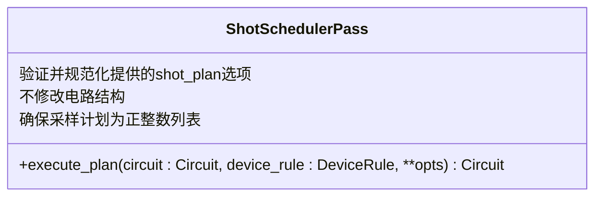
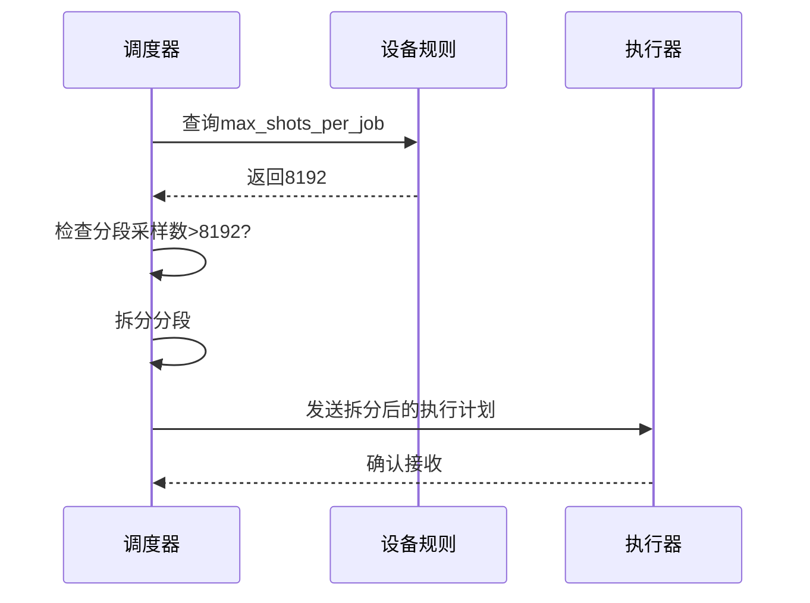
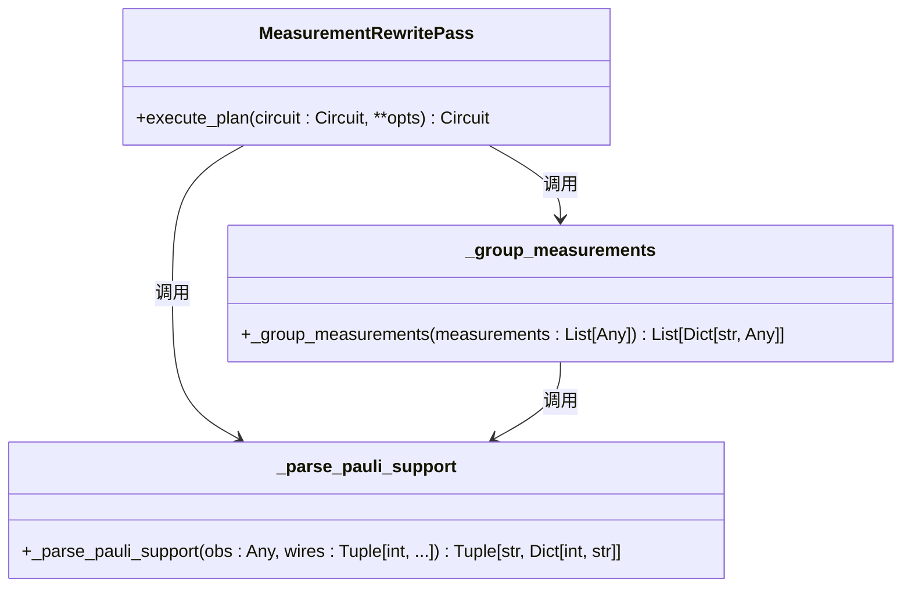
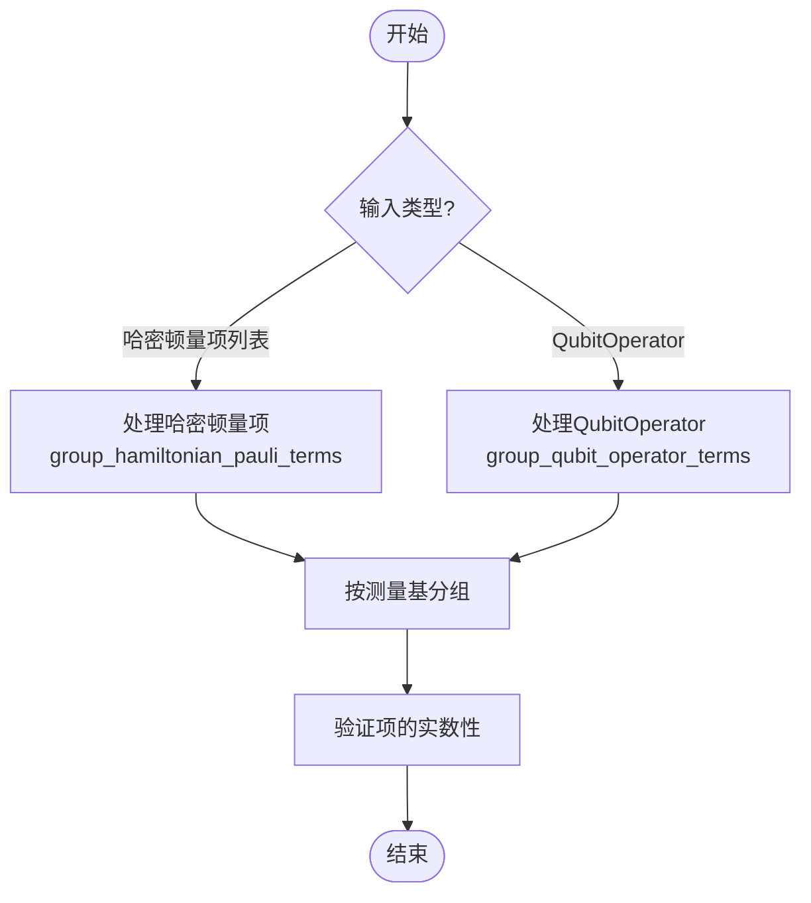

# 调度阶段

<cite>
**Referenced Files in This Document**   
- [shot_scheduler.py](file://src/tyxonq/compiler/stages/scheduling/shot_scheduler.py)
- [measurement.py](file://src/tyxonq/compiler/stages/rewrite/measurement.py)
- [hamiltonian_grouping.py](file://src/tyxonq/libs/hamiltonian_encoding/hamiltonian_grouping.py)
</cite>

## 目录
1. [调度阶段概述](#调度阶段概述)
2. [核心功能与实现](#核心功能与实现)
3. [调度算法设计原则](#调度算法设计原则)
4. [实际调度案例分析](#实际调度案例分析)
5. [云量子计算环境下的优化作用](#云量子计算环境下的优化作用)
6. [与重写阶段的耦合关系](#与重写阶段的耦合关系)

## 调度阶段概述

调度阶段是量子计算编译流程中的关键环节，其主要功能是根据测量分组结果和用户指定的总采样次数（shots），智能分配每个测量组的采样资源。该阶段通过 `shot_scheduler.py` 模块实现，位于 `src/tyxonq/compiler/stages/scheduling/` 目录下。

调度器的核心目标是将测量分组元数据转换为具体的执行计划（segments），从而解耦调度逻辑与设备执行器。它支持两种主要模式：用户显式指定的采样向量和基于分组权重的自动分配。这种设计使得调度策略更加灵活、可测试且易于扩展。

**Section sources**
- [shot_scheduler.py](file://src/tyxonq/compiler/stages/scheduling/shot_scheduler.py#L0-L136)

## 核心功能与实现

### 调度器核心函数

调度器的核心功能由 `schedule` 函数实现，该函数接收电路对象、采样计划、总采样次数和设备规则作为输入参数，并返回一个包含电路和分段信息的执行计划。



**Diagram sources**
- [shot_scheduler.py](file://src/tyxonq/compiler/stages/scheduling/shot_scheduler.py#L43-L118)

**Section sources**
- [shot_scheduler.py](file://src/tyxonq/compiler/stages/scheduling/shot_scheduler.py#L43-L118)

### 调度器传递类

`ShotSchedulerPass` 类是一个编译传递，负责将采样计划附加到编译元数据中。其主要功能是验证和规范化提供的 `shot_plan` 选项，而不对电路本身进行任何修改。



**Diagram sources**
- [shot_scheduler.py](file://src/tyxonq/compiler/stages/scheduling/shot_scheduler.py#L121-L133)

**Section sources**
- [shot_scheduler.py](file://src/tyxonq/compiler/stages/scheduling/shot_scheduler.py#L121-L133)

## 调度算法设计原则

### 基于权重的分配策略

调度算法的核心设计原则是基于哈密顿量项权重的加权分配策略，旨在最小化总期望值估计的方差。具体实现中，每个测量组的权重由 `estimated_shots_per_group` 字段决定，该字段的计算基于测量项数量和涉及的量子比特数。

```python
weights = [max(1, g.get("estimated_shots_per_group", 1)) for g in groups]
wsum = sum(weights)
rem = int(total_shots)
for i, (g, w) in enumerate(zip(groups, weights)):
    shots_i = int(round(total_shots * (w / wsum))) if i < len(groups) - 1 else rem
    rem -= shots_i
```

这种加权分配策略确保了对更复杂或更重要的测量组分配更多的采样资源，从而优化整体测量精度。

### 确定性舍入处理

为了保证总采样次数的精确性，调度器采用确定性舍入策略。在分配过程中，除最后一个分段外的所有分段都使用四舍五入计算采样次数，而剩余的采样次数则全部分配给最后一个分段。这种策略确保了 `sum(shots) == total_shots` 的严格满足。

**Section sources**
- [shot_scheduler.py](file://src/tyxonq/compiler/stages/scheduling/shot_scheduler.py#L43-L118)

## 实际调度案例分析

### 案例一：简单哈密顿量测量

考虑一个包含三个测量组的VQE任务，总采样次数为10000次。各测量组的 `estimated_shots_per_group` 分别为10、5和15。

| 测量组 | 权重 | 分配采样次数 |
|--------|------|-------------|
| 组1 | 10 | 3333 |
| 组2 | 5 | 1667 |
| 组3 | 15 | 5000 |

在这种分配策略下，第三组获得了最多的采样资源，因为它可能包含更多或更重要的哈密顿量项，从而对最终能量估计的精度有更大影响。

### 案例二：设备约束下的调度

当目标设备有最大单次作业采样数限制（如IBM Quantum设备的8192次）时，调度器会自动将大分段拆分为多个小分段。例如，一个需要10000次采样的分段会被拆分为两个分段：一个8192次，另一个1808次。



**Diagram sources**
- [shot_scheduler.py](file://src/tyxonq/compiler/stages/scheduling/shot_scheduler.py#L43-L118)

**Section sources**
- [shot_scheduler.py](file://src/tyxonq/compiler/stages/scheduling/shot_scheduler.py#L43-L118)

## 云量子计算环境下的优化作用

### 成本优化

在云量子计算环境中，用户的计算成本通常与采样次数直接相关。通过智能的采样资源分配，调度阶段能够显著降低达到目标精度所需的总采样次数，从而减少用户的经济成本。

### 效率优化

调度器通过以下方式提高执行效率：
1. **设置重用**：每个分段携带测量上下文（基、量子比特、基映射），允许执行器重用测量设置，减少基变换开销。
2. **批处理支持**：如果设备支持批处理，调度器会为分段分配批处理ID，实现更高效的资源利用。
3. **并行执行**：合理的分段划分为不同测量组的并行执行提供了可能。

```python
if supports_batch and max_segments_per_batch and max_segments_per_batch > 0:
    for idx, seg in enumerate(segments):
        seg["batch_id"] = idx // max_segments_per_batch
```

**Section sources**
- [shot_scheduler.py](file://src/tyxonq/compiler/stages/scheduling/shot_scheduler.py#L43-L118)

## 与重写阶段的耦合关系

### 测量重写阶段

调度阶段与重写阶段中的测量分组功能紧密耦合。`MeasurementRewritePass` 类负责生成测量分组元数据，这些元数据随后被调度器使用。



**Diagram sources**
- [measurement.py](file://src/tyxonq/compiler/stages/rewrite/measurement.py#L9-L88)

**Section sources**
- [measurement.py](file://src/tyxonq/compiler/stages/rewrite/measurement.py#L9-L88)

### 哈密顿量分组实现

对于哈密顿量测量，系统使用 `group_hamiltonian_pauli_terms` 函数将哈密顿量项按可同时测量的基进行分组。这个过程是调度前的关键步骤，直接影响后续的资源分配。



**Diagram sources**
- [hamiltonian_grouping.py](file://src/tyxonq/libs/hamiltonian_encoding/hamiltonian_grouping.py#L11-L65)

**Section sources**
- [hamiltonian_grouping.py](file://src/tyxonq/libs/hamiltonian_encoding/hamiltonian_grouping.py#L11-L65)