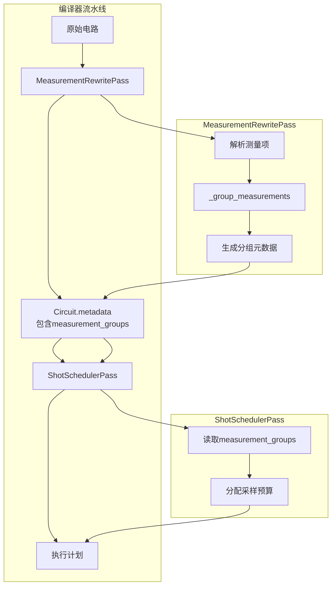
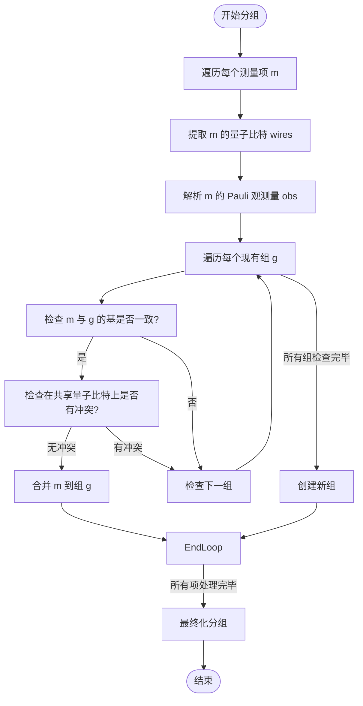
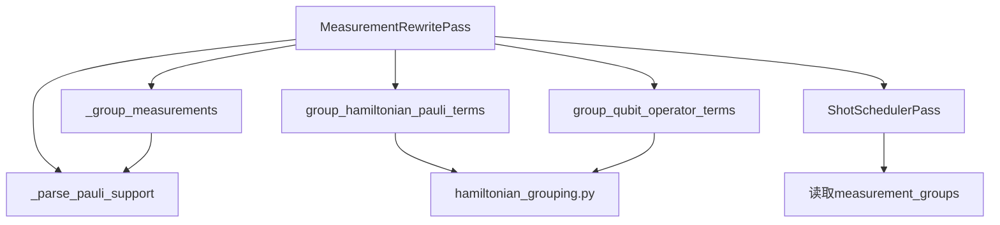

# 测量重写优化

<cite>
**Referenced Files in This Document**   
- [measurement.py](file://src/tyxonq/compiler/stages/rewrite/measurement.py)
- [shot_scheduler.py](file://src/tyxonq/compiler/stages/scheduling/shot_scheduler.py)
- [hamiltonian_grouping.py](file://src/tyxonq/libs/hamiltonian_encoding/hamiltonian_grouping.py)
- [test_measurement_rewrite_grouping.py](file://tests_core_module/test_measurement_rewrite_grouping.py)
</cite>

## 目录
1. [引言](#引言)
2. [核心组件](#核心组件)
3. [架构概述](#架构概述)
4. [详细组件分析](#详细组件分析)
5. [依赖分析](#依赖分析)
6. [性能考量](#性能考量)
7. [故障排除指南](#故障排除指南)
8. [结论](#结论)

## 引言

在量子计算中，测量操作是获取量子态信息的关键步骤，但其执行成本高昂，尤其是在含噪声中等规模量子（NISQ）设备上。频繁的测量配置切换会显著增加电路执行时间并引入额外误差。`MeasurementRewritePass` 类是 TyxonQ 编译器中的一个核心优化阶段，旨在通过智能分组测量操作来最小化测量配置的切换次数，从而提升量子算法（如变分量子本征求解器 VQE）的执行效率。本文档深入分析其核心机制，特别是 `_group_measurements` 函数如何解析 Pauli 观测量并构建非重叠量子比特组，以及该优化如何与后端调度器协同工作以实现性能提升。

## 核心组件

`MeasurementRewritePass` 的核心功能在于其 `execute_plan` 方法，该方法作为编译流水线的一部分，负责处理电路中的测量指令。其主要职责包括：从电路中提取或推导测量项、调用 `_group_measurements` 函数进行分组、处理哈密顿量项的分组，并将生成的分组元数据附加到电路的 `metadata` 字段中，供后续阶段使用。

**Section sources**
- [measurement.py](file://src/tyxonq/compiler/stages/rewrite/measurement.py#L29-L88)

## 架构概述

`MeasurementRewritePass` 与 `ShotSchedulerPass` 共同构成了测量优化的前后端。`MeasurementRewritePass` 位于编译器的重写（rewrite）阶段，负责分析和分组测量操作，生成包含 `basis_map`、`wires` 和 `estimated_settings` 等关键信息的 `measurement_groups` 元数据。随后，在调度（scheduling）阶段，`ShotSchedulerPass` 读取这些元数据，根据分组信息和总采样数（shots）来分配每个测量组的预算，生成最终的执行计划（segments）。

**Diagram sources **
- [measurement.py](file://src/tyxonq/compiler/stages/rewrite/measurement.py#L29-L88)
- [shot_scheduler.py](file://src/tyxonq/compiler/stages/scheduling/shot_scheduler.py#L64-L70)

## 详细组件分析

### MeasurementRewritePass 分析

`MeasurementRewritePass` 的核心是其分组策略，该策略通过 `_group_measurements` 函数实现，旨在将可同时测量的项合并，从而减少总的测量配置。

#### 分组逻辑分析
`_group_measurements` 函数采用一种贪心策略对测量项进行分组。其核心思想是：如果两个测量项在相同的量子比特上要求不同的测量基（basis），则它们不能被分到同一组，因为这会导致测量冲突。函数遍历所有测量项，尝试将其放入已有的组中。只有当新项与组内所有项在共享量子比特上的测量基完全一致时，才能成功合并。否则，将创建一个新组来容纳该项。

**Diagram sources **
- [measurement.py](file://src/tyxonq/compiler/stages/rewrite/measurement.py#L117-L162)

**Section sources**
- [measurement.py](file://src/tyxonq/compiler/stages/rewrite/measurement.py#L117-L162)

#### 元数据生成逻辑
分组完成后，`_group_measurements` 函数会为每个组生成关键的元数据字段：
- **`basis_map`**: 一个字典，明确指定了每个量子比特（键）在该组测量中应使用的测量基（值，如 'X', 'Y', 'Z'）。这为后端设备提供了精确的配置指令。
- **`wires`**: 一个元组，列出了该组测量所涉及的所有量子比特的索引。这有助于确定测量的范围。
- **`estimated_settings`**: 一个启发式估计值，表示该组所需的测量配置次数。在当前实现中，由于组内所有项共享同一测量基，因此该值恒为 1，表明整个组只需一次配置即可完成所有测量。
- **`estimated_shots_per_group`**: 另一个启发式估计值，用于指导采样预算的分配。它与组内测量项的数量和涉及的量子比特数成正比，反映了该组的相对“成本”。

这些元数据被附加到电路的 `metadata` 字段中，成为连接优化阶段和执行阶段的桥梁。

### 与哈密顿量分组的协同
`MeasurementRewritePass` 不仅处理显式的测量指令，还能处理用于计算哈密顿量期望值的 Pauli 项。当传入 `hamiltonian_terms` 或 `qubit_operator` 参数时，它会调用 `libs/hamiltonian_encoding` 模块中的 `group_hamiltonian_pauli_terms` 或 `group_qubit_operator_terms` 函数。这些函数基于相同的“乘积基安全”原则，将哈密顿量中的 Pauli 项按其测量基进行分组。分组后的结果（包括恒等项常数 `identity_const`）同样被整合进 `measurement_groups` 元数据中，确保了 VQE 等算法中能量计算的高效性。

**Section sources**
- [measurement.py](file://src/tyxonq/compiler/stages/rewrite/measurement.py#L48-L88)
- [hamiltonian_grouping.py](file://src/tyxonq/libs/hamiltonian_encoding/hamiltonian_grouping.py#L35-L66)

## 依赖分析

`MeasurementRewritePass` 的功能依赖于多个模块和文件，形成了一个清晰的依赖链。

**Diagram sources **
- [measurement.py](file://src/tyxonq/compiler/stages/rewrite/measurement.py)
- [hamiltonian_grouping.py](file://src/tyxonq/libs/hamiltonian_encoding/hamiltonian_grouping.py)
- [shot_scheduler.py](file://src/tyxonq/compiler/stages/scheduling/shot_scheduler.py#L13)

**Section sources**
- [measurement.py](file://src/tyxonq/compiler/stages/rewrite/measurement.py)
- [hamiltonian_grouping.py](file://src/tyxonq/libs/hamiltonian_encoding/hamiltonian_grouping.py)
- [shot_scheduler.py](file://src/tyxonq/compiler/stages/scheduling/shot_scheduler.py)

## 性能考量

`MeasurementRewritePass` 的优化对 VQE 等量子化学算法的性能有显著提升：
1. **减少测量配置次数**: 通过将可同时测量的项分组，极大地减少了在量子设备上切换测量基的次数。每次切换都伴随着额外的延迟和潜在的误差，因此减少切换次数直接缩短了总执行时间并提高了结果的准确性。
2. **降低总采样成本**: 虽然总采样数可能不变，但通过 `estimated_shots_per_group` 这样的元数据，调度器可以更智能地分配预算，避免在低权重项上浪费采样。
3. **与后端规则协同**: 生成的 `measurement_groups` 元数据被 `ShotSchedulerPass` 消费，后者可以根据设备规则（如 `max_shots_per_job`）进一步优化执行计划，例如将大组拆分为符合设备限制的子任务。

## 故障排除指南

在使用 `MeasurementRewritePass` 时，可能遇到以下问题：
- **分组未生效**: 检查输入的测量项或哈密顿量项是否格式正确。确保 `obs` 字段是有效的 Pauli 字符串（如 'Z', 'XZ'），且 `wires` 字段正确指定了量子比特索引。
- **元数据缺失**: 确认 `MeasurementRewritePass` 已在编译流水线中正确执行。检查电路的 `metadata` 字段是否包含 `measurement_groups` 键。
- **哈密顿量项含虚部**: 如果传入的哈密顿量项包含不可忽略的虚部（绝对值 > 1e-10），`group_hamiltonian_pauli_terms` 函数会抛出 `ValueError`。请确保输入的哈密顿量是厄米算符（Hermitian），其系数应为实数。

**Section sources**
- [measurement.py](file://src/tyxonq/compiler/stages/rewrite/measurement.py)
- [hamiltonian_grouping.py](file://src/tyxonq/libs/hamiltonian_encoding/hamiltonian_grouping.py#L45-L55)

## 结论

`MeasurementRewritePass` 类通过其 `_group_measurements` 函数实现了一种高效且安全的测量分组策略。它通过解析 Pauli 观测量并构建非重叠的测量基组，显著减少了量子电路执行中的测量配置切换次数。该优化通过生成结构化的元数据（如 `basis_map` 和 `estimated_settings`）与后续的 `ShotSchedulerPass` 无缝集成，共同提升了 VQE 等算法的执行效率。这种将优化逻辑与执行逻辑解耦的设计，使得系统既灵活又易于扩展，为未来实现更复杂的分组策略（如基于对易关系的分组）奠定了坚实的基础。