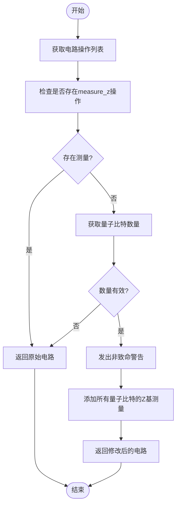
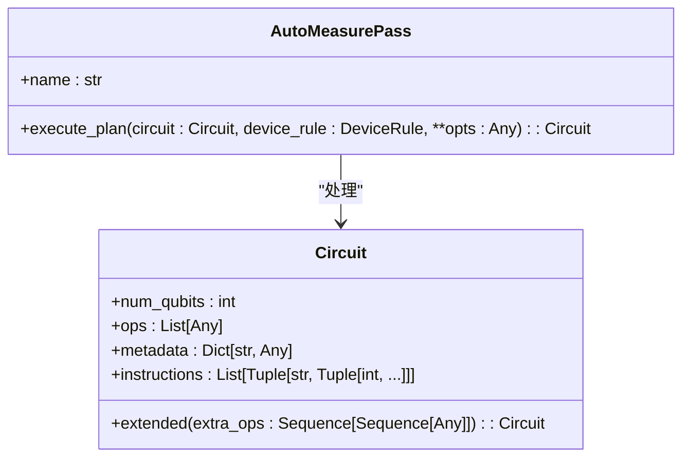
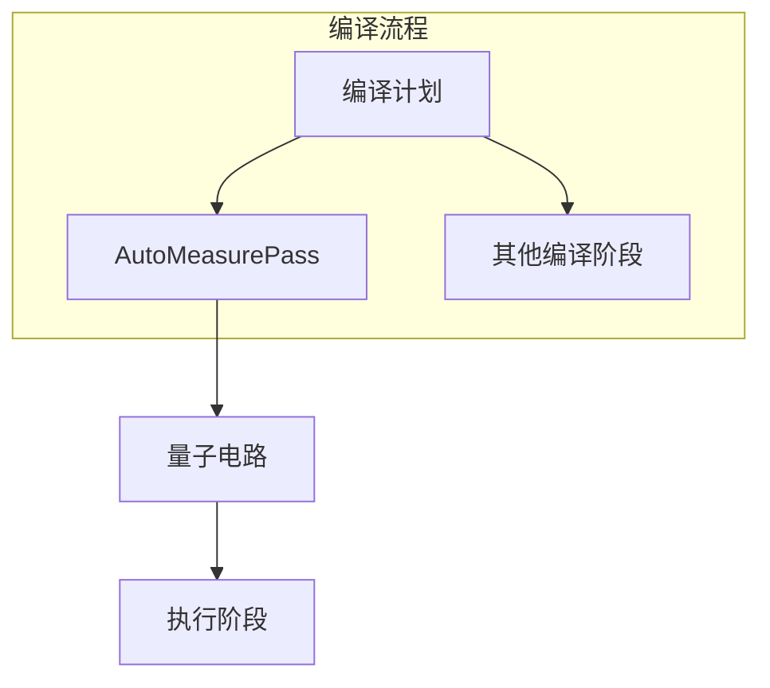

# 自动测量插入

<cite>
**本文档中引用的文件**   
- [auto_measure.py](file://src/tyxonq/compiler/stages/rewrite/auto_measure.py)
- [circuit.py](file://src/tyxonq/core/ir/circuit.py)
- [compile_plan.py](file://src/tyxonq/compiler/compile_engine/native/compile_plan.py)
</cite>

## 目录
1. [简介](#简介)
2. [核心机制分析](#核心机制分析)
3. [执行流程详解](#执行流程详解)
4. [设计意图与警告机制](#设计意图与警告机制)
5. [实际用例分析](#实际用例分析)
6. [依赖关系与集成](#依赖关系与集成)

## 简介
`AutoMeasurePass` 类是 TyxonQ 编译器框架中的一个关键组件，负责在量子电路编译流程中自动插入测量指令。当检测到电路中不存在显式测量操作时，该机制会自动向所有量子比特添加 Z 基测量，确保电路的可执行性。本文件详细分析其工作机制、设计原理和实际应用。

## 核心机制分析

`AutoMeasurePass` 类实现了在无显式测量的量子电路中自动插入 Z 基测量的功能。其主要行为包括：
- 检测电路中是否包含显式的 `("measure_z", q)` 操作
- 若未发现任何测量操作，则向所有量子比特 `[0..num_qubits-1]` 自动添加 Z 基测量
- 当电路中已存在任何测量时，保持原样不做修改（no-op）

该机制通过 `execute_plan` 方法实现核心逻辑，确保了量子电路在执行前具备必要的测量操作，同时避免对已有测量配置产生副作用。

**Section sources**
- [auto_measure.py](file://src/tyxonq/compiler/stages/rewrite/auto_measure.py#L10-L34)

## 执行流程详解

`execute_plan` 方法的执行流程如下：

**Diagram sources **
- [auto_measure.py](file://src/tyxonq/compiler/stages/rewrite/auto_measure.py#L22-L34)

**Section sources**
- [auto_measure.py](file://src/tyxonq/compiler/stages/rewrite/auto_measure.py#L22-L34)

## 设计意图与警告机制

`AutoMeasurePass` 的设计体现了对用户体验和系统透明性的重视。通过 `warnings.warn` 向用户发出非致命警告的设计意图包括：

1. **行为透明性**：明确告知用户系统自动添加了测量操作，避免"魔法行为"
2. **可追溯性**：在编译过程中留下清晰的记录，便于调试和验证
3. **非破坏性**：使用 `UserWarning` 而非错误，确保编译流程继续执行

这种设计确保了即使在自动补全测量的情况下，用户也能清楚了解系统行为，维护了开发过程的可控性和可预测性。

**Diagram sources **
- [auto_measure.py](file://src/tyxonq/compiler/stages/rewrite/auto_measure.py#L10-L34)
- [circuit.py](file://src/tyxonq/core/ir/circuit.py#L48-L727)

**Section sources**
- [auto_measure.py](file://src/tyxonq/compiler/stages/rewrite/auto_measure.py#L10-L34)

## 实际用例分析

在实际使用中，`AutoMeasurePass` 确保了无显式测量电路的可执行性。例如，在 `circuit_chain_demo.py` 示例中，即使用户创建的电路未包含测量操作，编译器也会自动补全，保证后续执行阶段的正常进行。

该功能避免了对已有测量配置电路的副作用，体现了智能默认行为的设计理念：既提供便利性，又尊重用户的显式选择。当用户已经定义了特定的测量策略时，系统不会干扰这些配置，保持了用户意图的完整性。

**Section sources**
- [circuit_chain_demo.py](file://examples/circuit_chain_demo.py#L0-L304)

## 依赖关系与集成

`AutoMeasurePass` 作为编译流程的一部分，与其他组件紧密集成。它通过 `compile_plan.py` 中的 `build_plan` 函数被纳入编译管道，成为整体编译策略的一个阶段。

**Diagram sources **
- [compile_plan.py](file://src/tyxonq/compiler/compile_engine/native/compile_plan.py#L34-L36)
- [auto_measure.py](file://src/tyxonq/compiler/stages/rewrite/auto_measure.py#L10-L34)

**Section sources**
- [compile_plan.py](file://src/tyxonq/compiler/compile_engine/native/compile_plan.py#L34-L36)