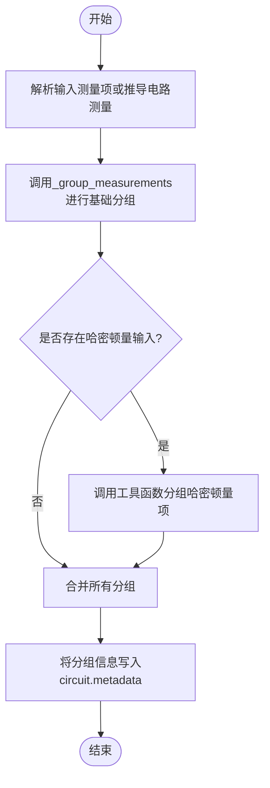
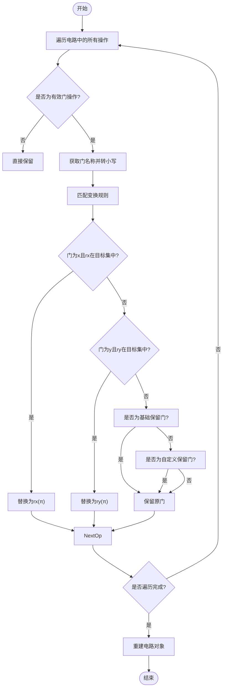
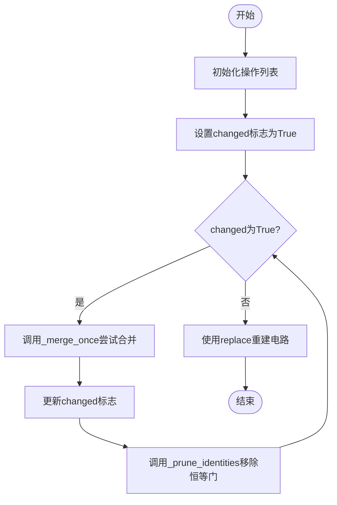
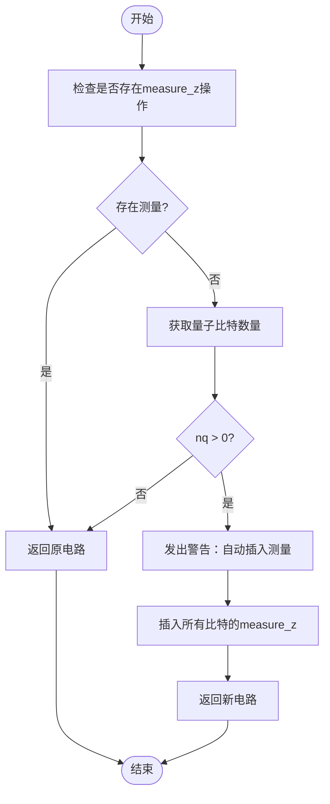

# 重写阶段

<cite>
**本文档中引用的文件**  
- [measurement.py](file://src/tyxonq/compiler/stages/rewrite/measurement.py)
- [gates_transform.py](file://src/tyxonq/compiler/stages/rewrite/gates_transform.py)
- [merge_prune.py](file://src/tyxonq/compiler/stages/rewrite/merge_prune.py)
- [auto_measure.py](file://src/tyxonq/compiler/stages/rewrite/auto_measure.py)
</cite>

## 目录
1. [引言](#引言)
2. [核心功能分析](#核心功能分析)
3. [测量基分组与优化](#测量基分组与优化)
4. [量子门等价变换与标准化](#量子门等价变换与标准化)
5. [相邻门合并与冗余剪枝](#相邻门合并与冗余剪枝)
6. [自动测量插入策略](#自动测量插入策略)
7. [协同工作机制与整体流程](#协同工作机制与整体流程)
8. [对VQE等量子化学算法的优化效果](#对vqe等量子化学算法的优化效果)
9. [结论](#结论)

## 引言
重写阶段是量子电路编译流程中的关键环节，旨在通过一系列优化策略提升电路执行效率与测量精度。该阶段包含多个子功能模块：`measurement.py` 实现测量基分组以减少实际测量配置次数；`gates_transform.py` 执行量子门的等价变换和标准化；`merge_prune.py` 完成相邻门的合并与冗余门的剪枝；`auto_measure.py` 提供自动测量插入机制。这些模块协同工作，在不改变电路语义的前提下显著优化电路结构，并为后续调度与执行提供支持。

## 核心功能分析
重写阶段的核心目标是对量子电路进行结构性优化，主要涵盖测量操作、量子门序列和整体电路布局的改进。各模块分工明确，分别处理不同类型的优化任务，最终共同提升电路的可执行性与资源利用率。

### 功能模块概览
- **测量基分组（measurement.py）**：将可共用测量基的观测项进行分组，减少重复测量设置。
- **门变换标准化（gates_transform.py）**：将通用量子门转换为目标设备支持的标准门集。
- **门合并与剪枝（merge_prune.py）**：合并连续作用于同一量子比特的门，并移除恒等操作。
- **自动测量插入（auto_measure.py）**：在无显式测量指令时，默认插入全比特Z基测量。

**Section sources**
- [measurement.py](file://src/tyxonq/compiler/stages/rewrite/measurement.py#L29-L88)
- [gates_transform.py](file://src/tyxonq/compiler/stages/rewrite/gates_transform.py#L23-L49)
- [merge_prune.py](file://src/tyxonq/compiler/stages/rewrite/merge_prune.py#L35-L43)
- [auto_measure.py](file://src/tyxonq/compiler/stages/rewrite/auto_measure.py#L22-L34)

## 测量基分组与优化
该功能由 `MeasurementRewritePass` 类实现，核心在于对测量项进行智能分组，从而减少实际测量所需的独立设置次数。

### 分组策略
系统采用贪心策略对测量项进行分组：
1. 若测量项之间作用的量子比特无冲突或基矢一致，则可合并至同一组。
2. 每个组对应一个统一的测量基（basis），并通过 `basis_map` 明确每个量子比特的测量方式。
3. 支持从电路中自动推导测量项，或接收外部传入的哈密顿量项进行分组。

### 哈密顿量项处理
当输入为哈密顿量形式（如Pauli项之和）时，系统调用 `group_hamiltonian_pauli_terms` 或 `group_qubit_operator_terms` 进行分组，确保同一组内所有项可在相同测量基下同时评估。

### 元数据附加
优化后，分组信息以 `measurement_groups` 形式存入电路元数据，便于下游调度器复用测量设置，降低总测量开销。

**Diagram sources**
- [measurement.py](file://src/tyxonq/compiler/stages/rewrite/measurement.py#L29-L88)

**Section sources**
- [measurement.py](file://src/tyxonq/compiler/stages/rewrite/measurement.py#L29-L88)

## 量子门等价变换与标准化
`GatesTransformPass` 模块负责将电路中的量子门转换为设备支持的标准门集，提升电路的可执行性。

### 变换规则
默认目标门集为 `["h", "rx", "rz", "cx", "cz"]`，变换规则如下：
- `x` 门 → `rx(π)`（若支持rx）
- `y` 门 → `ry(π)`（若支持ry）
- 保留 `cx`, `cz`, `h`, `rx`, `ry`, `rz` 等基础门
- 若请求保留 `rxx`, `rzz`, `cy` 等复合门，则透明保留

### 实现逻辑
遍历电路中所有操作，根据门名称和目标门集决定是否替换。对于参数化门（如rx, rz），保持参数不变。

**Diagram sources**
- [gates_transform.py](file://src/tyxonq/compiler/stages/rewrite/gates_transform.py#L23-L49)

**Section sources**
- [gates_transform.py](file://src/tyxonq/compiler/stages/rewrite/gates_transform.py#L23-L49)

## 相邻门合并与冗余剪枝
`MergePrunePass` 模块通过合并相邻门和移除恒等操作来简化电路结构。

### 合并规则
预定义的合并规则存储在 `DEFAULT_MERGE_RULES` 中，例如：
- `("s", "s") → "z"`
- `("t", "t") → "s"`
- `("x", "x") → "i"`（恒等）
- `("rz", "rz") → "rz"`（参数相加）

### 执行流程
1. 循环调用 `_merge_once` 尝试合并相邻同线量子门。
2. 调用 `_prune_identities` 移除所有 `"i"`（恒等）门。
3. 重复直至无法进一步合并。

### 关键方法
- `_same_wire`: 判断两个门是否作用于同一量子比特。
- `_merge_once`: 单次遍历尝试合并。
- `_prune_identities`: 过滤恒等门。

**Diagram sources**
- [merge_prune.py](file://src/tyxonq/compiler/stages/rewrite/merge_prune.py#L35-L43)

**Section sources**
- [merge_prune.py](file://src/tyxonq/compiler/stages/rewrite/merge_prune.py#L35-L43)

## 自动测量插入策略
`AutoMeasurePass` 在电路无显式测量时自动插入全比特Z基测量。

### 触发条件
- 电路中不存在任何 `"measure_z"` 操作。
- 电路包含至少一个量子比特。

### 行为说明
- 若满足条件，向每个量子比特 `[0..num_qubits-1]` 插入 `"measure_z"` 操作。
- 发出非致命警告，提示用户自动插入行为。
- 若已有测量存在，则直接返回原电路（无操作）。

**Diagram sources**
- [auto_measure.py](file://src/tyxonq/compiler/stages/rewrite/auto_measure.py#L22-L34)

**Section sources**
- [auto_measure.py](file://src/tyxonq/compiler/stages/rewrite/auto_measure.py#L22-L34)

## 协同工作机制与整体流程
各重写模块按特定顺序协同工作，形成完整的优化流水线。

### 执行顺序
1. **自动测量插入**：确保电路具有明确的测量终点。
2. **门变换标准化**：统一门集，便于后续合并。
3. **门合并与剪枝**：简化门序列。
4. **测量基分组**：最后进行测量优化，基于标准化后的电路结构。

### 数据流

**Diagram sources**
- [auto_measure.py](file://src/tyxonq/compiler/stages/rewrite/auto_measure.py#L22-L34)
- [gates_transform.py](file://src/tyxonq/compiler/stages/rewrite/gates_transform.py#L23-L49)
- [merge_prune.py](file://src/tyxonq/compiler/stages/rewrite/merge_prune.py#L35-L43)
- [measurement.py](file://src/tyxonq/compiler/stages/rewrite/measurement.py#L29-L88)

**Section sources**
- [auto_measure.py](file://src/tyxonq/compiler/stages/rewrite/auto_measure.py#L22-L34)
- [gates_transform.py](file://src/tyxonq/compiler/stages/rewrite/gates_transform.py#L23-L49)
- [merge_prune.py](file://src/tyxonq/compiler/stages/rewrite/merge_prune.py#L35-L43)
- [measurement.py](file://src/tyxonq/compiler/stages/rewrite/measurement.py#L29-L88)

## 对VQE等量子化学算法的优化效果
在变分量子本征求解（VQE）等算法中，哈密顿量期望值计算需对大量Pauli项进行测量。重写阶段对此类任务有显著优化：

### 测量效率提升
- **减少测量设置次数**：通过测量基分组，将多个可共用基的Pauli项归为一组，大幅降低设备重配置次数。
- ** shots分配优化**：基于分组元数据，调度器可更合理地分配采样次数，提升精度。

### 电路执行效率
- **门序列简化**：合并与剪枝减少总门数，缩短电路深度，降低噪声影响。
- **标准门集适配**：确保电路可在目标硬件上高效执行。

### 端到端优势
整体上，重写阶段使VQE等算法的每次迭代更快、更稳定，尤其在含噪中等规模量子（NISQ）设备上表现突出。

**Section sources**
- [measurement.py](file://src/tyxonq/compiler/stages/rewrite/measurement.py#L29-L88)
- [merge_prune.py](file://src/tyxonq/compiler/stages/rewrite/merge_prune.py#L35-L43)

## 结论
重写阶段通过测量基分组、门变换、合并剪枝和自动测量插入四项关键技术，系统性地优化了量子电路的结构与执行效率。各模块协同工作，不仅提升了电路的简洁性与可执行性，更为后续的测量调度与结果分析奠定了坚实基础。特别是在VQE等量子化学算法中，该阶段显著降低了测量开销，增强了算法的实用性与可扩展性。