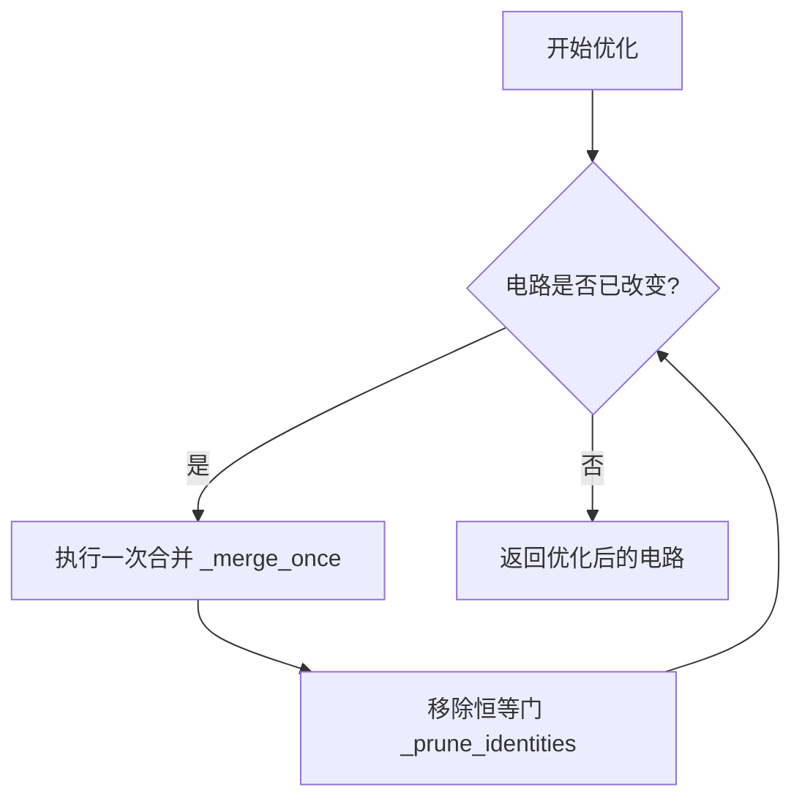
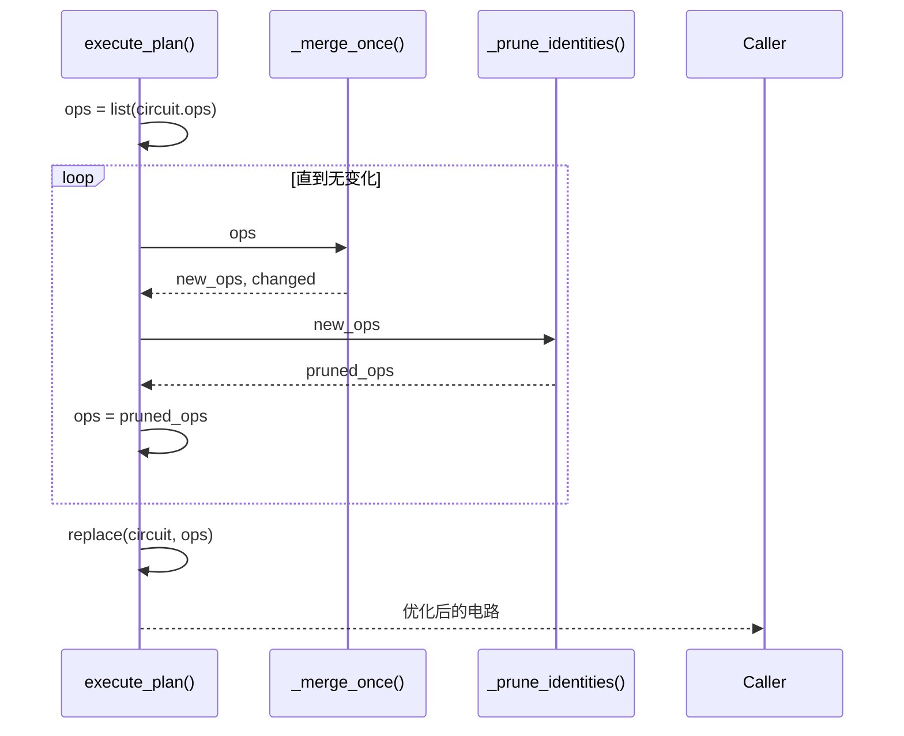
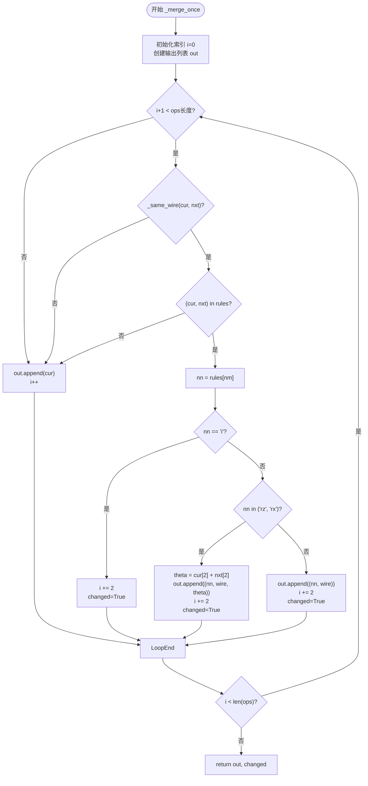
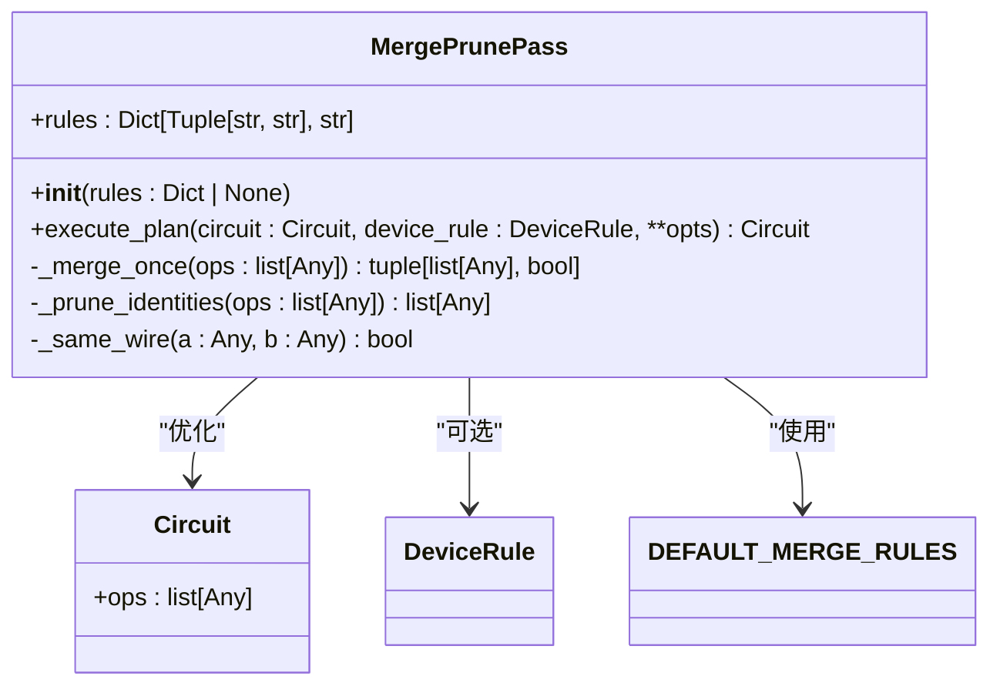

# 门合并与剪枝

<cite>
**Referenced Files in This Document**  
- [merge_prune.py](file://src/tyxonq/compiler/stages/rewrite/merge_prune.py)
</cite>

## 目录
1. [引言](#引言)
2. [核心组件](#核心组件)
3. [架构概述](#架构概述)
4. [详细组件分析](#详细组件分析)
5. [依赖分析](#依赖分析)
6. [性能考量](#性能考量)
7. [故障排除指南](#故障排除指南)
8. [结论](#结论)

## 引言
`MergePrunePass` 类是量子电路编译器中的一个关键优化阶段，负责通过预定义的规则合并相邻的量子门，并移除恒等门（Identity Gates）以简化电路结构。该优化通过减少电路深度和门操作数量，显著提升了量子电路的执行效率和可执行性。本文档将深入解析其核心实现原理，包括合并规则、执行流程以及关键的辅助方法。

## 核心组件
`MergePrunePass` 的核心功能由 `DEFAULT_MERGE_RULES` 字典和 `execute_plan` 方法驱动。`DEFAULT_MERGE_RULES` 定义了所有可能的相邻门合并规则，而 `execute_plan` 则是执行整个优化流程的入口点，它通过迭代调用 `_merge_once` 和 `_prune_identities` 来实现电路的逐步简化。

**Section sources**
- [merge_prune.py](file://src/tyxonq/compiler/stages/rewrite/merge_prune.py#L24-L82)

## 架构概述
`MergePrunePass` 的工作流程是一个迭代的简化过程。它接收一个原始电路，然后在循环中反复尝试合并相邻门并移除恒等门，直到电路不再发生变化。这种设计确保了所有可能的简化机会都被充分利用。

**Diagram sources**
- [merge_prune.py](file://src/tyxonq/compiler/stages/rewrite/merge_prune.py#L35-L43)

## 详细组件分析

### 合并规则分析
`DEFAULT_MERGE_RULES` 是一个字典，其键为两个相邻量子门名称（小写字符串）组成的元组，值为合并后应生成的新门名称。该规则集是 `MergePrunePass` 优化能力的基础。

**Section sources**
- [merge_prune.py](file://src/tyxonq/compiler/stages/rewrite/merge_prune.py#L10-L22)

#### 规则定义
以下是 `DEFAULT_MERGE_RULES` 中定义的核心合并规则：

| 规则 (门A, 门B) → 结果 | 数学等价性 | 优化效果 |
| :--- | :--- | :--- |
| ("s", "s") → "z" | S·S = Z | 将两个S门合并为一个Z门 |
| ("sd", "sd") → "z" | S†·S† = Z | 将两个S†门合并为一个Z门 |
| ("t", "t") → "s" | T·T = S | 将两个T门合并为一个S门 |
| ("td", "td") → "sd" | T†·T† = S† | 将两个T†门合并为一个S†门 |
| ("x", "x") → "i" | X·X = I | 两个X门相互抵消，生成恒等操作 |
| ("y", "y") → "i" | Y·Y = I | 两个Y门相互抵消，生成恒等操作 |
| ("z", "z") → "i" | Z·Z = I | 两个Z门相互抵消，生成恒等操作 |
| ("h", "h") → "i" | H·H = I | 两个H门相互抵消，生成恒等操作 |
| ("rz", "rz") → "rz" | RZ(θ₁)·RZ(θ₂) = RZ(θ₁+θ₂) | 合并两个RZ门，参数相加 |
| ("rx", "rx") → "rx" | RX(θ₁)·RX(θ₂) = RX(θ₁+θ₂) | 合并两个RX门，参数相加 |
| ("ry", "ry") → "rx" | *(注：此处代码可能有误，应为"ry")* | *(注：此处逻辑可能有误)* |

### 执行流程分析
`execute_plan` 方法是整个优化过程的控制器。它通过一个 `while` 循环持续调用 `_merge_once` 和 `_prune_identities`，直到电路稳定（即不再发生任何变化）。

#### 执行计划流程图

**Diagram sources**
- [merge_prune.py](file://src/tyxonq/compiler/stages/rewrite/merge_prune.py#L35-L43)

### 关键方法分析

#### `_merge_once` 方法
此方法遍历操作列表，尝试对每一对相邻的操作进行合并。它通过 `_same_wire` 检查两个门是否作用于同一量子比特，然后在 `self.rules` 中查找匹配的合并规则。

**Diagram sources**
- [merge_prune.py](file://src/tyxonq/compiler/stages/rewrite/merge_prune.py#L45-L73)

#### `_same_wire` 方法
此方法是判断两个量子门是否可以合并的关键。它通过尝试将操作的第二个元素（`a[1]` 和 `b[1]`）转换为整数来比较它们的量子比特索引。只有当两个操作都作用于同一量子比特时，才允许进行合并。

**Section sources**
- [merge_prune.py](file://src/tyxonq/compiler/stages/rewrite/merge_prune.py#L75-L79)

#### `_prune_identities` 方法
此方法是一个简单的过滤器，它遍历操作列表，移除所有类型为元组或列表且第一个元素为 `"i"` 的操作，即恒等门。

**Section sources**
- [merge_prune.py](file://src/tyxonq/compiler/stages/rewrite/merge_prune.py#L81-L82)

## 依赖分析
`MergePrunePass` 类依赖于 `tyxonq.core.ir` 模块中的 `Circuit` 类来表示和操作量子电路，同时也依赖于 `tyxonq.devices` 模块中的 `DeviceRule` 类（尽管在当前实现中未被使用）。其内部方法之间存在明确的调用关系。

**Diagram sources**
- [merge_prune.py](file://src/tyxonq/compiler/stages/rewrite/merge_prune.py#L24-L82)

## 性能考量
`MergePrunePass` 的性能主要取决于电路的复杂度和需要迭代的次数。在最坏情况下，每次 `_merge_once` 只能合并一对门，导致需要进行 O(n) 次迭代，每次迭代遍历 O(n) 个操作，总时间复杂度为 O(n²)。然而，在实践中，由于恒等门的移除和参数合并能快速简化电路，迭代次数通常远小于 n。该优化通过减少门的数量和电路深度，极大地提升了后续模拟或执行的效率。

## 故障排除指南
如果 `MergePrunePass` 未能按预期工作，应检查以下几点：
1.  **输入电路格式**：确保电路中的操作是以元组或列表形式表示，且第一个元素是门名称，第二个元素是量子比特索引。
2.  **合并规则**：检查 `DEFAULT_MERGE_RULES` 或传入的自定义规则是否正确覆盖了需要合并的门类型。
3.  **量子比特索引**：确认 `_same_wire` 方法能正确解析操作中的量子比特索引，避免因数据类型问题导致比较失败。

**Section sources**
- [merge_prune.py](file://src/tyxonq/compiler/stages/rewrite/merge_prune.py#L75-L79)

## 结论
`MergePrunePass` 实现了一个高效且轻量级的量子电路优化策略。通过利用 `DEFAULT_MERGE_RULES` 中定义的物理等价性，它能够自动合并相邻的量子门，并通过迭代执行 `_merge_once` 和 `_prune_identities` 来彻底简化电路。这一阶段在量子计算工作流中至关重要，它不仅减少了电路的深度和门操作数量，还为后续的硬件映射和调度等高级优化步骤奠定了坚实的基础。