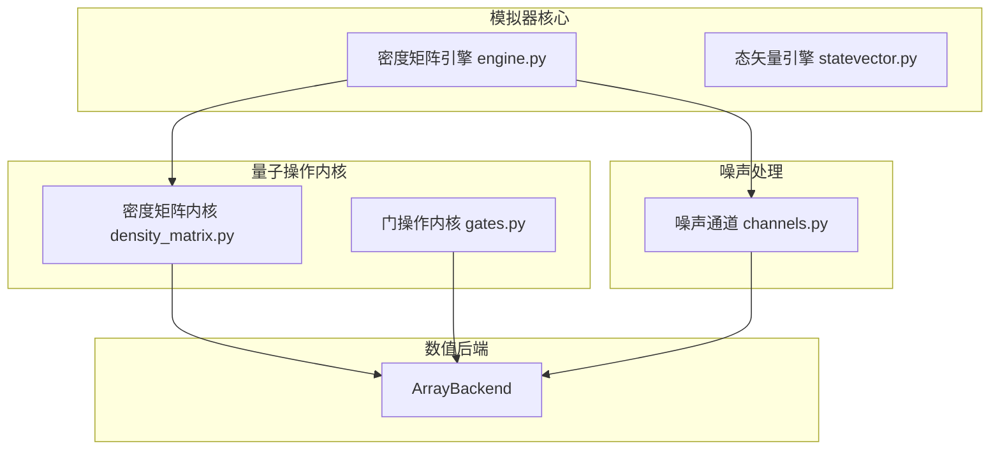
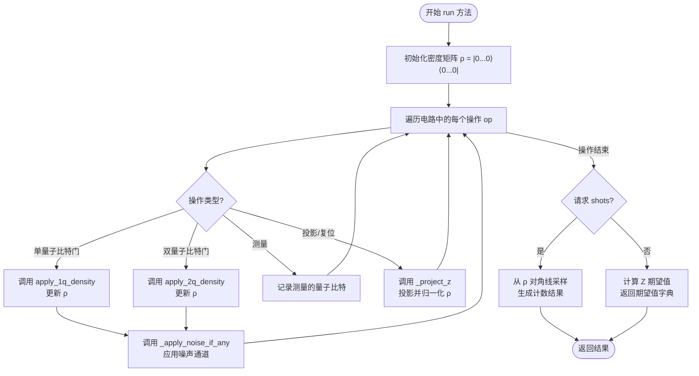
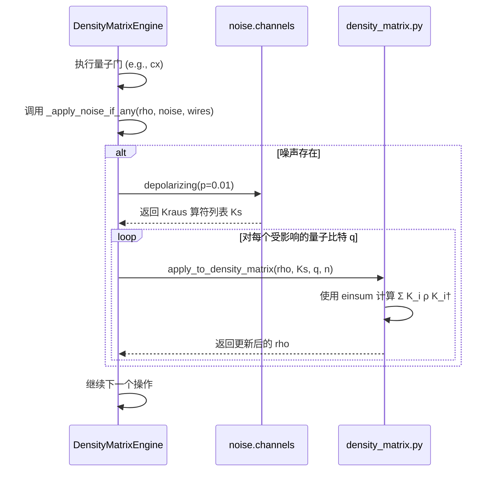
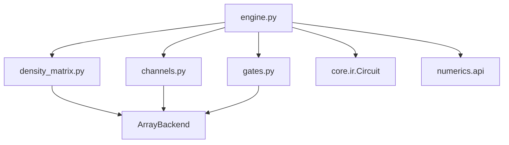

# 密度矩阵模拟器

<cite>
**本文档引用的文件**  
- [engine.py](file://src/tyxonq/devices/simulators/density_matrix/engine.py)
- [channels.py](file://src/tyxonq/devices/simulators/noise/channels.py)
- [density_matrix.py](file://src/tyxonq/libs/quantum_library/kernels/density_matrix.py)
- [statevector.py](file://src/tyxonq/devices/simulators/statevector/engine.py)
- [vqe_noisyopt.py](file://examples/vqe_noisyopt.py)
- [noisy_qml.py](file://examples-ng/noisy_qml.py)
</cite>

## 目录
1. [简介](#简介)
2. [项目结构](#项目结构)
3. [核心组件](#核心组件)
4. [架构概述](#架构概述)
5. [详细组件分析](#详细组件分析)
6. [依赖分析](#依赖分析)
7. [性能考量](#性能考量)
8. [故障排除指南](#故障排除指南)
9. [结论](#结论)

## 简介
密度矩阵模拟器是用于模拟混合量子态和噪声量子系统的核心工具。与仅能表示纯态的态矢量模拟器不同，该模拟器使用密度矩阵形式（ρ）来精确描述包含噪声和退相干效应的量子系统。它通过Kraus算符实现对多种噪声通道（如去极化、振幅阻尼等）的原生支持，使其成为量子误差分析、噪声鲁棒性测试和量子信道研究的理想选择。尽管其资源消耗随量子比特数呈双指数增长（内存O(4^n)），限制了其在大规模系统上的应用，但在小规模系统中提供了无与伦比的精度。本文档详细阐述了其内部工作机制、与噪声模块的集成方式，并提供配置示例和常见问题解决方案。

## 项目结构
密度矩阵模拟器位于`src/tyxonq/devices/simulators/density_matrix/`目录下，是整个模拟器框架中的一个专门化组件。其设计遵循模块化原则，与噪声处理、核心量子操作和数值后端等模块紧密协作。该结构确保了代码的可维护性和可扩展性，允许在不修改核心逻辑的情况下添加新的噪声模型或优化数值计算。



**图源**  
- [engine.py](file://src/tyxonq/devices/simulators/density_matrix/engine.py)
- [channels.py](file://src/tyxonq/devices/simulators/noise/channels.py)
- [density_matrix.py](file://src/tyxonq/libs/quantum_library/kernels/density_matrix.py)
- [statevector.py](file://src/tyxonq/devices/simulators/statevector/engine.py)

**节源**  
- [engine.py](file://src/tyxonq/devices/simulators/density_matrix/engine.py)
- [channels.py](file://src/tyxonq/devices/simulators/noise/channels.py)

## 核心组件
密度矩阵模拟器的核心在于`DensityMatrixEngine`类，它负责管理整个量子电路的演化过程。该引擎初始化一个全零态的密度矩阵，并按顺序应用电路中的每一个量子门操作。每个门操作通过调用`libs.quantum_library.kernels`中的统一内核函数（如`apply_1q_density`）来实现，这些函数使用爱因斯坦求和约定（`einsum`）高效地计算密度矩阵的变换。最关键的是，它在每次门操作后，根据用户配置的噪声模型，调用`_apply_noise_if_any`方法将Kraus算符作用于密度矩阵，从而精确模拟噪声对量子态的影响。最终，根据用户请求，它可以返回测量期望值或通过采样密度矩阵对角线生成测量结果。

**节源**  
- [engine.py](file://src/tyxonq/devices/simulators/density_matrix/engine.py#L38-L137)
- [density_matrix.py](file://src/tyxonq/libs/quantum_library/kernels/density_matrix.py)

## 架构概述
密度矩阵模拟器的架构是一个典型的分层设计。顶层是`DensityMatrixEngine`，它作为用户与模拟器交互的接口。中间层是专门的量子操作内核，负责实现具体的量子门和噪声通道对密度矩阵的数学变换。底层是统一的数值后端（`ArrayBackend`），它抽象了NumPy、PyTorch等不同的计算库，确保了代码的可移植性和高性能。这种分层架构清晰地分离了关注点：引擎处理流程控制，内核处理物理模型，后端处理数值计算。

```mermaid
graph TD
User[用户] --> Engine[密度矩阵引擎\nrun, expval]
Engine --> |调用| Kernels[量子操作内核\napply_1q_density,\napply_2q_density,\napply_to_density_matrix]
Kernels --> |使用| Backend[数值后端\nArrayBackend\neinsum, reshape, kron]
Engine --> |配置| NoiseConfig[噪声配置\n{type: 'depolarizing', p: 0.01}]
Engine --> |调用| NoiseChannels[噪声通道\ndepolarizing(),\namplitude_damping()]
```

**图源**  
- [engine.py](file://src/tyxonq/devices/simulators/density_matrix/engine.py)
- [density_matrix.py](file://src/tyxonq/libs/quantum_library/kernels/density_matrix.py)
- [channels.py](file://src/tyxonq/devices/simulators/noise/channels.py)

## 详细组件分析

### DensityMatrixEngine 分析
`DensityMatrixEngine`是模拟器的控制中心。其`run`方法是执行电路的主入口，它遍历电路中的所有操作（`ops`），并根据操作类型分发到相应的处理逻辑。对于单量子比特门（如`h`, `rz`），它调用`apply_1q_density`；对于双量子比特门（如`cx`, `cz`），它调用`apply_2q_density`。每次门操作后，都会立即调用`_apply_noise_if_any`来应用噪声。对于测量操作（`measure_z`），它会记录测量的量子比特索引，并在最后计算这些量子比特上Z算符的期望值。

#### 核心方法流程


**图源**  
- [engine.py](file://src/tyxonq/devices/simulators/density_matrix/engine.py#L38-L137)

**节源**  
- [engine.py](file://src/tyxonq/devices/simulators/density_matrix/engine.py#L38-L137)

### 噪声通道集成分析
噪声通道的集成是通过`noise/channels.py`模块实现的。该模块定义了`depolarizing`、`amplitude_damping`等函数，它们返回对应噪声通道的Kraus算符列表。`DensityMatrixEngine`通过`_apply_noise_if_any`方法与这些通道交互。当检测到用户启用了噪声时，引擎会根据配置的噪声类型（如`"depolarizing"`）调用相应的通道函数获取Kraus算符，然后通过`apply_to_density_matrix`函数将这些算符作用于指定量子比特上的密度矩阵。这个过程是精确的，因为它直接在密度矩阵上实现了量子操作的完全正映射。

#### 噪声应用序列图


**图源**  
- [engine.py](file://src/tyxonq/devices/simulators/density_matrix/engine.py#L167-L193)
- [channels.py](file://src/tyxonq/devices/simulators/noise/channels.py)

**节源**  
- [engine.py](file://src/tyxonq/devices/simulators/density_matrix/engine.py#L167-L193)
- [channels.py](file://src/tyxonq/devices/simulators/noise/channels.py)

## 依赖分析
密度矩阵模拟器依赖于多个关键模块。其核心功能依赖于`libs.quantum_library.kernels.density_matrix`中的数学内核，这些内核使用`ArrayBackend`进行张量运算。噪声功能则直接依赖于`devices.simulators.noise.channels`模块提供的Kraus算符生成函数。此外，它还依赖于`core.ir.Circuit`来解析输入的量子电路，并依赖于`numerics.api`来获取配置的数值后端。这种依赖关系确保了模拟器的灵活性和可扩展性。



**图源**  
- [engine.py](file://src/tyxonq/devices/simulators/density_matrix/engine.py)
- [density_matrix.py](file://src/tyxonq/libs/quantum_library/kernels/density_matrix.py)
- [channels.py](file://src/tyxonq/devices/simulators/noise/channels.py)

**节源**  
- [engine.py](file://src/tyxonq/devices/simulators/density_matrix/engine.py)
- [density_matrix.py](file://src/tyxonq/libs/quantum_library/kernels/density_matrix.py)
- [channels.py](file://src/tyxonq/devices/simulators/noise/channels.py)

## 性能考量
密度矩阵模拟器的主要性能瓶颈在于其资源消耗。由于密度矩阵的大小为2^n × 2^n，其内存占用为O(4^n)，时间复杂度也大致为O(poly(gates)*4^n)，这远高于态矢量模拟器的O(2^n)。这意味着每增加一个量子比特，内存需求将变为原来的四倍。因此，该模拟器适用于量子比特数较少（通常n < 12）的系统。对于大规模系统，应考虑使用态矢量模拟器或矩阵乘积态（MPS）模拟器。在使用时，应优先使用支持GPU的后端（如PyTorch）以加速`einsum`等张量运算。

## 故障排除指南
使用密度矩阵模拟器时最常见的问题是内存溢出（Out-of-Memory, OOM）。当模拟的量子比特数过多时，会迅速耗尽系统内存。

**规避策略：**
1.  **限制量子比特数**：始终从小规模系统（如2-6个量子比特）开始验证。
2.  **监控资源**：在运行前估算内存需求（4^n * 16字节，假设为双精度复数）。
3.  **使用高效后端**：配置`device='density_matrix'`时，指定`backend_name='pytorch'`以利用GPU内存。
4.  **简化电路**：减少电路深度和门操作数量。

**配置示例：**
```python
# 启用密度矩阵模拟器并配置噪声
circuit.device(
    provider="simulator", 
    device="density_matrix", 
    backend_name="pytorch",  # 使用PyTorch后端
    use_noise=True,
    noise={"type": "depolarizing", "p": 0.01}
)
```

**节源**  
- [engine.py](file://src/tyxonq/devices/simulators/density_matrix/engine.py)
- [vqe_noisyopt.py](file://examples/vqe_noisyopt.py)
- [noisy_qml.py](file://examples-ng/noisy_qml.py)

## 结论
密度矩阵模拟器是一个功能强大且精确的工具，专为研究含噪声的量子系统而设计。它通过密度矩阵形式和Kraus算符演化，为量子误差分析和信道研究提供了坚实的理论基础。虽然其双指数级的资源消耗限制了其在大规模问题上的应用，但在小规模系统中，它提供的精确度是无可替代的。通过合理配置噪声模型和数值后端，研究人员可以有效地利用该模拟器来验证算法的噪声鲁棒性，并深入理解噪声对量子计算的影响。