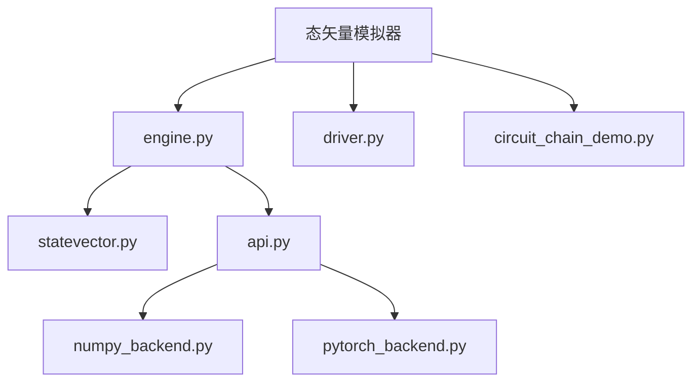
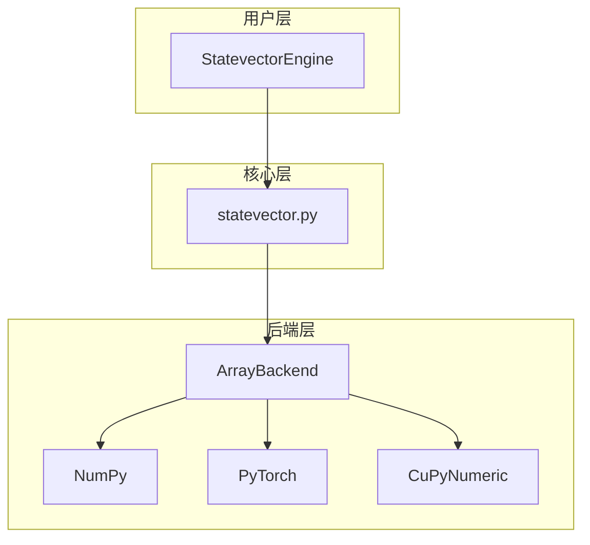
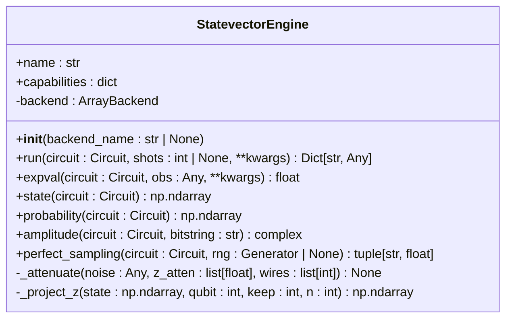
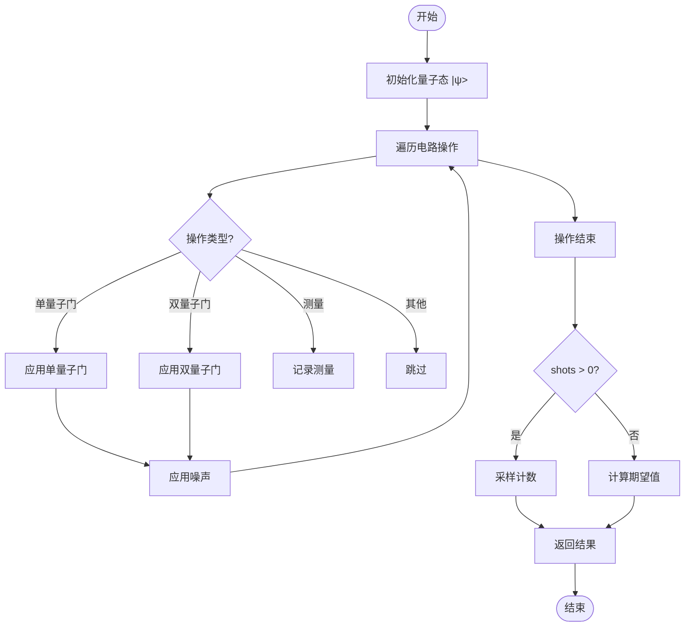
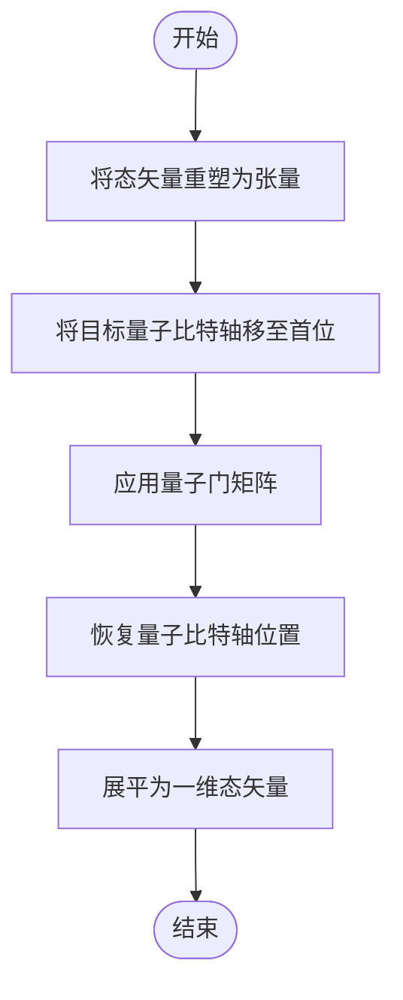
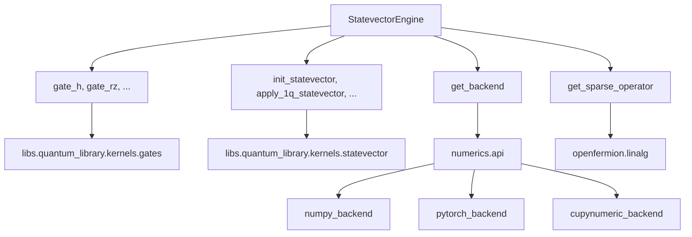

# 态矢量模拟器

<cite>
**本文档中引用的文件**  
- [engine.py](file://src/tyxonq/devices/simulators/statevector/engine.py)
- [statevector.py](file://src/tyxonq/libs/quantum_library/kernels/statevector.py)
- [api.py](file://src/tyxonq/numerics/api.py)
- [numpy_backend.py](file://src/tyxonq/numerics/backends/numpy_backend.py)
- [pytorch_backend.py](file://src/tyxonq/numerics/backends/pytorch_backend.py)
- [driver.py](file://src/tyxonq/devices/simulators/driver.py)
- [circuit_chain_demo.py](file://examples/circuit_chain_demo.py)
</cite>

## 目录
1. [简介](#简介)
2. [项目结构](#项目结构)
3. [核心组件](#核心组件)
4. [架构概述](#架构概述)
5. [详细组件分析](#详细组件分析)
6. [依赖分析](#依赖分析)
7. [性能考量](#性能考量)
8. [故障排除指南](#故障排除指南)
9. [结论](#结论)

## 简介
态矢量模拟器是TyxonQ框架中用于精确全振幅量子态仿真的核心实现。该模拟器通过稠密数组表示量子态，支持量子门作用、测量概率计算和期望值评估。它在无噪声、中小规模电路（通常≤30量子比特）场景下表现出高精度优势，但受限于指数级内存消耗。本文档详细说明其内部实现机制、与数值后端的集成方式以及在链式API调用中的数据传递流程。

## 项目结构
态矢量模拟器位于`src/tyxonq/devices/simulators/statevector/`目录下，其核心实现由`engine.py`文件提供。该模块依赖于`libs/quantum_library/kernels/statevector.py`中的底层核函数，并通过`numerics/api.py`与多种数值后端（如NumPy、PyTorch）进行集成。模拟器通过`devices/simulators/driver.py`统一接口被调用，可在`examples/circuit_chain_demo.py`中找到使用示例。

**Diagram sources**
- [engine.py](file://src/tyxonq/devices/simulators/statevector/engine.py)
- [statevector.py](file://src/tyxonq/libs/quantum_library/kernels/statevector.py)
- [api.py](file://src/tyxonq/numerics/api.py)
- [numpy_backend.py](file://src/tyxonq/numerics/backends/numpy_backend.py)
- [pytorch_backend.py](file://src/tyxonq/numerics/backends/pytorch_backend.py)
- [driver.py](file://src/tyxonq/devices/simulators/driver.py)
- [circuit_chain_demo.py](file://examples/circuit_chain_demo.py)

**Section sources**
- [engine.py](file://src/tyxonq/devices/simulators/statevector/engine.py)
- [statevector.py](file://src/tyxonq/libs/quantum_library/kernels/statevector.py)

## 核心组件
态矢量模拟器的核心是`StatevectorEngine`类，它通过稠密数组表示量子态|ψ>，其大小为2^n（n为量子比特数）。该类实现了量子门作用、测量概率计算和期望值评估等关键功能。模拟器支持h/rz/rx/cx等基本量子门操作，并可通过`use_noise`参数启用噪声模型。数值计算通过统一的`ArrayBackend`接口与NumPy、PyTorch等后端集成。

**Section sources**
- [engine.py](file://src/tyxonq/devices/simulators/statevector/engine.py#L39-L162)
- [statevector.py](file://src/tyxonq/libs/quantum_library/kernels/statevector.py#L0-L54)

## 架构概述
态矢量模拟器采用分层架构设计，上层为`StatevectorEngine`类提供用户接口，中层为`statevector.py`中的核函数实现核心算法，底层通过`ArrayBackend`协议与不同数值后端通信。这种设计实现了计算逻辑与数值实现的解耦，使得模拟器可以无缝切换不同的计算后端。

**Diagram sources**
- [engine.py](file://src/tyxonq/devices/simulators/statevector/engine.py)
- [statevector.py](file://src/tyxonq/libs/quantum_library/kernels/statevector.py)
- [api.py](file://src/tyxonq/numerics/api.py)

## 详细组件分析

### StatevectorEngine分析
`StatevectorEngine`类是态矢量模拟器的主要入口，其`run`方法负责执行量子电路。该方法首先初始化量子态，然后遍历电路中的所有操作，根据操作类型调用相应的量子门函数。对于测量操作，模拟器可以返回采样计数或Z期望值。`expval`方法用于计算任意可观测量的期望值，需要OpenFermion库支持。

#### 类图

**Diagram sources**
- [engine.py](file://src/tyxonq/devices/simulators/statevector/engine.py#L39-L264)

#### 执行流程图

**Diagram sources**
- [engine.py](file://src/tyxonq/devices/simulators/statevector/engine.py#L39-L162)

**Section sources**
- [engine.py](file://src/tyxonq/devices/simulators/statevector/engine.py#L39-L162)
- [engine.py](file://src/tyxonq/devices/simulators/statevector/engine.py#L164-L173)

### 核心算法分析
态矢量模拟器的核心算法实现在`statevector.py`文件中，包括量子态初始化、单/双量子门应用和Z期望值计算。这些函数使用Einstein求和约定（einsum）高效地实现量子门作用，通过张量重排（moveaxis）处理任意量子比特位置的门操作。

#### 算法流程图

**Diagram sources**
- [statevector.py](file://src/tyxonq/libs/quantum_library/kernels/statevector.py#L0-L54)

**Section sources**
- [statevector.py](file://src/tyxonq/libs/quantum_library/kernels/statevector.py#L0-L54)

## 依赖分析
态矢量模拟器依赖于多个模块和外部库。核心依赖包括`libs/quantum_library/kernels`中的量子门核函数和`numerics`中的数值后端。可选依赖包括OpenFermion（用于`expval`方法）和PyTorch/CuPy（用于相应后端支持）。模拟器通过`devices/simulators/driver.py`中的工厂函数被统一调用。

**Diagram sources**
- [engine.py](file://src/tyxonq/devices/simulators/statevector/engine.py)
- [statevector.py](file://src/tyxonq/libs/quantum_library/kernels/statevector.py)
- [api.py](file://src/tyxonq/numerics/api.py)

**Section sources**
- [engine.py](file://src/tyxonq/devices/simulators/statevector/engine.py)
- [statevector.py](file://src/tyxonq/libs/quantum_library/kernels/statevector.py)
- [api.py](file://src/tyxonq/numerics/api.py)

## 性能考量
态矢量模拟器的主要性能瓶颈在于其指数级内存消耗O(2^n)和时间复杂度O(poly(gates)*2^n)。对于n>30的量子电路，内存需求将超过常规计算机的处理能力。优化建议包括：避免重复状态初始化、合理使用缓存机制、选择适当的数值后端（如PyTorch在GPU上可能提供加速），以及在不需要全振幅信息时使用其他模拟器（如矩阵积态模拟器）。

## 故障排除指南
常见问题包括后端导入错误和内存不足。若出现"pytorch backend requested but torch module not importable"错误，请确保已安装PyTorch库。对于内存不足问题，建议减少量子比特数或使用近似模拟器。`expval`方法需要OpenFermion库，若未安装将抛出ImportError。调试时可使用`state`和`probability`等辅助方法检查中间态。

**Section sources**
- [engine.py](file://src/tyxonq/devices/simulators/statevector/engine.py#L164-L173)
- [api.py](file://src/tyxonq/numerics/api.py#L145-L194)

## 结论
态矢量模拟器作为TyxonQ框架中精确量子态仿真的核心组件，通过稠密数组表示和高效的张量运算实现了高精度的量子电路模拟。其模块化设计和统一的数值后端接口使其具有良好的扩展性和灵活性。尽管受限于指数级资源消耗，但在中小规模量子电路的精确模拟中仍具有重要价值。通过合理使用缓存和选择适当的后端，可以在一定程度上优化其性能表现。