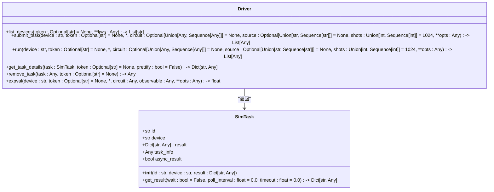
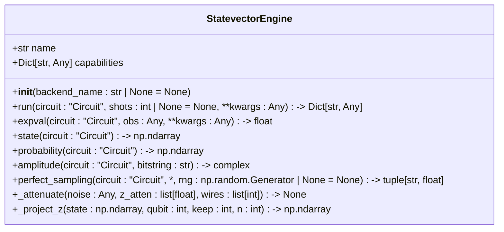
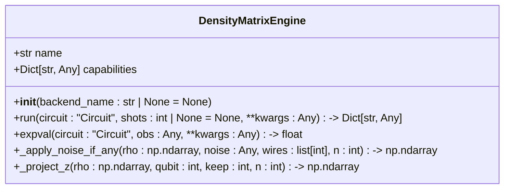
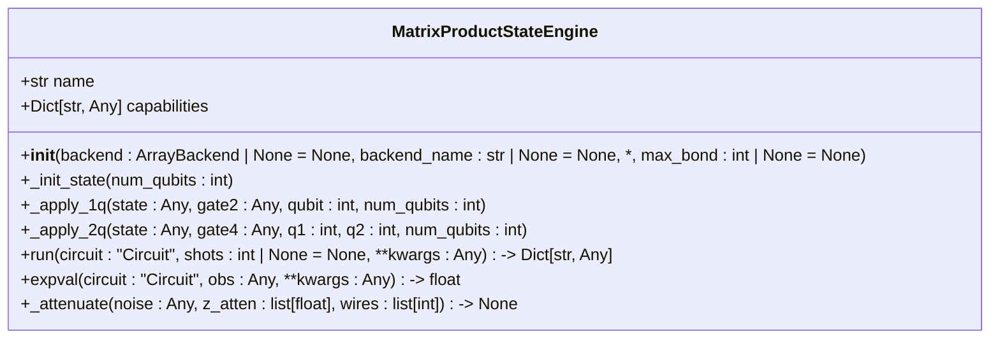
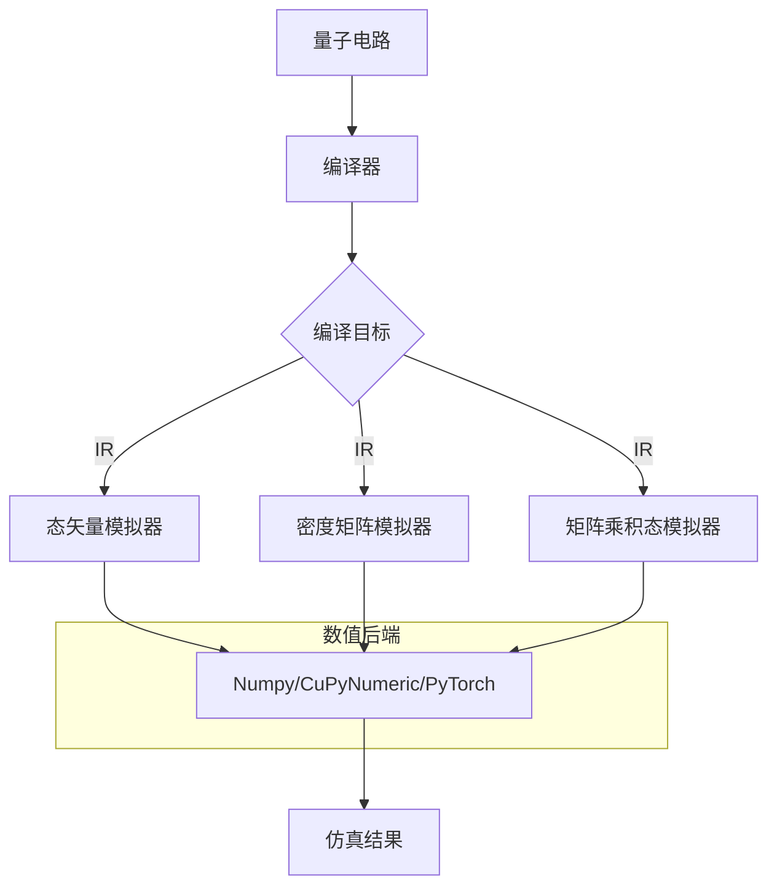
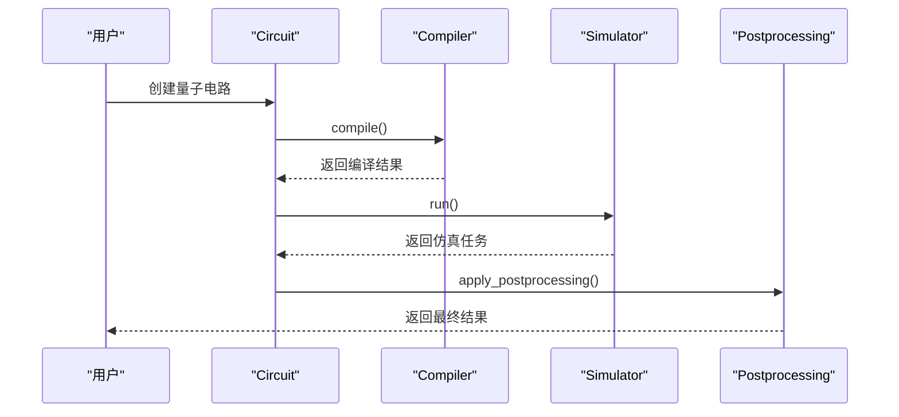

# 模拟器

<cite>
**本文档中引用的文件**  
- [driver.py](file://src/tyxonq/devices/simulators/driver.py)
- [statevector/engine.py](file://src/tyxonq/devices/simulators/statevector/engine.py)
- [density_matrix/engine.py](file://src/tyxonq/devices/simulators/density_matrix/engine.py)
- [matrix_product_state/engine.py](file://src/tyxonq/devices/simulators/matrix_product_state/engine.py)
- [numpy_backend.py](file://src/tyxonq/numerics/backends/numpy_backend.py)
- [cupynumeric_backend.py](file://src/tyxonq/numerics/backends/cupynumeric_backend.py)
- [pytorch_backend.py](file://src/tyxonq/numerics/backends/pytorch_backend.py)
- [api.py](file://src/tyxonq/compiler/api.py)
</cite>

## 目录
1. [简介](#简介)
2. [模拟器驱动接口设计](#模拟器驱动接口设计)
3. [态矢量模拟器](#态矢量模拟器)
4. [密度矩阵模拟器](#密度矩阵模拟器)
5. [矩阵乘积态模拟器](#矩阵乘积态模拟器)
6. [模拟器与编译器及数值后端的协同机制](#模拟器与编译器及数值后端的协同机制)
7. [链式API集成方式](#链式api集成方式)
8. [总结](#总结)

## 简介
模拟器模块是TyxonQ框架中用于本地高性能量子计算仿真的核心组件。它提供了多种类型的量子态模拟能力，包括精确的全振幅模拟、支持噪声通道的混合态模拟以及基于张量网络的大规模系统近似模拟。通过统一的接口设计，用户可以方便地选择不同的模拟器类型来满足特定的仿真需求。本文档将详细介绍模拟器驱动的设计原理、三种主要模拟器类型的实现逻辑及其适用场景，并探讨它们与编译器和数值后端的协同工作机制。

## 模拟器驱动接口设计

模拟器驱动（driver.py）提供了一个统一的接口，用于管理和调用不同类型的模拟器。该接口定义了`run`、`expval`、`submit_task`等关键方法，使得用户可以通过简单的函数调用来执行量子电路仿真任务。



**图示来源**
- [driver.py](file://src/tyxonq/devices/simulators/driver.py#L6-L141)

**本节来源**
- [driver.py](file://src/tyxonq/devices/simulators/driver.py#L6-L141)

### run方法实现逻辑
`run`方法是模拟器驱动的核心入口，负责根据指定的设备参数选择合适的模拟器引擎并执行电路仿真。其调用流程如下：
1. 调用`_qasm_to_ir_if_needed`函数将输入的QASM源码转换为IR电路表示（如果需要）。
2. 使用`_select_engine`函数根据设备名称选择对应的模拟器引擎类。
3. 创建所选引擎的实例。
4. 对于每个输入电路，调用引擎的`run`方法进行仿真，并对输出结果进行标准化处理。
5. 返回包含仿真结果的`SimTask`对象列表。

### expval方法实现逻辑
`expval`方法专门用于计算量子电路在给定可观测量下的解析期望值。其实现逻辑包括：
1. 根据设备名称选择相应的模拟器引擎。
2. 创建引擎实例并调用其`expval`方法执行计算。
3. 返回浮点型的期望值结果。

### submit_task方法实现逻辑
`submit_task`方法作为`run`方法的别名，提供了任务提交的统一接口。它直接调用`run`方法并将结果封装成任务形式返回，便于后续的任务管理与结果获取。

## 态矢量模拟器

态矢量模拟器适用于精确的全振幅量子态模拟，能够完整地表示纯量子态|ψ⟩。该模拟器使用密集的态矢量来存储量子态信息，具有较高的精度但资源消耗随量子比特数呈指数增长。



**图示来源**
- [statevector/engine.py](file://src/tyxonq/devices/simulators/statevector/engine.py#L31-L261)

**本节来源**
- [statevector/engine.py](file://src/tyxonq/devices/simulators/statevector/engine.py#L31-L261)

### 适用场景
- 小规模量子系统的精确模拟（通常不超过30个量子比特）
- 需要获取完整量子态信息的应用
- 无噪声或理想条件下的算法验证

### 性能特征
- 内存复杂度：O(2^n)，其中n为量子比特数
- 时间复杂度：~O(poly(gates)*2^n)
- 支持测量Z基下的期望值计算
- 可选的噪声衰减模型（如去极化噪声）

### 资源消耗
随着量子比特数的增加，内存占用呈指数级增长。例如，模拟30个量子比特需要约16GB内存，而35个量子比特则需要超过500GB内存。

## 密度矩阵模拟器

密度矩阵模拟器用于模拟混合量子态ρ，支持更复杂的噪声通道仿真。与态矢量模拟器相比，它能够处理非纯态和开放量子系统，但计算成本更高。



**图示来源**
- [density_matrix/engine.py](file://src/tyxonq/devices/simulators/density_matrix/engine.py#L31-L205)

**本节来源**
- [density_matrix/engine.py](file://src/tyxonq/devices/simulators/density_matrix/engine.py#L31-L205)

### 适用场景
- 噪声量子系统的仿真研究
- 开放量子系统的动力学模拟
- 混合态量子信息处理

### 性能特征
- 内存复杂度：O(4^n)，远高于态矢量模拟器
- 时间复杂度：~O(poly(gates)*4^n)
- 原生支持Kraus算符形式的噪声通道应用
- 支持多种噪声模型（去极化、振幅阻尼、相位阻尼等）

### 资源消耗
由于需要存储完整的密度矩阵，其资源消耗比态矢量模拟器更加剧烈。对于n个量子比特，需要O(4^n)的内存空间，这限制了其在大规模系统上的应用。

## 矩阵乘积态模拟器

矩阵乘积态（MPS）模拟器基于张量网络理论，通过限制纠缠程度来实现大规模量子系统的高效近似模拟。它特别适合处理低纠缠度的量子态。



**图示来源**
- [matrix_product_state/engine.py](file://src/tyxonq/devices/simulators/matrix_product_state/engine.py#L34-L209)

**本节来源**
- [matrix_product_state/engine.py](file://src/tyxonq/devices/simulators/matrix_product_state/engine.py#L34-L209)

### 适用场景
- 大规模量子系统的近似模拟（超过30个量子比特）
- 低纠缠度量子态的仿真
- 张量网络算法的研究与实现

### 性能特征
- 内存和时间复杂度与最大纠缠维度χ相关，而非2^n
- 可通过`max_bond`参数控制纠缠截断
- 支持SWAP路由的两量子比特门操作
- 测量期望值通过重构态矢量完成

### 资源消耗
相比前两种模拟器，MPS模拟器在处理大规模系统时具有显著优势。其资源消耗主要取决于系统的纠缠程度，对于低纠缠系统，可以在有限内存下模拟数百个量子比特。

## 模拟器与编译器及数值后端的协同机制

模拟器模块与编译器和数值后端紧密协作，形成一个高效的量子计算仿真流水线。



**图示来源**
- [driver.py](file://src/tyxonq/devices/simulators/driver.py#L6-L141)
- [api.py](file://src/tyxonq/compiler/api.py#L0-L65)
- [numerics/backends/*.py](file://src/tyxonq/numerics/backends/)

**本节来源**
- [driver.py](file://src/tyxonq/devices/simulators/driver.py#L6-L141)
- [api.py](file://src/tyxonq/compiler/api.py#L0-L65)
- [numerics/backends/*.py](file://src/tyxonq/numerics/backends/)

### 编译器协同
编译器负责将高级量子电路转换为适合模拟器执行的中间表示（IR）。通过`compile`函数，用户可以指定不同的编译引擎（如qiskit或native）和输出格式（如ir或qasm2），确保电路能够在目标模拟器上正确运行。

### 数值后端协同
模拟器利用统一的数值后端抽象层（ArrayBackend）来执行底层数学运算。目前支持三种后端：
- **NumpyBackend**：基于NumPy的CPU计算
- **CuPyNumericBackend**：基于CuPy的GPU加速计算
- **PyTorchBackend**：基于PyTorch的自动微分与GPU支持

这种设计使得模拟器能够在不同硬件平台上灵活切换，同时保持接口的一致性。

## 链式API集成方式

模拟器模块通过链式API无缝集成到TyxonQ的整体架构中。用户可以通过简洁的链式调用完成从电路构建到结果分析的全过程。



**图示来源**
- [core/ir/circuit.py](file://src/tyxonq/core/ir/circuit.py#L404-L515)
- [devices/base.py](file://src/tyxonq/devices/base.py#L162-L280)

**本节来源**
- [core/ir/circuit.py](file://src/tyxonq/core/ir/circuit.py#L404-L515)
- [devices/base.py](file://src/tyxonq/devices/base.py#L162-L280)

典型的链式调用示例如下：
```python
result = (
    QuantumCircuit()
    .h(0)
    .cx(0, 1)
    .run(device="simulator::statevector", shots=1000)
    .get_counts()
)
```

这种方式不仅提高了代码的可读性和简洁性，还增强了模块间的解耦程度，便于未来的扩展和维护。

## 总结
TyxonQ的模拟器模块提供了一套完整且高效的本地量子计算仿真解决方案。通过统一的驱动接口和多样化的模拟器类型，用户可以根据具体需求选择最适合的仿真策略。态矢量模拟器适用于小规模精确模拟，密度矩阵模拟器支持复杂的噪声通道仿真，而矩阵乘积态模拟器则为大规模系统提供了可行的近似方案。这些模拟器与编译器和数值后端的紧密协作，以及链式API的优雅集成，共同构成了一个强大而灵活的量子计算仿真平台。