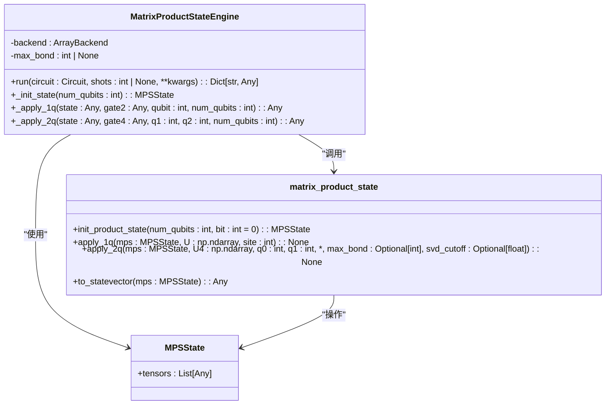
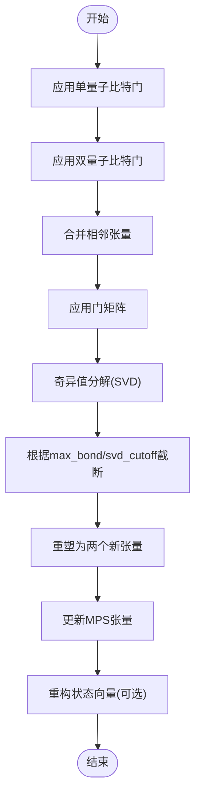
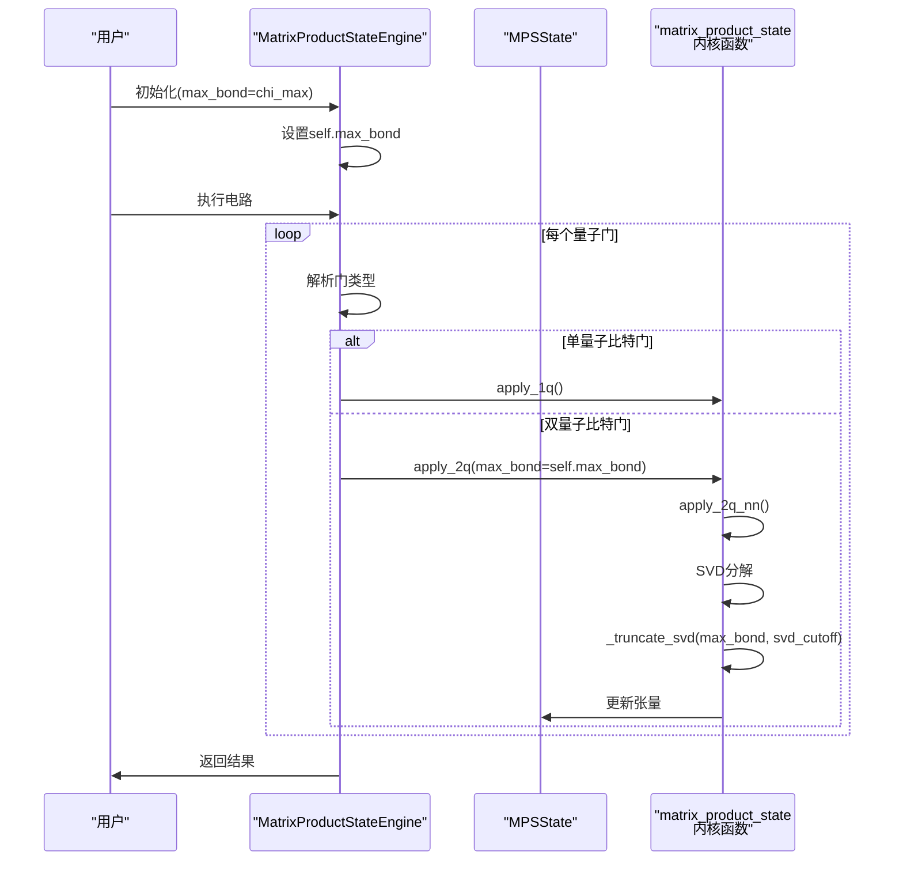
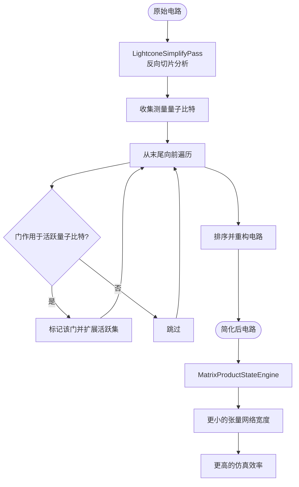

# 矩阵乘积态模拟器

<cite>
**本文档中引用的文件**  
- [engine.py](file://src/tyxonq/devices/simulators/matrix_product_state/engine.py)
- [matrix_product_state.py](file://src/tyxonq/libs/quantum_library/kernels/matrix_product_state.py)
- [lightcone.py](file://src/tyxonq/compiler/stages/simplify/lightcone.py)
- [test_matrix_product_state_truncation.py](file://tests_core_module/test_matrix_product_state_truncation.py)
</cite>

## 目录
1. [简介](#简介)
2. [核心架构与实现原理](#核心架构与实现原理)
3. [MPS引擎的张量网络操作](#mps引擎的张量网络操作)
4. [截断参数与精度性能权衡](#截断参数与精度性能权衡)
5. [与Lightcone简化编译的协同优化](#与lightcone简化编译的协同优化)
6. [典型应用场景与最佳实践](#典型应用场景与最佳实践)
7. [配置示例](#配置示例)
8. [局限性与挑战](#局限性与挑战)
9. [结论](#结论)

## 简介
矩阵乘积态（Matrix Product State, MPS）模拟器是一种高效的量子系统近似仿真工具，特别适用于大规模一维量子系统的模拟。该模拟器基于张量网络表示量子态，通过限制纠缠程度（即截断最大纠缠维度）来显著降低计算复杂度。其内存和时间复杂度主要取决于最大纠缠维度（bond dimension）而非量子比特数的指数增长，因此在处理局部纠缠较强的系统时表现出卓越的性能。

该模拟器支持常见的单量子比特门（如h、rz、rx）和双量子比特门（如cx、cz、cry），并通过SWAP路由机制支持非近邻门操作。测量操作通过重构概率分布实现，支持采样和期望值计算。此外，模拟器可与编译器的lightcone简化阶段协同工作，进一步减少张量网络的有效宽度，提升仿真效率。

**Section sources**
- [engine.py](file://src/tyxonq/devices/simulators/matrix_product_state/engine.py#L1-L212)

## 核心架构与实现原理
MPS模拟器的核心是`MatrixProductStateEngine`类，它实现了基于矩阵乘积态的量子态表示和演化。量子态被表示为一系列张量的乘积，每个张量对应一个量子比特，其形状为（Dl, 2, Dr），其中Dl和Dr分别为左右纠缠维度，2为物理维度（对应|0⟩和|1⟩）。

初始态通过`init_product_state`函数创建，通常为全零态|0...0⟩，此时所有纠缠维度为1。单量子比特门通过`apply_1q`函数直接作用于对应位置的张量，而双量子比特门则通过`apply_2q`函数实现。对于非近邻门，系统会自动插入SWAP门进行路由，确保门作用在相邻量子比特上。



**Diagram sources**
- [engine.py](file://src/tyxonq/devices/simulators/matrix_product_state/engine.py#L34-L209)
- [matrix_product_state.py](file://src/tyxonq/libs/quantum_library/kernels/matrix_product_state.py#L36-L59)

**Section sources**
- [engine.py](file://src/tyxonq/devices/simulators/matrix_product_state/engine.py#L34-L209)
- [matrix_product_state.py](file://src/tyxonq/libs/quantum_library/kernels/matrix_product_state.py#L46-L59)

## MPS引擎的张量网络操作
MPS引擎通过一系列张量操作来实现量子门的应用和状态演化。核心操作包括单量子比特门应用、双量子比特门应用以及状态向量重构。

单量子比特门应用通过einsum操作实现，将门矩阵与对应位置的MPS张量进行缩并，更新该位置的张量。双量子比特门应用更为复杂，首先将两个相邻的MPS张量合并成一个大张量，然后应用门操作，最后通过奇异值分解（SVD）将大张量重新分解为两个张量，并根据截断参数裁剪奇异值，从而控制纠缠维度的增长。

状态向量重构通过依次缩并所有MPS张量实现，最终得到完整的2^n维状态向量。此操作仅用于小规模系统或测试目的，因为其复杂度为指数级。



**Diagram sources**
- [matrix_product_state.py](file://src/tyxonq/libs/quantum_library/kernels/matrix_product_state.py#L62-L69)
- [matrix_product_state.py](file://src/tyxonq/libs/quantum_library/kernels/matrix_product_state.py#L175-L200)
- [matrix_product_state.py](file://src/tyxonq/libs/quantum_library/kernels/matrix_product_state.py#L203-L223)

**Section sources**
- [matrix_product_state.py](file://src/tyxonq/libs/quantum_library/kernels/matrix_product_state.py#L62-L223)

## 截断参数与精度性能权衡
MPS模拟器通过截断参数控制精度与性能的权衡。主要参数为`max_bond`（最大纠缠维度）和`svd_cutoff`（奇异值截断阈值）。

`max_bond`是一个硬性上限，限制了任意两个量子比特之间的最大纠缠维度。当SVD分解后的新维度超过`max_bond`时，系统会截断至该值，从而牺牲精度以换取计算效率。`svd_cutoff`则基于奇异值的大小进行截断，仅保留大于阈值的奇异值，这可以更精细地控制信息损失。

在`MatrixProductStateEngine`的初始化中，`max_bond`参数被传递给`apply_2q`函数，用于控制每次双量子比特门应用后的纠缠增长。测试用例`test_compressed_state_engine_max_bond_option_smoke`验证了`max_bond`参数的有效性，当设置为1时，系统强制保持最小纠缠，适用于高度局域化的系统。



**Diagram sources**
- [engine.py](file://src/tyxonq/devices/simulators/matrix_product_state/engine.py#L45-L50)
- [matrix_product_state.py](file://src/tyxonq/libs/quantum_library/kernels/matrix_product_state.py#L175-L200)
- [test_matrix_product_state_truncation.py](file://tests_core_module/test_matrix_product_state_truncation.py#L6-L13)

**Section sources**
- [engine.py](file://src/tyxonq/devices/simulators/matrix_product_state/engine.py#L45-L50)
- [matrix_product_state.py](file://src/tyxonq/libs/quantum_library/kernels/matrix_product_state.py#L175-L200)
- [test_matrix_product_state_truncation.py](file://tests_core_module/test_matrix_product_state_truncation.py#L6-L13)

## 与Lightcone简化编译的协同优化
MPS模拟器可与编译器的lightcone简化阶段协同优化，进一步提升仿真效率。`LightconeSimplifyPass`编译阶段通过反向切片分析，仅保留对测量结果有影响的量子门操作，从而减少张量网络的有效宽度。

该过程从测量量子比特开始，反向遍历电路，收集所有直接影响测量结果的门操作。对于纠缠门（如cx、cz），其影响会传播到所有参与的量子比特，从而扩大“光锥”范围。最终，只有位于光锥内的门操作被保留，其余门被移除。这不仅减少了计算量，还降低了MPS的纠缠维度增长，使得`max_bond`参数更有效。



**Diagram sources**
- [lightcone.py](file://src/tyxonq/compiler/stages/simplify/lightcone.py#L9-L95)

**Section sources**
- [lightcone.py](file://src/tyxonq/compiler/stages/simplify/lightcone.py#L9-L95)

## 典型应用场景与最佳实践
MPS模拟器特别适用于以下场景：
- **一维近邻耦合电路**：如一维自旋链、量子行走等，其纠缠结构天然适合MPS表示。
- **浅层变分量子算法（VQA）**：如浅层QAOA、VQE，其电路深度有限，纠缠程度较低。
- **含局部纠缠的量子动力学模拟**：如局域哈密顿量的时间演化，纠缠传播速度有限。

**最佳实践建议**：
1. **H链模拟**：对于氢链（H-chain）等化学系统，建议从较小的`max_bond`（如16或32）开始，逐步增加以观察能量收敛情况。
2. **参数设置**：结合`max_bond`和`svd_cutoff`（如1e-8）进行双重控制，以平衡精度和性能。
3. **电路设计**：尽量减少长程纠缠操作，优先使用近邻门和局部电路结构。
4. **验证**：对于关键结果，建议与全振幅模拟器进行小规模对比验证。

**Section sources**
- [examples/hchainhamiltonian.py](file://examples/hchainhamiltonian.py)
- [examples-ng/vqe_extra_mpo.py](file://examples-ng/vqe_extra_mpo.py)

## 配置示例
启用MPS模拟器并设置截断参数的典型配置如下：

```python
# 创建MPS模拟器，设置最大纠缠维度为64
engine = MatrixProductStateEngine(max_bond=64)

# 或通过设备配置
device = {
    'name': 'matrix_product_state',
    'options': {
        'max_bond': 64,
        'backend': 'numpy'  # 或 'pytorch', 'cupynumeric'
    }
}

# 在运行电路时指定
result = engine.run(circuit, shots=1000, use_noise=False)
```

此配置将模拟器的最大纠缠维度限制为64，适用于中等规模的量子系统仿真。

**Section sources**
- [engine.py](file://src/tyxonq/devices/simulators/matrix_product_state/engine.py#L45-L50)

## 局限性与挑战
尽管MPS模拟器在处理低纠缠系统时非常高效，但在面对高纠缠电路时存在精度退化问题。当量子电路产生全局纠缠（如深度随机电路或量子傅里叶变换）时，MPS的纠缠维度会迅速增长至指数级，导致截断误差累积，仿真结果失真。

此外，MPS表示对量子比特的排序敏感，非局域的量子比特映射可能导致纠缠维度异常增长。因此，在使用MPS模拟器时，需谨慎评估电路的纠缠特性，并结合其他验证手段确保结果可靠性。

**Section sources**
- [engine.py](file://src/tyxonq/devices/simulators/matrix_product_state/engine.py#L1-L212)

## 结论
矩阵乘积态模拟器是一种强大的量子系统近似仿真工具，通过张量网络和截断技术实现了对大规模一维量子系统的高效模拟。其与lightcone简化编译阶段的协同优化进一步提升了仿真效率。在合理设置`max_bond`和`svd_cutoff`参数的前提下，该模拟器在H链模拟、浅层VQA等场景中表现出色。然而，用户需注意其在高纠缠电路中的局限性，并结合具体应用场景选择合适的配置和验证策略。