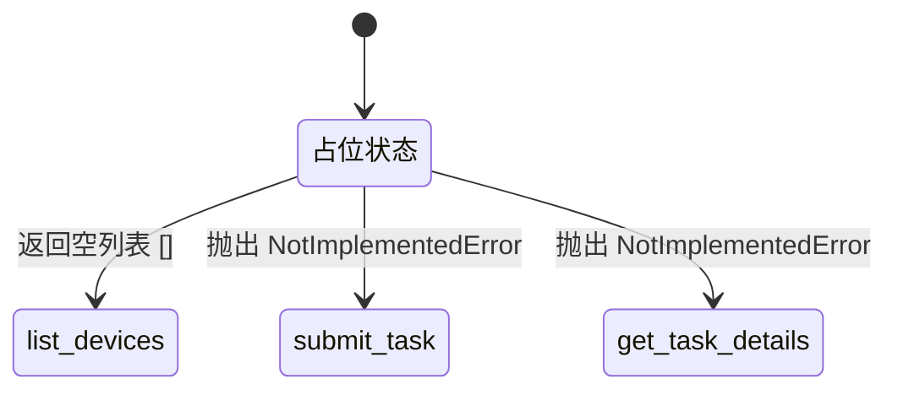
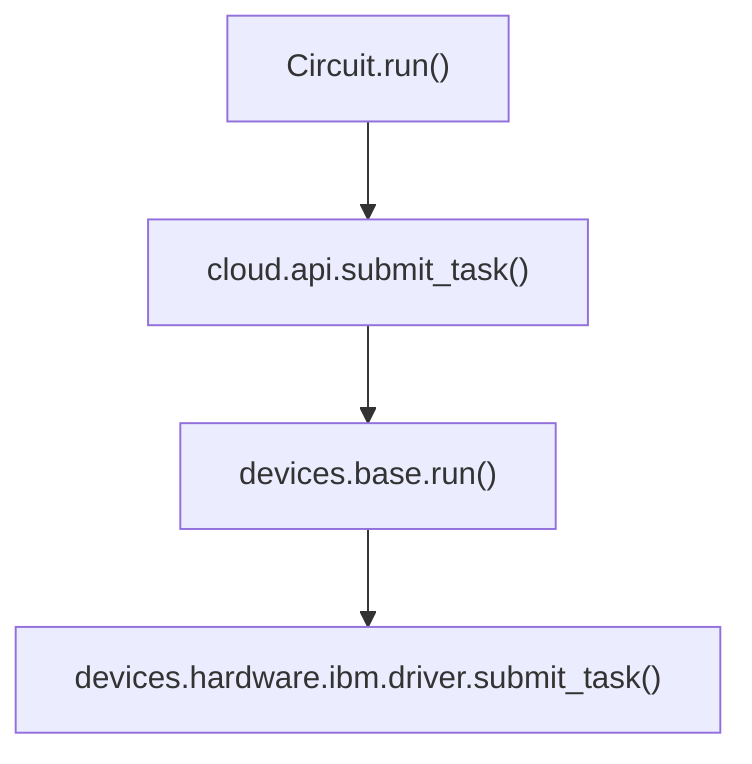

# IBM 硬件驱动

<cite>
**本文档中引用的文件**  
- [driver.py](file://src/tyxonq/devices/hardware/ibm/driver.py)
- [api.py](file://src/tyxonq/cloud/api.py)
- [base.py](file://src/tyxonq/devices/base.py)
- [circuit.py](file://src/tyxonq/core/ir/circuit.py)
</cite>

## 目录
1. [简介](#简介)
2. [核心接口规范](#核心接口规范)
3. [当前实现状态](#当前实现状态)
4. [API一致性设计](#api一致性设计)
5. [未来集成路线图](#未来集成路线图)
6. [接口兼容性说明](#接口兼容性说明)
7. [结论](#结论)

## 简介
IBM 硬件驱动模块为 TyxonQ 框架提供了与 IBM 量子硬件集成的骨架结构。该驱动目前处于占位状态，旨在定义统一的接口规范，为未来通过 Qiskit 适配器实现完整功能奠定基础。本驱动的设计目标是确保上层应用在功能完整实现后能够无缝切换，无需修改调用代码。

**Section sources**
- [driver.py](file://src/tyxonq/devices/hardware/ibm/driver.py#L1-L39)

## 核心接口规范
该驱动定义了与云服务 API 交互所需的核心接口方法，确保与框架其他部分的统一性。

### list_devices 方法
此方法用于获取可用的 IBM 量子设备列表。

- **参数**:
  - `token` (可选[str]): 用于身份验证的访问令牌。
  - `**kws` (Any): 其他可选关键字参数。
- **返回值**: `List[str]` - 设备标识符字符串列表。
- **预期行为**: 当前返回空列表。未来将通过 Qiskit Providers 查询并返回实际的设备列表。

### submit_task 方法
此方法用于向指定的 IBM 量子设备提交量子任务。

- **参数**:
  - `device` (str): 目标设备的名称或标识符。
  - `token` (可选[str]): 用于身份验证的访问令牌。
  - `circuit` (可选[Union[Any, Sequence[Any]]]): 要执行的量子电路（TyxonQ IR 或兼容格式）。
  - `source` (可选[Union[str, Sequence[str]]]): 可选的源代码（如 QASM 字符串）。
  - `shots` (Union[int, Sequence[int]]): 采样次数，默认为 1024。
  - `**opts` (Any): 其他任务选项。
- **返回值**: `List[Any]` - 任务句柄列表。
- **预期行为**: 当前抛出 `NotImplementedError`。未来将通过 Qiskit Runtime 服务提交任务。

### get_task_details 方法
此方法用于查询已提交任务的详细信息和状态。

- **参数**:
  - `task` (Any): 任务句柄。
  - `token` (可选[str]): 用于身份验证的访问令牌。
  - `prettify` (bool): 是否美化输出结果。
- **返回值**: `Dict[str, Any]` - 包含任务详细信息的字典。
- **预期行为**: 当前抛出 `NotImplementedError`。未来将通过 Qiskit Runtime 查询任务状态和结果。

**Section sources**
- [driver.py](file://src/tyxonq/devices/hardware/ibm/driver.py#L20-L38)

## 当前实现状态
IBM 硬件驱动目前是一个占位实现，所有核心功能均未激活。

**Diagram sources**
- [driver.py](file://src/tyxonq/devices/hardware/ibm/driver.py#L20-L38)

**Section sources**
- [driver.py](file://src/tyxonq/devices/hardware/ibm/driver.py#L1-L39)

## API一致性设计
为了保持 API 的一致性，`run` 函数被设计为 `submit_task` 的代理。

**Diagram sources**
- [circuit.py](file://src/tyxonq/core/ir/circuit.py#L404-L515)
- [api.py](file://src/tyxonq/cloud/api.py#L78-L98)
- [base.py](file://src/tyxonq/devices/base.py#L270-L388)
- [driver.py](file://src/tyxonq/devices/hardware/ibm/driver.py#L25-L38)

如上图所示，从 `Circuit.run()` 到最终的硬件驱动调用，整个调用链通过 `submit_task` 进行统一。`run` 函数直接代理到 `submit_task`，确保了无论通过 `run` 还是 `submit_task` 调用，其底层行为和参数处理逻辑完全一致。

**Section sources**
- [driver.py](file://src/tyxonq/devices/hardware/ibm/driver.py#L22-L24)
- [circuit.py](file://src/tyxonq/core/ir/circuit.py#L539-L550)

## 未来集成路线图
以下是实现完整功能的建议路线图。

### 1. 集成 Qiskit Providers
- **目标**: 实现 `list_devices` 方法。
- **步骤**:
  1. 在 `list_devices` 函数中导入 `qiskit.providers`。
  2. 使用提供的 `token` 创建 `IBMQProvider` 实例。
  3. 调用 `provider.backends()` 获取后端列表。
  4. 过滤并返回可用的量子设备名称。

### 2. 集成 Qiskit Runtime
- **目标**: 实现 `submit_task` 和 `get_task_details` 方法。
- **步骤**:
  1. 在 `submit_task` 中，将 TyxonQ IR 电路通过 `qiskit_compiler` 转换为 Qiskit 的 `QuantumCircuit`。
  2. 使用 `qiskit_ibm_runtime` 模块中的 `QiskitRuntimeService` 和 `Sampler` 或 `Estimator` 原语提交任务。
  3. 返回 `RuntimeJob` 句柄作为任务标识符。
  4. 在 `get_task_details` 中，接收 `RuntimeJob` 句柄，调用其 `result()` 方法获取结果，并将其格式化为框架期望的字典结构。

**Section sources**
- [driver.py](file://src/tyxonq/devices/hardware/ibm/driver.py#L20-L38)
- [qiskit_compiler.py](file://src/tyxonq/compiler/compile_engine/qiskit/qiskit_compiler.py#L22-L76)

## 接口兼容性说明
本驱动的设计确保了上层应用的无缝迁移。

- **参数签名兼容**: `list_devices`, `submit_task`, `get_task_details` 的参数签名与框架的云 API (`cloud.api`) 严格对齐。
- **返回类型兼容**: 所有方法的返回类型（`List[str]`, `List[Any]`, `Dict[str, Any]`）与框架其他硬件驱动保持一致。
- **错误处理兼容**: 抛出的 `NotImplementedError` 是 Python 内置异常，上层应用可以捕获并处理，为未来实现提供了清晰的升级路径。
- **代理模式兼容**: `run` 函数作为 `submit_task` 的代理，保证了现有调用 `run` 的代码在功能实现后无需任何修改。

**Section sources**
- [driver.py](file://src/tyxonq/devices/hardware/ibm/driver.py#L1-L39)
- [api.py](file://src/tyxonq/cloud/api.py#L1-L123)

## 结论
IBM 硬件驱动当前作为一个骨架结构，成功定义了与 IBM 量子硬件交互所需的统一接口。通过将核心功能抛出 `NotImplementedError`，它明确标识了待实现的部分。`run` 函数对 `submit_task` 的代理设计保证了 API 的一致性。未来的集成应通过 Qiskit Providers 和 Qiskit Runtime 服务来填充这些占位符，实现完整的功能。由于接口设计的兼容性，一旦实现，上层应用将能够无缝切换到完整的 IBM 硬件支持，而无需修改现有代码。