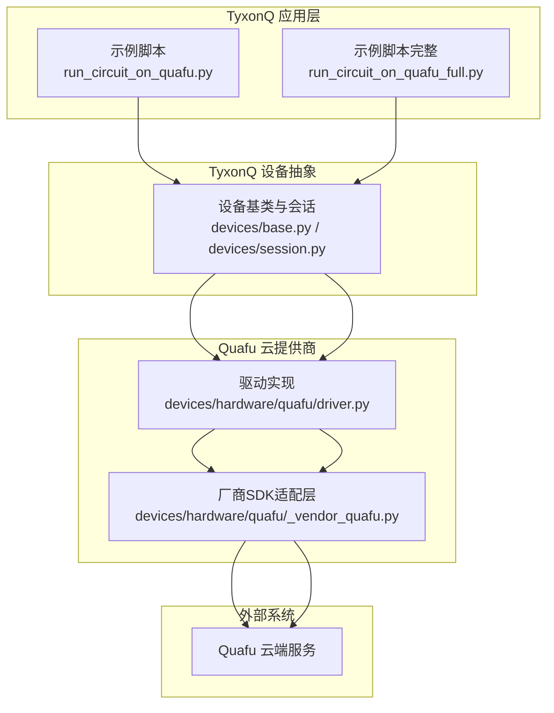
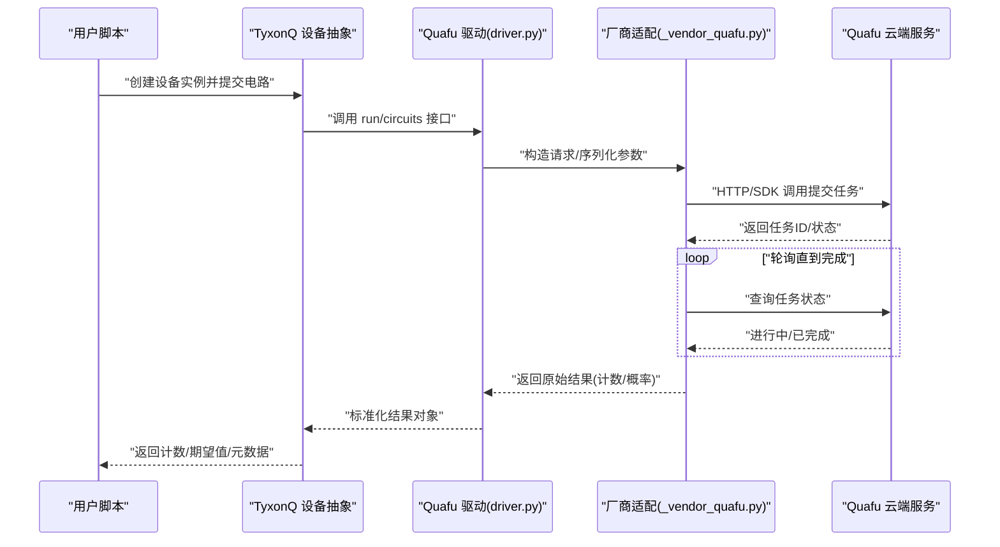
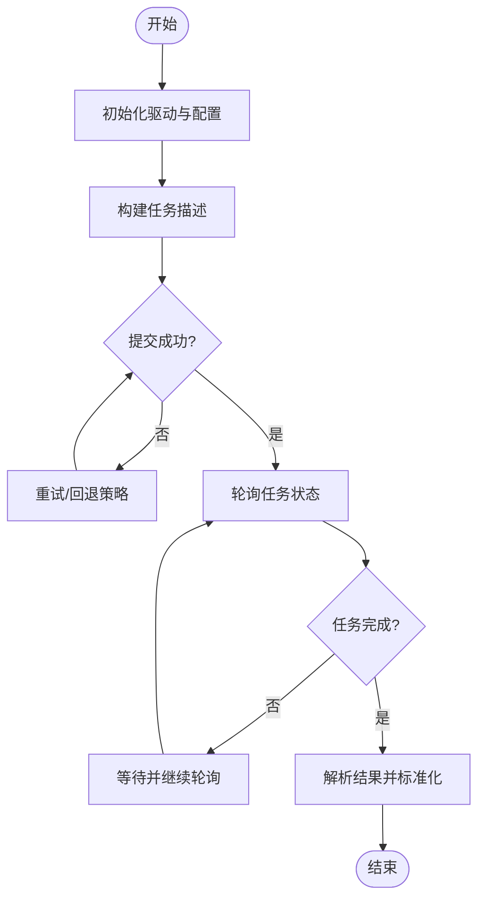
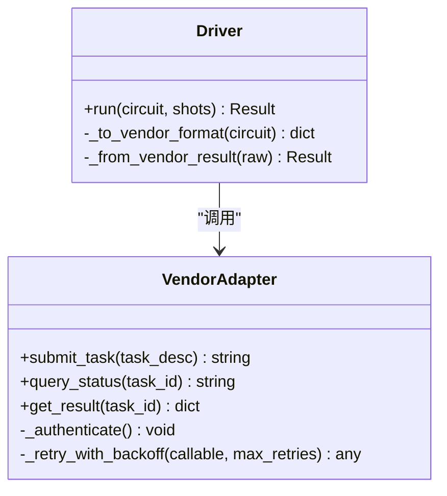
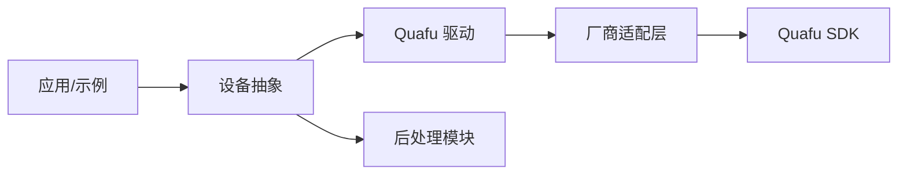

# Quafu云提供商

<cite>
**本文引用的文件**
- [src/tyxonq/devices/hardware/quafu/driver.py](file://src/tyxonq/devices/hardware/quafu/driver.py)
- [src/tyxonq/devices/hardware/quafu/_vendor_quafu.py](file://src/tyxonq/devices/hardware/quafu/_vendor_quafu.py)
- [examples/run_circuit_on_quafu.py](file://examples/run_circuit_on_quafu.py)
- [examples/run_circuit_on_quafu_full.py](file://examples/run_circuit_on_quafu_full.py)
- [tests_core_module/test_quafu_driver.py](file://tests_core_module/test_quafu_driver.py)
- [tests_core_module/test_quafu_chain_api.py](file://tests_core_module/test_quafu_chain_api.py)
- [tests_core_module/test_quafu_live.py](file://tests_core_module/test_quafu_live.py)
- [tests_core_module/test_quafu_vendor_parity.py](file://tests_core_module/test_quafu_vendor_parity.py)
- [docs/quafu_provider.md](file://docs/quafu_provider.md)
</cite>

## 目录
1. [简介](#简介)
2. [项目结构](#项目结构)
3. [核心组件](#核心组件)
4. [架构总览](#架构总览)
5. [详细组件分析](#详细组件分析)
6. [依赖关系分析](#依赖关系分析)
7. [性能与可靠性考虑](#性能与可靠性考虑)
8. [故障排查指南](#故障排查指南)
9. [结论](#结论)
10. [附录](#附录)

## 简介
本章节面向使用 TyxonQ 接入 Quafu 云平台执行量子电路的用户与开发者，系统性说明 Quafu 云提供商在 TyxonQ 中的集成方式、数据流、关键接口与最佳实践。文档聚焦于设备驱动层如何封装厂商 SDK、如何将 TyxonQ 的电路 IR 编译并下发至 Quafu 云端执行、以及结果回传与后处理的流程。同时提供示例与测试用例路径，便于快速上手与问题定位。

## 项目结构
Quafu 云提供商相关代码主要位于硬件设备驱动的 quafu 子模块中，并通过 TyxonQ 的设备抽象统一暴露给上层编译器与运行器。示例脚本展示了端到端的使用方式，测试覆盖了驱动行为、链式 API、在线执行与厂商一致性等场景。

图表来源
- [src/tyxonq/devices/hardware/quafu/driver.py](file://src/tyxonq/devices/hardware/quafu/driver.py)
- [src/tyxonq/devices/hardware/quafu/_vendor_quafu.py](file://src/tyxonq/devices/hardware/quafu/_vendor_quafu.py)
- [examples/run_circuit_on_quafu.py](file://examples/run_circuit_on_quafu.py)
- [examples/run_circuit_on_quafu_full.py](file://examples/run_circuit_on_quafu_full.py)

章节来源
- [src/tyxonq/devices/hardware/quafu/driver.py](file://src/tyxonq/devices/hardware/quafu/driver.py)
- [src/tyxonq/devices/hardware/quafu/_vendor_quafu.py](file://src/tyxonq/devices/hardware/quafu/_vendor_quafu.py)
- [examples/run_circuit_on_quafu.py](file://examples/run_circuit_on_quafu.py)
- [examples/run_circuit_on_quafu_full.py](file://examples/run_circuit_on_quafu_full.py)

## 核心组件
- 设备驱动（driver.py）：实现 TyxonQ 设备接口，负责将 TyxonQ 电路 IR 转换为 Quafu 可接受的格式，管理任务提交、轮询状态与结果获取。
- 厂商适配层（_vendor_quafu.py）：封装 Quafu 官方 SDK 调用细节，屏蔽版本差异与网络协议细节，向上提供稳定接口。
- 示例脚本：演示从构建电路到提交任务、等待完成、读取计数与期望值的完整流程。
- 测试套件：覆盖驱动行为、链式 API、在线执行与厂商一致性校验，确保驱动在不同环境下的稳定性。

章节来源
- [src/tyxonq/devices/hardware/quafu/driver.py](file://src/tyxonq/devices/hardware/quafu/driver.py)
- [src/tyxonq/devices/hardware/quafu/_vendor_quafu.py](file://src/tyxonq/devices/hardware/quafu/_vendor_quafu.py)
- [examples/run_circuit_on_quafu.py](file://examples/run_circuit_on_quafu.py)
- [examples/run_circuit_on_quafu_full.py](file://examples/run_circuit_on_quafu_full.py)
- [tests_core_module/test_quafu_driver.py](file://tests_core_module/test_quafu_driver.py)
- [tests_core_module/test_quafu_chain_api.py](file://tests_core_module/test_quafu_chain_api.py)
- [tests_core_module/test_quafu_live.py](file://tests_core_module/test_quafu_live.py)
- [tests_core_module/test_quafu_vendor_parity.py](file://tests_core_module/test_quafu_vendor_parity.py)

## 架构总览
下图展示从用户脚本到 Quafu 云端执行的端到端序列，包括编译、转换、提交、轮询与结果处理。

图表来源
- [src/tyxonq/devices/hardware/quafu/driver.py](file://src/tyxonq/devices/hardware/quafu/driver.py)
- [src/tyxonq/devices/hardware/quafu/_vendor_quafu.py](file://src/tyxonq/devices/hardware/quafu/_vendor_quafu.py)
- [examples/run_circuit_on_quafu.py](file://examples/run_circuit_on_quafu.py)
- [examples/run_circuit_on_quafu_full.py](file://examples/run_circuit_on_quafu_full.py)

## 详细组件分析

### 设备驱动（driver.py）
- 职责
  - 接收 TyxonQ 电路 IR，进行必要的格式转换与参数校验。
  - 管理任务生命周期：提交、轮询、重试、取消。
  - 将云端返回的原始结果标准化为 TyxonQ 内部数据结构，供后续后处理使用。
- 关键流程
  - 初始化：加载配置（如 token、目标设备、并发限制）。
  - 提交任务：将 IR 转为 Quafu 可接受的任务描述，调用厂商适配层。
  - 轮询与重试：基于指数退避策略检查任务状态，处理瞬态错误。
  - 结果解析：将计数/概率映射为 TyxonQ 标准格式，附带元数据（如噪声模型、校准信息）。
- 错误处理
  - 网络异常：自动重试与超时控制。
  - 任务失败：记录错误码与消息，支持诊断输出。
  - 参数校验：对无效电路或非法参数提前报错，减少无效请求。

图表来源
- [src/tyxonq/devices/hardware/quafu/driver.py](file://src/tyxonq/devices/hardware/quafu/driver.py)

章节来源
- [src/tyxonq/devices/hardware/quafu/driver.py](file://src/tyxonq/devices/hardware/quafu/driver.py)

### 厂商适配层（_vendor_quafu.py）
- 职责
  - 封装 Quafu 官方 SDK 的调用细节，包括认证、请求构造、响应解析。
  - 屏蔽不同版本 SDK 的差异，提供稳定的内部接口。
  - 处理网络层异常、限流与重试逻辑。
- 关键接口
  - 任务提交：将 TyxonQ 任务描述转换为 SDK 所需格式。
  - 状态查询：根据任务 ID 查询执行状态。
  - 结果获取：拉取最终结果并反序列化为中间格式。
- 兼容性
  - 通过版本探测与特性开关，兼容不同 SDK 版本。
  - 提供最小权限的访问令牌与资源隔离策略。

图表来源
- [src/tyxonq/devices/hardware/quafu/_vendor_quafu.py](file://src/tyxonq/devices/hardware/quafu/_vendor_quafu.py)
- [src/tyxonq/devices/hardware/quafu/driver.py](file://src/tyxonq/devices/hardware/quafu/driver.py)

章节来源
- [src/tyxonq/devices/hardware/quafu/_vendor_quafu.py](file://src/tyxonq/devices/hardware/quafu/_vendor_quafu.py)
- [src/tyxonq/devices/hardware/quafu/driver.py](file://src/tyxonq/devices/hardware/quafu/driver.py)

### 示例脚本
- run_circuit_on_quafu.py：最小化示例，展示如何构建电路、选择 Quafu 设备、提交任务并读取计数。
- run_circuit_on_quafu_full.py：更完整的流程，包含期望值计算、误差缓解、结果可视化与元数据保存。

使用建议
- 优先使用链式 API，减少样板代码。
- 合理设置 shot 数与重试次数，平衡精度与耗时。
- 利用后处理模块进行读误校正与统计聚合。

章节来源
- [examples/run_circuit_on_quafu.py](file://examples/run_circuit_on_quafu.py)
- [examples/run_circuit_on_quafu_full.py](file://examples/run_circuit_on_quafu_full.py)

### 测试套件
- test_quafu_driver.py：验证驱动的核心行为，包括参数校验、结果标准化与错误路径。
- test_quafu_chain_api.py：端到端链式 API 测试，确保从电路构建到结果获取的完整性。
- test_quafu_live.py：在线执行测试，连接真实云端服务，验证任务提交与轮询。
- test_quafu_vendor_parity.py：与厂商 SDK 的行为对比测试，确保结果一致性与兼容性。

章节来源
- [tests_core_module/test_quafu_driver.py](file://tests_core_module/test_quafu_driver.py)
- [tests_core_module/test_quafu_chain_api.py](file://tests_core_module/test_quafu_chain_api.py)
- [tests_core_module/test_quafu_live.py](file://tests_core_module/test_quafu_live.py)
- [tests_core_module/test_quafu_vendor_parity.py](file://tests_core_module/test_quafu_vendor_parity.py)

## 依赖关系分析
- 内部依赖
  - 设备抽象层：TyxonQ 的设备基类与会话管理，统一接口与资源调度。
  - 编译器与阶段：将电路 IR 转换为 Quafu 可接受的格式，可能涉及门集分解、布局优化与调度。
  - 后处理模块：对原始计数进行期望值计算、误差缓解与指标统计。
- 外部依赖
  - Quafu 官方 SDK：用于认证、任务提交与结果获取。
  - 网络库：处理 HTTP/REST 调用与超时、重试。
- 耦合与内聚
  - 驱动与厂商适配层解耦，便于替换或升级 SDK。
  - 示例脚本仅依赖高层 API，降低使用复杂度。

图表来源
- [src/tyxonq/devices/hardware/quafu/driver.py](file://src/tyxonq/devices/hardware/quafu/driver.py)
- [src/tyxonq/devices/hardware/quafu/_vendor_quafu.py](file://src/tyxonq/devices/hardware/quafu/_vendor_quafu.py)
- [examples/run_circuit_on_quafu.py](file://examples/run_circuit_on_quafu.py)

章节来源
- [src/tyxonq/devices/hardware/quafu/driver.py](file://src/tyxonq/devices/hardware/quafu/driver.py)
- [src/tyxonq/devices/hardware/quafu/_vendor_quafu.py](file://src/tyxonq/devices/hardware/quafu/_vendor_quafu.py)
- [examples/run_circuit_on_quafu.py](file://examples/run_circuit_on_quafu.py)

## 性能与可靠性考虑
- 任务批处理：合并相似任务以减少网络往返，提高吞吐。
- 自适应重试：基于错误类型与负载情况动态调整重试间隔与次数。
- 结果缓存：对相同电路与参数的结果进行本地缓存，避免重复执行。
- 资源配额：遵循云端服务的并发与速率限制，防止被限流。
- 监控与日志：记录关键指标（延迟、成功率、错误码），便于容量规划与问题定位。

[本节为通用指导，不直接分析具体文件]

## 故障排查指南
- 认证失败
  - 检查令牌有效期与权限范围。
  - 确认网络可达与代理设置。
- 任务提交失败
  - 查看错误码与消息，判断是否参数非法或资源不足。
  - 尝试缩小电路规模或减少 shot 数。
- 轮询超时
  - 增加超时阈值与重试次数。
  - 检查云端服务状态与队列长度。
- 结果不一致
  - 对比厂商 SDK 的直接调用结果，定位差异点。
  - 检查随机种子与测量顺序。

章节来源
- [tests_core_module/test_quafu_driver.py](file://tests_core_module/test_quafu_driver.py)
- [tests_core_module/test_quafu_live.py](file://tests_core_module/test_quafu_live.py)
- [tests_core_module/test_quafu_vendor_parity.py](file://tests_core_module/test_quafu_vendor_parity.py)

## 结论
TyxonQ 的 Quafu 云提供商通过清晰的驱动与厂商适配层分离，实现了高内聚、低耦合的云端执行能力。借助示例与完善的测试套件，用户可以快速上手并可靠地执行量子任务。建议在工程实践中结合批处理、重试与缓存策略，以获得更好的性能与稳定性。

[本节为总结性内容，不直接分析具体文件]

## 附录
- 快速入门
  - 参考示例脚本，逐步构建电路并提交任务。
  - 使用链式 API 简化常见操作。
- 进阶用法
  - 自定义后处理流程，集成误差缓解与指标计算。
  - 结合编译器优化阶段，提升执行效率。
- 参考文档
  - 提供商说明文档：docs/quafu_provider.md

章节来源
- [docs/quafu_provider.md](file://docs/quafu_provider.md)
- [examples/run_circuit_on_quafu.py](file://examples/run_circuit_on_quafu.py)
- [examples/run_circuit_on_quafu_full.py](file://examples/run_circuit_on_quafu_full.py)