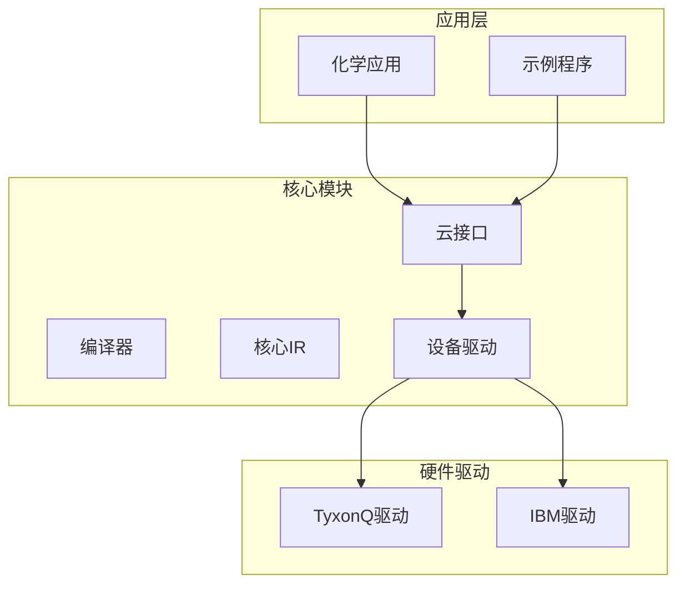
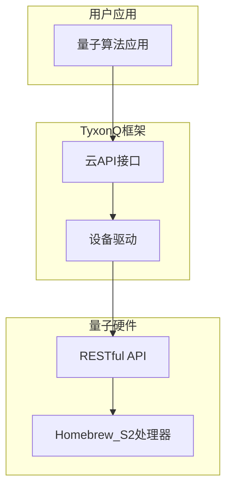
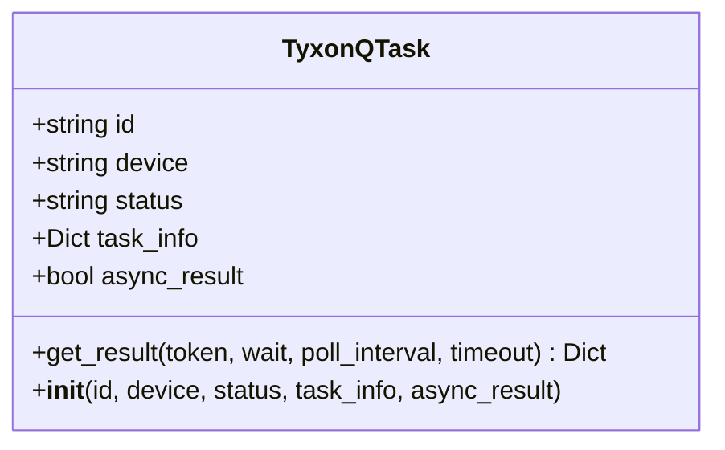
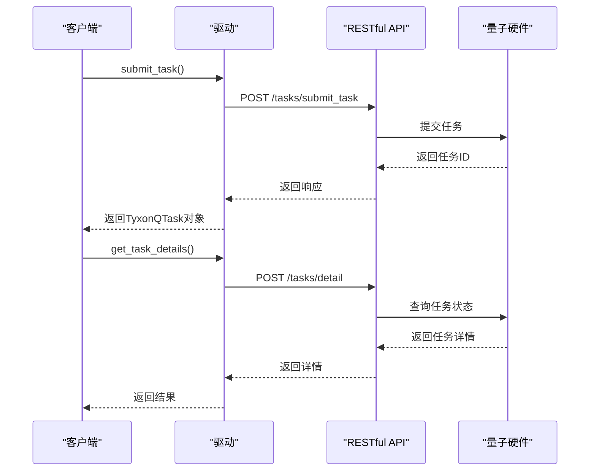
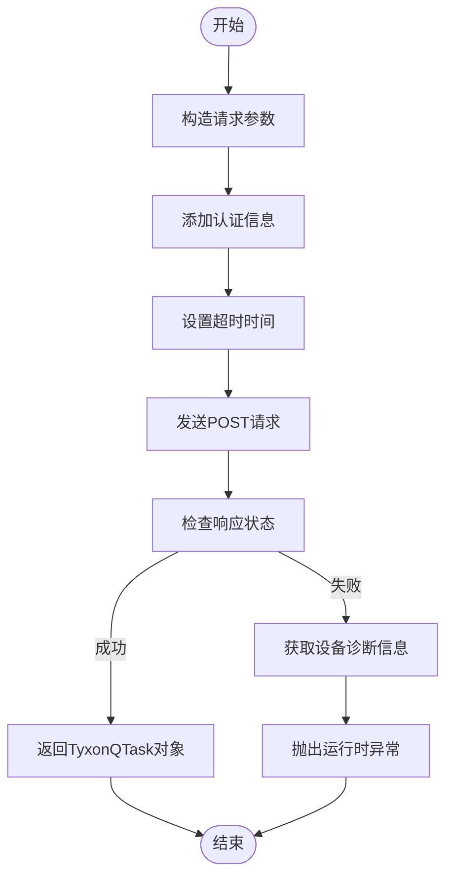
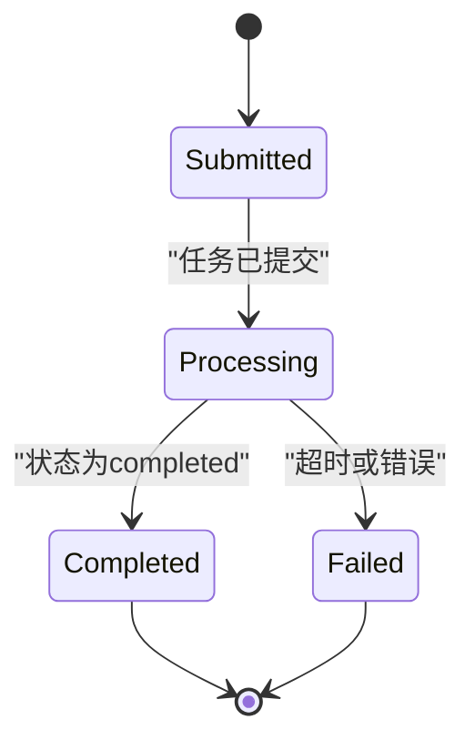
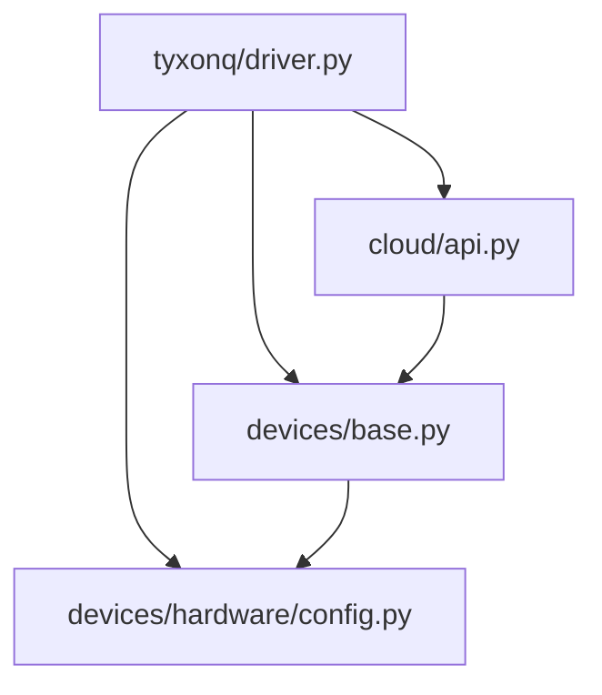
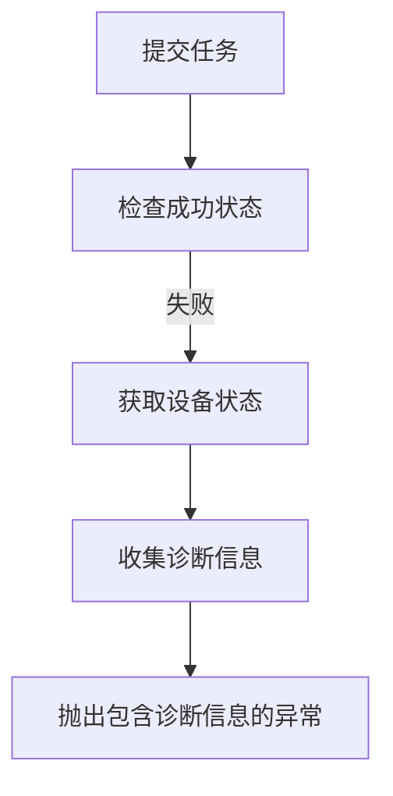

# TyxonQ 自研硬件驱动

<cite>
**本文档引用的文件**
- [driver.py](file://src/tyxonq/devices/hardware/tyxonq/driver.py)
- [api.py](file://src/tyxonq/cloud/api.py)
- [base.py](file://src/tyxonq/devices/base.py)
- [config.py](file://src/tyxonq/devices/hardware/config.py)
- [circuit.py](file://src/tyxonq/core/ir/circuit.py)
- [cloud_api_devices.py](file://examples/cloud_api_devices.py)
- [cloud_api_task.py](file://examples/cloud_api_task.py)
</cite>

## 目录
1. [简介](#简介)
2. [项目结构](#项目结构)
3. [核心组件](#核心组件)
4. [架构概述](#架构概述)
5. [详细组件分析](#详细组件分析)
6. [依赖分析](#依赖分析)
7. [性能考虑](#性能考虑)
8. [故障排除指南](#故障排除指南)
9. [结论](#结论)

## 简介
本文档详细描述了TyxonQ自研硬件驱动的设计与实现，重点阐述其与Homebrew_S2量子处理器的集成机制。文档涵盖了通过RESTful API进行任务提交、状态查询和结果获取的完整流程，包括认证方式、超时设置和错误处理策略。同时，深入分析了TyxonQTask类的状态管理机制，特别是异步结果获取中的轮询逻辑与超时控制，并提供了设备列表和属性信息获取接口的实现细节。

## 项目结构
TyxonQ项目采用模块化设计，主要分为核心模块、云接口、编译器、设备驱动、应用层等部分。硬件驱动位于`src/tyxonq/devices/hardware/tyxonq/`目录下，是连接上层应用与底层量子硬件的关键组件。

**图示来源**
- [driver.py](file://src/tyxonq/devices/hardware/tyxonq/driver.py)
- [api.py](file://src/tyxonq/cloud/api.py)

**本节来源**
- [driver.py](file://src/tyxonq/devices/hardware/tyxonq/driver.py)
- [api.py](file://src/tyxonq/cloud/api.py)

## 核心组件
TyxonQ自研硬件驱动的核心组件包括任务管理、设备管理、RESTful API接口和状态机管理。这些组件协同工作，实现了与Homebrew_S2量子处理器的高效通信和任务调度。

**本节来源**
- [driver.py](file://src/tyxonq/devices/hardware/tyxonq/driver.py)
- [api.py](file://src/tyxonq/cloud/api.py)

## 架构概述
TyxonQ硬件驱动采用分层架构设计，上层通过统一的云API接口与驱动交互，底层通过RESTful API与量子硬件通信。驱动内部实现了任务队列管理、状态监控和错误处理等核心功能。

**图示来源**
- [driver.py](file://src/tyxonq/devices/hardware/tyxonq/driver.py)
- [api.py](file://src/tyxonq/cloud/api.py)

## 详细组件分析

### TyxonQTask 类分析
TyxonQTask类是任务管理的核心数据结构，负责封装任务的元数据和状态信息。

**图示来源**
- [driver.py](file://src/tyxonq/devices/hardware/tyxonq/driver.py#L12-L41)

**本节来源**
- [driver.py](file://src/tyxonq/devices/hardware/tyxonq/driver.py#L12-L41)

### RESTful API 接口分析
RESTful API接口实现了与量子硬件的通信，包括任务提交、状态查询和结果获取等功能。

**图示来源**
- [driver.py](file://src/tyxonq/devices/hardware/tyxonq/driver.py#L82-L124)
- [driver.py](file://src/tyxonq/devices/hardware/tyxonq/driver.py#L128-L182)

**本节来源**
- [driver.py](file://src/tyxonq/devices/hardware/tyxonq/driver.py#L82-L182)

### 任务提交流程分析
任务提交流程涉及请求构造、认证、超时设置和错误处理等多个环节。

**图示来源**
- [driver.py](file://src/tyxonq/devices/hardware/tyxonq/driver.py#L82-L124)

**本节来源**
- [driver.py](file://src/tyxonq/devices/hardware/tyxonq/driver.py#L82-L124)

### 状态管理机制分析
TyxonQTask的状态管理机制通过轮询实现异步结果获取，具有完善的超时控制。

**图示来源**
- [driver.py](file://src/tyxonq/devices/hardware/tyxonq/driver.py#L23-L41)

**本节来源**
- [driver.py](file://src/tyxonq/devices/hardware/tyxonq/driver.py#L23-L41)

## 依赖分析
TyxonQ硬件驱动依赖于多个核心模块，包括云API、设备基类和配置管理。

**图示来源**
- [driver.py](file://src/tyxonq/devices/hardware/tyxonq/driver.py)
- [api.py](file://src/tyxonq/cloud/api.py)
- [base.py](file://src/tyxonq/devices/base.py)
- [config.py](file://src/tyxonq/devices/hardware/config.py)

**本节来源**
- [driver.py](file://src/tyxonq/devices/hardware/tyxonq/driver.py)
- [api.py](file://src/tyxonq/cloud/api.py)
- [base.py](file://src/tyxonq/devices/base.py)
- [config.py](file://src/tyxonq/devices/hardware/config.py)

## 性能考虑
在性能方面，TyxonQ硬件驱动通过以下方式优化：
- 使用合理的默认超时值（任务提交30秒，状态查询15秒）
- 实现高效的轮询机制，最小化网络开销
- 采用异步任务处理模式，提高系统吞吐量
- 缓存设备信息，减少重复查询

## 故障排除指南
当任务提交失败时，系统会自动获取设备状态进行故障排查：

**图示来源**
- [driver.py](file://src/tyxonq/devices/hardware/tyxonq/driver.py#L105-L115)

**本节来源**
- [driver.py](file://src/tyxonq/devices/hardware/tyxonq/driver.py#L105-L115)

## 结论
TyxonQ自研硬件驱动通过精心设计的架构和实现，成功实现了与Homebrew_S2量子处理器的高效集成。驱动提供了完整的RESTful API接口，支持任务提交、状态查询和结果获取等核心功能。通过TyxonQTask类的状态管理机制和完善的错误处理策略，确保了量子计算任务的可靠执行。该驱动为量子算法的开发和应用提供了稳定的基础支持。