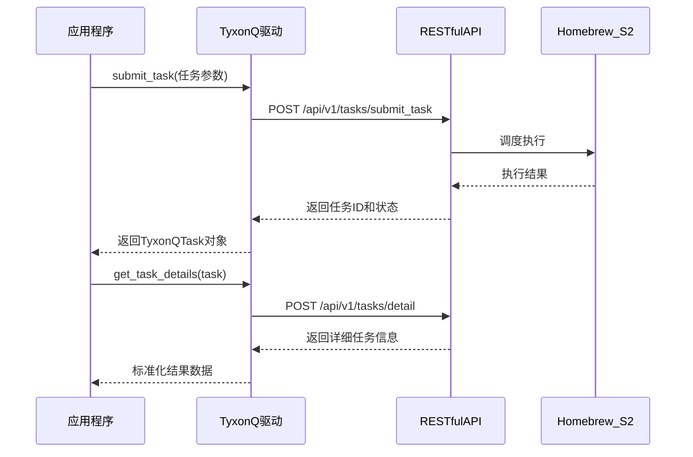
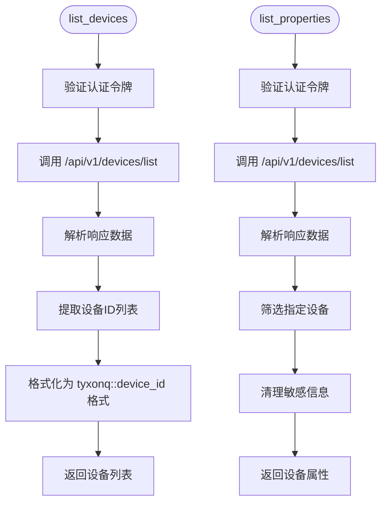
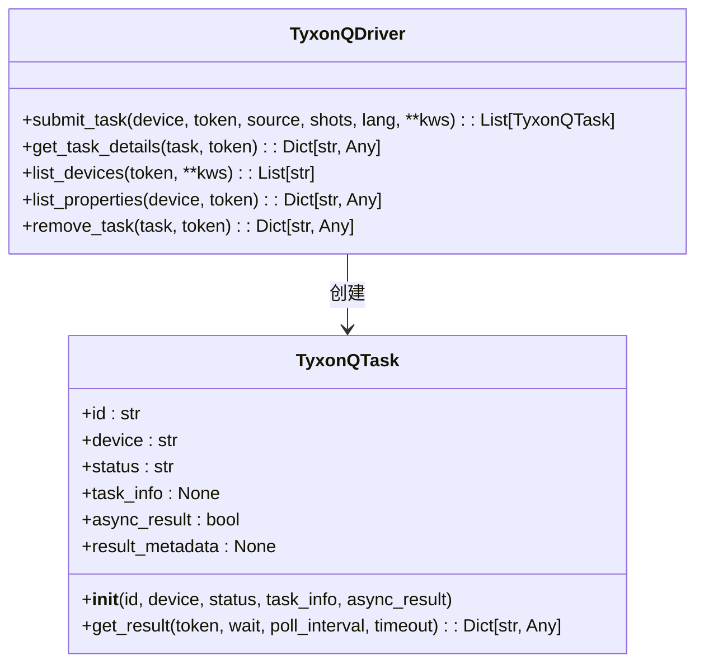
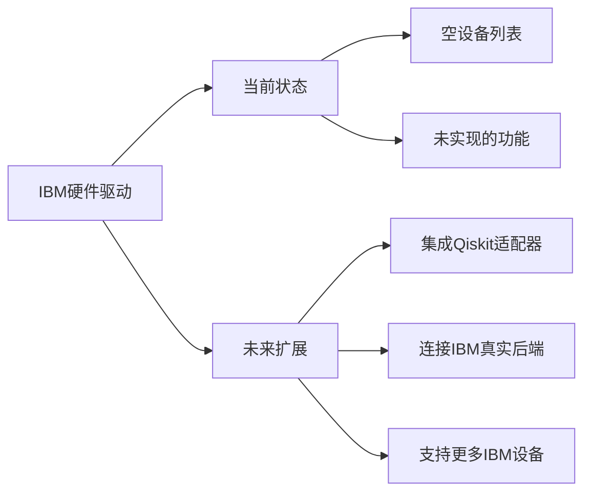
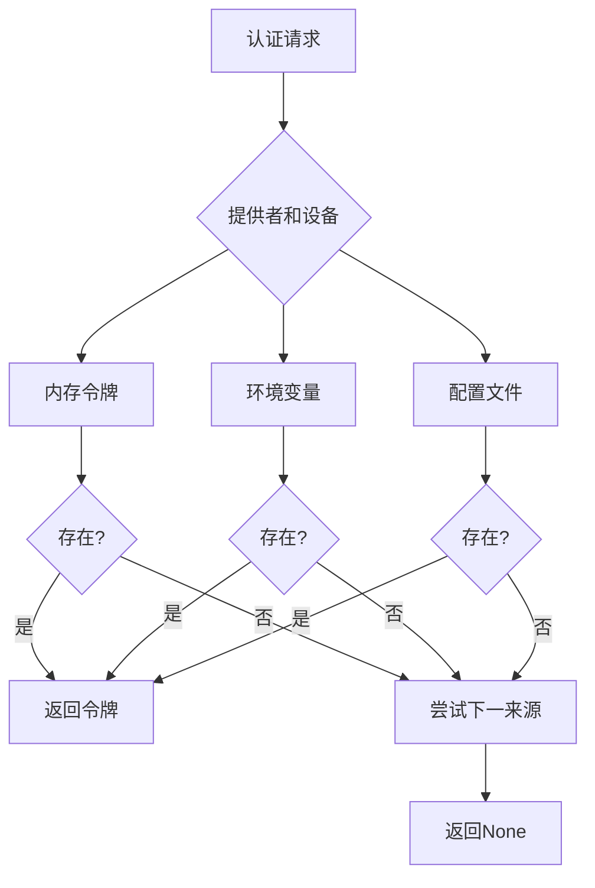
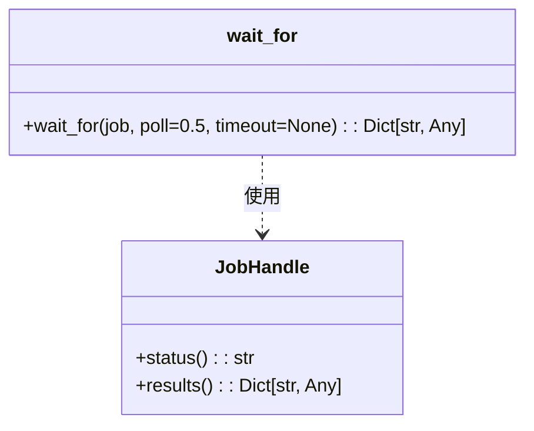
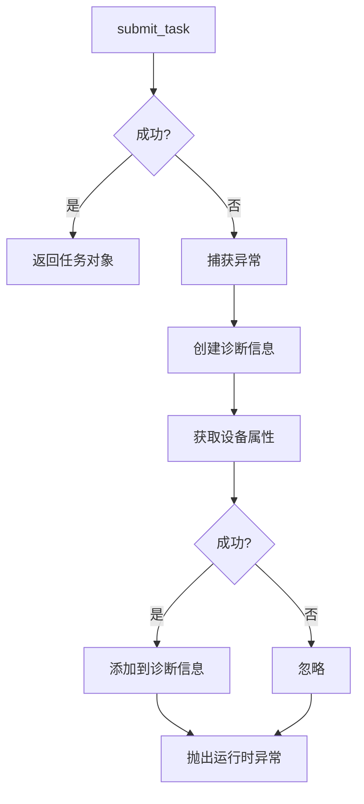

# 硬件驱动

<cite>
**本文档引用的文件**  
- [src/tyxonq/devices/hardware/tyxonq/driver.py](file://src/tyxonq/devices/hardware/tyxonq/driver.py)
- [src/tyxonq/devices/hardware/ibm/driver.py](file://src/tyxonq/devices/hardware/ibm/driver.py)
- [src/tyxonq/devices/hardware/config.py](file://src/tyxonq/devices/hardware/config.py)
- [src/tyxonq/devices/hardware/session.py](file://src/tyxonq/devices/hardware/session.py)
- [src/tyxonq/devices/hardware/__init__.py](file://src/tyxonq/devices/hardware/__init__.py)
</cite>

## 目录
1. [引言](#引言)
2. [核心组件](#核心组件)
3. [TyxonQ自研硬件驱动实现](#tyxonq自研硬件驱动实现)
4. [IBM硬件驱动结构](#ibm硬件驱动结构)
5. [统一接口规范](#统一接口规范)
6. [认证与会话管理](#认证与会话管理)
7. [错误处理与诊断](#错误处理与诊断)
8. [使用示例](#使用示例)
9. [结论](#结论)

## 引言

硬件驱动模块在TyxonQ量子计算框架中扮演着连接真实量子设备的关键桥梁角色。该模块为上层应用提供了统一的硬件访问接口，屏蔽了底层不同量子处理器的实现差异。本技术文档详细阐述了硬件驱动的架构设计与实现机制，重点分析TyxonQ自研硬件驱动与IBM硬件驱动的实现细节，为开发者提供完整的使用指导和扩展参考。

## 核心组件

硬件驱动模块由多个核心组件构成，包括设备驱动实现、配置管理、会话处理等。这些组件协同工作，实现了对量子硬件的安全、可靠访问。

**Section sources**
- [src/tyxonq/devices/hardware/tyxonq/driver.py](file://src/tyxonq/devices/hardware/tyxonq/driver.py#L1-L192)
- [src/tyxonq/devices/hardware/ibm/driver.py](file://src/tyxonq/devices/hardware/ibm/driver.py#L1-L40)
- [src/tyxonq/devices/hardware/config.py](file://src/tyxonq/devices/hardware/config.py#L1-L68)
- [src/tyxonq/devices/hardware/session.py](file://src/tyxonq/devices/hardware/session.py#L1-L26)

## TyxonQ自研硬件驱动实现

TyxonQ自研硬件驱动（`tyxonq/driver.py`）实现了与Homebrew_S2处理器的完整通信协议，通过RESTful API完成量子任务的全生命周期管理。

### 通信协议与任务流程

驱动通过预定义的端点与后端服务通信，所有API调用均采用POST方法，通过JSON格式传输数据。通信流程遵循标准的量子计算任务处理模式：任务提交 → 状态查询 → 结果获取。



**Diagram sources**
- [src/tyxonq/devices/hardware/tyxonq/driver.py](file://src/tyxonq/devices/hardware/tyxonq/driver.py#L50-L55)
- [src/tyxonq/devices/hardware/tyxonq/driver.py](file://src/tyxonq/devices/hardware/tyxonq/driver.py#L82-L124)

### 设备管理功能

驱动提供了设备列表查询和属性获取功能，使应用程序能够动态发现可用硬件资源。



**Diagram sources**
- [src/tyxonq/devices/hardware/tyxonq/driver.py](file://src/tyxonq/devices/hardware/tyxonq/driver.py#L57-L68)
- [src/tyxonq/devices/hardware/tyxonq/driver.py](file://src/tyxonq/devices/hardware/tyxonq/driver.py#L70-L80)

### 任务提交与结果获取

`submit_task`函数负责将量子电路提交到指定设备执行，支持单任务和批量任务提交。`get_task_details`函数用于查询任务的详细信息和执行结果。



**Diagram sources**
- [src/tyxonq/devices/hardware/tyxonq/driver.py](file://src/tyxonq/devices/hardware/tyxonq/driver.py#L12-L41)
- [src/tyxonq/devices/hardware/tyxonq/driver.py](file://src/tyxonq/devices/hardware/tyxonq/driver.py#L82-L189)

**Section sources**
- [src/tyxonq/devices/hardware/tyxonq/driver.py](file://src/tyxonq/devices/hardware/tyxonq/driver.py#L12-L189)

## IBM硬件驱动结构

IBM硬件驱动（`ibm/driver.py`）目前为骨架结构，定义了与IBM量子设备交互的接口规范，为未来的功能扩展奠定了基础。

### 骨架设计与扩展计划

驱动采用接口先行的设计模式，预先定义了所有必要的功能接口，但具体实现留待后续开发。这种设计确保了框架的可扩展性和接口一致性。



**Section sources**
- [src/tyxonq/devices/hardware/ibm/driver.py](file://src/tyxonq/devices/hardware/ibm/driver.py#L1-L40)

## 统一接口规范

硬件驱动模块遵循统一的接口规范，确保不同硬件提供商的驱动具有相同的使用模式。

### 核心接口定义

所有硬件驱动必须实现以下核心接口：

| 接口函数 | 参数 | 返回值 | 功能描述 |
|--------|------|-------|--------|
| list_devices | token, **kws | List[str] | 查询可用设备列表 |
| submit_task | device, token, *, source, shots, **opts | List[Any] | 提交量子任务 |
| get_task_details | task, token, prettify=False | Dict[str, Any] | 获取任务详细信息 |

**Section sources**
- [src/tyxonq/devices/hardware/ibm/driver.py](file://src/tyxonq/devices/hardware/ibm/driver.py#L15-L38)
- [src/tyxonq/devices/hardware/tyxonq/driver.py](file://src/tyxonq/devices/hardware/tyxonq/driver.py#L57-L189)

## 认证与会话管理

驱动模块通过token认证和会话管理机制确保通信安全，防止未授权访问。

### 认证机制

系统支持多种认证方式，包括内存令牌、环境变量和配置文件，提供了灵活的认证管理策略。



**Diagram sources**
- [src/tyxonq/devices/hardware/config.py](file://src/tyxonq/devices/hardware/config.py#L20-L46)

### 会话管理

`JobHandle`协议定义了任务处理的标准接口，`wait_for`函数提供了通用的任务等待机制。



**Diagram sources**
- [src/tyxonq/devices/hardware/session.py](file://src/tyxonq/devices/hardware/session.py#L6-L19)

**Section sources**
- [src/tyxonq/devices/hardware/config.py](file://src/tyxonq/devices/hardware/config.py#L20-L46)
- [src/tyxonq/devices/hardware/session.py](file://src/tyxonq/devices/hardware/session.py#L6-L19)

## 错误处理与诊断

驱动模块实现了完善的错误处理机制，在任务提交失败时自动收集诊断信息，帮助用户快速定位问题。

### 错误处理流程

当任务提交失败时，驱动会自动尝试获取设备属性信息，构建详细的错误诊断报告。



**Section sources**
- [src/tyxonq/devices/hardware/tyxonq/driver.py](file://src/tyxonq/devices/hardware/tyxonq/driver.py#L109-L124)

## 使用示例

以下代码示例展示了如何配置和使用不同硬件设备。

```python
# 配置TyxonQ认证令牌
set_token("your-api-key", provider="tyxonq")

# 查询可用设备
devices = list_devices()
print("可用设备:", devices)

# 提交量子任务
task = submit_task(
    device="tyxonq::homebrew_s2",
    source="OPENQASM代码",
    shots=1024
)

# 获取任务结果
result = get_task_details(task[0])
print("测量结果:", result['result'])
```

**Section sources**
- [src/tyxonq/devices/hardware/tyxonq/driver.py](file://src/tyxonq/devices/hardware/tyxonq/driver.py#L57-L189)
- [src/tyxonq/devices/hardware/config.py](file://src/tyxonq/devices/hardware/config.py#L20-L46)

## 结论

TyxonQ硬件驱动模块通过统一的接口规范和灵活的实现机制，成功实现了对不同量子硬件的抽象和管理。TyxonQ自研驱动已具备完整的生产级功能，而IBM驱动的骨架设计为未来的功能扩展提供了清晰的路线图。该模块的设计充分考虑了安全性、可靠性和可扩展性，为上层应用提供了稳定可靠的硬件访问能力。