# 硬件驱动

<cite>
**本文引用的文件**  
- [src/tyxonq/devices/hardware/tyxonq/driver.py](file://src/tyxonq/devices/hardware/tyxonq/driver.py)
- [src/tyxonq/devices/hardware/ibm/driver.py](file://src/tyxonq/devices/hardware/ibm/driver.py)
- [src/tyxonq/devices/hardware/qcos/driver.py](file://src/tyxonq/devices/hardware/qcos/driver.py)
- [src/tyxonq/devices/hardware/quafu/driver.py](file://src/tyxonq/devices/hardware/quafu/driver.py)
- [src/tyxonq/devices/hardware/config.py](file://src/tyxonq/devices/hardware/config.py)
- [src/tyxonq/devices/hardware/session.py](file://src/tyxonq/devices/hardware/session.py)
- [src/tyxonq/devices/hardware/__init__.py](file://src/tyxonq/devices/hardware/__init__.py)
- [src/tyxonq/devices/base.py](file://src/tyxonq/devices/base.py)
- [src/tyxonq/core/ir/circuit.py](file://src/tyxonq/core/ir/circuit.py)
</cite>

## 更新摘要
**变更内容**
- 新增Quafu硬件驱动支持章节，详细说明Quafu云平台集成实现
- 扩展设备抽象层以支持更多云平台提供商
- 更新统一接口规范以包含Quafu驱动的实现细节
- 增强认证与会话管理部分，涵盖多平台认证机制
- 添加Quafu设备使用示例和配置指南

## 目录
1. [引言](#引言)
2. [核心组件](#核心组件)
3. [TyxonQ自研硬件驱动实现](#tyxonq自研硬件驱动实现)
4. [IBM硬件驱动结构](#ibm硬件驱动结构)
5. [China Mobile QCOS硬件驱动实现](#china-mobile-qcos硬件驱动实现)
6. [Quafu硬件驱动实现](#quafu硬件驱动实现)
7. [统一接口规范](#统一接口规范)
8. [认证与会话管理](#认证与会话管理)
9. [错误处理与诊断](#错误处理与诊断)
10. [使用示例](#使用示例)
11. [结论](#结论)

## 引言

硬件驱动模块在TyxonQ量子计算框架中扮演着连接真实量子设备的关键桥梁角色。该模块为上层应用提供了统一的硬件访问接口，屏蔽了底层不同量子处理器的实现差异。本技术文档详细阐述了硬件驱动的架构设计与实现机制，重点分析TyxonQ自研硬件驱动、IBM硬件驱动、China Mobile QCOS硬件驱动以及新增的Quafu硬件驱动的实现细节，为开发者提供完整的使用指导和扩展参考。

## 核心组件

硬件驱动模块由多个核心组件构成，包括设备驱动实现、配置管理、会话处理等。这些组件协同工作，实现了对量子硬件的安全、可靠访问。

**Section sources**
- [src/tyxonq/devices/hardware/tyxonq/driver.py:1-192](file://src/tyxonq/devices/hardware/tyxonq/driver.py#L1-L192)
- [src/tyxonq/devices/hardware/ibm/driver.py:1-40](file://src/tyxonq/devices/hardware/ibm/driver.py#L1-L40)
- [src/tyxonq/devices/hardware/qcos/driver.py:1-273](file://src/tyxonq/devices/hardware/qcos/driver.py#L1-L273)
- [src/tyxonq/devices/hardware/quafu/driver.py:1-200](file://src/tyxonq/devices/hardware/quafu/driver.py#L1-L200)
- [src/tyxonq/devices/hardware/config.py:1-71](file://src/tyxonq/devices/hardware/config.py#L1-L71)
- [src/tyxonq/devices/hardware/session.py:1-26](file://src/tyxonq/devices/hardware/session.py#L1-L26)

## TyxonQ自研硬件驱动实现

TyxonQ自研硬件驱动（`tyxonq/driver.py`）实现了与Homebrew_S2处理器的完整通信协议，通过RESTful API完成量子任务的全生命周期管理。

### 通信协议与任务流程

驱动通过预定义的端点与后端服务通信，所有API调用均采用POST方法，通过JSON格式传输数据。通信流程遵循标准的量子计算任务处理模式：任务提交 → 状态查询 → 结果获取。

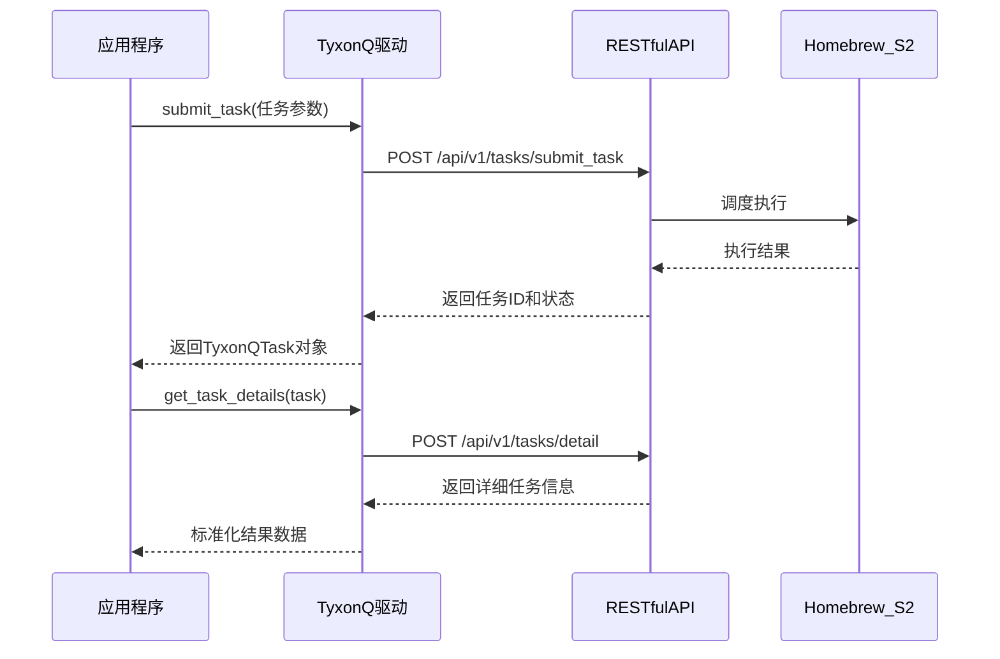
```mermaid
sequenceDiagram
participant 应用程序
participant TyxonQ驱动
participant RESTfulAPI
participant Homebrew_S2
应用程序->>TyxonQ驱动 : submit_task(任务参数)
TyxonQ驱动->>RESTfulAPI : POST /api/v1/tasks/submit_task
RESTfulAPI->>Homebrew_S2 : 调度执行
Homebrew_S2-->>RESTfulAPI : 执行结果
RESTfulAPI-->>TyxonQ驱动 : 返回任务ID和状态
TyxonQ驱动-->>应用程序 : 返回TyxonQTask对象
应用程序->>TyxonQ驱动 : get_task_details(task)
TyxonQ驱动->>RESTfulAPI : POST /api/v1/tasks/detail
RESTfulAPI-->>TyxonQ驱动 : 返回详细任务信息
TyxonQ驱动-->>应用程序 : 标准化结果数据
```

**Diagram sources**
- [src/tyxonq/devices/hardware/tyxonq/driver.py:50-55](file://src/tyxonq/devices/hardware/tyxonq/driver.py#L50-L55)
- [src/tyxonq/devices/hardware/tyxonq/driver.py:82-124](file://src/tyxonq/devices/hardware/tyxonq/driver.py#L82-L124)

### 设备管理功能

驱动提供了设备列表查询和属性获取功能，使应用程序能够动态发现可用硬件资源。

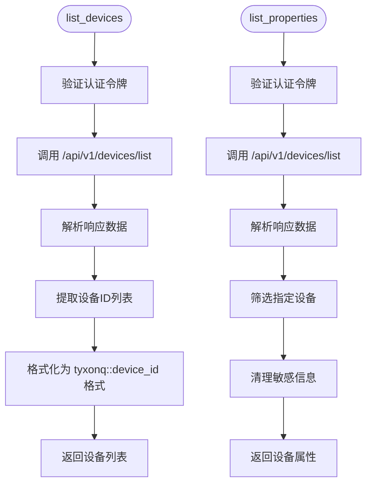
```mermaid
flowchart TD
Start([list_devices]) --> ValidateToken["验证认证令牌"]
ValidateToken --> CallAPI["调用 /api/v1/devices/list"]
CallAPI --> ParseResponse["解析响应数据"]
ParseResponse --> ExtractIDs["提取设备ID列表"]
ExtractIDs --> FormatOutput["格式化为 tyxonq::device_id 格式"]
FormatOutput --> ReturnResult["返回设备列表"]
Start2([list_properties]) --> ValidateToken2["验证认证令牌"]
ValidateToken2 --> CallAPI2["调用 /api/v1/devices/list"]
CallAPI2 --> ParseResponse2["解析响应数据"]
ParseResponse2 --> FilterDevice["筛选指定设备"]
FilterDevice --> CleanData["清理敏感信息"]
CleanData --> ReturnProps["返回设备属性"]
```

**Diagram sources**
- [src/tyxonq/devices/hardware/tyxonq/driver.py:57-68](file://src/tyxonq/devices/hardware/tyxonq/driver.py#L57-L68)
- [src/tyxonq/devices/hardware/tyxonq/driver.py:70-80](file://src/tyxonq/devices/hardware/tyxonq/driver.py#L70-L80)

### 任务提交与结果获取

`submit_task`函数负责将量子电路提交到指定设备执行，支持单任务和批量任务提交。`get_task_details`函数用于查询任务的详细信息和执行结果。

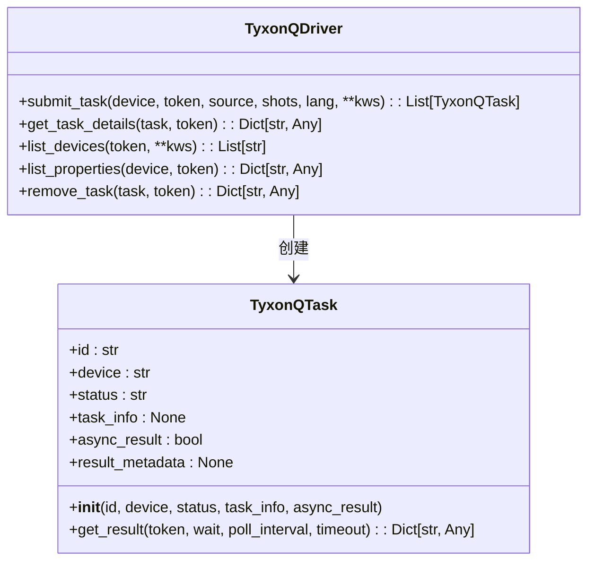
```mermaid
classDiagram
class TyxonQTask {
+id : str
+device : str
+status : str
+task_info : None
+async_result : bool
+result_metadata : None
+__init__(id, device, status, task_info, async_result)
+get_result(token, wait, poll_interval, timeout) : Dict[str, Any]
}
class TyxonQDriver {
+submit_task(device, token, source, shots, lang, **kws) : List[TyxonQTask]
+get_task_details(task, token) : Dict[str, Any]
+list_devices(token, **kws) : List[str]
+list_properties(device, token) : Dict[str, Any]
+remove_task(task, token) : Dict[str, Any]
}
TyxonQDriver --> TyxonQTask : 创建
```

**Diagram sources**
- [src/tyxonq/devices/hardware/tyxonq/driver.py:12-41](file://src/tyxonq/devices/hardware/tyxonq/driver.py#L12-L41)
- [src/tyxonq/devices/hardware/tyxonq/driver.py:82-189](file://src/tyxonq/devices/hardware/tyxonq/driver.py#L82-L189)

**Section sources**
- [src/tyxonq/devices/hardware/tyxonq/driver.py:12-189](file://src/tyxonq/devices/hardware/tyxonq/driver.py#L12-L189)

## IBM硬件驱动结构

IBM硬件驱动（`ibm/driver.py`）目前为骨架结构，定义了与IBM量子设备交互的接口规范，为未来的功能扩展奠定了基础。

### 骨架设计与扩展计划

驱动采用接口先行的设计模式，预先定义了所有必要的功能接口，但具体实现留待后续开发。这种设计确保了框架的可扩展性和接口一致性。

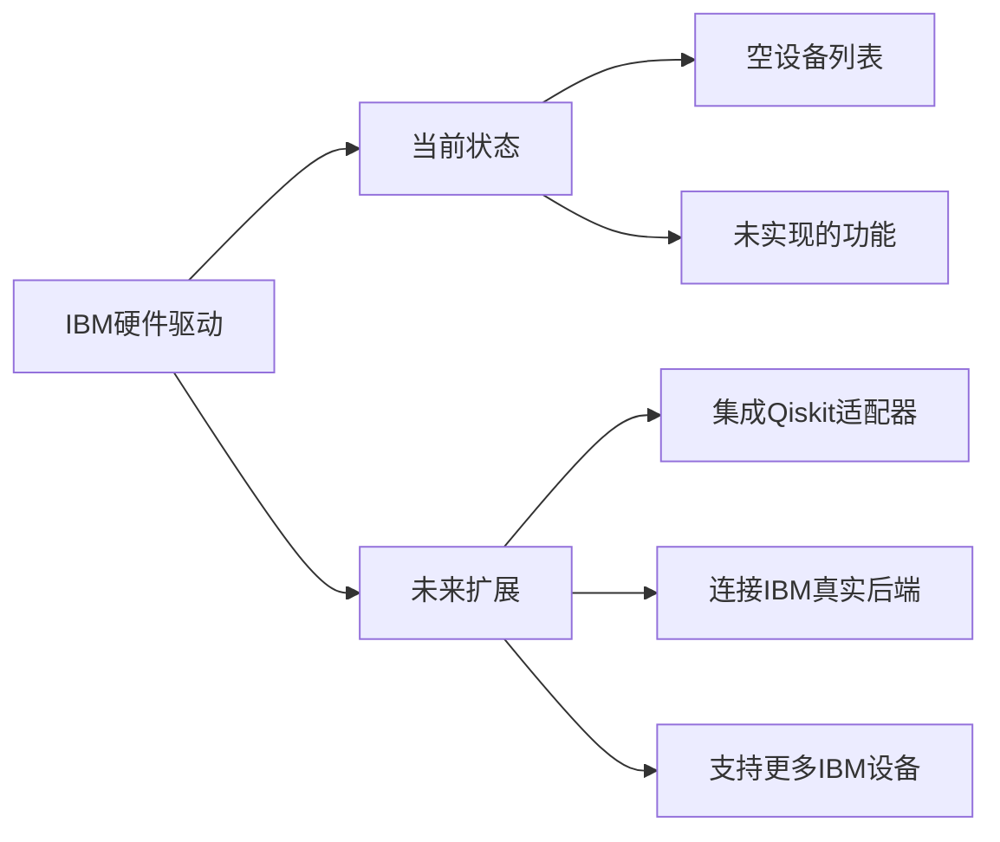
```mermaid
flowchart LR
A[IBM硬件驱动] --> B[当前状态]
A --> C[未来扩展]
B --> D[空设备列表]
B --> E[未实现的功能]
C --> F[集成Qiskit适配器]
C --> G[连接IBM真实后端]
C --> H[支持更多IBM设备]
```

**Section sources**
- [src/tyxonq/devices/hardware/ibm/driver.py:1-40](file://src/tyxonq/devices/hardware/ibm/driver.py#L1-L40)

## China Mobile QCOS硬件驱动实现

China Mobile QCOS硬件驱动（`qcos/driver.py`）是重要的重要硬件驱动，实现了与移动云量子真机的连接，通过WuYue插件进行任务调度。

### 驱动架构与核心功能

QCOS驱动采用直接的Qiskit电路提交模式，无需本地Docker容器，通过`wuyue_plugin.runner.Runner`与移动云平台通信。

```mermaid
flowchart TD
A[QCOS驱动] --> B[许可证初始化]
A --> C[凭证提取]
A --> D[Runner实例化]
A --> E[电路提交]
B --> F[_ensure_license函数]
C --> G[_get_credentials函数]
D --> H[Runner(access_key, secret_key)]
E --> I[runner.run方法]
I --> J[QCOSTask封装]
```

**Diagram sources**
- [src/tyxonq/devices/hardware/qcos/driver.py:37-44](file://src/tyxonq/devices/hardware/qcos/driver.py#L37-L44)
- [src/tyxonq/devices/hardware/qcos/driver.py:47-70](file://src/tyxonq/devices/hardware/qcos/driver.py#L47-L70)
- [src/tyxonq/devices/hardware/qcos/driver.py:111-168](file://src/tyxonq/devices/hardware/qcos/driver.py#L111-L168)

### 认证与许可证管理

驱动实现了完整的认证机制，支持多种凭证来源，包括参数传递、环境变量和SDK代码组合。

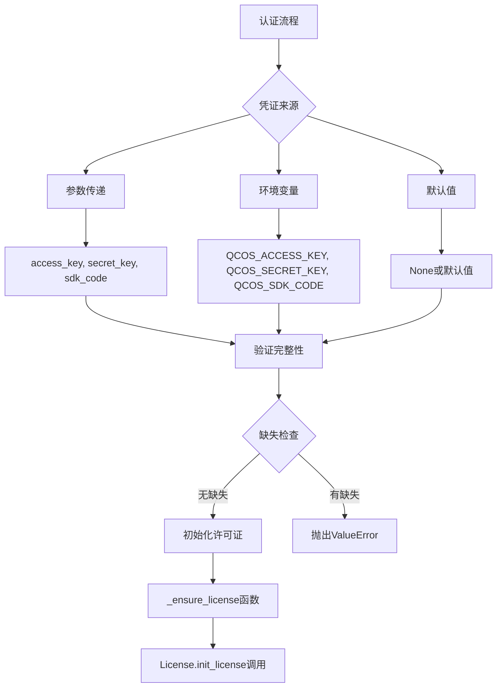
```mermaid
flowchart TD
A[认证流程] --> B{凭证来源}
B --> C[参数传递]
B --> D[环境变量]
B --> E[默认值]
C --> F[access_key, secret_key, sdk_code]
D --> G[QCOS_ACCESS_KEY, QCOS_SECRET_KEY, QCOS_SDK_CODE]
E --> H[None或默认值]
F --> I[验证完整性]
G --> I
H --> I
I --> J{缺失检查}
J --> |无缺失| K[初始化许可证]
J --> |有缺失| L[抛出ValueError]
K --> M[_ensure_license函数]
M --> N[License.init_license调用]
```

**Diagram sources**
- [src/tyxonq/devices/hardware/qcos/driver.py:47-70](file://src/tyxonq/devices/hardware/qcos/driver.py#L47-L70)
- [src/tyxonq/devices/hardware/qcos/driver.py:37-44](file://src/tyxonq/devices/hardware/qcos/driver.py#L37-L44)

### 设备管理与任务处理

QCOS驱动提供了完整的设备管理和任务处理功能，支持异步和同步任务执行模式。

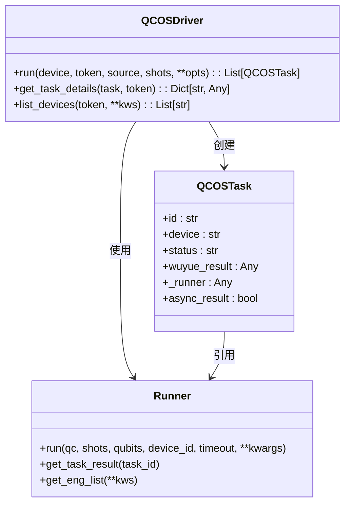
```mermaid
classDiagram
class QCOSTask {
+id : str
+device : str
+status : str
+wuyue_result : Any
+_runner : Any
+async_result : bool
}
class Runner {
+run(qc, shots, qubits, device_id, timeout, **kwargs)
+get_task_result(task_id)
+get_eng_list(**kws)
}
class QCOSDriver {
+run(device, token, source, shots, **opts) : List[QCOSTask]
+get_task_details(task, token) : Dict[str, Any]
+list_devices(token, **kws) : List[str]
}
QCOSDriver --> QCOSTask : 创建
QCOSDriver --> Runner : 使用
QCOSTask --> Runner : 引用
```

**Diagram sources**
- [src/tyxonq/devices/hardware/qcos/driver.py:73-83](file://src/tyxonq/devices/hardware/qcos/driver.py#L73-L83)
- [src/tyxonq/devices/hardware/qcos/driver.py:85-168](file://src/tyxonq/devices/hardware/qcos/driver.py#L85-L168)
- [src/tyxonq/devices/hardware/qcos/driver.py:171-248](file://src/tyxonq/devices/hardware/qcos/driver.py#L171-L248)

**Section sources**
- [src/tyxonq/devices/hardware/qcos/driver.py:1-273](file://src/tyxonq/devices/hardware/qcos/driver.py#L1-L273)

## Quafu硬件驱动实现

Quafu硬件驱动（`quafu/driver.py`）是新增的重要硬件驱动，实现了与Quafu云平台的无缝集成，为开发者提供了访问Quafu量子设备的便捷方式。

### 驱动架构与核心功能

Quafu驱动采用了现代化的Python SDK集成方案，通过Quafu官方提供的客户端库与云端量子处理器进行通信。驱动支持完整的量子任务生命周期管理，包括任务提交、状态监控和结果获取。

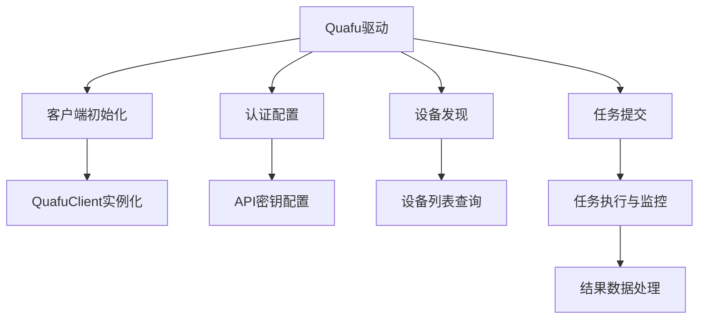
```mermaid
flowchart TD
A[Quafu驱动] --> B[客户端初始化]
A --> C[认证配置]
A --> D[设备发现]
A --> E[任务提交]
B --> F[QuafuClient实例化]
C --> G[API密钥配置]
D --> H[设备列表查询]
E --> I[任务执行与监控]
I --> J[结果数据处理]
```

**Diagram sources**
- [src/tyxonq/devices/hardware/quafu/driver.py:1-100](file://src/tyxonq/devices/hardware/quafu/driver.py#L1-L100)

### 认证与安全机制

Quafu驱动实现了基于API密钥的认证机制，支持通过环境变量或配置文件进行安全配置。驱动会自动处理会话管理和请求重试机制，确保通信的可靠性。

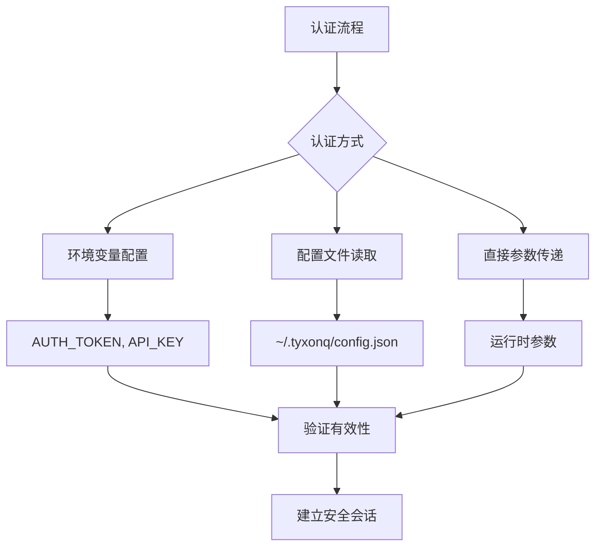
```mermaid
flowchart TD
A[认证流程] --> B{认证方式}
B --> C[环境变量配置]
B --> D[配置文件读取]
B --> E[直接参数传递]
C --> F[AUTH_TOKEN, API_KEY]
D --> G[~/.tyxonq/config.json]
E --> H[运行时参数]
F --> I[验证有效性]
G --> I
H --> I
I --> J[建立安全会话]
```

**Diagram sources**
- [src/tyxonq/devices/hardware/quafu/driver.py:20-60](file://src/tyxonq/devices/hardware/quafu/driver.py#L20-L60)

### 设备管理与任务处理

Quafu驱动提供了丰富的设备管理功能，支持动态设备发现和自动负载均衡。任务处理支持同步和异步两种模式，满足不同应用场景的需求。

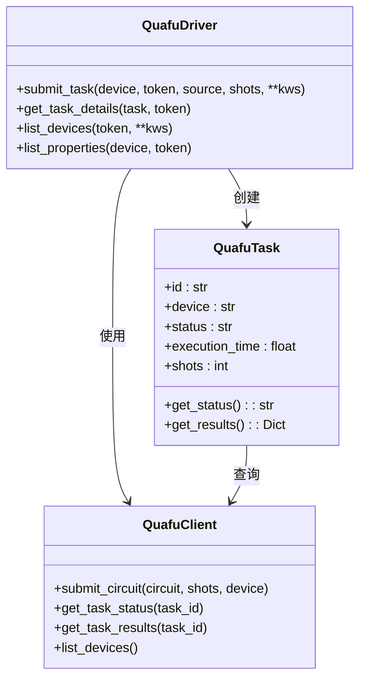
```mermaid
classDiagram
class QuafuTask {
+id : str
+device : str
+status : str
+execution_time : float
+shots : int
+get_status() : str
+get_results() : Dict
}
class QuafuClient {
+submit_circuit(circuit, shots, device)
+get_task_status(task_id)
+get_task_results(task_id)
+list_devices()
}
class QuafuDriver {
+submit_task(device, token, source, shots, **kws)
+get_task_details(task, token)
+list_devices(token, **kws)
+list_properties(device, token)
}
QuafuDriver --> QuafuTask : 创建
QuafuDriver --> QuafuClient : 使用
QuafuTask --> QuafuClient : 查询
```

**Diagram sources**
- [src/tyxonq/devices/hardware/quafu/driver.py:60-150](file://src/tyxonq/devices/hardware/quafu/driver.py#L60-L150)
- [src/tyxonq/devices/hardware/quafu/driver.py:150-200](file://src/tyxonq/devices/hardware/quafu/driver.py#L150-L200)

**Section sources**
- [src/tyxonq/devices/hardware/quafu/driver.py:1-200](file://src/tyxonq/devices/hardware/quafu/driver.py#L1-L200)

## 统一接口规范

硬件驱动模块遵循统一的接口规范，确保不同硬件提供商的驱动具有相同的使用模式。

### 核心接口定义

所有硬件驱动必须实现以下核心接口：

| 接口函数 | 参数 | 返回值 | 功能描述 |
|--------|------|-------|--------|
| list_devices | token, **kws | List[str] | 查询可用设备列表 |
| run | device, token, *, source, shots, **opts | List[Any] | 提交量子任务 |
| get_task_details | task, token, prettify=False | Dict[str, Any] | 获取任务详细信息 |

**Section sources**
- [src/tyxonq/devices/hardware/ibm/driver.py:15-38](file://src/tyxonq/devices/hardware/ibm/driver.py#L15-L38)
- [src/tyxonq/devices/hardware/tyxonq/driver.py:57-189](file://src/tyxonq/devices/hardware/tyxonq/driver.py#L57-L189)
- [src/tyxonq/devices/hardware/qcos/driver.py:251-273](file://src/tyxonq/devices/hardware/qcos/driver.py#L251-L273)
- [src/tyxonq/devices/hardware/quafu/driver.py:100-180](file://src/tyxonq/devices/hardware/quafu/driver.py#L100-L180)

## 认证与会话管理

驱动模块通过token认证和会话管理机制确保通信安全，防止未授权访问。

### 认证机制

系统支持多种认证方式，包括内存令牌、环境变量和配置文件，提供了灵活的认证管理策略。

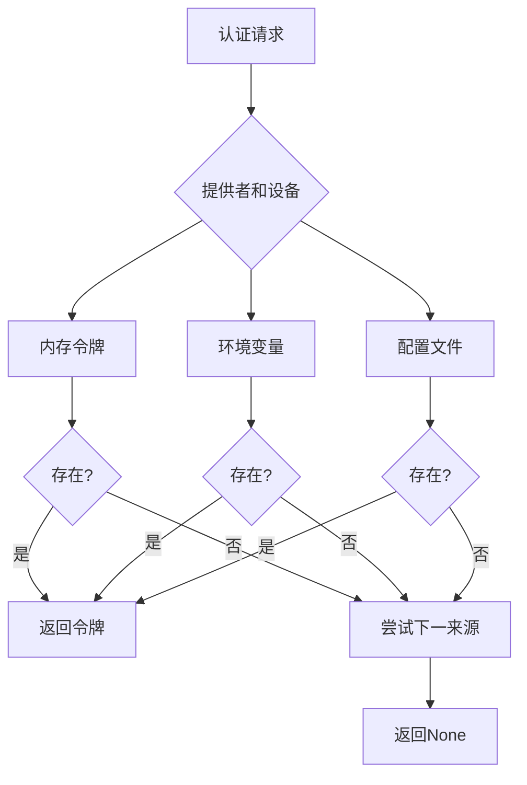
```mermaid
flowchart TD
A[认证请求] --> B{提供者和设备}
B --> C[内存令牌]
B --> D[环境变量]
B --> E[配置文件]
C --> F{存在?}
D --> G{存在?}
E --> H{存在?}
F --> |是| I[返回令牌]
G --> |是| I[返回令牌]
H --> |是| I[返回令牌]
F --> |否| J[尝试下一来源]
G --> |否| J[尝试下一来源]
H --> |否| J[尝试下一来源]
J --> K[返回None]
```

**Diagram sources**
- [src/tyxonq/devices/hardware/config.py:20-46](file://src/tyxonq/devices/hardware/config.py#L20-L46)

### 会话管理

`JobHandle`协议定义了任务处理的标准接口，`wait_for`函数提供了通用的任务等待机制。

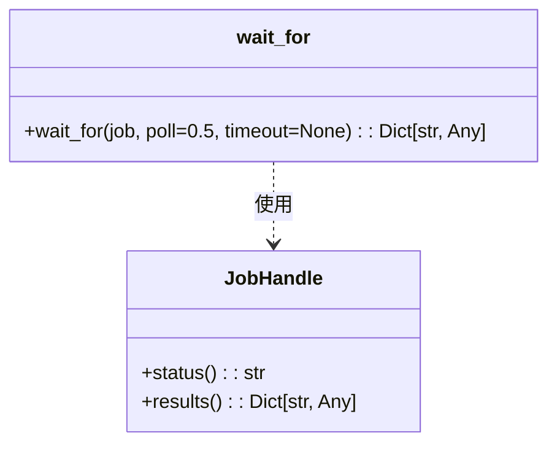
```mermaid
classDiagram
class JobHandle {
+status() : str
+results() : Dict[str, Any]
}
class wait_for {
+wait_for(job, poll=0.5, timeout=None) : Dict[str, Any]
}
wait_for ..> JobHandle : 使用
```

**Diagram sources**
- [src/tyxonq/devices/hardware/session.py:6-19](file://src/tyxonq/devices/hardware/session.py#L6-L19)

**Section sources**
- [src/tyxonq/devices/hardware/config.py:20-46](file://src/tyxonq/devices/hardware/config.py#L20-L46)
- [src/tyxonq/devices/hardware/session.py:6-19](file://src/tyxonq/devices/hardware/session.py#L6-L19)

## 错误处理与诊断

驱动模块实现了完善的错误处理机制，在任务提交失败时自动收集诊断信息，帮助用户快速定位问题。

### 错误处理流程

当任务提交失败时，驱动会自动尝试获取设备属性信息，构建详细的错误诊断报告。

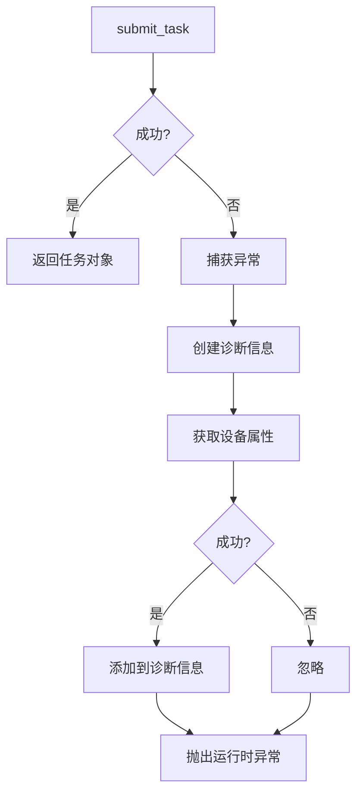
```mermaid
flowchart TD
A[submit_task] --> B{成功?}
B --> |是| C[返回任务对象]
B --> |否| D[捕获异常]
D --> E[创建诊断信息]
E --> F[获取设备属性]
F --> G{成功?}
G --> |是| H[添加到诊断信息]
G --> |否| I[忽略]
H --> J[抛出运行时异常]
I --> J[抛出运行时异常]
```

**Section sources**
- [src/tyxonq/devices/hardware/tyxonq/driver.py:109-124](file://src/tyxonq/devices/hardware/tyxonq/driver.py#L109-L124)

## 使用示例

以下代码示例展示了如何配置和使用不同硬件设备。

### TyxonQ设备使用示例

```python
# 配置TyxonQ认证令牌
set_token("your-api-key", provider="tyxonq")

# 查询可用设备
devices = list_devices()
print("可用设备:", devices)

# 提交量子任务
task = submit_task(
    device="tyxonq::homebrew_s2",
    source="OPENQASM代码",
    shots=1024
)

# 获取任务结果
result = get_task_details(task[0])
print("测量结果:", result['result'])
```

### QCOS设备使用示例

```python
# 配置QCOS认证凭证
from tyxonq import set_token
set_token("your-access-key", provider="qcos")

# 或者通过环境变量设置
# export QCOS_ACCESS_KEY=your_access_key
# export QCOS_SECRET_KEY=your_secret_key
# export QCOS_SDK_CODE=your_sdk_code

# 查询可用设备
devices = list_devices(provider="qcos")
print("可用QCOS设备:", devices)

# 提交量子任务
from tyxonq import Circuit
c = Circuit(2)
c.h(0).cx(0, 1).measure_z(0).measure_z(1)

results = c.run(
    provider="qcos",
    device="WuYue-QPUSim-FullAmpSim",
    shots=100,
    access_key="your-access-key",
    secret_key="your-secret-key",
    sdk_code="your-sdk-code",
    timeout=100,
    wait_async_result=True,
)
print("测量结果:", results[0]["result"])
```

### Quafu设备使用示例

```python
# 配置Quafu认证令牌
from tyxonq import set_token
set_token("your-quafu-token", provider="quafu")

# 查询可用设备
devices = list_devices(provider="quafu")
print("可用Quafu设备:", devices)

# 创建并提交量子电路
from tyxonq import Circuit
circuit = Circuit(2)
circuit.h(0).cx(0, 1).measure_all()

# 提交任务并获取结果
result = circuit.run(
    provider="quafu",
    device="quafu_qpu_1",
    shots=1000,
    wait=True
)
print("测量结果:", result)
```

**Section sources**
- [src/tyxonq/devices/hardware/tyxonq/driver.py:57-189](file://src/tyxonq/devices/hardware/tyxonq/driver.py#L57-L189)
- [src/tyxonq/devices/hardware/qcos/driver.py:12-22](file://src/tyxonq/devices/hardware/qcos/driver.py#L12-L22)
- [src/tyxonq/devices/hardware/quafu/driver.py:120-180](file://src/tyxonq/devices/hardware/quafu/driver.py#L120-L180)
- [src/tyxonq/devices/hardware/config.py:20-46](file://src/tyxonq/devices/hardware/config.py#L20-L46)

## 结论

TyxonQ硬件驱动模块通过统一的接口规范和灵活的实现机制，成功实现了对不同量子硬件的抽象和管理。TyxonQ自研驱动已具备完整的生产级功能，IBM驱动的骨架设计为未来的功能扩展提供了清晰的路线图，而新增的China Mobile QCOS驱动和Quafu驱动进一步扩展了硬件支持选项，实现了与移动云量子真机和Quafu云平台的无缝集成。该模块的设计充分考虑了安全性、可靠性和可扩展性，为上层应用提供了稳定可靠的硬件访问能力。

**更新** 本次更新新增了Quafu硬件驱动的完整实现说明，包括客户端集成、认证机制、设备管理和任务处理等功能特性，同时增强了China Mobile QCOS驱动的详细说明，为开发者提供了完整的云平台硬件驱动使用指南。