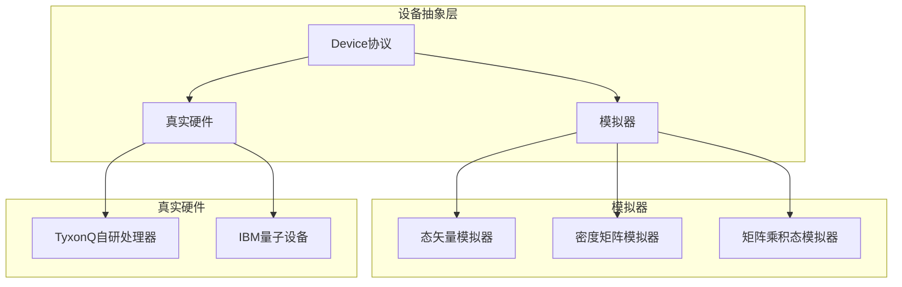
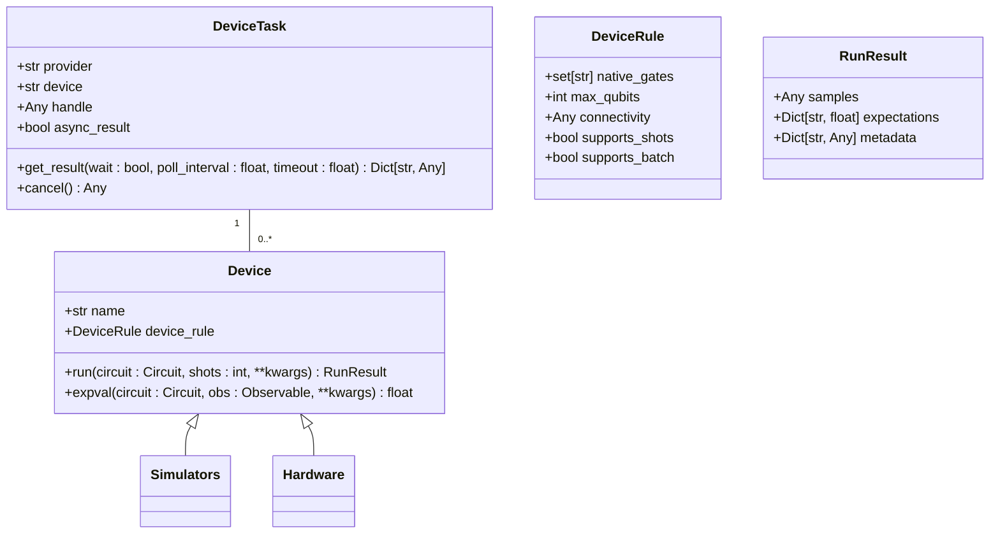
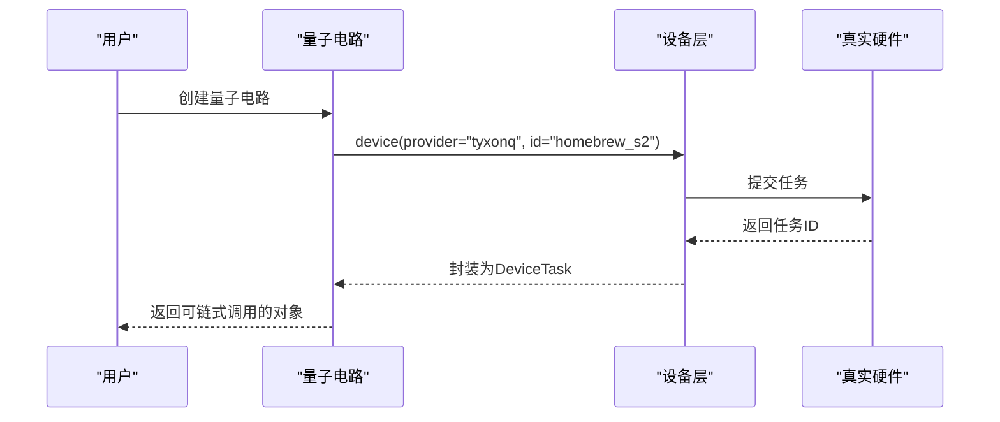

# 设备抽象层

<cite>
**本文档引用的文件**
- [devices.rst](file://docs-ng/source/next/user/devices.rst)
- [base.py](file://src/tyxonq/devices/base.py)
- [driver.py](file://src/tyxonq/devices/simulators/driver.py)
- [statevector/engine.py](file://src/tyxonq/devices/simulators/statevector/engine.py)
- [density_matrix/engine.py](file://src/tyxonq/devices/simulators/density_matrix/engine.py)
- [matrix_product_state/engine.py](file://src/tyxonq/devices/simulators/matrix_product_state/engine.py)
- [config.py](file://src/tyxonq/devices/hardware/config.py)
- [tyxonq/driver.py](file://src/tyxonq/devices/hardware/tyxonq/driver.py)
- [ibm/driver.py](file://src/tyxonq/devices/hardware/ibm/driver.py)
- [api.py](file://src/tyxonq/cloud/api.py)
</cite>

## 更新摘要
**已做更改**
- 更新了`设备驱动设计模式与接口规范`和`设备配置与选择`部分，以反映`base.py`中`run`和`expval`方法的最新行为。
- 增加了对批量运行和分组编译的支持说明。
- 修正了与真实硬件交互时需预先编译为`source`的约束条件。
- 更新了代码示例以匹配当前API用法。

## 目录
1. [引言](#引言)
2. [设备抽象层架构](#设备抽象层架构)
3. [设备驱动设计模式与接口规范](#设备驱动设计模式与接口规范)
4. [模拟器类型详解](#模拟器类型详解)
5. [真实硬件集成](#真实硬件集成)
6. [设备配置与选择](#设备配置与选择)
7. [设备层在链式API中的角色](#设备层在链式api中的角色)
8. [与编译器和后处理模块的交互](#与编译器和后处理模块的交互)

## 引言
设备抽象层是TyxonQ框架的核心组件，旨在为量子计算任务提供统一的执行环境。该层通过抽象化模拟器和真实量子硬件的差异，使用户能够无缝地在不同设备间切换，而无需修改核心算法代码。设备抽象层不仅支持多种模拟器类型，还集成了自研和第三方量子处理器，为量子算法的开发、测试和部署提供了灵活且强大的基础设施。

## 设备抽象层架构
设备抽象层采用分层设计，将设备管理、任务调度和结果处理分离，确保系统的可扩展性和可维护性。该层通过统一的接口协议，将不同类型的设备（包括模拟器和真实硬件）封装为可互换的组件。设备抽象层的核心是`Device`协议，定义了所有设备必须实现的基本方法，如`run`和`expval`。通过这种设计，用户可以专注于量子算法的开发，而无需关心底层设备的具体实现细节。



**图示来源**
- [base.py](file://src/tyxonq/devices/base.py#L67-L78)

## 设备驱动设计模式与接口规范
设备驱动的设计遵循工厂模式和策略模式，通过`resolve_driver`函数根据设备提供者（provider）和设备类型（device）动态选择合适的驱动程序。每个驱动程序实现统一的接口，包括`run`、`submit_task`、`get_task_details`等方法，确保了不同设备间的一致性。驱动程序通过`DeviceTask`对象封装任务，提供统一的任务管理和结果获取机制。

**设备驱动接口规范**
- `run`: 执行量子电路，返回运行结果
- `submit_task`: 提交任务到远程设备
- `get_task_details`: 获取任务详细信息
- `list_devices`: 列出可用设备
- `expval`: 计算期望值



**图示来源**
- [base.py](file://src/tyxonq/devices/base.py#L15-L15)
- [base.py](file://src/tyxonq/devices/base.py#L67-L78)

**本节来源**
- [base.py](file://src/tyxonq/devices/base.py#L15-L388)
- [driver.py](file://src/tyxonq/devices/simulators/driver.py#L6-L16)
- [tyxonq/driver.py](file://src/tyxonq/devices/hardware/tyxonq/driver.py#L12-L41)

## 模拟器类型详解
设备抽象层支持三种主要的模拟器类型：态矢量（statevector）、密度矩阵（density-matrix）和矩阵乘积态（MPS）模拟器。每种模拟器都有其独特的原理、性能特点和适用场景，用户可以根据具体需求选择合适的模拟器。

### 态矢量模拟器
态矢量模拟器使用一个大小为2^n的复数向量来表示量子态，其中n是量子比特数。该模拟器适用于纯态量子系统的模拟，具有较高的计算效率，但内存消耗随量子比特数呈指数增长。

**性能特点**
- 内存复杂度：O(2^n)
- 时间复杂度：O(poly(gates)*2^n)
- 适用场景：小规模量子电路的精确模拟

**本节来源**
- [statevector/engine.py](file://src/tyxonq/devices/simulators/statevector/engine.py#L31-L261)

### 密度矩阵模拟器
密度矩阵模拟器使用一个大小为2^n x 2^n的矩阵来表示混合量子态。该模拟器能够模拟包含噪声的量子系统，适用于研究量子噪声对计算结果的影响。

**性能特点**
- 内存复杂度：O(4^n)
- 时间复杂度：O(poly(gates)*4^n)
- 适用场景：噪声量子系统的模拟和研究

**本节来源**
- [density_matrix/engine.py](file://src/tyxonq/devices/simulators/density_matrix/engine.py#L31-L205)

### 矩阵乘积态模拟器
矩阵乘积态（MPS）模拟器将量子态表示为矩阵乘积的形式，通过限制纠缠程度来降低计算复杂度。该模拟器适用于大规模量子系统的模拟，特别是当系统纠缠程度较低时。

**性能特点**
- 内存和时间复杂度：与纠缠程度相关，通常远低于2^n
- 适用场景：大规模量子系统的模拟，特别是低纠缠系统

**本节来源**
- [matrix_product_state/engine.py](file://src/tyxonq/devices/simulators/matrix_product_state/engine.py#L34-L209)

## 真实硬件集成
设备抽象层通过硬件适配器与真实量子设备集成，目前支持TyxonQ自研的Homebrew_S2处理器和IBM量子设备。硬件适配器负责将量子电路编译为设备特定的指令集，并通过API与设备进行通信。

### TyxonQ自研处理器
TyxonQ自研的Homebrew_S2处理器通过`tyxonq/driver.py`进行管理。该驱动程序实现了与TyxonQ云平台的通信协议，支持任务提交、状态查询和结果获取。用户可以通过设置API密钥和设备ID来访问自研处理器。

**本节来源**
- [tyxonq/driver.py](file://src/tyxonq/devices/hardware/tyxonq/driver.py#L12-L41)

### IBM量子设备
IBM量子设备通过`ibm/driver.py`进行管理。该驱动程序目前为骨架实现，未来将集成Qiskit适配器以支持完整的IBM量子设备功能。用户可以通过IBM Quantum平台访问其量子处理器。

**本节来源**
- [ibm/driver.py](file://src/tyxonq/devices/hardware/ibm/driver.py#L1-L40)

## 设备配置与选择
用户可以通过`device()`方法指定设备提供者和设备参数，实现设备的灵活配置和选择。该方法支持多种参数设置，包括设备名称、提供者、设备ID和测量次数（shots）。

### 代码示例
```python
# 使用默认设备
device()

# 指定设备名称
device(name="simulator::statevector")

# 指定提供者和设备
device(provider="tyxonq", id="homebrew_s2")

# 设置测量次数
device(shots=1024)
```

**本节来源**
- [api.py](file://src/tyxonq/cloud/api.py#L29-L30)
- [base.py](file://src/tyxonq/devices/base.py#L15-L15)

## 设备层在链式API中的角色
设备层在链式API中扮演着关键角色，作为连接量子电路和执行环境的桥梁。通过`Circuit.device()`方法，用户可以将设备配置与量子电路链式连接，实现流畅的量子算法开发流程。



**图示来源**
- [circuit.py](file://src/tyxonq/core/ir/circuit.py#L178-L181)

## 与编译器和后处理模块的交互
设备层与编译器和后处理模块紧密协作，形成完整的量子计算工作流。编译器负责将高级量子电路转换为设备可执行的指令，设备层负责执行这些指令，后处理模块则对执行结果进行分析和处理。

**交互流程**
1. 用户提交量子电路
2. 编译器将电路编译为设备特定的指令集
3. 设备层执行编译后的电路
4. 后处理模块对结果进行分析和可视化

**本节来源**
- [base.py](file://src/tyxonq/devices/base.py#L15-L388)
- [postprocessing](file://src/tyxonq/postprocessing)