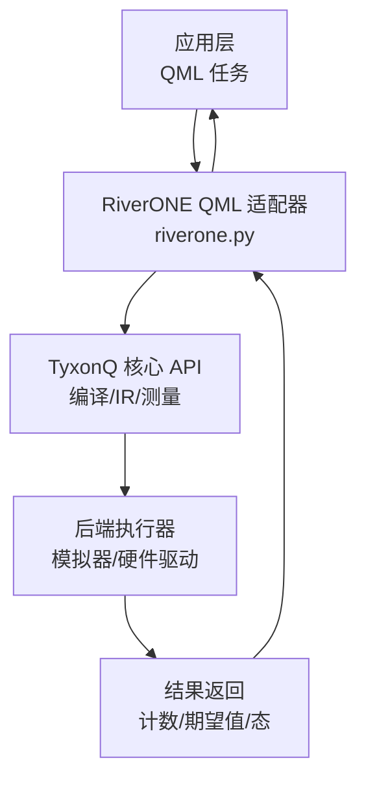
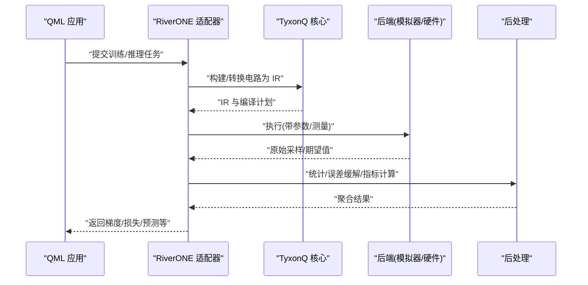
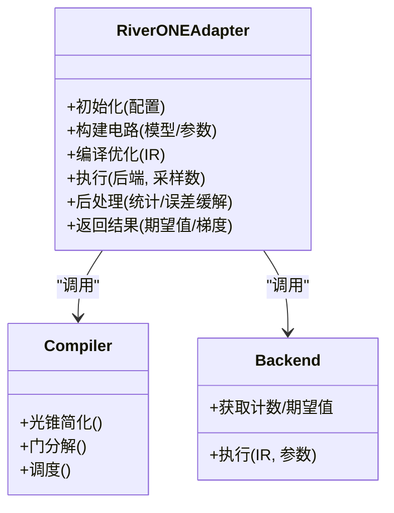
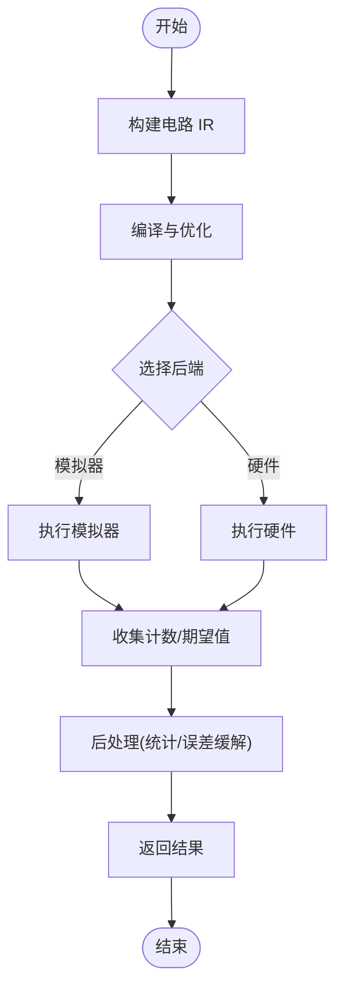
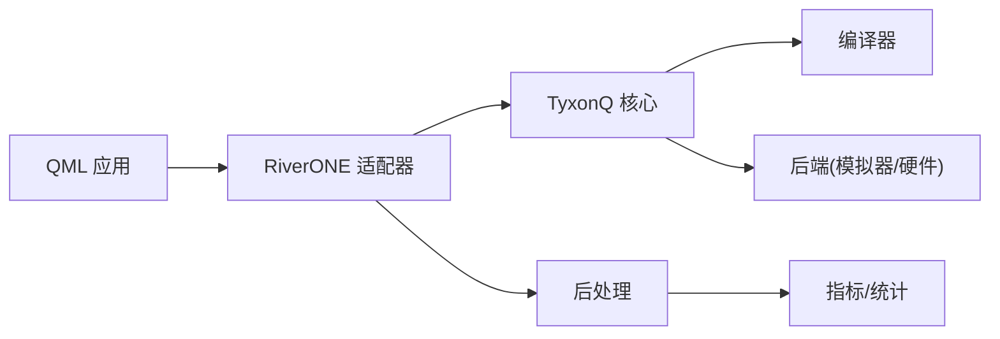

# RiverONE QML适配器

<cite>
**本文引用的文件**
- [riverone.py](file://src/tyxonq/applications/qml/riverone.py)
- [__init__.py](file://src/tyxonq/applications/qml/__init__.py)
- [riverone_qml.py](file://examples/riverone_qml.py)
- [test_riverone_qml_adapter.py](file://tests_core_module/test_riverone_qml_adapter.py)
- [test_riverone_qml_example.py](file://tests_examples/test_riverone_qml_example.py)
</cite>

## 目录
1. [简介](#简介)
2. [项目结构](#项目结构)
3. [核心组件](#核心组件)
4. [架构总览](#架构总览)
5. [详细组件分析](#详细组件分析)
6. [依赖关系分析](#依赖关系分析)
7. [性能考虑](#性能考虑)
8. [故障排查指南](#故障排查指南)
9. [结论](#结论)
10. [附录](#附录)

## 简介
本文件聚焦于 TyxonQ 中的 RiverONE QML 适配器，说明其职责、在整体架构中的位置、数据流与调用流程，以及使用方式与注意事项。该适配器将 TyxonQ 的量子计算能力暴露给上层 QML（Quantum Machine Learning）应用，使开发者能够以统一的接口进行电路构建、执行与结果后处理，同时保持与底层设备/仿真器的解耦。

## 项目结构
RiverONE QML 适配相关代码主要位于以下路径：
- 适配器实现：src/tyxonq/applications/qml/riverone.py
- 模块入口：src/tyxonq/applications/qml/__init__.py
- 示例脚本：examples/riverone_qml.py
- 单元测试：tests_core_module/test_riverone_qml_adapter.py
- 示例测试：tests_examples/test_riverone_qml_example.py

图表来源
- [riverone.py](file://src/tyxonq/applications/qml/riverone.py)
- [__init__.py](file://src/tyxonq/applications/qml/__init__.py)

章节来源
- [riverone.py:1-200](file://src/tyxonq/applications/qml/riverone.py#L1-L200)
- [__init__.py:1-200](file://src/tyxonq/applications/qml/__init__.py#L1-L200)

## 核心组件
- RiverONE QML 适配器：封装 TyxonQ 的电路构建、编译、执行与后处理流程，提供面向 QML 的简洁接口。
- 配置与上下文：管理运行参数（如采样次数、后端选择、优化选项等）。
- 执行管线：将高层 QML 请求转换为 TyxonQ IR，经编译器优化后下发到具体后端执行。
- 结果聚合：对多次采样的结果进行统计、期望值计算与误差缓解（可选）。

章节来源
- [riverone.py:1-200](file://src/tyxonq/applications/qml/riverone.py#L1-L200)

## 架构总览
下图展示了从 QML 任务到执行结果的端到端流程，包括编译、调度、执行与后处理的关键阶段。

图表来源
- [riverone.py:1-200](file://src/tyxonq/applications/qml/riverone.py#L1-L200)

## 详细组件分析

### RiverONE 适配器类与方法
- 职责：统一 QML 任务入口，负责参数绑定、电路生成、编译、执行与结果解析。
- 关键方法（概念性描述）：
  - 初始化：加载配置、注册后端、准备缓存。
  - 构建电路：根据 QML 模型或任务描述生成电路 IR。
  - 编译与优化：调用编译器进行光锥简化、门分解、调度等。
  - 执行：选择合适后端并执行，支持批处理与并行。
  - 后处理：统计计数、计算期望值、误差缓解、指标汇总。
  - 梯度/优化：结合参数平移或数值梯度，返回可用于优化的信号。

图表来源
- [riverone.py:1-200](file://src/tyxonq/applications/qml/riverone.py#L1-L200)

章节来源
- [riverone.py:1-200](file://src/tyxonq/applications/qml/riverone.py#L1-L200)

### 执行流程（算法流程图）

图表来源
- [riverone.py:1-200](file://src/tyxonq/applications/qml/riverone.py#L1-L200)

### 示例与测试
- 示例脚本展示了如何调用适配器完成一次典型的 QML 任务（如 VQE/QAOA/分类等），包括参数设置、电路构建、执行与结果读取。
- 单元测试覆盖了适配器的基本功能路径，确保在不同后端和配置下行为一致。

章节来源
- [riverone_qml.py:1-200](file://examples/riverone_qml.py#L1-L200)
- [test_riverone_qml_adapter.py:1-200](file://tests_core_module/test_riverone_qml_adapter.py#L1-L200)
- [test_riverone_qml_example.py:1-200](file://tests_examples/test_riverone_qml_example.py#L1-L200)

## 依赖关系分析
- 内部依赖：
  - TyxonQ 核心：IR、编译器、测量与类型系统。
  - 设备抽象：统一模拟器/硬件驱动接口。
  - 后处理库：统计、误差缓解、指标计算。
- 外部依赖：
  - QML 框架（由上层应用引入），通过适配器接口交互。
  - 可选：数值后端（NumPy/Torch/Cupy）用于梯度与优化。

图表来源
- [riverone.py:1-200](file://src/tyxonq/applications/qml/riverone.py#L1-L200)

章节来源
- [riverone.py:1-200](file://src/tyxonq/applications/qml/riverone.py#L1-L200)

## 性能考虑
- 编译优化：启用光锥简化与门分解以减少深度与门数量。
- 批处理与并行：对多组参数或样本进行批处理，提升吞吐。
- 后端选择：小规模验证优先使用模拟器；大规模或真实任务切换至硬件。
- 采样策略：合理设置采样次数，平衡精度与耗时。
- 内存与检查点：大电路场景采用检查点或分块执行以降低峰值内存。

[本节为通用指导，不直接分析具体文件]

## 故障排查指南
- 常见错误定位：
  - 参数绑定失败：检查参数范围与电路约束是否匹配。
  - 编译失败：查看编译器日志，确认门集与目标设备兼容。
  - 执行异常：核对后端连接状态、配额与噪声模型配置。
  - 结果不一致：对比不同后端/采样次数下的统计波动。
- 调试建议：
  - 启用详细日志，输出 IR 与编译计划。
  - 逐步缩小问题范围：先在小规模电路上复现。
  - 使用单元测试用例作为最小可复现实例。

章节来源
- [test_riverone_qml_adapter.py:1-200](file://tests_core_module/test_riverone_qml_adapter.py#L1-L200)
- [test_riverone_qml_example.py:1-200](file://tests_examples/test_riverone_qml_example.py#L1-L200)

## 结论
RiverONE QML 适配器为上层 QML 应用提供了稳定、可扩展的量子计算接入点。通过统一的电路构建、编译与执行管线，屏蔽了底层差异，提升了开发效率与可移植性。建议在复杂任务中结合编译优化、批处理与合适的后端选择以获得更佳性能。

[本节为总结，不直接分析具体文件]

## 附录
- 快速上手：参考示例脚本，按步骤完成环境准备、任务配置与执行。
- 扩展指南：如需新增后端或后处理逻辑，遵循现有接口约定进行扩展。

[本节为补充信息，不直接分析具体文件]