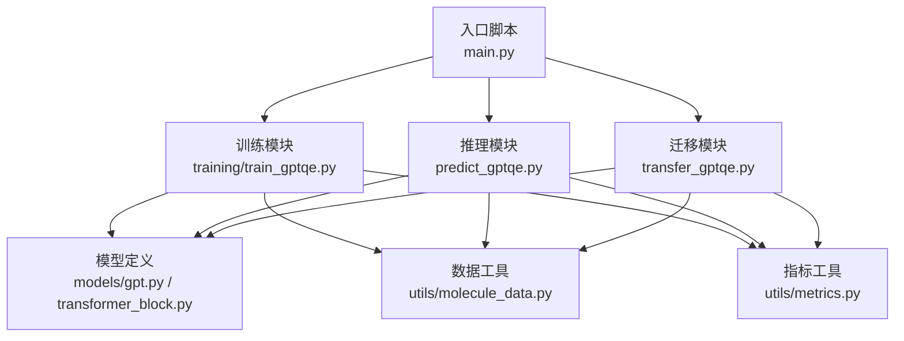
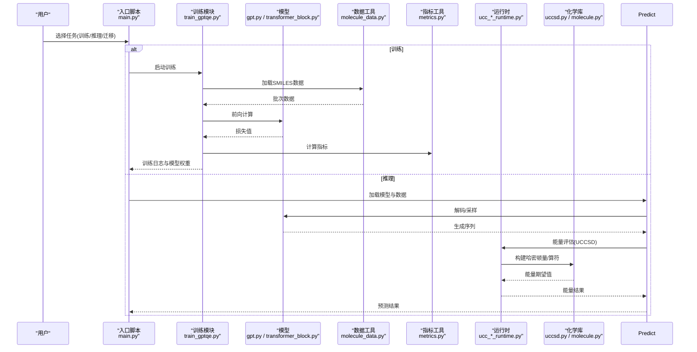
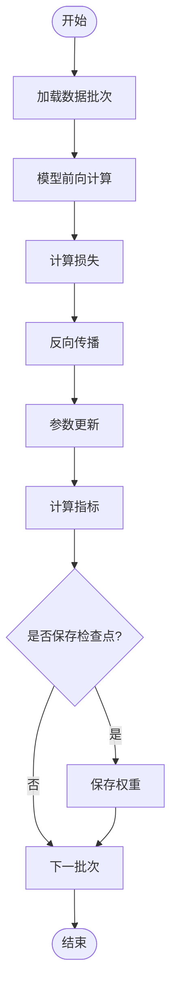
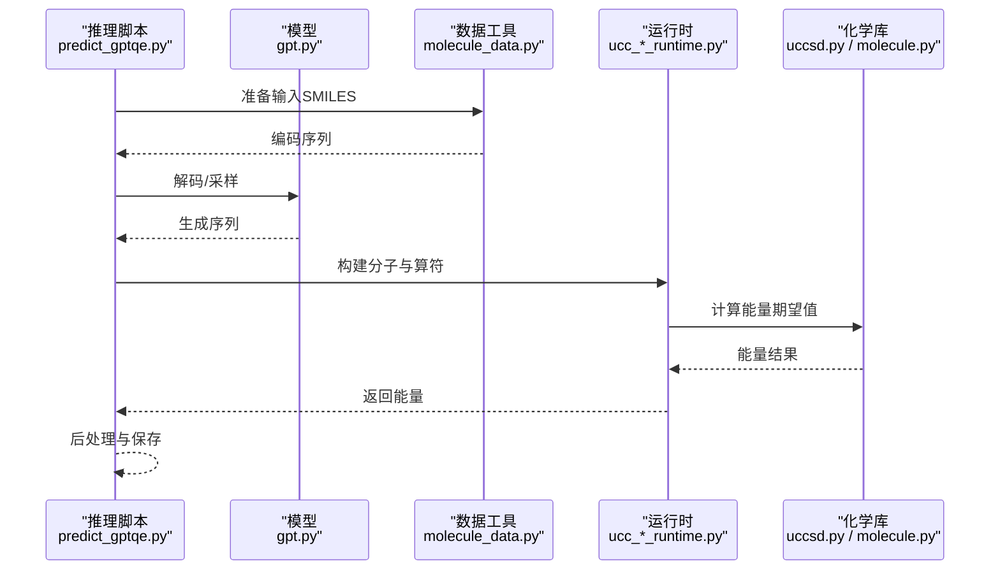
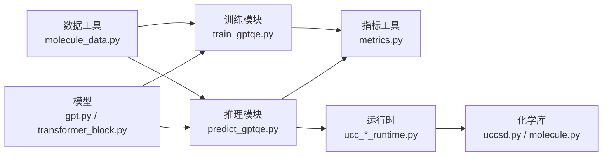

# SMILES药物设计流水线

<cite>
**本文档引用的文件**
- [examples/SMILES-TyxonQ/main.py](file://examples/SMILES-TyxonQ/main.py)
- [examples/SMILES-TyxonQ/predict_gptqe.py](file://examples/SMILES-TyxonQ/predict_gptqe.py)
- [examples/SMILES-TyxonQ/transfer_gptqe.py](file://examples/SMILES-TyxonQ/transfer_gptqe.py)
- [examples/SMILES-TyxonQ/models/gpt.py](file://examples/SMILES-TyxonQ/models/gpt.py)
- [examples/SMILES-TyxonQ/models/transformer_block.py](file://examples/SMILES-TyxonQ/models/transformer_block.py)
- [examples/SMILES-TyxonQ/training/train_gptqe.py](file://examples/SMILES-TyxonQ/training/train_gptqe.py)
- [examples/SMILES-TyxonQ/utils/molecule_data.py](file://examples/SMILES-TyxonQ/utils/molecule_data.py)
- [examples/SMILES-TyxonQ/utils/metrics.py](file://examples/SMILES-TyxonQ/utils/metrics.py)
- [examples/SMILES-TyxonQ/Readme.md](file://examples/SMILES-TyxonQ/Readme.md)
- [src/tyxonq/applications/chem/molecule.py](file://src/tyxonq/applications/chem/molecule.py)
- [src/tyxonq/applications/chem/algorithms/uccsd.py](file://src/tyxonq/applications/chem/algorithms/uccsd.py)
- [src/tyxonq/applications/chem/runtimes/ucc_device_runtime.py](file://src/tyxonq/applications/chem/runtimes/ucc_device_runtime.py)
- [src/tyxonq/applications/chem/runtimes/ucc_numeric_runtime.py](file://src/tyxonq/applications/chem/runtimes/ucc_numeric_runtime.py)
- [src/tyxonq/applications/chem/constants.py](file://src/tyxonq/applications/chem/constants.py)
- [examples/gqe_drug_design/main.py](file://examples/gqe_drug_design/main.py)
- [examples/gqe_drug_design/predict_gptqe.py](file://examples/gqe_drug_design/predict_gptqe.py)
- [examples/gqe_drug_design/transfer_gptqe.py](file://examples/gqe_drug_design/transfer_gptqe.py)
- [examples/gqe_drug_design/models/gpt.py](file://examples/gqe_drug_design/models/gpt.py)
- [examples/gqe_drug_design/models/transformer_block.py](file://examples/gqe_drug_design/models/transformer_block.py)
- [examples/gqe_drug_design/training/train_gptqe.py](file://examples/gqe_drug_design/training/train_gptqe.py)
- [examples/gqe_drug_design/utils/molecule_data.py](file://examples/gqe_drug_design/utils/molecule_data.py)
- [examples/gqe_drug_design/utils/metrics.py](file://examples/gqe_drug_design/utils/metrics.py)
</cite>

## 目录
1. [简介](#简介)
2. [项目结构](#项目结构)
3. [核心组件](#核心组件)
4. [架构总览](#架构总览)
5. [详细组件分析](#详细组件分析)
6. [依赖关系分析](#依赖关系分析)
7. [性能考量](#性能考量)
8. [故障排查指南](#故障排查指南)
9. [结论](#结论)
10. [附录](#附录)

## 简介
本仓库提供基于SMILES的量子化学药物设计流水线，结合经典深度学习模型（GPT/Transformer）与TyxonQ量子计算后端，实现从分子表示、训练、推理到能量预测的端到端流程。该流水线支持：
- 使用SMILES序列构建分子数据集并进行分词与编码
- 训练生成式模型以学习有效分子序列分布
- 通过量子或数值运行时评估分子能量（UCCSD等算法）
- 将生成的候选分子进行批量预测与结果后处理

该文档面向希望理解并复用该流水线的用户，既包含高层架构说明，也提供代码级流程图与关键路径指引。

## 项目结构
SMILES药物设计流水线主要位于示例目录中，分为两类：
- examples/SMILES-TyxonQ：面向SMILES输入的完整流水线，包含数据准备、模型定义、训练脚本、推理与迁移脚本
- examples/gqe_drug_design：另一套等价实现的药物设计示例，结构与前者类似

核心目录组织如下：
- models：定义GPT与Transformer块
- training：训练脚本，负责数据加载、优化器配置与训练循环
- utils：分子数据处理与指标计算工具
- main.py：入口脚本，串联训练/推理/迁移等任务
- predict_gptqe.py：推理脚本，加载模型并对输入SMILES进行预测
- transfer_gptqe.py：迁移学习脚本，用于在目标域上微调或评估

图表来源
- [examples/SMILES-TyxonQ/main.py](file://examples/SMILES-TyxonQ/main.py)
- [examples/SMILES-TyxonQ/training/train_gptqe.py](file://examples/SMILES-TyxonQ/training/train_gptqe.py)
- [examples/SMILES-TyxonQ/predict_gptqe.py](file://examples/SMILES-TyxonQ/predict_gptqe.py)
- [examples/SMILES-TyxonQ/transfer_gptqe.py](file://examples/SMILES-TyxonQ/transfer_gptqe.py)
- [examples/SMILES-TyxonQ/models/gpt.py](file://examples/SMILES-TyxonQ/models/gpt.py)
- [examples/SMILES-TyxonQ/models/transformer_block.py](file://examples/SMILES-TyxonQ/models/transformer_block.py)
- [examples/SMILES-TyxonQ/utils/molecule_data.py](file://examples/SMILES-TyxonQ/utils/molecule_data.py)
- [examples/SMILES-TyxonQ/utils/metrics.py](file://examples/SMILES-TyxonQ/utils/metrics.py)

章节来源
- [examples/SMILES-TyxonQ/Readme.md](file://examples/SMILES-TyxonQ/Readme.md)
- [examples/SMILES-TyxonQ/main.py](file://examples/SMILES-TyxonQ/main.py)

## 核心组件
- 分子数据工具：负责SMILES解析、分词、编码与批次构建，为训练与推理提供统一的数据接口
- 模型定义：GPT与Transformer块，用于学习分子序列的概率分布
- 训练模块：数据加载、损失函数、优化器、训练循环与日志记录
- 推理模块：加载预训练模型，对输入SMILES进行采样或解码，输出候选分子序列
- 迁移模块：在目标域上进行微调或评估，支持权重初始化与参数冻结策略
- 指标工具：计算生成质量与预测误差等指标
- 量子/数值运行时：调用TyxonQ的UCCSD等算法，对分子能量进行数值或设备执行

章节来源
- [examples/SMILES-TyxonQ/utils/molecule_data.py](file://examples/SMILES-TyxonQ/utils/molecule_data.py)
- [examples/SMILES-TyxonQ/models/gpt.py](file://examples/SMILES-TyxonQ/models/gpt.py)
- [examples/SMILES-TyxonQ/models/transformer_block.py](file://examples/SMILES-TyxonQ/models/transformer_block.py)
- [examples/SMILES-TyxonQ/training/train_gptqe.py](file://examples/SMILES-TyxonQ/training/train_gptqe.py)
- [examples/SMILES-TyxonQ/predict_gptqe.py](file://examples/SMILES-TyxonQ/predict_gptqe.py)
- [examples/SMILES-TyxonQ/transfer_gptqe.py](file://examples/SMILES-TyxonQ/transfer_gptqe.py)
- [examples/SMILES-TyxonQ/utils/metrics.py](file://examples/SMILES-TyxonQ/utils/metrics.py)

## 架构总览
下图展示了从数据到预测的整体流程，包括经典模型训练与量子/数值能量评估的集成点。

图表来源
- [examples/SMILES-TyxonQ/main.py](file://examples/SMILES-TyxonQ/main.py)
- [examples/SMILES-TyxonQ/training/train_gptqe.py](file://examples/SMILES-TyxonQ/training/train_gptqe.py)
- [examples/SMILES-TyxonQ/predict_gptqe.py](file://examples/SMILES-TyxonQ/predict_gptqe.py)
- [examples/SMILES-TyxonQ/models/gpt.py](file://examples/SMILES-TyxonQ/models/gpt.py)
- [examples/SMILES-TyxonQ/models/transformer_block.py](file://examples/SMILES-TyxonQ/models/transformer_block.py)
- [examples/SMILES-TyxonQ/utils/molecule_data.py](file://examples/SMILES-TyxonQ/utils/molecule_data.py)
- [examples/SMILES-TyxonQ/utils/metrics.py](file://examples/SMILES-TyxonQ/utils/metrics.py)
- [src/tyxonq/applications/chem/runtimes/ucc_device_runtime.py](file://src/tyxonq/applications/chem/runtimes/ucc_device_runtime.py)
- [src/tyxonq/applications/chem/runtimes/ucc_numeric_runtime.py](file://src/tyxonq/applications/chem/runtimes/ucc_numeric_runtime.py)
- [src/tyxonq/applications/chem/algorithms/uccsd.py](file://src/tyxonq/applications/chem/algorithms/uccsd.py)
- [src/tyxonq/applications/chem/molecule.py](file://src/tyxonq/applications/chem/molecule.py)

## 详细组件分析

### 数据与预处理（SMILES→张量）
- 功能要点
  - 读取SMILES文本，进行分词与编码，构建批次
  - 提供训练与推理的统一数据接口
  - 支持过滤无效序列与长度截断
- 复杂度与优化
  - 分词与编码通常为线性时间O(N)，N为序列长度
  - 批处理可提升吞吐，注意内存占用与填充策略
- 错误处理
  - 对非法SMILES进行异常捕获与跳过
  - 对空批次或维度不匹配进行校验

章节来源
- [examples/SMILES-TyxonQ/utils/molecule_data.py](file://examples/SMILES-TyxonQ/utils/molecule_data.py)
- [examples/gqe_drug_design/utils/molecule_data.py](file://examples/gqe_drug_design/utils/molecule_data.py)

### 模型定义（GPT与Transformer块）
- 功能要点
  - GPT模型作为生成器，学习SMILES序列的条件概率
  - Transformer块提供注意力机制与前馈网络
- 设计模式
  - 模块化堆叠，便于扩展层数与隐藏维度
  - 位置编码与掩码确保自回归生成正确性
- 性能考虑
  - 注意力复杂度O(L^2)，可通过序列裁剪或稀疏化优化
  - 混合精度与梯度累积可用于大模型训练

章节来源
- [examples/SMILES-TyxonQ/models/gpt.py](file://examples/SMILES-TyxonQ/models/gpt.py)
- [examples/SMILES-TyxonQ/models/transformer_block.py](file://examples/SMILES-TyxonQ/models/transformer_block.py)
- [examples/gqe_drug_design/models/gpt.py](file://examples/gqe_drug_design/models/gpt.py)
- [examples/gqe_drug_design/models/transformer_block.py](file://examples/gqe_drug_design/models/transformer_block.py)

### 训练流程（数据→损失→优化）
- 功能要点
  - 加载数据批次，前向计算得到预测分布
  - 计算交叉熵损失，反向传播更新参数
  - 记录指标与保存检查点
- 关键步骤
  - 学习率调度与正则化
  - 早停与验证集评估
- 可扩展性
  - 多卡并行与梯度同步
  - 动态批大小与梯度裁剪

图表来源
- [examples/SMILES-TyxonQ/training/train_gptqe.py](file://examples/SMILES-TyxonQ/training/train_gptqe.py)
- [examples/gqe_drug_design/training/train_gptqe.py](file://examples/gqe_drug_design/training/train_gptqe.py)

章节来源
- [examples/SMILES-TyxonQ/training/train_gptqe.py](file://examples/SMILES-TyxonQ/training/train_gptqe.py)
- [examples/gqe_drug_design/training/train_gptqe.py](file://examples/gqe_drug_design/training/train_gptqe.py)

### 推理与预测（生成→能量评估）
- 功能要点
  - 加载预训练模型，对输入SMILES进行解码或采样
  - 将生成序列转换为分子结构，调用运行时计算能量
- 关键步骤
  - 温度采样或束搜索控制生成多样性
  - 能量评估可选择数值或设备后端
- 错误处理
  - 对无效分子结构进行回退与重试
  - 对运行时异常进行捕获与日志记录

图表来源
- [examples/SMILES-TyxonQ/predict_gptqe.py](file://examples/SMILES-TyxonQ/predict_gptqe.py)
- [examples/gqe_drug_design/predict_gptqe.py](file://examples/gqe_drug_design/predict_gptqe.py)
- [src/tyxonq/applications/chem/runtimes/ucc_device_runtime.py](file://src/tyxonq/applications/chem/runtimes/ucc_device_runtime.py)
- [src/tyxonq/applications/chem/runtimes/ucc_numeric_runtime.py](file://src/tyxonq/applications/chem/runtimes/ucc_numeric_runtime.py)
- [src/tyxonq/applications/chem/algorithms/uccsd.py](file://src/tyxonq/applications/chem/algorithms/uccsd.py)
- [src/tyxonq/applications/chem/molecule.py](file://src/tyxonq/applications/chem/molecule.py)

章节来源
- [examples/SMILES-TyxonQ/predict_gptqe.py](file://examples/SMILES-TyxonQ/predict_gptqe.py)
- [examples/gqe_drug_design/predict_gptqe.py](file://examples/gqe_drug_design/predict_gptqe.py)

### 迁移学习（目标域微调）
- 功能要点
  - 在目标域数据上对预训练模型进行微调
  - 支持参数冻结与分层学习率
- 关键步骤
  - 数据适配与重分词
  - 验证集监控与早停
- 应用场景
  - 特定分子家族或性质优化

章节来源
- [examples/SMILES-TyxonQ/transfer_gptqe.py](file://examples/SMILES-TyxonQ/transfer_gptqe.py)
- [examples/gqe_drug_design/transfer_gptqe.py](file://examples/gqe_drug_design/transfer_gptqe.py)

### 指标与评估
- 功能要点
  - 计算生成质量指标（如唯一性、有效性）
  - 计算预测误差（如MAE、RMSE）
- 可扩展性
  - 支持自定义指标注册与聚合

章节来源
- [examples/SMILES-TyxonQ/utils/metrics.py](file://examples/SMILES-TyxonQ/utils/metrics.py)
- [examples/gqe_drug_design/utils/metrics.py](file://examples/gqe_drug_design/utils/metrics.py)

## 依赖关系分析
- 内部依赖
  - 训练与推理均依赖模型定义与数据工具
  - 能量评估依赖TyxonQ化学库与运行时
- 外部依赖
  - 深度学习框架（PyTorch等）
  - 量子计算后端（数值模拟或硬件设备）
- 耦合度
  - 数据与模型松耦合，便于替换数据源或模型结构
  - 运行时与算法解耦，支持数值与设备切换

图表来源
- [examples/SMILES-TyxonQ/utils/molecule_data.py](file://examples/SMILES-TyxonQ/utils/molecule_data.py)
- [examples/SMILES-TyxonQ/training/train_gptqe.py](file://examples/SMILES-TyxonQ/training/train_gptqe.py)
- [examples/SMILES-TyxonQ/predict_gptqe.py](file://examples/SMILES-TyxonQ/predict_gptqe.py)
- [examples/SMILES-TyxonQ/models/gpt.py](file://examples/SMILES-TyxonQ/models/gpt.py)
- [examples/SMILES-TyxonQ/models/transformer_block.py](file://examples/SMILES-TyxonQ/models/transformer_block.py)
- [examples/SMILES-TyxonQ/utils/metrics.py](file://examples/SMILES-TyxonQ/utils/metrics.py)
- [src/tyxonq/applications/chem/runtimes/ucc_device_runtime.py](file://src/tyxonq/applications/chem/runtimes/ucc_device_runtime.py)
- [src/tyxonq/applications/chem/runtimes/ucc_numeric_runtime.py](file://src/tyxonq/applications/chem/runtimes/ucc_numeric_runtime.py)
- [src/tyxonq/applications/chem/algorithms/uccsd.py](file://src/tyxonq/applications/chem/algorithms/uccsd.py)
- [src/tyxonq/applications/chem/molecule.py](file://src/tyxonq/applications/chem/molecule.py)

章节来源
- [examples/SMILES-TyxonQ/main.py](file://examples/SMILES-TyxonQ/main.py)
- [examples/gqe_drug_design/main.py](file://examples/gqe_drug_design/main.py)

## 性能考量
- 数据层面
  - 批大小与序列长度影响内存与速度，建议根据GPU显存调整
  - 使用缓存与并行I/O减少数据加载瓶颈
- 模型层面
  - 注意力复杂度随序列长度平方增长，可采用序列裁剪或稀疏注意力
  - 混合精度训练可显著提升吞吐
- 运行时层面
  - 数值后端适合快速验证，设备后端适合真实量子电路执行
  - 算符分组与测量优化可减少shots开销

[本节为通用指导，无需具体文件引用]

## 故障排查指南
- 数据问题
  - 无效SMILES导致分词失败：检查数据清洗与过滤逻辑
  - 批次维度不匹配：确认填充策略与张量形状
- 训练问题
  - 损失不收敛：检查学习率、梯度裁剪与数据质量
  - 内存溢出：减小批大小或使用梯度累积
- 推理问题
  - 生成序列无效：调整温度或束搜索宽度
  - 能量计算异常：检查分子结构转换与运行时配置
- 运行时问题
  - 设备连接失败：检查后端配置与权限
  - 数值计算发散：检查哈密顿量构建与初始参数

章节来源
- [examples/SMILES-TyxonQ/utils/molecule_data.py](file://examples/SMILES-TyxonQ/utils/molecule_data.py)
- [examples/SMILES-TyxonQ/training/train_gptqe.py](file://examples/SMILES-TyxonQ/training/train_gptqe.py)
- [examples/SMILES-TyxonQ/predict_gptqe.py](file://examples/SMILES-TyxonQ/predict_gptqe.py)
- [src/tyxonq/applications/chem/runtimes/ucc_device_runtime.py](file://src/tyxonq/applications/chem/runtimes/ucc_device_runtime.py)
- [src/tyxonq/applications/chem/runtimes/ucc_numeric_runtime.py](file://src/tyxonq/applications/chem/runtimes/ucc_numeric_runtime.py)
- [src/tyxonq/applications/chem/algorithms/uccsd.py](file://src/tyxonq/applications/chem/algorithms/uccsd.py)
- [src/tyxonq/applications/chem/molecule.py](file://src/tyxonq/applications/chem/molecule.py)

## 结论
该SMILES药物设计流水线将经典生成模型与量子化学计算有机结合，提供了从数据到预测的完整解决方案。通过模块化设计与可扩展的运行时接口，用户可根据需求灵活替换数据源、模型结构与计算后端。建议在大规模应用中关注数据质量、模型效率与运行时稳定性，以获得更可靠的分子设计与能量预测结果。

[本节为总结性内容，无需具体文件引用]

## 附录
- 相关示例与文档
  - 示例说明与使用说明参见README
  - TyxonQ化学库与运行时接口参考源码与测试用例

章节来源
- [examples/SMILES-TyxonQ/Readme.md](file://examples/SMILES-TyxonQ/Readme.md)