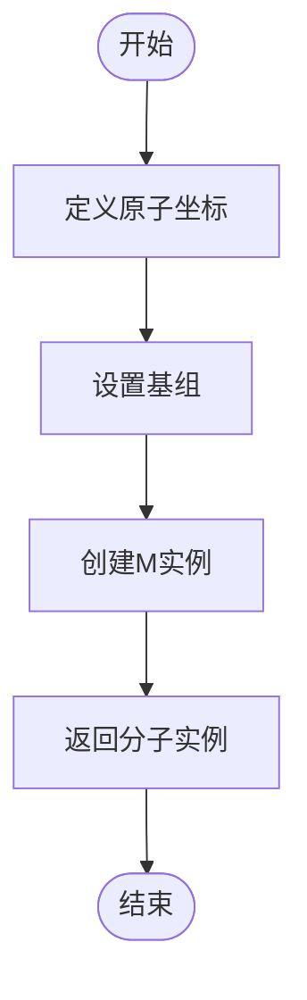
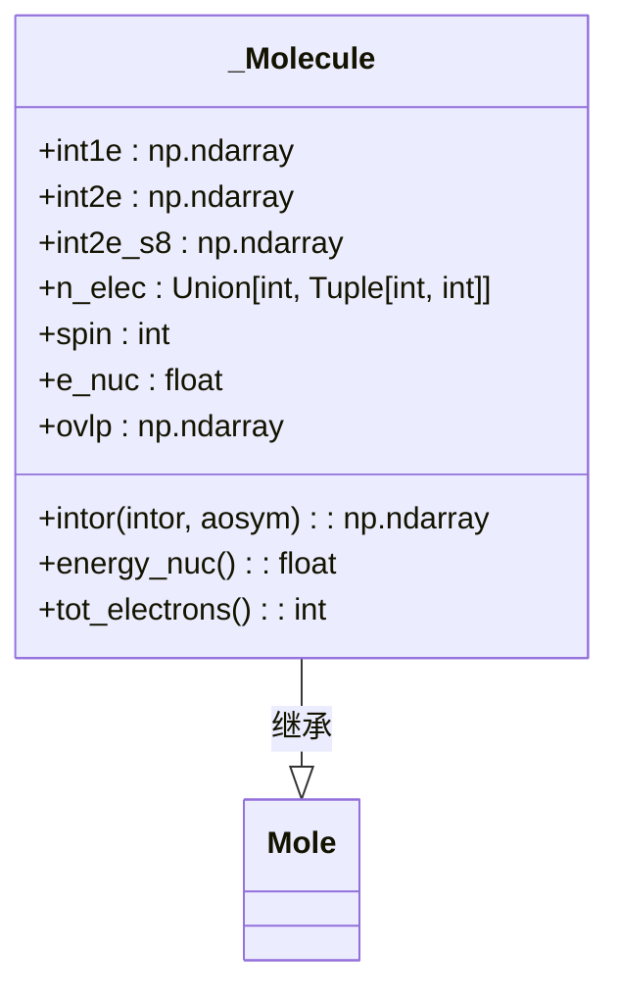

# 分子建模与化学信息封装

<cite>
**本文档引用的文件**
- [molecule.py](file://src/tyxonq/applications/chem/molecule.py)
- [constants.py](file://src/tyxonq/applications/chem/constants.py)
- [hamiltonian_builders.py](file://src/tyxonq/applications/chem/chem_libs/hamiltonians_chem_library/hamiltonian_builders.py)
- [test_mol_construct.py](file://tests_mol_valid/test_mol_construct.py)
</cite>

## 目录
1. [简介](#简介)
2. [分子类结构与化学信息封装](#分子类结构与化学信息封装)
3. [分子构建方法](#分子构建方法)
4. [与PySCF的兼容性设计](#与pyscf的兼容性设计)
5. [哈密顿量与初始轨道生成](#哈密顿量与初始轨道生成)
6. [完整代码示例](#完整代码示例)
7. [常量定义与物理参数配置](#常量定义与物理参数配置)
8. [扩展分子类以支持自定义模型](#扩展分子类以支持自定义模型)
9. [结论](#结论)

## 简介
本文件旨在全面阐述`_Molecule`类的设计与实现，该类用于封装分子的原子坐标、基组、电荷、自旋等关键化学信息。文档详细说明了如何从SMILES字符串或XYZ文件构建分子结构，展示了与PySCF量子化学软件包的兼容性设计，并解释了哈密顿量和初始轨道的自动生成机制。此外，还提供了创建分子实例、执行HF预计算和导出活性空间的完整代码示例，以及如何通过`constants.py`进行单位转换和物理参数配置。最后，指导用户如何扩展该类以支持自定义力场或溶剂模型。

## 分子类结构与化学信息封装

`_Molecule`类继承自PySCF的`Mole`类，用于封装分子的关键化学信息。其核心属性包括原子坐标、基组、电荷、自旋、重叠积分和核排斥能等。该类通过`intor`方法提供对单电子和双电子积分的访问，支持多种积分类型，如动能积分、核吸引积分、重叠积分和双电子积分。

**Section sources**
- [molecule.py](file://src/tyxonq/applications/chem/molecule.py#L49-L63)
- [molecule.py](file://src/tyxonq/applications/chem/molecule.py#L4-L48)

## 分子构建方法

`_Molecule`类支持多种分子构建方法。用户可以通过预定义的函数快速构建常见分子，如氢链、水分子、甲烷等。这些函数利用PySCF的`M`类，通过指定原子坐标和基组来创建分子实例。例如，`h_chain`函数可以构建任意长度的氢链，`water`函数可以构建水分子。



**Diagram sources**
- [molecule.py](file://src/tyxonq/applications/chem/molecule.py#L79-L80)
- [molecule.py](file://src/tyxonq/applications/chem/molecule.py#L121-L128)

## 与PySCF的兼容性设计

`_Molecule`类通过继承和重写PySCF的`Mole`类方法，实现了与PySCF的无缝兼容。`intor`方法是关键的兼容性接口，它将积分类型映射到相应的积分矩阵。例如，当请求`int1e_nuc`时，返回`self.int1e`；当请求`int2e`时，根据对称性要求返回`s1`或`s8`格式的双电子积分。这种设计使得`_Molecule`实例可以直接用于PySCF的HF、UCCSD等计算模块。



**Diagram sources**
- [molecule.py](file://src/tyxonq/applications/chem/molecule.py#L4-L63)

## 哈密顿量与初始轨道生成

`_Molecule`类通过`get_integral_from_hf`和`get_h_from_integral`等函数支持哈密顿量的自动生成。`get_integral_from_hf`函数从HF计算结果中提取有效的一电子和二电子积分，而`get_h_from_integral`则根据指定模式（如`sparse`、`mpo`或`fcifunc`）生成相应的哈密顿量表示。初始轨道通常通过HF计算获得，并可通过`canonical_mo_coeff`函数进行规范化。

**Section sources**
- [hamiltonian_builders.py](file://src/tyxonq/applications/chem/chem_libs/hamiltonians_chem_library/hamiltonian_builders.py#L41-L63)
- [hamiltonian_builders.py](file://src/tyxonq/applications/chem/chem_libs/hamiltonians_chem_library/hamiltonian_builders.py#L212-L223)

## 完整代码示例

以下代码示例展示了如何创建分子实例、执行HF预计算和导出活性空间。

```python
from tyxonq.applications.chem.molecule import h4
from tyxonq.applications.chem import UCCSD
from pyscf.scf import RHF

# 创建H4分子实例
m = h4
# 执行HF计算
hf = RHF(m)
hf.kernel()
# 创建UCCSD实例并执行计算
uccsd = UCCSD(m, active_space=(2, 4))
e = uccsd.kernel()
```

**Section sources**
- [test_mol_construct.py](file://tests_mol_valid/test_mol_construct.py#L50-L55)
- [test_mol_construct.py](file://tests_mol_valid/test_mol_construct.py#L100-L105)

## 常量定义与物理参数配置

`constants.py`文件定义了用于量子化学计算的常量和基本算符。例如，`a`和`ad`分别表示湮灭和创生算符，`ad_a`表示单粒子算符`a†_i a_j`。`DISCARD_EPS`常量用于数值计算中的精度控制，通常用于忽略小于该阈值的微小数值。

**Section sources**
- [constants.py](file://src/tyxonq/applications/chem/constants.py#L4-L17)

## 扩展分子类以支持自定义模型

用户可以通过继承`_Molecule`类并重写相关方法来支持自定义力场或溶剂模型。例如，可以重写`intor`方法以引入溶剂效应的积分修正，或添加新的属性来存储力场参数。此外，可以通过实现新的`get_h_from_integral`模式来支持特定的哈密顿量表示。

**Section sources**
- [molecule.py](file://src/tyxonq/applications/chem/molecule.py#L4-L63)
- [hamiltonian_builders.py](file://src/tyxonq/applications/chem/chem_libs/hamiltonians_chem_library/hamiltonian_builders.py#L212-L223)

## 结论

`_Molecule`类为分子建模和化学信息封装提供了一个强大且灵活的框架。通过与PySCF的深度集成，它支持从简单分子到复杂系统的各种量子化学计算。其模块化设计使得扩展和定制变得简单，为研究自定义力场和溶剂模型提供了坚实的基础。未来的工作可以进一步优化积分计算和哈密顿量生成的效率，以支持更大规模的分子系统。