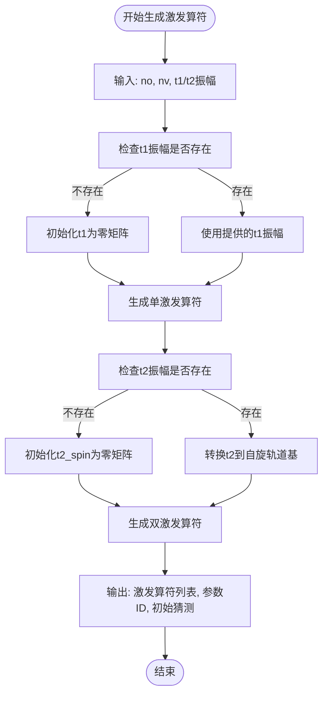
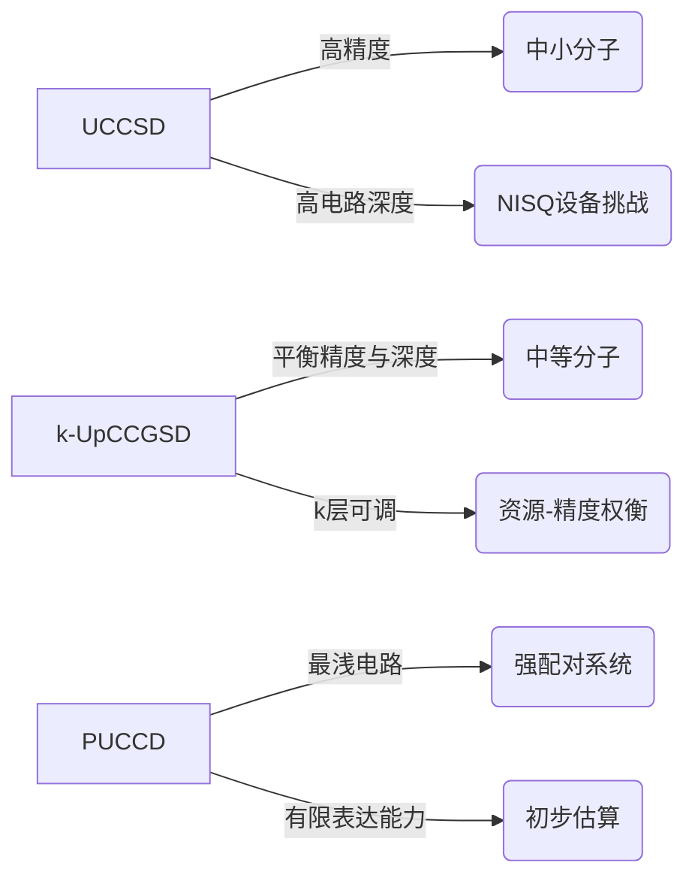

# 化学电路库

<cite>
**本文档引用的文件**  
- [ansatz_uccsd.py](file://src/tyxonq/applications/chem/chem_libs/circuit_chem_library/ansatz_uccsd.py)
- [ansatz_kupccgsd.py](file://src/tyxonq/applications/chem/chem_libs/circuit_chem_library/ansatz_kupccgsd.py)
- [ansatz_puccd.py](file://src/tyxonq/applications/chem/chem_libs/circuit_chem_library/ansatz_puccd.py)
- [uccsd.py](file://src/tyxonq/applications/chem/algorithms/uccsd.py)
- [vqeh2o_benchmark.py](file://examples/vqeh2o_benchmark.py)
</cite>

## 目录
1. [引言](#引言)
2. [预定义ansatz模板概览](#预定义ansatz模板概览)
3. [UCCSD变分量子电路](#uccsd变分量子电路)
4. [k-UpCCGSD变分量子电路](#k-upccgsd变分量子电路)
5. [PUCCD变分量子电路](#puccd变分量子电路)
6. [激发算符生成机制](#激发算符生成机制)
7. [VQE算法集成示例](#vqe算法集成示例)
8. [适用场景与性能权衡](#适用场景与性能权衡)
9. [与经典量子化学方法的对应关系](#与经典量子化学方法的对应关系)

## 引言

化学电路库提供了一套用于量子化学模拟的预定义变分量子电路（ansatz）模板，旨在解决分子基态能量计算问题。这些ansatz模板基于量子化学中的耦合簇理论，将经典电子相关方法映射到量子计算框架中。通过构建参数化的量子电路，这些ansatz能够系统性地探索分子哈密顿量的基态，为变分量子本征求解器（VQE）算法提供高效的搜索空间。本文档详细阐述了UCCSD、k-UpCCGSD和PUCCD三种核心ansatz的实现机制、物理意义及其在量子化学模拟中的应用。

## 预定义ansatz模板概览

化学电路库实现了三种主要的预定义ansatz模板，每种模板针对不同的化学系统和计算需求进行了优化：

- **UCCSD (Unitary Coupled Cluster Singles and Doubles)**：实现完整的单双激发耦合簇方法，提供高精度的基态能量计算，适用于中小分子系统。
- **k-UpCCGSD (k-fold Unitary Pair Coupled Cluster Generalized Singles and Doubles)**：采用广义单激发和配对双激发的k层重复结构，平衡了电路深度与表达能力。
- **PUCCD (Pair Unitary Coupled Cluster Doubles)**：专注于配对双激发，特别适用于具有强配对效应的系统，如超导体或配对电子系统。

这些ansatz模板通过独立的模块实现，分别位于`circuit_chem_library`目录下的`ansatz_uccsd.py`、`ansatz_kupccgsd.py`和`ansatz_puccd.py`文件中，确保了代码的模块化和可维护性。

**Section sources**
- [ansatz_uccsd.py](file://src/tyxonq/applications/chem/chem_libs/circuit_chem_library/ansatz_uccsd.py)
- [ansatz_kupccgsd.py](file://src/tyxonq/applications/chem/chem_libs/circuit_chem_library/ansatz_kupccgsd.py)
- [ansatz_puccd.py](file://src/tyxonq/applications/chem/chem_libs/circuit_chem_library/ansatz_puccd.py)

## UCCSD变分量子电路

UCCSD ansatz是量子化学中最常用的变分形式之一，它直接对应于经典的UCCSD方法。该ansatz通过指数化单双激发算符来构建试探波函数：

$$
|\psi_{\text{UCCSD}}\rangle = e^{T_1 - T_1^\dagger + T_2 - T_2^\dagger} |\phi_0\rangle
$$

其中$T_1$和$T_2$分别表示单激发和双激发算符。在量子电路上，这被实现为一系列受控的费米子激发门。UCCSD ansatz的实现位于`ansatz_uccsd.py`文件中，通过`generate_uccsd_ex1_ops`和`generate_uccsd_ex2_ops`函数分别生成单激发和双激发算符序列。该ansatz能够精确描述电子相关效应，是高精度量子化学计算的基准方法。

**Section sources**
- [ansatz_uccsd.py](file://src/tyxonq/applications/chem/chem_libs/circuit_chem_library/ansatz_uccsd.py#L8-L123)

## k-UpCCGSD变分量子电路

k-UpCCGSD ansatz是一种广义的配对耦合簇方法，其设计旨在降低电路深度同时保持良好的表达能力。与UCCSD不同，k-UpCCGSD采用广义单激发（所有可能的占据-虚拟轨道对）和配对双激发（i→a, a→i配对）。其结构由k个重复的层组成，每层包含配对双激发和广义单激发的序列：

$$
|\psi_{\text{k-UpCCGSD}}\rangle = \left(e^{T_{\text{paired}} + T_{\text{gen}}}\right)^k |\phi_0\rangle
$$

这种分层结构使得k-UpCCGSD在浅层电路中仍能捕捉到重要的电子相关效应，特别适用于当前含噪声中等规模量子（NISQ）设备。实现细节位于`ansatz_kupccgsd.py`文件中，通过`generate_kupccgsd_ex1_ops`、`generate_kupccgsd_ex2_ops`和`generate_kupccgsd_ex_ops`函数构建激发算符序列。

**Section sources**
- [ansatz_kupccgsd.py](file://src/tyxonq/applications/chem/chem_libs/circuit_chem_library/ansatz_kupccgsd.py#L7-L59)

## PUCCD变分量子电路

PUCCD ansatz专注于配对双激发，假设电子以自旋配对的方式进行激发。其形式为：

$$
|\psi_{\text{PUCCD}}\rangle = e^{T_{\text{paired}} - T_{\text{paired}}^\dagger} |\phi_0\rangle
$$

其中$T_{\text{paired}}$只包含配对激发项$(a^\dagger_{i\alpha}a^\dagger_{i\beta}a_{a\beta}a_{a\alpha})$。这种简化使得PUCCD ansatz具有较浅的电路深度，特别适用于描述BCS型配对或具有强配对相关性的系统。在`ansatz_puccd.py`文件中，`generate_puccd_ex_ops`函数实现了这种配对激发算符的生成，采用两体形式以保持与现有测试的兼容性。

**Section sources**
- [ansatz_puccd.py](file://src/tyxonq/applications/chem/chem_libs/circuit_chem_library/ansatz_puccd.py#L7-L57)

## 激发算符生成机制

### 单双激发算符的构建

激发算符的生成是ansatz实现的核心，直接决定了量子电路的结构和参数化方式。`generate_uccsd_ex1_ops`和`generate_uccsd_ex2_ops`函数负责构建UCCSD ansatz的激发算符序列。

`generate_uccsd_ex1_ops`函数根据占据轨道数（no）和虚拟轨道数（nv）生成所有可能的单激发算符。对于每个占据轨道i和虚拟轨道a，它生成两个算符：一个用于α自旋通道，另一个用于β自旋通道。这些算符在量子电路上对应于单激发门，其参数由经典CCSD计算的t1振幅初始化。

`generate_uccsd_ex2_ops`函数构建双激发算符，包括三种类型：两个α电子激发（AA）、两个β电子激发（BB）和一个α一个β电子激发（AB）。函数通过嵌套循环遍历所有可能的轨道组合，并根据自旋对称性生成相应的费米子算符序列。初始参数由t2振幅提供，通过`spatial2spin`函数从空间轨道振幅转换而来。

**Diagram sources**
- [ansatz_uccsd.py](file://src/tyxonq/applications/chem/chem_libs/circuit_chem_library/ansatz_uccsd.py#L8-L123)

**Section sources**
- [ansatz_uccsd.py](file://src/tyxonq/applications/chem/chem_libs/circuit_chem_library/ansatz_uccsd.py#L8-L123)

## VQE算法集成示例

预定义ansatz模板与VQE算法的集成展示了从量子化学问题到可执行量子电路的完整流程。以H2O分子为例，`vqeh2o_benchmark.py`文件提供了一个完整的基准测试示例。

首先，通过PySCF和OpenFermion进行经典量子化学计算，获得分子轨道积分和哈密顿量。然后，初始化UCCSD ansatz类，该类自动调用`generate_uccsd_ex1_ops`和`generate_uccsd_ex2_ops`函数生成激发算符序列。这些算符随后被映射为量子门序列，形成变分量子电路。

在VQE优化循环中，量子电路以可调参数为输入，输出量子态。通过测量哈密顿量的期望值，计算能量本征值。经典优化器根据能量梯度调整电路参数，迭代寻找基态能量。这种集成方式将复杂的量子化学问题分解为清晰的步骤：分子表示、ansatz选择、电路构建和参数优化。

**Section sources**
- [vqeh2o_benchmark.py](file://examples/vqeh2o_benchmark.py#L0-L162)
- [uccsd.py](file://src/tyxonq/applications/chem/algorithms/uccsd.py#L0-L577)

## 适用场景与性能权衡

不同的ansatz模板在电路深度、参数数量和精度之间存在显著的权衡，适用于不同的应用场景。

UCCSD ansatz提供最高的精度，因为它包含了所有单双激发项。然而，其电路深度和参数数量随系统规模二次增长，对于大分子可能超出当前量子设备的能力。因此，UCCSD最适合中小分子的高精度计算，或作为其他近似方法的基准。

k-UpCCGSD ansatz通过广义激发和k层重复结构，在保持合理电路深度的同时提供了良好的表达能力。其参数数量随系统规模线性增长，使其成为NISQ设备上的理想选择。通过调整k值，用户可以在计算资源和精度之间进行权衡，适用于中等规模分子的探索性研究。

PUCCD ansatz具有最浅的电路深度，特别适用于描述配对主导的物理现象。其计算成本最低，但表达能力有限，可能无法准确描述复杂的电子相关效应。因此，PUCCD最适合强配对系统或作为初步估算工具。

**Diagram sources**
- [ansatz_uccsd.py](file://src/tyxonq/applications/chem/chem_libs/circuit_chem_library/ansatz_uccsd.py)
- [ansatz_kupccgsd.py](file://src/tyxonq/applications/chem/chem_libs/circuit_chem_library/ansatz_kupccgsd.py)
- [ansatz_puccd.py](file://src/tyxonq/applications/chem/chem_libs/circuit_chem_library/ansatz_puccd.py)

## 与经典量子化学方法的对应关系

预定义ansatz模板与经典量子化学方法有着深刻的对应关系，这种对应是量子变分算法有效性的理论基础。

UCCSD ansatz直接对应于经典的UCCSD方法，两者都基于相同的单双激发算符。在经典计算中，UCCSD通过非线性方程求解振幅；而在量子计算中，这些振幅成为量子电路的可调参数。这种对应确保了量子UCCSD能够达到与经典UCCSD相同的精度，为量子优势提供了基准。

k-UpCCGSD ansatz与广义耦合簇理论相关，但通过k层重复结构引入了新的近似。这种结构类似于经典方法中的迭代求解过程，但以更结构化的方式实现。k-UpCCGSD可以看作是经典耦合簇方法在量子硬件约束下的适应性变体。

PUCCD ansatz对应于配对耦合簇方法，特别类似于BCS理论中的配对近似。在经典计算中，这种方法用于描述超导态；在量子计算中，它被实现为特定的量子电路结构。这种对应关系使得PUCCD成为研究配对物理的理想工具。

通过这种与经典方法的对应，化学电路库的ansatz模板不仅提供了实用的计算工具，还建立了经典与量子量子化学之间的桥梁，促进了两种范式的相互理解和验证。