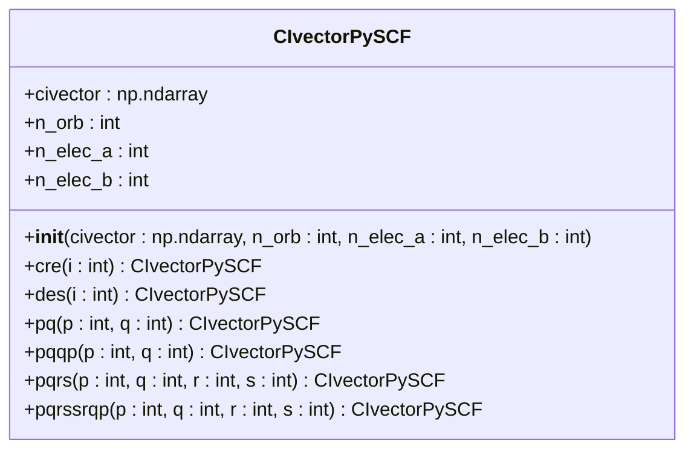
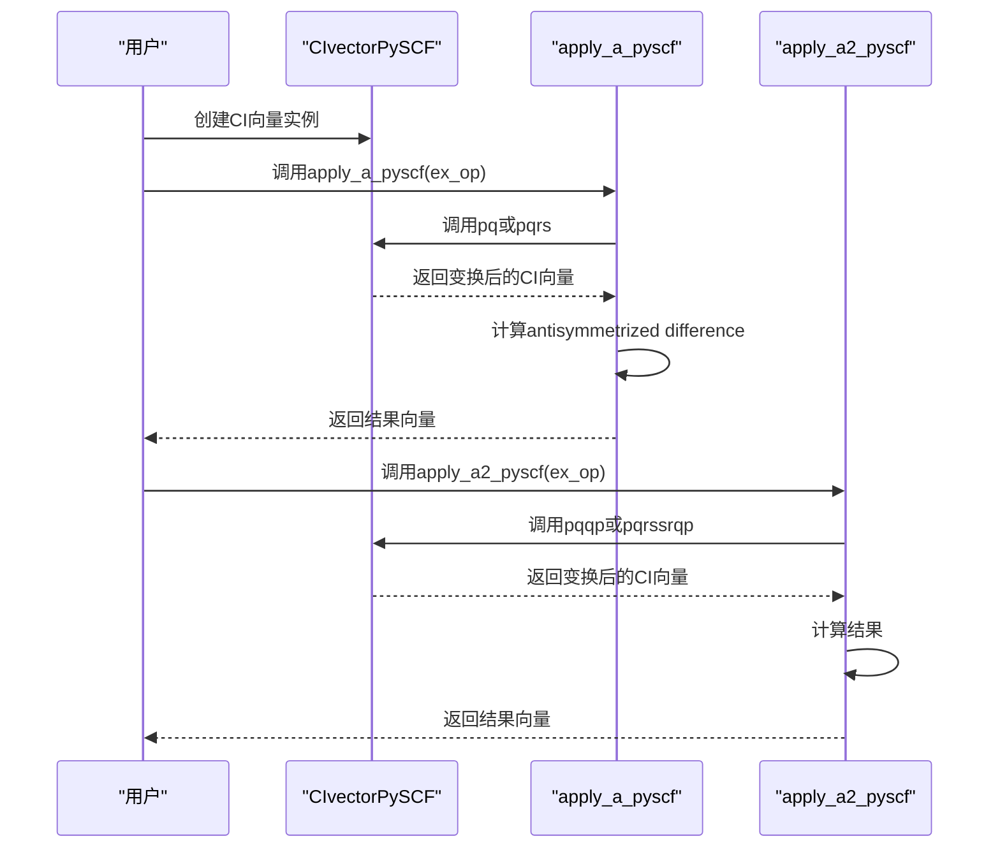
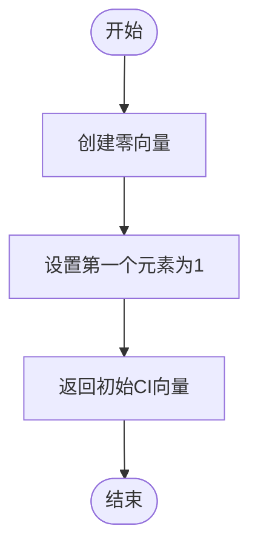
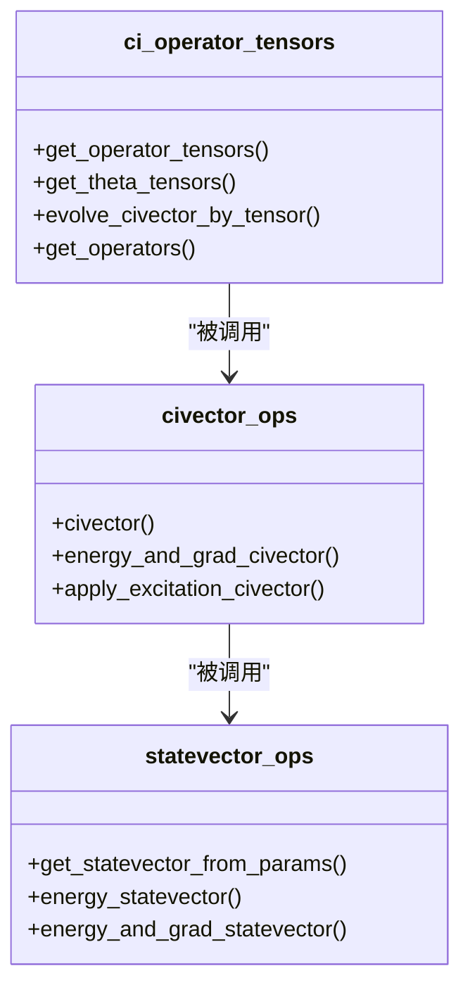
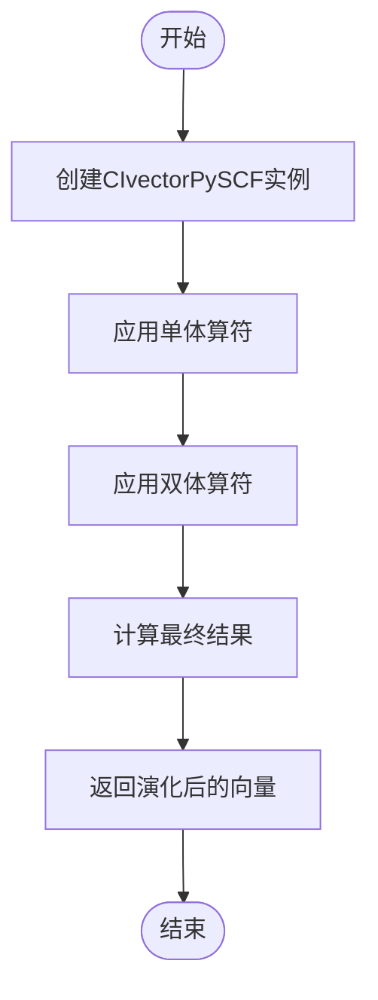
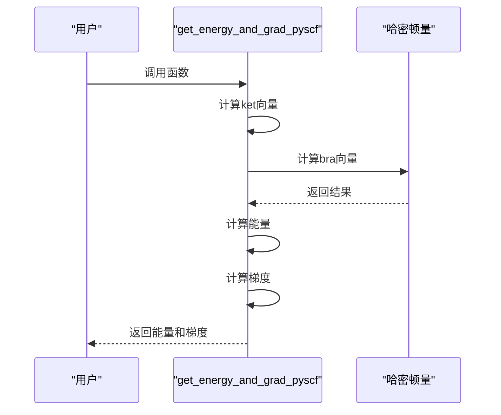
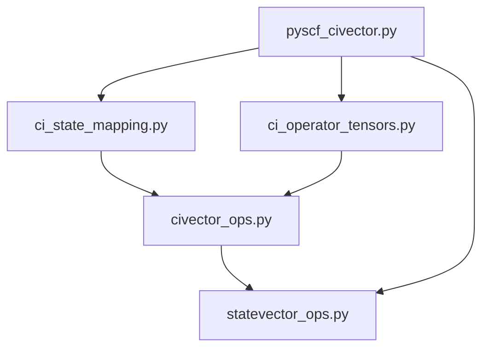

# 量子化学算子库

<cite>
**Referenced Files in This Document**   
- [pyscf_civector.py](file://src/tyxonq/applications/chem/chem_libs/quantum_chem_library/pyscf_civector.py)
- [ci_state_mapping.py](file://src/tyxonq/applications/chem/chem_libs/quantum_chem_library/ci_state_mapping.py)
- [civector_ops.py](file://src/tyxonq/applications/chem/chem_libs/quantum_chem_library/civector_ops.py)
- [statevector_ops.py](file://src/tyxonq/applications/chem/chem_libs/quantum_chem_library/statevector_ops.py)
- [ci_operator_tensors.py](file://src/tyxonq/applications/chem/chem_libs/quantum_chem_library/ci_operator_tensors.py)
</cite>

## 目录
1. [引言](#引言)
2. [核心组件分析](#核心组件分析)
3. [CI向量操作与态映射](#ci向量操作与态映射)
4. [算符张量处理能力](#算符张量处理能力)
5. [高级操作函数](#高级操作函数)
6. [依赖关系分析](#依赖关系分析)

## 引言

本文件旨在深入文档化量子化学算子库，重点阐述其在CI向量操作、态映射和算符张量处理方面的核心能力。该库为量子化学计算提供了精确的数值基线，特别适用于小体系的验证和教育目的。通过封装PySCF的CI向量操作，该库实现了对单体与双体费米子算符在CI基下的高效作用，并支持复杂的激发演化和能量梯度计算。

## 核心组件分析

### CIvectorPySCF 类分析

`CIvectorPySCF` 类是该库的核心，它为PySCF的CI向量提供了一个轻量级的封装，支持创建（cre）、湮灭（des）及复合算符的链式调用接口。

**Diagram sources**
- [pyscf_civector.py](file://src/tyxonq/applications/chem/chem_libs/quantum_chem_library/pyscf_civector.py#L55-L99)

**Section sources**
- [pyscf_civector.py](file://src/tyxonq/applications/chem/chem_libs/quantum_chem_library/pyscf_civector.py#L55-L99)

## CI向量操作与态映射

### CI向量操作

该库通过 `apply_a_pyscf` 和 `apply_a2_pyscf` 函数实现了单体与双体费米子算符在CI基下的作用。这些函数利用 `CIvectorPySCF` 类的链式调用接口，支持反向序减操作以保证反对易关系。

**Diagram sources**
- [pyscf_civector.py](file://src/tyxonq/applications/chem/chem_libs/quantum_chem_library/pyscf_civector.py#L102-L126)

**Section sources**
- [pyscf_civector.py](file://src/tyxonq/applications/chem/chem_libs/quantum_chem_library/pyscf_civector.py#L102-L126)

### 态映射

`get_init_civector` 函数实现了CI向量的初始化，创建一个以HF态为基的初始向量。

**Diagram sources**
- [ci_state_mapping.py](file://src/tyxonq/applications/chem/chem_libs/quantum_chem_library/ci_state_mapping.py#L159-L164)

**Section sources**
- [ci_state_mapping.py](file://src/tyxonq/applications/chem/chem_libs/quantum_chem_library/ci_state_mapping.py#L159-L164)

## 算符张量处理能力

该库提供了强大的算符张量处理能力，通过 `get_operator_tensors` 和 `get_theta_tensors` 等函数实现。

**Diagram sources**
- [ci_operator_tensors.py](file://src/tyxonq/applications/chem/chem_libs/quantum_chem_library/ci_operator_tensors.py)
- [civector_ops.py](file://src/tyxonq/applications/chem/chem_libs/quantum_chem_library/civector_ops.py)
- [statevector_ops.py](file://src/tyxonq/applications/chem/chem_libs/quantum_chem_library/statevector_ops.py)

**Section sources**
- [ci_operator_tensors.py](file://src/tyxonq/applications/chem/chem_libs/quantum_chem_library/ci_operator_tensors.py)
- [civector_ops.py](file://src/tyxonq/applications/chem/chem_libs/quantum_chem_library/civector_ops.py)
- [statevector_ops.py](file://src/tyxonq/applications/chem/chem_libs/quantum_chem_library/statevector_ops.py)

## 高级操作函数

### 激发演化

`evolve_excitation_pyscf` 函数实现了激发演化，支持UCC单参数块在CI空间中的演化。

**Diagram sources**
- [pyscf_civector.py](file://src/tyxonq/applications/chem/chem_libs/quantum_chem_library/pyscf_civector.py#L131-L137)

**Section sources**
- [pyscf_civector.py](file://src/tyxonq/applications/chem/chem_libs/quantum_chem_library/pyscf_civector.py#L131-L137)

### 能量梯度计算

`get_energy_and_grad_pyscf` 函数实现了能量和梯度的计算，用于VQE等算法的优化。

**Diagram sources**
- [pyscf_civector.py](file://src/tyxonq/applications/chem/chem_libs/quantum_chem_library/pyscf_civector.py#L179-L201)

**Section sources**
- [pyscf_civector.py](file://src/tyxonq/applications/chem/chem_libs/quantum_chem_library/pyscf_civector.py#L179-L201)

## 依赖关系分析

该库的各个组件之间存在紧密的依赖关系，形成了一个完整的量子化学计算框架。

**Diagram sources**
- [pyscf_civector.py](file://src/tyxonq/applications/chem/chem_libs/quantum_chem_library/pyscf_civector.py)
- [ci_state_mapping.py](file://src/tyxonq/applications/chem/chem_libs/quantum_chem_library/ci_state_mapping.py)
- [ci_operator_tensors.py](file://src/tyxonq/applications/chem/chem_libs/quantum_chem_library/ci_operator_tensors.py)
- [civector_ops.py](file://src/tyxonq/applications/chem/chem_libs/quantum_chem_library/civector_ops.py)
- [statevector_ops.py](file://src/tyxonq/applications/chem/chem_libs/quantum_chem_library/statevector_ops.py)

**Section sources**
- [pyscf_civector.py](file://src/tyxonq/applications/chem/chem_libs/quantum_chem_library/pyscf_civector.py)
- [ci_state_mapping.py](file://src/tyxonq/applications/chem/chem_libs/quantum_chem_library/ci_state_mapping.py)
- [ci_operator_tensors.py](file://src/tyxonq/applications/chem/chem_libs/quantum_chem_library/ci_operator_tensors.py)
- [civector_ops.py](file://src/tyxonq/applications/chem/chem_libs/quantum_chem_library/civector_ops.py)
- [statevector_ops.py](file://src/tyxonq/applications/chem/chem_libs/quantum_chem_library/statevector_ops.py)