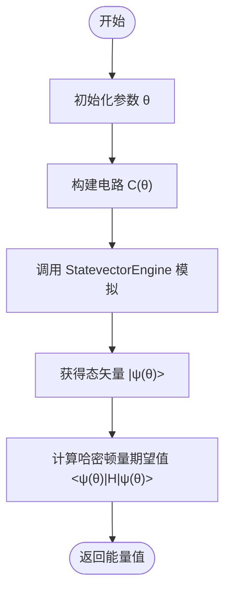
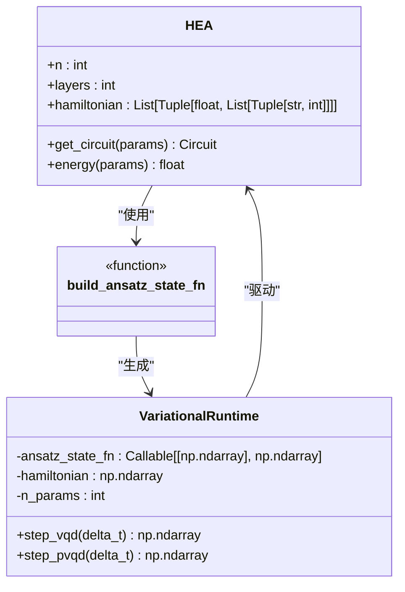
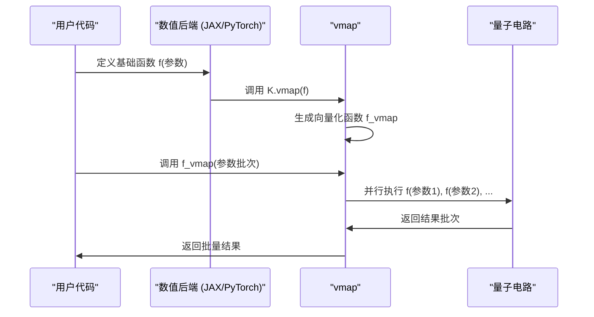

# HEA数值运行时

<cite>
**本文档中引用的文件**  
- [hea.py](file://src/tyxonq/applications/chem/algorithms/hea.py)
- [hea_numeric_runtime.py](file://src/tyxonq/applications/chem/runtimes/hea_numeric_runtime.py)
- [variational.py](file://src/tyxonq/libs/circuits_library/variational.py)
- [matprod_vmap.py](file://examples-ng/matprod_vmap.py)
- [chaotic_behavior.py](file://examples-ng/chaotic_behavior.py)
- [training_deep_tunable_structures.py](file://examples-ng/training_deep_tunable_structures.py)
- [checkpoint_memsave.py](file://examples-ng/checkpoint_memsave.py)
</cite>

## 目录
1. [引言](#引言)
2. [HEA电路的态矢量仿真](#hea电路的态矢量仿真)
3. [与变分模块的协同](#与变分模块的协同)
4. [批量电路评估实现](#批量电路评估实现)
5. [深度电路训练示例](#深度电路训练示例)
6. [内存优化策略](#内存优化策略)
7. [结论](#结论)

## 引言
本文档全面阐述HEA（硬件高效变分量子电路）在经典数值后端的仿真执行流程。重点介绍如何高效构建和演化HEA电路的态矢量表示，以支持大规模量子比特数的模拟。文档详细说明HEA算法如何与`libs/circuits_library`中的`variational`模块协同工作，实现参数化电路的快速评估。同时，描述了利用JAX或PyTorch的`vmap`功能进行批量电路评估的具体实现方法。通过`chaotic_behavior.py`和`training_deep_tunable_structures.py`示例，展示深度电路训练的稳定性与性能特征。最后，提供包括检查点机制和MPS近似模拟在内的内存优化策略。

## HEA电路的态矢量仿真
HEA电路的数值仿真核心在于高效地构建和演化其量子态的态矢量表示。该过程由`HEANumericRuntime`类驱动，该类位于`src/tyxonq/applications/chem/runtimes/hea_numeric_runtime.py`中。

当`HEA`类的`runtime`参数设置为`"numeric"`时，其`energy`和`energy_and_grad`方法会实例化`HEANumericRuntime`对象。该运行时首先通过`_build`方法，利用`get_circuit`函数（通常来自`HEA.get_circuit`）根据给定的参数生成一个`Circuit`对象。随后，`_state`方法调用`StatevectorEngine`来计算该电路的最终态矢量，目前主要支持`statevector`引擎，未来计划集成MPS（矩阵乘积态）引擎以支持更大规模的模拟。

态矢量的演化过程遵循HEA的电路结构：初始的RY层后接多层（纠缠层 + RY层）的重复。`StatevectorEngine`通过应用每个量子门的酉矩阵来逐步更新态矢量，最终得到一个大小为 \(2^n\) 的复数向量，其中 \(n\) 是量子比特数。

**图示来源**
- [hea_numeric_runtime.py](file://src/tyxonq/applications/chem/runtimes/hea_numeric_runtime.py#L13-L68)
- [hea.py](file://src/tyxonq/applications/chem/algorithms/hea.py#L26-L516)

**本节来源**
- [hea_numeric_runtime.py](file://src/tyxonq/applications/chem/runtimes/hea_numeric_runtime.py#L13-L68)
- [hea.py](file://src/tyxonq/applications/chem/algorithms/hea.py#L26-L516)

## 与变分模块的协同
HEA算法与`libs/circuits_library`中的`variational.py`模块紧密协同，以实现更高级的变分动力学和参数优化功能。

`variational.py`模块提供了`VariationalRuntime`类，它是一个与后端无关的变分动力学运行时。该类接收一个`ansatz_state_fn`（一个将参数映射到态矢量的可调用函数）、一个稠密的哈密顿量矩阵和参数数量作为输入。`HEA`类可以通过`build_ansatz_state_fn`函数，利用其`get_circuit`方法和`StatevectorEngine`来创建一个`ansatz_state_fn`，从而与`VariationalRuntime`集成。

这种协同使得HEA电路可以用于更复杂的任务，例如变分量子动力学（VQD）。`VariationalRuntime`利用`get_jacobian_func`计算态矢量对参数的雅可比矩阵，并通过求解正规方程来计算参数的时间导数`theta_dot`，从而实现量子态的演化。

**图示来源**
- [variational.py](file://src/tyxonq/libs/circuits_library/variational.py#L152-L251)
- [hea.py](file://src/tyxonq/applications/chem/algorithms/hea.py#L26-L516)

**本节来源**
- [variational.py](file://src/tyxonq/libs/circuits_library/variational.py#L152-L251)

## 批量电路评估实现
为了高效地评估多个电路或进行批量梯度计算，系统利用了JAX或PyTorch的`vmap`（向量化映射）功能。`matprod_vmap.py`示例清晰地展示了这一机制。

在`matprod_vmap.py`中，一个基础的矩阵乘法函数`ij`被定义。通过`K.vmap`（其中`K`是JAX或PyTorch后端），该函数被向量化以处理批量输入。`vij`函数将`ij`向量化到第二个参数，而`vvij`则进一步将`vij`向量化到第一个参数，从而创建了一个可以高效处理两个输入矩阵批次的批量矩阵乘法函数`mul2`。

这种`vmap`模式可以推广到量子电路评估。例如，在`chaotic_behavior.py`中，`frame_potential_batch`函数通过循环处理批次，展示了批量计算框架势的思路。理想情况下，通过`vmap`可以完全向量化此过程，避免显式循环，从而在GPU等硬件上获得显著的性能提升。

**图示来源**
- [matprod_vmap.py](file://examples-ng/matprod_vmap.py#L0-L42)
- [chaotic_behavior.py](file://examples-ng/chaotic_behavior.py#L0-L100)

**本节来源**
- [matprod_vmap.py](file://examples-ng/matprod_vmap.py#L0-L42)

## 深度电路训练示例
`chaotic_behavior.py`和`training_deep_tunable_structures.py`两个示例共同展示了深度可调结构电路的训练流程、稳定性与性能特征。

`chaotic_behavior.py`提供了一个基础的训练循环。它定义了一个包含RY门和CNOT门的参数化电路`get_state`，并使用`value_and_grad`（`vg_func`）来获取能量函数`get_zz`的值和梯度。然后，它使用PyTorch的`Adam`优化器执行梯度下降，展示了能量随优化步数下降的动态过程。这个示例还尝试计算雅可比和海森矩阵，突显了在自动微分框架下进行高阶微分的挑战。

`training_deep_tunable_structures.py`则展示了更复杂的场景。它实现了一个深度可调的电路结构，其中门的类型和参数都可以被训练。该示例结合了`jit`（即时编译）来加速`value_and_grad`计算，并使用`vmap`/`vvag`进行批量参数评估。`main`函数中的训练循环展示了如何将`jit`编译的梯度函数与PyTorch优化器结合使用，从而在保持灵活性的同时实现高性能。

**本节来源**
- [chaotic_behavior.py](file://examples-ng/chaotic_behavior.py#L0-L100)
- [training_deep_tunable_structures.py](file://examples-ng/training_deep_tunable_structures.py#L0-L175)

## 内存优化策略
对于深度电路或大规模量子比特系统的模拟，内存消耗是一个关键挑战。`checkpoint_memsave.py`示例演示了一种基于检查点的内存优化策略。

该策略的核心思想是将长电路分解为多个子层（`zzxlayer` -> `zzxsqrtlayer` -> `totallayer`）。在反向传播计算梯度时，传统的自动微分会保存所有中间态，导致内存占用与电路深度成正比。检查点机制通过`recursive_checkpoint`函数实现，它递归地组合子层函数。在前向传播时，它只保存关键检查点处的态矢量，而不是所有中间态。在反向传播时，它从最近的检查点重新计算所需的中间态。这种方法以增加计算时间为代价，显著降低了峰值内存占用。

此外，文档中提到的MPS（矩阵乘积态）近似模拟是另一种重要的内存优化选项。与存储完整的 \(2^n\) 态矢量不同，MPS将量子态表示为一系列低秩张量的乘积，特别适合表示纠缠度较低的态，可以将内存复杂度从指数级降低到多项式级。

**本节来源**
- [checkpoint_memsave.py](file://examples-ng/checkpoint_memsave.py#L0-L119)

## 结论
本文档详细阐述了HEA算法在经典数值后端的完整仿真流程。通过`HEANumericRuntime`，系统能够高效地构建和演化HEA电路的态矢量，支持大规模量子比特的模拟。与`variational`模块的协同，为实现复杂的变分动力学算法提供了基础。利用JAX/PyTorch的`vmap`功能，系统能够高效地进行批量电路评估，提升训练效率。通过`chaotic_behavior.py`和`training_deep_tunable_structures.py`示例，验证了深度电路训练的可行性与性能特征。最后，通过检查点机制和MPS近似模拟等内存优化策略，系统能够应对深度和规模带来的挑战，为实际应用提供了强大的支持。