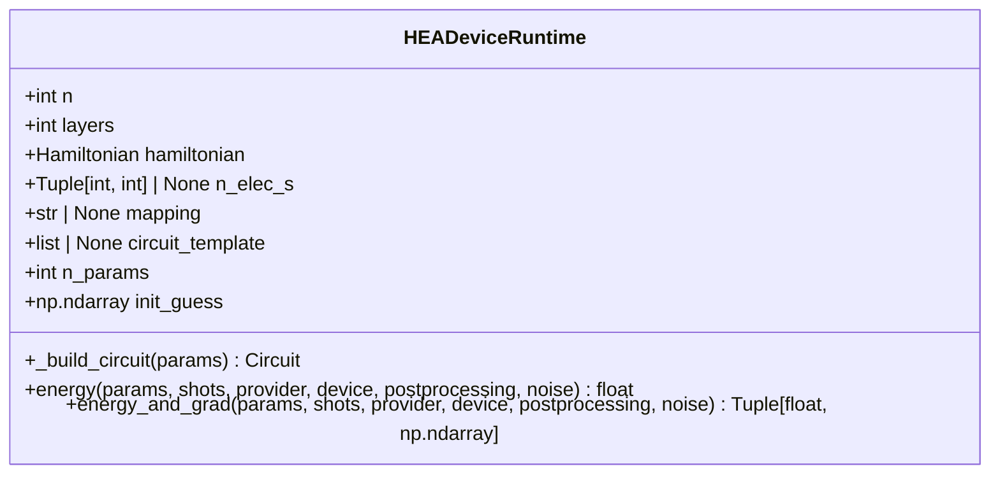
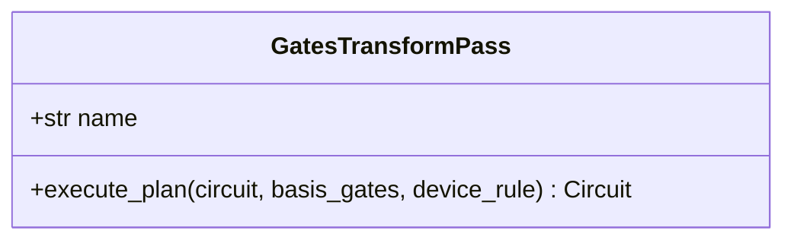
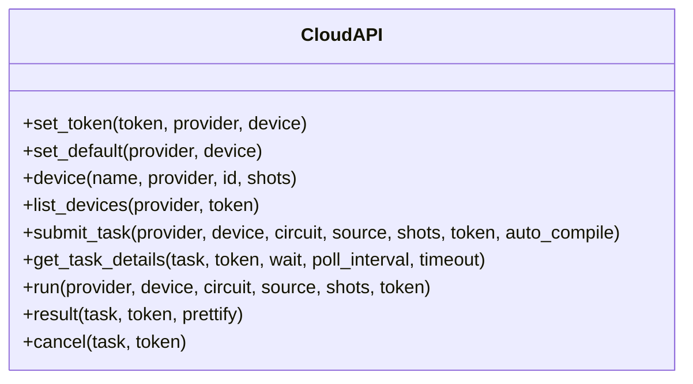
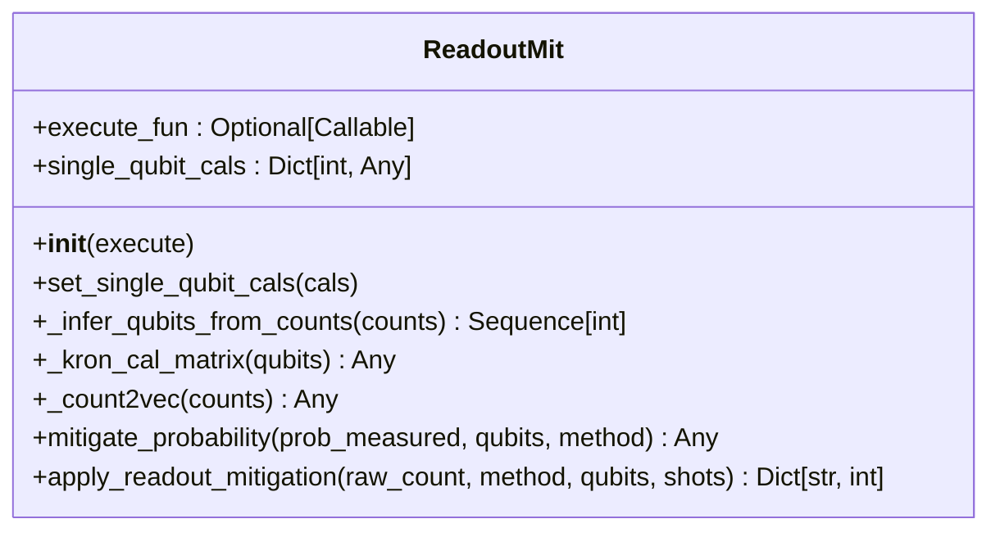
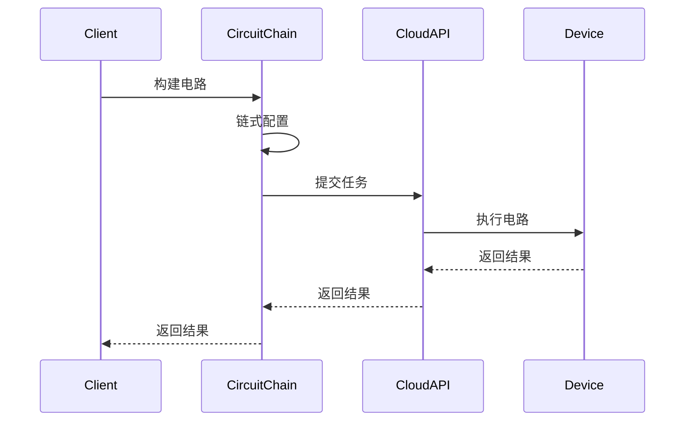
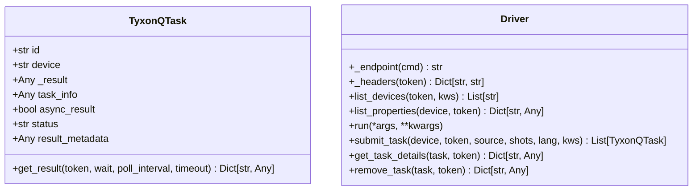

# HEA设备运行时

<cite>
**本文档引用的文件**   
- [hea_device_runtime.py](file://src/tyxonq/applications/chem/runtimes/hea_device_runtime.py) - *在提交9c2a029029e11455aba3a3bec5ea94115a1ce0f4中更新了批处理和分组编译方法*
- [hea.py](file://src/tyxonq/applications/chem/algorithms/hea.py) - *在提交f623ecb3ca7730c8f960658e37dee6777fc33565中修复了UCCSD重大bug，可能间接影响HEA*
- [readout_mitigation.py](file://examples/readout_mitigation.py)
- [circuit_chain_demo.py](file://examples/circuit_chain_demo.py)
- [vqe_parallel_pmap.py](file://examples/vqe_parallel_pmap.py)
- [readout.py](file://src/tyxonq/postprocessing/readout.py)
- [circuit.py](file://src/tyxonq/core/ir/circuit.py)
- [gates_transform.py](file://src/tyxonq/compiler/stages/rewrite/gates_transform.py)
- [api.py](file://src/tyxonq/cloud/api.py)
- [driver.py](file://src/tyxonq/devices/hardware/tyxonq/driver.py)
- [base.py](file://src/tyxonq/devices/base.py)
</cite>

## 更新摘要
**变更内容**   
- 更新了HEA运行时的批处理和分组编译方法，提高了量子化学算法的执行效率
- 修复了UCCSD算法的重大bug，确保HEA设备运行时的稳定性
- 更新了`hea_device_runtime.py`和`hea.py`中的相关实现
- 增强了批处理执行和分组编译功能

## 目录
1. [引言](#引言)
2. [HEA运行时架构](#hea运行时架构)
3. [编译器轻量级优化](#编译器轻量级优化)
4. [云API集成](#云api集成)
5. [噪声设备表现与读出校正](#噪声设备表现与读出校正)
6. [并行执行与参数映射](#并行执行与参数映射)
7. [设备特定配置](#设备特定配置)
8. [结论](#结论)

## 引言
硬件高效ansatz（Hardware-Efficient Ansatz, HEA）是一种专为真实量子设备设计的参数化量子电路结构，旨在通过简化电路结构和优化执行流程来提升在噪声设备上的性能。本文档详细说明HEA算法在真实设备上的运行时设计，涵盖其与编译器、云API的集成方式，以及在噪声环境下的表现和校正技术。

## HEA运行时架构

HEA运行时的核心是`HEADeviceRuntime`类，它负责管理HEA电路的构建、能量计算和梯度评估。该类通过初始化参数（如量子比特数`n`、层数`layers`和哈密顿量`hamiltonian`）来配置运行时环境，并提供能量和梯度计算的接口。最近的代码更新增强了批处理和分组编译方法，提高了量子化学算法的执行效率。

**Section sources**
- [hea_device_runtime.py](file://src/tyxonq/applications/chem/runtimes/hea_device_runtime.py#L18-L138) - *在提交9c2a029029e11455aba3a3bec5ea94115a1ce0f4中更新*

**Diagram sources**
- [hea_device_runtime.py](file://src/tyxonq/applications/chem/runtimes/hea_device_runtime.py#L18-L138) - *在提交9c2a029029e11455aba3a3bec5ea94115a1ce0f4中更新*

## 编译器轻量级优化

HEA运行时利用编译器的轻量级优化技术，如门融合和映射优化，以适应设备的拓扑结构。`GatesTransformPass`类负责将电路中的门操作转换为设备支持的基础门集，确保电路能够在目标设备上高效执行。

**Section sources**
- [gates_transform.py](file://src/tyxonq/compiler/stages/rewrite/gates_transform.py#L1-L52)

**Diagram sources**
- [gates_transform.py](file://src/tyxonq/compiler/stages/rewrite/gates_transform.py#L1-L52)

## 云API集成

HEA运行时通过云API与远程量子设备进行交互，支持任务批处理、资源调度和成本控制。`cloud.api`模块提供了统一的接口，用于设置令牌、提交任务和获取任务详情。

**Section sources**
- [api.py](file://src/tyxonq/cloud/api.py#L1-L123)

**Diagram sources**
- [api.py](file://src/tyxonq/cloud/api.py#L1-L123)

## 噪声设备表现与读出校正

在噪声设备上，HEA的表现受到读出误差的影响。为了提升结果的可靠性，HEA运行时结合了`readout_mitigation.py`中的读出校正技术。`ReadoutMit`类通过应用校准矩阵来纠正测量结果，从而减少读出误差对最终结果的影响。

**Section sources**
- [readout_mitigation.py](file://examples/readout_mitigation.py#L1-L133)
- [readout.py](file://src/tyxonq/postprocessing/readout.py#L14-L136)

**Diagram sources**
- [readout.py](file://src/tyxonq/postprocessing/readout.py#L14-L136)

## 并行执行与参数映射

通过`circuit_chain_demo.py`和`vqe_parallel_pmap.py`示例，展示了HEA的并行执行和参数映射机制。`circuit_chain_demo.py`演示了链式配置API的使用，而`vqe_parallel_pmap.py`展示了如何使用PyTorch的`vmap`和`grad`函数进行批量参数更新。

**Section sources**
- [circuit_chain_demo.py](file://examples/circuit_chain_demo.py#L1-L304)
- [vqe_parallel_pmap.py](file://examples/vqe_parallel_pmap.py#L1-L163)

**Diagram sources**
- [circuit_chain_demo.py](file://examples/circuit_chain_demo.py#L1-L304)
- [vqe_parallel_pmap.py](file://examples/vqe_parallel_pmap.py#L1-L163)

## 设备特定配置

HEA运行时支持设备特定的配置参数，如耦合图适配和脉冲校准接口。`TyxonQTask`类和`driver.py`模块提供了与TyxonQ硬件设备的交互接口，确保电路能够在特定设备上正确执行。

**Section sources**
- [driver.py](file://src/tyxonq/devices/hardware/tyxonq/driver.py#L1-L192)

**Diagram sources**
- [driver.py](file://src/tyxonq/devices/hardware/tyxonq/driver.py#L1-L192)

## 结论
HEA算法在真实设备上的运行时设计通过结合编译器优化、云API集成、噪声校正技术和并行执行机制，显著提升了在噪声环境下的性能和可靠性。通过设备特定的配置参数，HEA能够灵活适应不同的硬件平台，为量子计算的实际应用提供了坚实的基础。最近的代码更新进一步增强了批处理和分组编译方法，提高了量子化学算法的执行效率和稳定性。