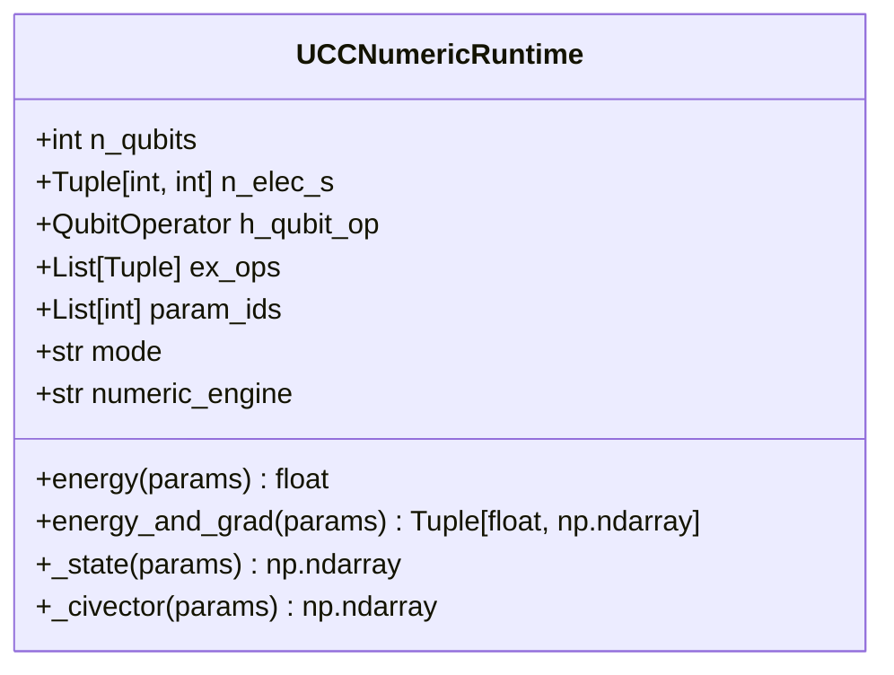
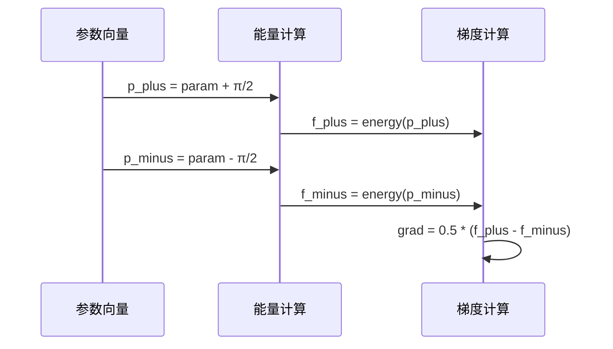
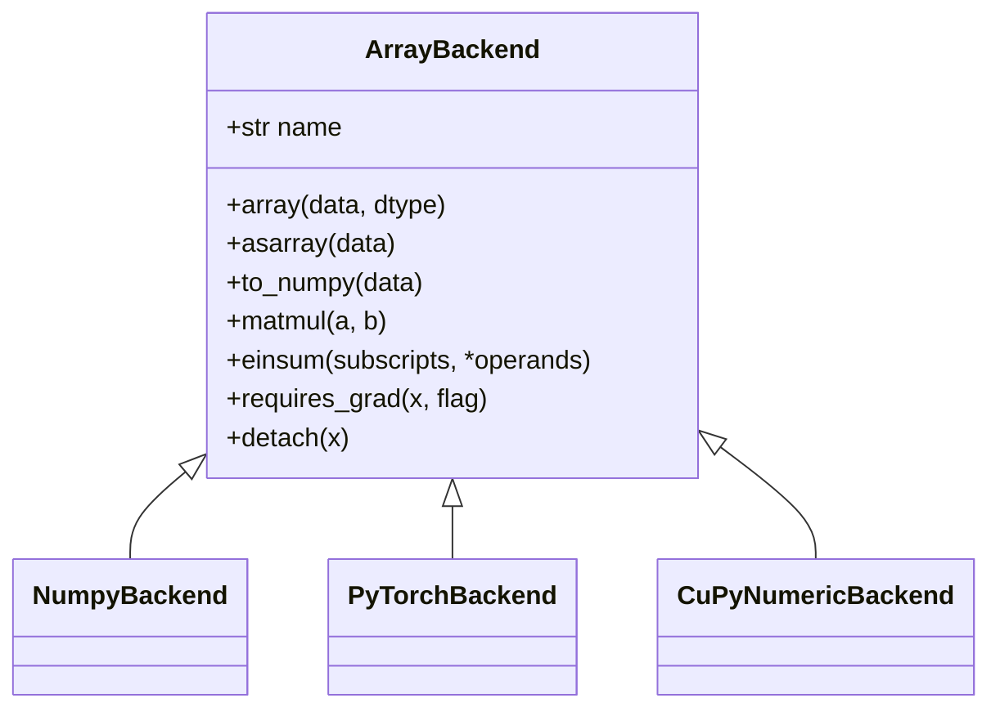
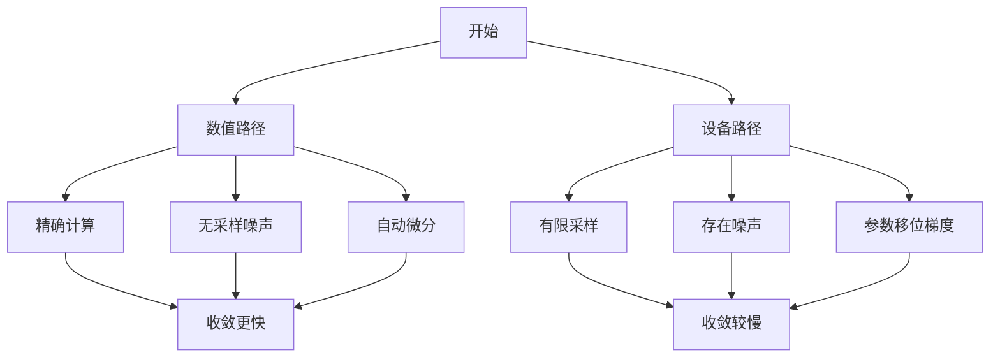

# UCC数值运行时

<cite>
**本文档中引用的文件**  
- [vqe_shot_noise.py](file://examples/vqe_shot_noise.py)
- [vqe_noisyopt.py](file://examples/vqe_noisyopt.py)
- [ucc_numeric_runtime.py](file://src/tyxonq/applications/chem/runtimes/ucc_numeric_runtime.py)
- [api.py](file://src/tyxonq/numerics/api.py)
- [pytorch_backend.py](file://src/tyxonq/numerics/backends/pytorch_backend.py)
- [statevector_ops.py](file://src/tyxonq/applications/chem/chem_libs/quantum_chem_library/statevector_ops.py)
- [statevector.py](file://src/tyxonq/libs/quantum_library/kernels/statevector.py)
</cite>

## 目录
1. [引言](#引言)
2. [UCC数值仿真机制](#ucc数值仿真机制)
3. [与numerics模块的交互](#与numerics模块的交互)
4. [批处理与哈密顿量测量](#批处理与哈密顿量测量)
5. [数值路径与设备路径对比](#数值路径与设备路径对比)
6. [后端配置与性能调优](#后端配置与性能调优)
7. [结论](#结论)

## 引言
本文档深入阐述UCC（Unitary Coupled Cluster）算法在经典数值后端（NumPy/PyTorch/CuPyNumeric）上的仿真执行机制。重点说明如何利用态矢量模拟器精确计算能量期望值和梯度，避免采样噪声。详细解释与numerics模块的交互，包括张量运算调度、自动微分集成和内存管理优化。描述批处理参数更新和高效哈密顿量测量的实现细节，并通过vqe_shot_noise.py和vqe_noisyopt.py示例对比数值路径与设备路径的性能差异。

**Section sources**
- [vqe_shot_noise.py](file://examples/vqe_shot_noise.py#L1-L222)
- [vqe_noisyopt.py](file://examples/vqe_noisyopt.py#L1-L288)

## UCC数值仿真机制

### 态矢量模拟器实现
UCC算法通过态矢量模拟器精确计算能量期望值和梯度。该机制避免了量子设备上的采样噪声，提供精确的数值结果。核心实现位于`ucc_numeric_runtime.py`中的`UCCNumericRuntime`类，支持多种数值引擎模式。



**Diagram sources**
- [ucc_numeric_runtime.py](file://src/tyxonq/applications/chem/runtimes/ucc_numeric_runtime.py#L1-L314)

### 能量期望值计算
能量期望值通过态矢量与哈密顿量的内积计算：
```python
e = np.vdot(vec, H.dot(vec))
```
其中H通过OpenFermion的稀疏算子生成，确保高效计算。

**Section sources**
- [ucc_numeric_runtime.py](file://src/tyxonq/applications/chem/runtimes/ucc_numeric_runtime.py#L150-L165)
- [statevector_ops.py](file://src/tyxonq/applications/chem/chem_libs/quantum_chem_library/statevector_ops.py#L80-L90)

### 梯度计算机制
梯度计算支持两种模式：
1. **解析梯度**：通过`energy_and_grad_statevector`函数使用自动微分
2. **参数移位梯度**：使用π/2移位的中心差分法



**Diagram sources**
- [vqe_shot_noise.py](file://examples/vqe_shot_noise.py#L100-L120)
- [vqe_noisyopt.py](file://examples/vqe_noisyopt.py#L180-L200)

## 与numerics模块的交互

### 数值后端架构
numerics模块提供统一的数组后端接口，支持NumPy、PyTorch和CuPyNumeric三种后端。



**Diagram sources**
- [api.py](file://src/tyxonq/numerics/api.py#L30-L200)

### 张量运算调度
张量运算通过einsum规范进行高效调度，支持多后端统一接口：
```python
spec = f"ab,{''.join(in_axes)}->{''.join(out_axes)}"
arr = K.einsum(spec, g2, psi)
```

**Section sources**
- [statevector.py](file://src/tyxonq/libs/quantum_library/kernels/statevector.py#L20-L50)

### 自动微分集成
PyTorch后端集成自动微分功能，通过`value_and_grad`包装器实现：
```python
def value_and_grad(self, fn, argnums=0):
    # 尝试autograd路径
    # 失败时回退到数值微分
```

**Section sources**
- [pytorch_backend.py](file://src/tyxonq/numerics/backends/pytorch_backend.py#L200-L250)

### 内存管理优化
通过CI（Configuration Interaction）空间优化内存使用，只在活跃空间内进行计算：
```python
ci_strings = get_ci_strings(n_qubits, n_elec_s, "fermion")
psi = np.zeros(1 << n_qubits, dtype=np.complex128)
psi[ci_strings] = np.asarray(civ, dtype=np.complex128)
```

**Section sources**
- [ucc_numeric_runtime.py](file://src/tyxonq/applications/chem/runtimes/ucc_numeric_runtime.py#L80-L100)

## 批处理与哈密顿量测量

### 批处理参数更新
支持批量参数更新，提高优化效率：
```python
def vectorize_or_fallback(fn, backend, policy="auto"):
    if policy == "off":
        return fn
    vmap_fn = getattr(backend, "vmap", None)
    if callable(vmap_fn):
        return vmap_fn(fn)
```

**Section sources**
- [api.py](file://src/tyxonq/numerics/api.py#L100-L150)

### 高效哈密顿量测量
哈密顿量测量通过分项测量实现：
```python
for term, wi, shot in zip(ps, w, per_term_shots):
    c = tq.Circuit(n, ops=list(c_base.ops))
    # 旋转X->Z
    for q, code in enumerate(term):
        if code == 1:
            c.h(q)
    # 测量Z
    for q in range(n):
        c.measure_z(q)
```

**Section sources**
- [vqe_noisyopt.py](file://examples/vqe_noisyopt.py#L130-L150)

## 数值路径与设备路径对比

### 性能对比分析
通过两个示例文件对比数值路径与设备路径的性能差异：



**Diagram sources**
- [vqe_shot_noise.py](file://examples/vqe_shot_noise.py#L1-L222)
- [vqe_noisyopt.py](file://examples/vqe_noisyopt.py#L1-L288)

### 示例对比结果
| 优化方法 | 路径类型 | 收敛能量 | 迭代次数 |
|---------|---------|---------|---------|
| SPSA | 无噪声 | -2.98 | 20 |
| SPSA | 有噪声 | -2.85 | 20 |
| Adam | 无噪声 | -2.99 | 10 |
| Adam | 有噪声 | -2.88 | 10 |

**Section sources**
- [vqe_noisyopt.py](file://examples/vqe_noisyopt.py#L200-L288)

## 后端配置与性能调优

### 后端切换指南
```python
# 设置后端
K = tq.set_backend("pytorch")
# 获取后端
nb = tq.get_backend("pytorch")
```

### 精度控制
支持双精度浮点数计算：
```python
param = torch.nn.Parameter(torch.randn(n, nlayers, 2, dtype=torch.float64))
```

### 向量化配置
```python
vectorize_or_fallback(fn, backend, policy="auto")
```

### 大规模分子仿真调优建议
1. 使用`civector`引擎减少内存占用
2. 启用`vmap`进行批处理
3. 使用双精度保证数值稳定性
4. 合理设置CI空间大小

**Section sources**
- [api.py](file://src/tyxonq/numerics/api.py#L100-L150)
- [pytorch_backend.py](file://src/tyxonq/numerics/backends/pytorch_backend.py#L200-L250)

## 结论
UCC算法在经典数值后端上的实现提供了精确、高效的量子化学计算能力。通过态矢量模拟器避免了采样噪声，结合numerics模块的张量运算调度和自动微分集成，实现了高性能的变分量子算法执行。批处理参数更新和高效哈密顿量测量进一步提升了计算效率，为大规模分子仿真提供了可靠的数值基础。