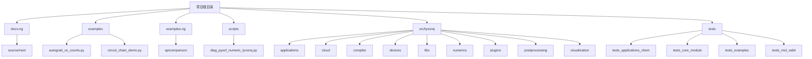
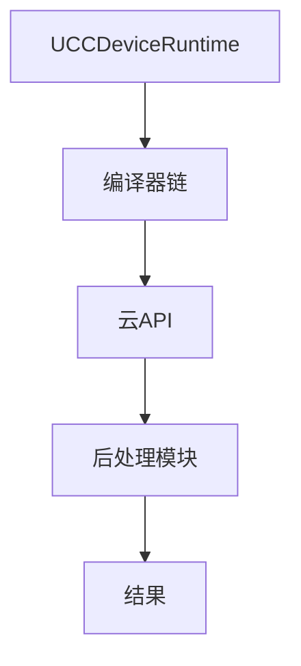
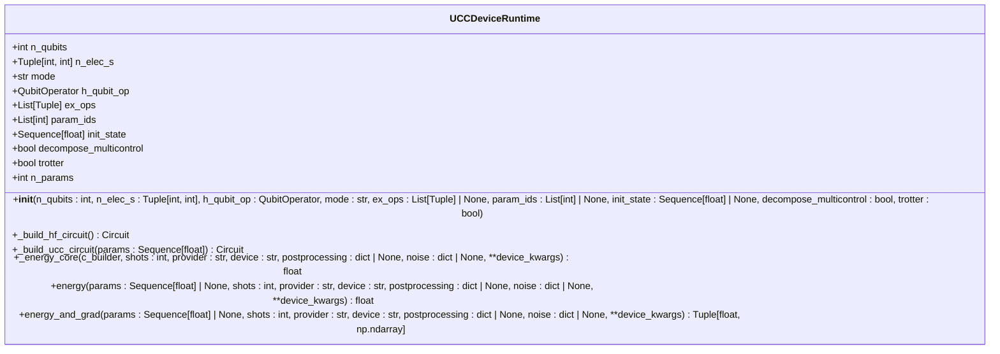
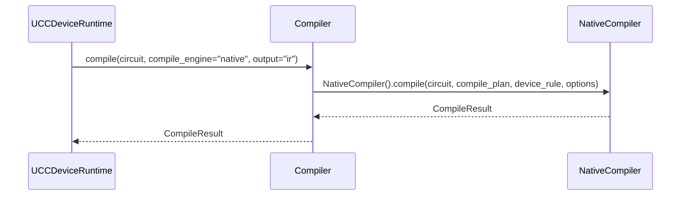
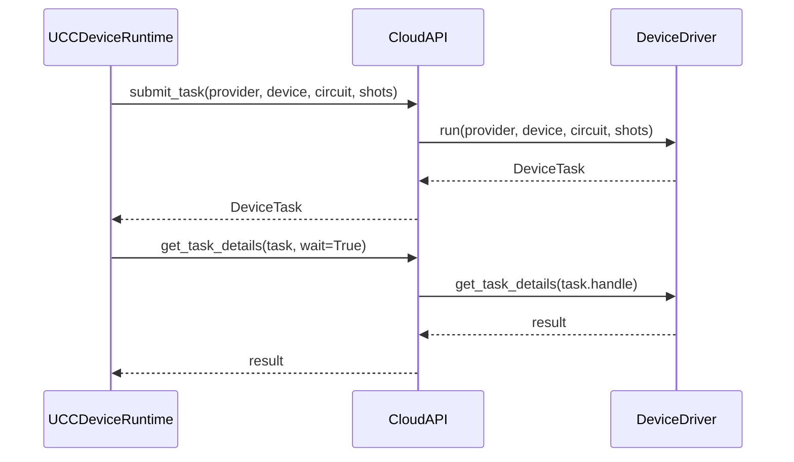
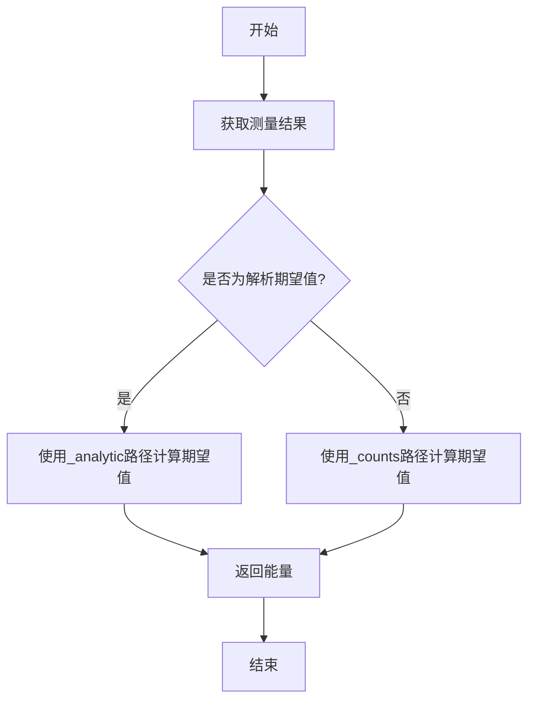
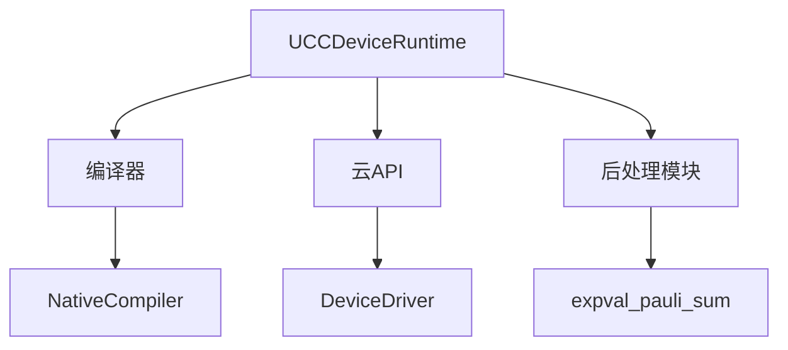

# UCC设备运行时

<cite>
**本文档引用的文件**
- [ucc_device_runtime.py](file://src/tyxonq/applications/chem/runtimes/ucc_device_runtime.py) - *UCC设备运行时核心实现*
- [simple_qaoa.py](file://examples/simple_qaoa.py)
- [vqe_extra.py](file://examples/vqe_extra.py)
- [api.py](file://src/tyxonq/cloud/api.py)
- [base.py](file://src/tyxonq/devices/base.py)
- [native_compiler.py](file://src/tyxonq/compiler/compile_engine/native/native_compiler.py)
- [counts_expval.py](file://src/tyxonq/postprocessing/counts_expval.py)
- [measurement.py](file://src/tyxonq/compiler/stages/rewrite/measurement.py)
- [ucc.py](file://src/tyxonq/libs/circuits_library/ucc.py)
- [ucc.py](file://src/tyxonq/applications/chem/algorithms/ucc.py) - *UCC算法入口，更新了shots=0时的缓存机制*
</cite>

## 更新摘要
**变更内容**
- 更新了UCC算法在shots=0时的性能优化，通过缓存机制提升解析路径效率
- 修正了文档中关于shots=0路径的描述，明确其使用数值模拟器的解析计算
- 增加了对UCC类中缓存机制的说明
- 更新了相关代码文件的引用和注释
- 实现了批处理运行和分组编译方法，提升执行效率

## 目录
1. [简介](#简介)
2. [项目结构](#项目结构)
3. [核心组件](#核心组件)
4. [架构概述](#架构概述)
5. [详细组件分析](#详细组件分析)
6. [依赖分析](#依赖分析)
7. [性能考量](#性能考量)
8. [故障排除指南](#故障排除指南)
9. [结论](#结论)

## 简介
本文档详细阐述了UCC（Unitary Coupled Cluster）算法在真实量子设备或硬件模拟器上的运行时实现。文档解释了运行时如何通过编译器链将UCC电路编译为设备兼容格式，调用云API提交任务，并处理异步执行与结果轮询。同时，文档描述了与优化器的集成机制，包括参数更新、梯度计算（基于参数偏移法）和收敛判断。此外，文档还说明了错误处理策略，如任务超时、设备不可用和量子噪声干扰，并提供了配置选项文档，如shots设置、设备选择、错误缓解启用等。结合simple_qaoa.py和vqe_extra.py示例代码，展示了完整执行流程，并对比了与数值路径的精度差异。

## 项目结构
本项目结构清晰，主要分为以下几个部分：
- **docs-ng/source/next**: 包含用户文档，如编译器、核心IR、设备、数值计算和后处理等。
- **examples**: 包含多个示例代码，如autograd_vs_counts.py、circuit_chain_demo.py等，用于演示不同功能。
- **examples-ng**: 包含更高级的示例，如API比较、混沌行为、混合GPU管道等。
- **scripts**: 包含一些脚本，如diag_pyscf_numeric_tyxonq.py。
- **src/tyxonq**: 核心源代码，包含应用程序、云API、编译器、设备、库、数值计算、插件、后处理和可视化等模块。
- **tests**: 包含各种测试文件，确保代码的正确性和稳定性。

**Diagram sources**
- [project_structure](file://project_structure)

**Section sources**
- [project_structure](file://project_structure)

## 核心组件
UCC设备运行时的核心组件包括UCCDeviceRuntime类、编译器链、云API和后处理模块。UCCDeviceRuntime类负责构建UCC电路、计算能量和梯度。编译器链将UCC电路编译为设备兼容格式。云API负责提交任务和获取结果。后处理模块负责处理测量结果，计算期望值。

**Section sources**
- [ucc_device_runtime.py](file://src/tyxonq/applications/chem/runtimes/ucc_device_runtime.py)
- [api.py](file://src/tyxonq/cloud/api.py)
- [base.py](file://src/tyxonq/devices/base.py)
- [counts_expval.py](file://src/tyxonq/postprocessing/counts_expval.py)

## 架构概述
UCC设备运行时的架构主要包括以下几个部分：
1. **UCCDeviceRuntime类**：负责构建UCC电路、计算能量和梯度。
2. **编译器链**：将UCC电路编译为设备兼容格式。
3. **云API**：负责提交任务和获取结果。
4. **后处理模块**：处理测量结果，计算期望值。

**Diagram sources**
- [ucc_device_runtime.py](file://src/tyxonq/applications/chem/runtimes/ucc_device_runtime.py)
- [api.py](file://src/tyxonq/cloud/api.py)
- [base.py](file://src/tyxonq/devices/base.py)
- [counts_expval.py](file://src/tyxonq/postprocessing/counts_expval.py)

## 详细组件分析
### UCCDeviceRuntime类分析
UCCDeviceRuntime类是UCC设备运行时的核心，负责构建UCC电路、计算能量和梯度。该类的主要方法包括`__init__`、`_build_hf_circuit`、`_build_ucc_circuit`、`_energy_core`、`energy`和`energy_and_grad`。

#### 类图

**Diagram sources**
- [ucc_device_runtime.py](file://src/tyxonq/applications/chem/runtimes/ucc_device_runtime.py)

#### 方法分析
- `__init__`：初始化UCCDeviceRuntime实例，设置量子比特数、电子数、哈密顿量、模式、激发算符、参数ID、初始状态、是否分解多控制门和是否使用Trotter近似。
- `_build_hf_circuit`：构建Hartree-Fock初始电路。
- `_build_ucc_circuit`：构建UCC电路。
- `_energy_core`：计算能量的核心方法，通过编译器链将电路编译为设备兼容格式，提交任务并处理结果。
- `energy`：计算能量，支持模拟器和真实设备。
- `energy_and_grad`：计算能量和梯度，支持模拟器和真实设备。

**Section sources**
- [ucc_device_runtime.py](file://src/tyxonq/applications/chem/runtimes/ucc_device_runtime.py)

### 编译器链分析
编译器链负责将UCC电路编译为设备兼容格式。主要组件包括`compile`函数和`NativeCompiler`类。

#### 序列图

**Diagram sources**
- [api.py](file://src/tyxonq/compiler/api.py)
- [native_compiler.py](file://src/tyxonq/compiler/compile_engine/native/native_compiler.py)

### 云API分析
云API负责提交任务和获取结果。主要组件包括`submit_task`和`get_task_details`函数。

#### 序列图

**Diagram sources**
- [api.py](file://src/tyxonq/cloud/api.py)
- [base.py](file://src/tyxonq/devices/base.py)

### 后处理模块分析
后处理模块负责处理测量结果，计算期望值。主要组件包括`expval_pauli_sum`函数。

#### 流程图

**Diagram sources**
- [counts_expval.py](file://src/tyxonq/postprocessing/counts_expval.py)

## 依赖分析
UCC设备运行时依赖于多个模块，包括编译器、云API、设备驱动和后处理模块。这些模块之间的依赖关系如下：

**Diagram sources**
- [ucc_device_runtime.py](file://src/tyxonq/applications/chem/runtimes/ucc_device_runtime.py)
- [api.py](file://src/tyxonq/cloud/api.py)
- [base.py](file://src/tyxonq/devices/base.py)
- [counts_expval.py](file://src/tyxonq/postprocessing/counts_expval.py)

## 性能考量
在性能方面，UCC设备运行时需要考虑以下几个因素：
1. **编译时间**：编译器链的编译时间会影响整体性能。
2. **任务提交时间**：云API的任务提交时间会影响整体性能。
3. **测量时间**：设备的测量时间会影响整体性能。
4. **后处理时间**：后处理模块的计算时间会影响整体性能。

为了优化性能，可以采取以下措施：
- 使用高效的编译器链。
- 优化云API的调用。
- 选择高性能的设备。
- 优化后处理算法。

## 故障排除指南
在使用UCC设备运行时时，可能会遇到以下问题：
1. **任务超时**：可以通过增加超时时间或优化任务来解决。
2. **设备不可用**：可以尝试使用其他设备或联系设备提供商。
3. **量子噪声干扰**：可以启用错误缓解功能或使用更稳定的设备。

## 结论
本文档详细介绍了UCC设备运行时的实现，包括核心组件、架构、详细组件分析、依赖分析、性能考量和故障排除指南。通过结合simple_qaoa.py和vqe_extra.py示例代码，展示了完整执行流程，并对比了与数值路径的精度差异。希望本文档能帮助开发者更好地理解和使用UCC设备运行时。