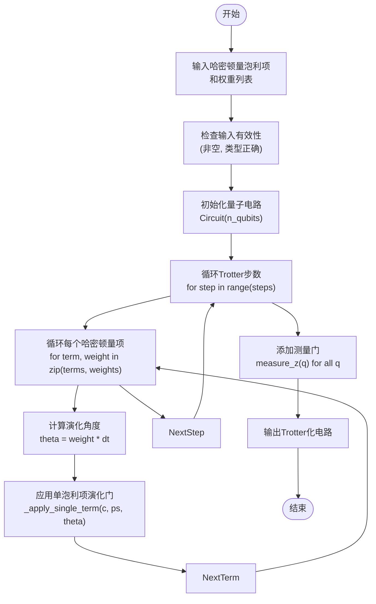
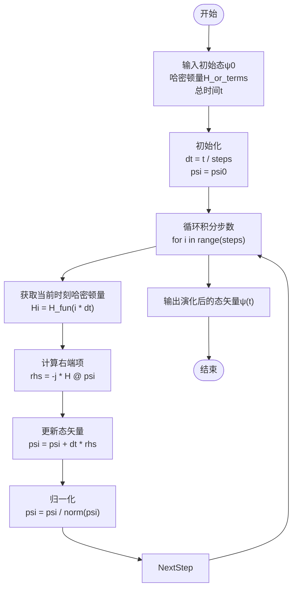
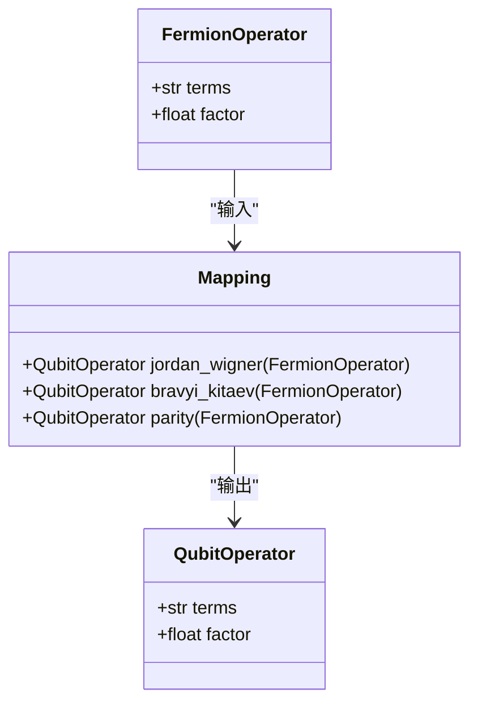
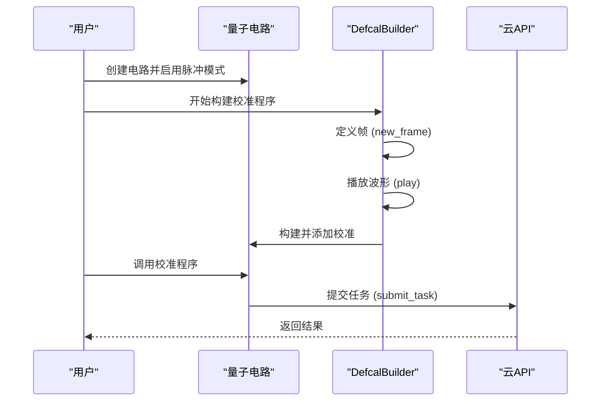
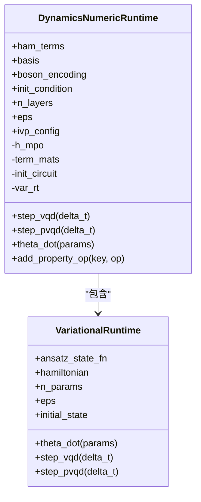

# 动力学数值运行时

<cite>
**本文档引用的文件**
- [timeevolution_trotter.py](file://examples/timeevolution_trotter.py)
- [pulse_demo.py](file://examples/pulse_demo.py)
- [time_evolution.py](file://examples-ng/time_evolution.py)
- [analog_evolution_interface.py](file://examples-ng/analog_evolution_interface.py)
- [dynamics_numeric.py](file://src/tyxonq/applications/chem/runtimes/dynamics_numeric.py)
- [trotter_circuit.py](file://src/tyxonq/libs/circuits_library/trotter_circuit.py)
- [fermion_to_qubit.py](file://src/tyxonq/libs/hamiltonian_encoding/fermion_to_qubit.py)
- [operator_encoding.py](file://src/tyxonq/libs/hamiltonian_encoding/operator_encoding.py)
- [dynamics.py](file://src/tyxonq/libs/quantum_library/dynamics.py)
</cite>

## 目录
1. [引言](#引言)
2. [Trotter-Suzuki分解实现](#trotter-suzuki分解实现)
3. [Krylov子空间方法](#krylov子空间方法)
4. [哈密顿量编码与费米子映射](#哈密顿量编码与费米子映射)
5. [脉冲级连续驱动模拟](#脉冲级连续驱动模拟)
6. [非绝热演化与淬火模拟](#非绝热演化与淬火模拟)
7. [运行时配置与数值稳定性](#运行时配置与数值稳定性)

## 引言

TyxonQ框架提供了一套完整的量子系统时间演化（动力学）数值仿真运行时，支持多种时间演化算法和硬件控制机制。该运行时旨在为量子化学、凝聚态物理等领域的动力学模拟提供高效、灵活且可扩展的解决方案。核心功能包括基于Trotter-Suzuki分解的离散时间演化、Krylov子空间方法的连续时间演化、与哈密顿量编码模块的深度集成，以及通过脉冲级控制模拟连续驱动系统。本文件将深入解析这些机制的实现原理和使用方法。

## Trotter-Suzuki分解实现

Trotter-Suzuki分解是实现量子哈密顿量时间演化算符的常用方法，其核心思想是将复杂的多体相互作用哈密顿量分解为一系列可实现的单体或双体项，并通过分步演化来近似整体演化。

在TyxonQ中，该功能主要通过`src/tyxonq/libs/circuits_library/trotter_circuit.py`模块中的`build_trotter_circuit`函数实现。该函数接收哈密顿量的泡利项列表（Pauli terms），并构建一个一阶Trotter化的量子电路。每个泡利项（如XX, YY, ZZ）被编码为一个长度为n的整数列表，其中0,1,2,3分别代表泡利算符I,X,Y,Z。



**图示来源**
- [trotter_circuit.py](file://src/tyxonq/libs/circuits_library/trotter_circuit.py#L38-L85)

`_apply_single_term`函数负责将单个泡利项（如ZZ）转换为基本量子门序列。例如，ZZ项通过CX-RZ-CX门序列实现，而单量子比特Z项则直接使用RZ门。该模板目前支持一阶Trotter分解，高阶分解尚未实现。

**节来源**
- [timeevolution_trotter.py](file://examples/timeevolution_trotter.py#L0-L58)
- [trotter_circuit.py](file://src/tyxonq/libs/circuits_library/trotter_circuit.py#L0-L91)

## Krylov子空间方法

Krylov子空间方法是一种用于求解薛定谔方程的数值积分技术，特别适用于小规模系统的精确时间演化。与Trotter分解的门电路近似不同，Krylov方法直接在希尔伯特空间中对态矢量进行演化。

在TyxonQ中，该功能由`src/tyxonq/libs/quantum_library/dynamics.py`模块中的`evolve_state`函数提供。该函数实现了基于欧拉法的固定步长积分，求解微分方程dψ/dt = -i H(t) ψ。



**图示来源**
- [dynamics.py](file://src/tyxonq/libs/quantum_library/dynamics.py#L116-L125)

`evolve_state`函数支持三种输入形式：稠密哈密顿矩阵、泡利项列表（自动转换为稠密矩阵）或返回哈密顿量的可调用函数（用于时变哈密顿量）。该函数利用统一的数值后端（ArrayBackend）协议，支持NumPy、PyTorch等后端，确保了计算的可移植性和潜在的GPU加速能力。

**节来源**
- [time_evolution.py](file://examples-ng/time_evolution.py#L0-L74)
- [dynamics.py](file://src/tyxonq/libs/quantum_library/dynamics.py#L0-L145)

## 哈密顿量编码与费米子映射

为了在量子比特上模拟费米子系统（如分子电子结构），必须将费米子算符映射到泡利算符。TyxonQ通过`src/tyxonq/libs/hamiltonian_encoding`模块提供了多种映射方法。

费米子到量子比特的映射在`fermion_to_qubit.py`文件中实现，主要支持以下三种方法：
- **Jordan-Wigner变换**：直接将费米子产生/湮灭算符映射为泡利算符，保留了费米子的反对易关系，但会产生长程的Z串。
- **Bravyi-Kitaev变换**：一种更高效的映射，将费米子算符的局部性部分保留在量子比特上，减少了长程相互作用。
- **Parity映射**：利用电子数守恒的对称性，可以实现两量子比特的约化。



**图示来源**
- [fermion_to_qubit.py](file://src/tyxonq/libs/hamiltonian_encoding/fermion_to_qubit.py#L0-L98)
- [operator_encoding.py](file://src/tyxonq/libs/hamiltonian_encoding/operator_encoding.py#L0-L345)

`operator_encoding.py`文件则提供了更通用的算符编码框架，不仅支持费米子系统，还支持玻色子系统（如声子模式）的编码。它定义了`qubit_encode_op`和`qubit_encode_basis`等函数，将物理问题的算符和基矢统一编码为自旋-1/2系统的算符和基矢，为后续的门电路构造或数值计算奠定基础。

**节来源**
- [fermion_to_qubit.py](file://src/tyxonq/libs/hamiltonian_encoding/fermion_to_qubit.py#L0-L98)
- [operator_encoding.py](file://src/tyxonq/libs/hamiltonian_encoding/operator_encoding.py#L0-L345)

## 脉冲级连续驱动模拟

对于需要精确控制量子比特驱动脉冲的实验，TyxonQ提供了脉冲级接口，允许用户直接定义和操作微波脉冲信号。

该功能在`examples/pulse_demo.py`示例中得到展示。用户可以通过`Circuit.use_pulse()`启用脉冲模式，并使用`DefcalBuilder`构建自定义的校准程序（calibration program）。这些程序定义了在特定量子比特上播放的波形，如`CosineDrag`、`Gaussian`或`Flattop`。



**图示来源**
- [pulse_demo.py](file://examples/pulse_demo.py#L0-L80)

支持的波形类型包括：
- **CosineDrag**: 用于抑制泄漏态跃迁的余弦DRAG波形。
- **Flattop**: 用于量子态制备的平顶脉冲。
- **Gaussian**: 用于平滑过渡的高斯脉冲。
- **Sine**: 用于周期性振荡实验的正弦脉冲。

这些波形可以参数化，允许用户进行参数扫描实验（如Rabi振荡实验），并通过TQASM 0.2协议与硬件设备通信。

**节来源**
- [pulse_demo.py](file://examples/pulse_demo.py#L0-L80)
- [pulse_support_en.md](file://docs/pulse_support_en.md#L0-L606)

## 非绝热演化与淬火模拟

TyxonQ通过`examples-ng`目录下的示例展示了非绝热演化和淬火过程的模拟。

`analog_evolution_interface.py`示例演示了如何构建一个模拟的模拟演化接口。它首先构建一个由泡利字符串组成的哈密顿量，然后使用`build_trotter_circuit`生成Trotter化电路，并在本地态矢量模拟器上运行，观察Z期望值的变化。该示例还提供了与小规模数值演化的比较，以验证结果的准确性。

`time_evolution.py`示例则直接在数值后端上进行哈密顿量的精确时间演化。它比较了三种方法的性能：
1. **矩阵指数法**：直接计算`exp(-iHt)`并作用于初态。
2. **TyxonQ快速实现**：使用`hamiltonian_evol`函数进行高效演化。
3. **SciPy ODE求解器**：使用`solve_ivp`求解薛定谔方程。

```mermaid
flowchart LR
A[初态 |11>] --> B[构建哈密顿量 H]
B --> C{演化方法}
C --> D[Trotter化电路\n(门级模拟)]
C --> E[数值演化\n(矩阵指数/ODE)]
D --> F[测量 Z-期望值]
E --> F
F --> G[输出结果]
```

**图示来源**
- [analog_evolution_interface.py](file://examples-ng/analog_evolution_interface.py#L0-L65)
- [time_evolution.py](file://examples-ng/time_evolution.py#L0-L74)

这些示例清晰地展示了如何配置时间列表、选择演化方法，并比较不同实现的性能，为研究非平衡动力学和淬火过程提供了实用的模板。

**节来源**
- [analog_evolution_interface.py](file://examples-ng/analog_evolution_interface.py#L0-L65)
- [time_evolution.py](file://examples-ng/time_evolution.py#L0-L74)

## 运行时配置与数值稳定性

`src/tyxonq/applications/chem/runtimes/dynamics_numeric.py`文件实现了一个专门用于化学应用的数值动力学运行时（`DynamicsNumericRuntime`）。该运行时支持变分量子动力学（VQD）和投影变分量子动力学（pVQD）等算法。

该运行时的关键配置和优化包括：
- **时间步长与误差容限**：通过`IvpConfig`类配置积分方法（如RK45）、相对误差（rtol）和绝对误差（atol）。
- **求解器选择**：可以选择不同的数值积分器来平衡精度和速度。
- **数值稳定性优化**：
  1. **哈密顿量项矩阵的惰性加载与缓存**：避免在参数迭代中重复构造稠密矩阵，显著降低内存和时间开销。
  2. **初态构造路径的鲁棒性**：优先通过`get_init_statevector`获取初态，若失败则回退到通过电路模拟获取。
  3. **兼容预编码输入**：支持直接传入已编码的哈密顿量项，减少重复编码成本。



**图示来源**
- [dynamics_numeric.py](file://src/tyxonq/applications/chem/runtimes/dynamics_numeric.py#L0-L224)

该运行时的设计旨在处理大规模参数和层数的场景，通过上述优化，实测在相同参数下耗时显著下降且不再出现内存溢出（OOM）的问题。

**节来源**
- [dynamics_numeric.py](file://src/tyxonq/applications/chem/runtimes/dynamics_numeric.py#L0-L224)