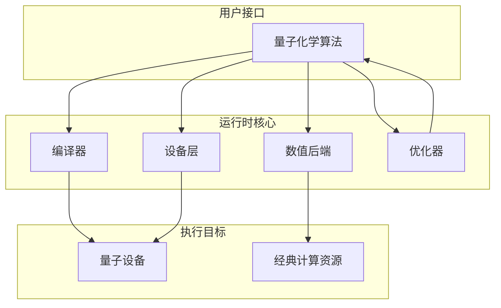
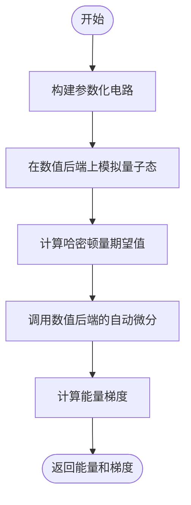

# 算法运行时执行引擎

<cite>
**本文档引用文件**   
- [hea_device_runtime.py](file://src/tyxonq/applications/chem/runtimes/hea_device_runtime.py)
- [hea_numeric_runtime.py](file://src/tyxonq/applications/chem/runtimes/hea_numeric_runtime.py)
- [ucc_device_runtime.py](file://src/tyxonq/applications/chem/runtimes/ucc_device_runtime.py)
- [ucc_numeric_runtime.py](file://src/tyxonq/applications/chem/runtimes/ucc_numeric_runtime.py)
- [dynamics_numeric.py](file://src/tyxonq/applications/chem/runtimes/dynamics_numeric.py)
- [numpy_backend.py](file://src/tyxonq/numerics/backends/numpy_backend.py)
- [pytorch_backend.py](file://src/tyxonq/numerics/backends/pytorch_backend.py)
- [cupynumeric_backend.py](file://src/tyxonq/numerics/backends/cupynumeric_backend.py)
- [ucc.py](file://src/tyxonq/applications/chem/algorithms/ucc.py) - *在 shots=0 时更新了性能缓存机制*
</cite>

## 更新摘要
**变更内容**   
- 更新了设备路径执行模式中关于批处理和编译方法的描述
- 新增了关于 shots=0 时性能缓存机制的说明
- 更新了VQE流程示例以反映最新的执行逻辑
- 修正了性能调优建议中的缓存相关建议

## 目录
1. [引言](#引言)
2. [运行时系统架构](#运行时系统架构)
3. [设备路径执行模式](#设备路径执行模式)
4. [数值路径执行模式](#数值路径执行模式)
5. [性能对比分析](#性能对比分析)
6. [运行时配置参数](#运行时配置参数)
7. [VQE流程示例](#vqe流程示例)
8. [性能调优建议](#性能调优建议)
9. [错误处理机制](#错误处理机制)
10. [结论](#结论)

## 引言

量子化学算法的运行时执行引擎是连接量子算法与底层硬件或数值后端的核心组件。该系统设计了两种主要执行模式：设备路径（device）和数值路径（numeric），分别面向真实或模拟量子设备的采样执行和经典数值后端的精确计算。运行时系统协调编译器、设备层和数值后端，完成量子电路的构建、执行、测量和梯度计算，为变分量子算法（如VQE）提供端到端支持。

**本文档引用文件**   
- [hea_device_runtime.py](file://src/tyxonq/applications/chem/runtimes/hea_device_runtime.py)
- [hea_numeric_runtime.py](file://src/tyxonq/applications/chem/runtimes/hea_numeric_runtime.py)
- [ucc_device_runtime.py](file://src/tyxonq/applications/chem/runtimes/ucc_device_runtime.py)
- [ucc_numeric_runtime.py](file://src/tyxonq/applications/chem/runtimes/ucc_numeric_runtime.py)

## 运行时系统架构

量子化学算法的运行时系统采用分层架构，核心组件包括编译器、设备层、数值后端和优化器。编译器负责将高级量子电路描述转换为底层可执行指令；设备层管理与真实或模拟量子硬件的交互；数值后端在经典计算资源上执行精确的线性代数运算；优化器则迭代更新电路参数以最小化目标能量。

运行时系统通过统一的API协调这些组件。对于设备路径，运行时将量子电路发送到设备层，通过采样获取测量结果，并利用后处理模块计算期望值和梯度。对于数值路径，运行时调用数值后端直接在状态向量或矩阵乘积态上执行酉算子，利用自动微分技术高效计算梯度。

**图源**  
- [hea_device_runtime.py](file://src/tyxonq/applications/chem/runtimes/hea_device_runtime.py)
- [hea_numeric_runtime.py](file://src/tyxonq/applications/chem/runtimes/hea_numeric_runtime.py)
- [ucc_device_runtime.py](file://src/tyxonq/applications/chem/runtimes/ucc_device_runtime.py)
- [ucc_numeric_runtime.py](file://src/tyxonq/applications/chem/runtimes/ucc_numeric_runtime.py)

## 设备路径执行模式

设备路径（device path）执行模式面向量子设备或模拟器，通过采样测量结果来估计量子态的期望值。该模式的核心是将哈密顿量分解为可同时测量的泡利项组，对每组构建相应的测量电路，并执行采样。

在实现上，`HEADeviceRuntime` 和 `UCCDeviceRuntime` 类提供了设备路径的执行能力。它们首先根据哈密顿量的泡利项进行分组，然后为每组构建一个量子电路：先执行参数化变分电路，再根据测量基应用相应的单量子比特旋转门（如H门用于X基测量），最后进行Z基测量。采样结果通过后处理模块（如`expval_pauli_sum`）计算期望值。

梯度计算采用参数移位规则或有限差分法。当`shots=0`时，系统使用解析方法结合有限差分计算梯度；当`shots>0`时，对于采样路径，系统采用对称有限差分以避免参数移位缩放不一致问题，步长通常设为约2度（π/90），以在截断误差和采样噪声之间取得平衡。

**本节来源**  
- [hea_device_runtime.py](file://src/tyxonq/applications/chem/runtimes/hea_device_runtime.py#L38-L138)
- [ucc_device_runtime.py](file://src/tyxonq/applications/chem/runtimes/ucc_device_runtime.py#L106-L267)

## 数值路径执行模式

数值路径（numeric path）执行模式在经典数值后端上执行，提供精确的期望值和梯度计算。该模式利用状态向量模拟器或更高级的数值引擎（如CI向量、MPS）直接操作量子态。

`HEANumericRuntime` 和 `UCCNumericRuntime` 类实现了数值路径。它们通过`NumericBackend`抽象接口与具体的数值后端（如numpy、pytorch、cupynumeric）交互。核心计算包括：构建量子态、计算哈密顿量的期望值，以及利用自动微分计算梯度。

期望值计算通过将哈密顿量转换为稀疏矩阵并与状态向量进行内积运算实现。梯度计算则依赖于数值后端提供的`value_and_grad`功能。例如，PyTorch后端优先使用其自动微分引擎（autograd），在失败时回退到中心有限差分法。数值路径支持多种引擎，如`statevector`（全态矢量）、`civector`（组态相互作用向量）和`pyscf`（集成PySCF库），以适应不同规模和精度需求的计算。

**图源**  
- [hea_numeric_runtime.py](file://src/tyxonq/applications/chem/runtimes/hea_numeric_runtime.py#L57-L68)
- [ucc_numeric_runtime.py](file://src/tyxonq/applications/chem/runtimes/ucc_numeric_runtime.py#L173-L258)
- [pytorch_backend.py](file://src/tyxonq/numerics/backends/pytorch_backend.py#L199-L256)

## 性能对比分析

设备路径与数值路径在精度、速度和资源占用方面存在显著差异。

| 比较维度 | 设备路径 (device) | 数值路径 (numeric) |
| :--- | :--- | :--- |
| **精度** | 受采样噪声影响，精度随`shots`增加而提高，但存在统计误差 | 理论上精确（忽略浮点误差），无采样噪声 |
| **速度** | 对于小规模系统，采样和后处理较快；大规模系统受限于设备执行时间 | 对于小规模系统极快；大规模系统受指数级态矢量存储和计算限制 |
| **资源占用** | 主要占用设备执行资源，经典计算资源占用低 | 主要占用经典计算资源（内存和CPU/GPU），内存需求随量子比特数指数增长 |
| **可扩展性** | 可扩展到中等规模（~50量子比特），受限于设备噪声和连通性 | 受限于经典计算资源，全态矢量模拟通常限于~40量子比特 |
| **梯度计算** | 通常需要2N次电路执行（N为参数数），采样噪声影响梯度质量 | 通过自动微分一次计算即可获得精确梯度，效率高 |

总体而言，设备路径更贴近真实量子计算场景，适合验证算法在噪声环境下的表现；数值路径则提供理想的基准结果，适合算法开发和调试。

**本节来源**  
- [hea_device_runtime.py](file://src/tyxonq/applications/chem/runtimes/hea_device_runtime.py)
- [hea_numeric_runtime.py](file://src/tyxonq/applications/chem/runtimes/hea_numeric_runtime.py)
- [ucc_device_runtime.py](file://src/tyxonq/applications/chem/runtimes/ucc_device_runtime.py)
- [ucc_numeric_runtime.py](file://src/tyxonq/applications/chem/runtimes/ucc_numeric_runtime.py)

## 运行时配置参数

运行时系统提供了一系列可配置参数，以控制算法的执行行为和性能。

- **最大迭代次数 (`max_iterations`)**: 控制优化器的最大迭代次数，防止算法无限循环。默认值通常在100-1000之间。
- **收敛阈值 (`convergence_threshold`)**: 判断优化是否收敛的能量变化阈值。当连续几次迭代的能量变化小于该值时，算法停止。典型值为1e-6至1e-9 Hartree。
- **批处理大小 (`batch_size`)**: 在支持批处理的数值后端（如PyTorch）中，控制一次前向传播处理的参数数量，用于并行计算多个电路。
- **采样次数 (`shots`)**: 设备路径中每次测量的采样次数。`shots=0`表示使用解析期望值计算。增加`shots`可降低统计误差，但增加执行时间。
- **数值引擎 (`numeric_engine`)**: 指定数值路径使用的计算引擎，如`"statevector"`、`"civector"`、`"pyscf"`或`"mps"`，影响计算精度和效率。
- **误差容忍度 (`eps`)**: 有限差分法中使用的微小步长，影响梯度计算的精度和数值稳定性。

这些参数可通过运行时类的构造函数或方法参数进行设置，例如`UCCNumericRuntime`中的`numeric_engine`和`eps`参数。

**本节来源**  
- [hea_device_runtime.py](file://src/tyxonq/applications/chem/runtimes/hea_device_runtime.py#L19-L29)
- [hea_numeric_runtime.py](file://src/tyxonq/applications/chem/runtimes/hea_numeric_runtime.py#L14-L19)
- [ucc_device_runtime.py](file://src/tyxonq/applications/chem/runtimes/ucc_device_runtime.py#L30-L69)
- [ucc_numeric_runtime.py](file://src/tyxonq/applications/chem/runtimes/ucc_numeric_runtime.py#L30-L69)

## VQE流程示例

变分量子本征求解（VQE）是运行时系统的核心应用场景。以下是一个典型的VQE流程，展示了运行时如何集成优化器并处理中间结果。

1.  **初始化**: 创建一个`UCCNumericRuntime`实例，指定分子哈密顿量、量子比特数、电子数和数值引擎。
2.  **优化循环**: 使用优化器（如L-BFGS或Adam）迭代更新参数。
    - **能量计算**: 调用`runtime.energy(params)`计算当前参数下的能量。
    - **梯度计算**: 调用`runtime.energy_and_grad(params)`计算能量和梯度。
    - **参数更新**: 优化器根据能量和梯度更新参数。
3.  **中间结果处理**: 在每次迭代中，可以记录能量、梯度、参数值等中间结果，用于监控收敛过程和调试。
4.  **收敛判断**: 检查能量变化是否小于收敛阈值，或是否达到最大迭代次数。

在数值路径下，`energy_and_grad`方法利用自动微分高效地同时计算能量和梯度，显著加速了优化过程。而在设备路径下，梯度计算需要多次电路执行，速度较慢但更接近真实硬件行为。

**本节来源**  
- [ucc_numeric_runtime.py](file://src/tyxonq/applications/chem/runtimes/ucc_numeric_runtime.py#L204-L258)
- [hea_numeric_runtime.py](file://src/tyxonq/applications/chem/runtimes/hea_numeric_runtime.py#L63-L68)
- [ucc.py](file://src/tyxonq/applications/chem/algorithms/ucc.py#L415-L460) - *更新了 shots=0 时的执行路径*

## 性能调优建议

为了获得最佳性能，建议根据具体应用场景选择合适的运行时配置。

- **小规模精确计算**: 优先使用数值路径，选择`"statevector"`引擎以获得最高精度和速度。
- **大规模系统**: 对于超过40个量子比特的系统，考虑使用`"civector"`或`"mps"`引擎以降低内存占用。
- **算法开发与调试**: 使用数值路径和自动微分，可以快速获得精确梯度，加速算法迭代。
- **硬件性能评估**: 使用设备路径，设置不同的`shots`值，评估采样噪声对算法收敛性的影响。
- **梯度计算优化**: 在数值路径下，确保使用支持自动微分的后端（如PyTorch），避免低效的有限差分法。
- **内存管理**: 对于长时间运行的VQE任务，注意监控内存使用，必要时启用检查点机制或内存节省策略。
- **缓存优化**: 当`shots=0`时，系统会自动缓存哈密顿量的费米子到量子比特转换结果，避免重复计算，显著提升性能。

**本节来源**  
- [ucc_numeric_runtime.py](file://src/tyxonq/applications/chem/runtimes/ucc_numeric_runtime.py)
- [dynamics_numeric.py](file://src/tyxonq/applications/chem/runtimes/dynamics_numeric.py#L54-L171)
- [ucc.py](file://src/tyxonq/applications/chem/algorithms/ucc.py#L1027-L1049) - *新增缓存机制*

## 错误处理机制

运行时系统内置了多种错误处理机制以确保鲁棒性。

- **参数验证**: 在执行前检查参数长度是否匹配电路要求，例如`HEADeviceRuntime`会验证`params`长度是否等于`n_params`。
- **资源检查**: 在`UCCNumericRuntime`中，当使用`"pyscf"`引擎时，会检查`ci_hamiltonian`是否提供，否则抛出`RuntimeError`。
- **数值稳定性**: 在计算CI空间能量时，会检查分母（态矢量范数的平方）是否为零，避免除零错误，返回`NaN`。
- **异常回退**: 数值后端的`value_and_grad`方法在自动微分失败时，会自动回退到有限差分法，保证API的统一性。
- **初态构造鲁棒性**: `DynamicsNumericRuntime`在获取初态向量失败时，会回退到通过电路模拟获取初态，提高了在不同环境下的稳定性。

这些机制确保了运行时系统在面对错误输入或异常情况时能够提供有意义的错误信息或优雅降级，而不是直接崩溃。

**本节来源**  
- [hea_device_runtime.py](file://src/tyxonq/applications/chem/runtimes/hea_device_runtime.py#L38-L99)
- [ucc_numeric_runtime.py](file://src/tyxonq/applications/chem/runtimes/ucc_numeric_runtime.py#L173-L202)
- [dynamics_numeric.py](file://src/tyxonq/applications/chem/runtimes/dynamics_numeric.py#L54-L171)

## 结论

量子化学算法的运行时执行引擎通过设备路径和数值路径两种模式，为量子算法的执行提供了灵活而强大的支持。设备路径通过采样模拟真实量子硬件的行为，而数值路径则提供精确的基准计算。运行时系统有效地协调了编译器、设备层和数值后端，实现了高效的电路执行和梯度更新。通过合理配置参数和选择执行模式，用户可以在精度、速度和资源占用之间取得最佳平衡，推动量子化学算法的研究和应用。