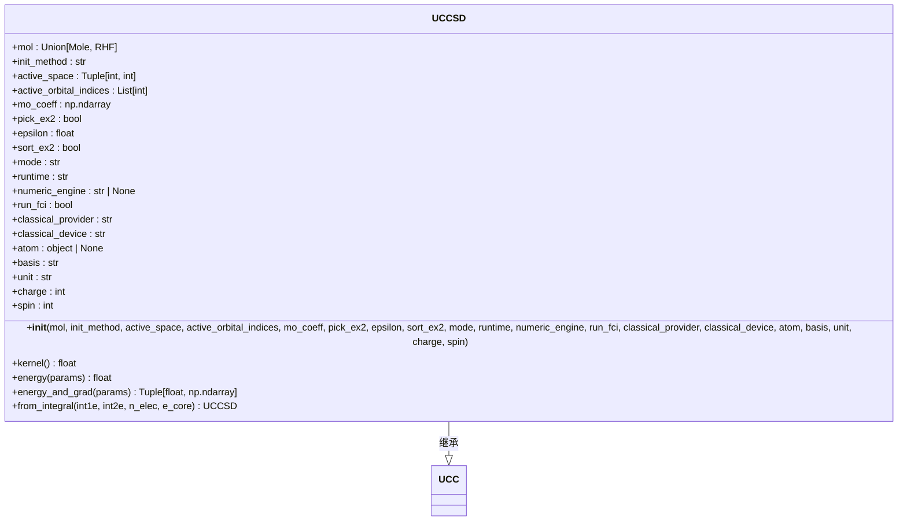
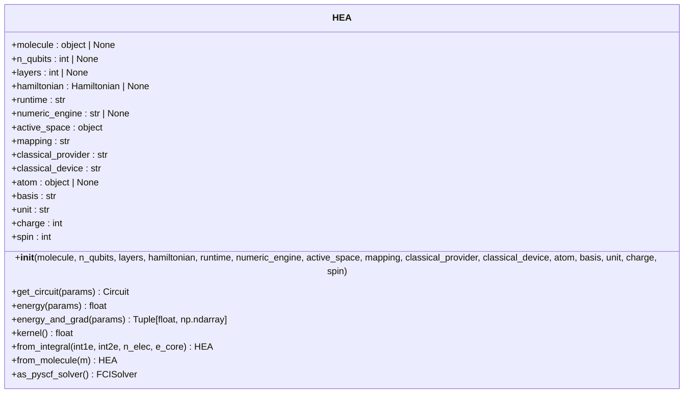
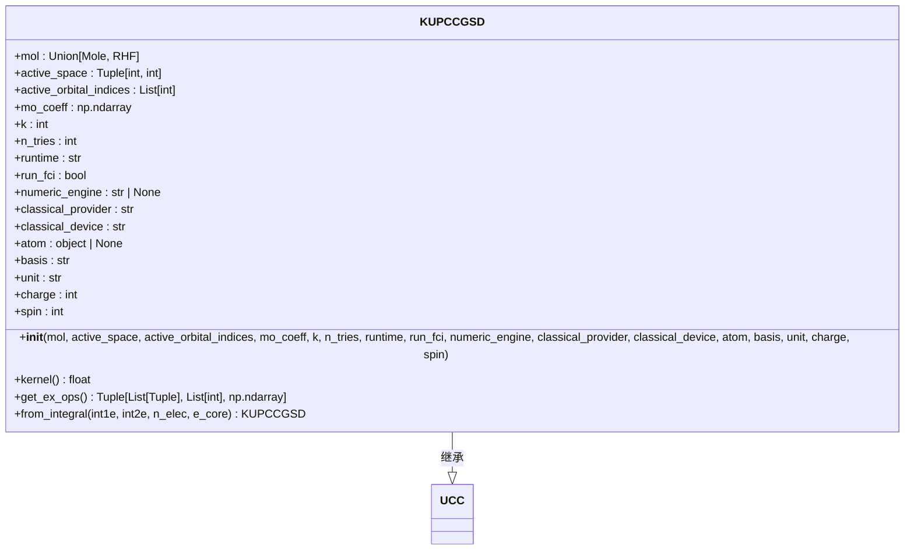
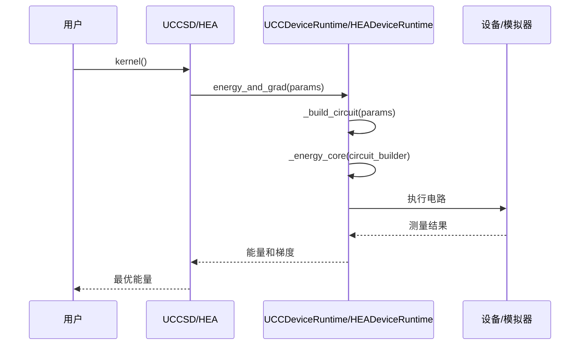
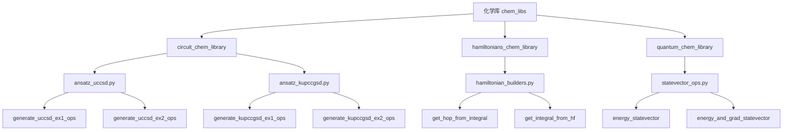

# 量子化学应用

<cite>
**本文档引用的文件**
- [molecule.py](file://src/tyxonq/applications/chem/molecule.py)
- [uccsd.py](file://src/tyxonq/applications/chem/algorithms/uccsd.py)
- [hea.py](file://src/tyxonq/applications/chem/algorithms/hea.py)
- [kupccgsd.py](file://src/tyxonq/applications/chem/algorithms/kupccgsd.py)
- [ucc_device_runtime.py](file://src/tyxonq/applications/chem/runtimes/ucc_device_runtime.py)
- [hea_device_runtime.py](file://src/tyxonq/applications/chem/runtimes/hea_device_runtime.py)
- [ansatz_uccsd.py](file://src/tyxonq/applications/chem/chem_libs/circuit_chem_library/ansatz_uccsd.py)
- [ansatz_kupccgsd.py](file://src/tyxonq/applications/chem/chem_libs/circuit_chem_library/ansatz_kupccgsd.py)
- [hamiltonian_builders.py](file://src/tyxonq/applications/chem/chem_libs/hamiltonians_chem_library/hamiltonian_builders.py)
</cite>

## 更新摘要
**变更内容**
- 根据代码重构和bug修复，更新了UCC、UCCSD、HEA和k-UpCCGSD算法的API和实现细节
- 修正了分子类初始化、活性空间处理和积分计算的逻辑
- 更新了算法内核的执行流程，特别是设备路径和数值路径的统一处理
- 修正了梯度计算和优化器集成的实现
- 更新了RDM计算和PySCF求解器适配器的功能

## 目录
1. [引言](#引言)
2. [分子类封装](#分子类封装)
3. [算法实现与API](#算法实现与api)
4. [算法内核统一执行](#算法内核统一执行)
5. [化学库预定义资源](#化学库预定义资源)
6. [完整工作流示例](#完整工作流示例)
7. [药物设计优化特性](#药物设计优化特性)
8. [结论](#结论)

## 引言

本文档深入介绍量子化学应用层，重点阐述其为AI药物设计（AIDD）提供的PySCF式用户体验。文档详细分析了UCCSD、HEA和k-UpCCGSD等核心量子化学算法的实现原理、API接口和使用场景。通过分子类（molecule）封装化学信息，简化了用户输入流程。算法内核（kernel）统一处理设备路径和数值路径的执行，确保了计算的一致性和高效性。化学库（chem_libs）提供了预定义的电路、哈密顿量和量子化学算子，为用户提供了丰富的构建模块。文档还提供了从分子构建、哈密顿量生成到能量计算的完整工作流示例，并讨论了针对药物设计任务的优化特性，如定制化ansatz、批处理梯度计算和自适应资源分配。

## 分子类封装

分子类（molecule）是量子化学应用的核心数据结构，负责封装化学信息并简化用户输入。该类继承自PySCF的Mole对象，提供了丰富的分子构建方法和预定义分子实例。

分子类通过`_Molecule`基类实现，该类继承自PySCF的`Mole`，并重写了积分计算方法`intor`以支持自定义积分。用户可以通过多种方式创建分子实例，包括直接指定积分矩阵、使用预定义的分子构造函数（如`h2`, `h2o`, `lih`等），或通过`M`函数自定义原子坐标。

分子类提供了大量预定义的分子实例，如`H2`, `H2O`, `LiH`, `BeH2`, `NH3`, `CH4`等，这些实例可以直接用于计算，无需用户手动输入原子坐标。此外，还提供了`random`方法用于生成随机积分的测试分子。

**Section sources**
- [molecule.py](file://src/tyxonq/applications/chem/molecule.py#L0-L310)

## 算法实现与API

### UCCSD算法

UCCSD（Unitary Coupled Cluster Singles and Doubles）算法是量子化学计算中的核心方法，用于求解分子基态能量。该算法通过单激发和双激发算子构建变分波函数，能够精确描述电子相关效应。

UCCSD类继承自UCC基类，其构造函数接受分子对象（PySCF Mole或RHF）、初始振幅猜测方法、活性空间参数等。算法支持多种初始猜测方法，包括MP2、CCSD和零初始猜测。通过`pick_ex2`和`sort_ex2`参数，可以筛选和排序双激发算子，优化ansatz结构。

UCCSD算法提供了`kernel`方法用于运行变分优化，返回最优能量。`energy`方法用于计算给定参数下的能量，`energy_and_grad`方法用于同时计算能量和梯度。此外，还提供了`from_integral`类方法，允许用户直接从分子积分构建UCCSD实例。



**Diagram sources**
- [uccsd.py](file://src/tyxonq/applications/chem/algorithms/uccsd.py#L25-L433)

**Section sources**
- [uccsd.py](file://src/tyxonq/applications/chem/algorithms/uccsd.py#L25-L433)

### HEA算法

HEA（Hardware-Efficient Ansatz）是一种硬件高效的参数化电路，适用于VQE等变分算法。该算法采用RY-only结构，由初始RY层和多层纠缠层（CNOT链）交替构成。

HEA类的构造函数接受量子比特数、层数、哈密顿量和运行时参数。算法支持从分子积分或PySCF分子对象直接构建，通过`from_integral`和`from_molecule`类方法实现。HEA还支持从外部参数化电路（如Qiskit RealAmplitudes）转换。

HEA提供了`get_circuit`方法用于生成门级电路，`energy`方法用于计算能量，`energy_and_grad`方法用于计算能量和梯度。`kernel`方法用于运行变分优化，返回最优能量。此外，还提供了`as_pyscf_solver`类方法，将HEA封装为PySCF兼容的求解器，便于与CASSCF等方法对接。



**Diagram sources**
- [hea.py](file://src/tyxonq/applications/chem/algorithms/hea.py#L26-L516)

**Section sources**
- [hea.py](file://src/tyxonq/applications/chem/algorithms/hea.py#L26-L516)

### k-UpCCGSD算法

k-UpCCGSD（k-layer Unitary Pair Coupled Cluster Generalized Singles and Doubles）算法是一种广义的耦合簇方法，通过k层结构增强ansatz的表达能力。该算法特别适用于大分子和复杂电子结构的计算。

k-UpCCGSD类继承自UCC基类，其构造函数接受分子对象、活性空间参数、层数k和初始化尝试次数n_tries。算法生成广义的单激发和配对双激发算子，不依赖于CC振幅，具有更强的灵活性。

k-UpCCGSD提供了`kernel`方法用于运行多次初始化尝试的变分优化，返回最优能量。`get_ex_ops`方法用于获取激发算子，`from_integral`类方法允许用户直接从分子积分构建实例。算法通过多次初始化尝试提高找到全局最优解的概率，特别适用于复杂势能面的搜索。



**Diagram sources**
- [kupccgsd.py](file://src/tyxonq/applications/chem/algorithms/kupccgsd.py#L0-L378)

**Section sources**
- [kupccgsd.py](file://src/tyxonq/applications/chem/algorithms/kupccgsd.py#L0-L378)

## 算法内核统一执行

算法内核（kernel）负责统一处理设备路径和数值路径的执行，确保计算的一致性和高效性。对于UCC和HEA算法，分别实现了`UCCDeviceRuntime`和`HEADeviceRuntime`运行时类。

`UCCDeviceRuntime`类负责UCC算法的设备路径执行。它通过`_build_ucc_circuit`方法构建UCC电路，利用`build_ucc_circuit`函数从激发算子和参数生成门级电路。能量计算通过`_energy_core`方法实现，对哈密顿量进行基分组测量，计算各组的期望值并求和。梯度计算采用参数移位法或有限差分法，根据运行时参数自动选择。

`HEADeviceRuntime`类负责HEA算法的设备路径执行。它通过`_build_circuit`方法构建HEA电路，支持RY-only结构和外部电路模板。能量和梯度计算流程与UCC类似，但针对HEA的特定电路结构进行了优化。

两种运行时类都支持模拟器和真实设备，通过`provider`和`device`参数指定。对于模拟器且`shots=0`的情况，采用解析期望值计算，避免采样噪声。对于真实设备或`shots>0`的情况，采用基于计数的期望值估计。



**Diagram sources**
- [ucc_device_runtime.py](file://src/tyxonq/applications/chem/runtimes/ucc_device_runtime.py#L0-L269)
- [hea_device_runtime.py](file://src/tyxonq/applications/chem/runtimes/hea_device_runtime.py#L0-L140)

**Section sources**
- [ucc_device_runtime.py](file://src/tyxonq/applications/chem/runtimes/ucc_device_runtime.py#L0-L269)
- [hea_device_runtime.py](file://src/tyxonq/applications/chem/runtimes/hea_device_runtime.py#L0-L140)

## 化学库预定义资源

化学库（chem_libs）提供了预定义的电路、哈密顿量和量子化学算子，为用户提供了丰富的构建模块。该库分为`circuit_chem_library`、`hamiltonians_chem_library`和`quantum_chem_library`三个子模块。

`circuit_chem_library`包含ansatz生成函数，如`generate_uccsd_ex1_ops`和`generate_uccsd_ex2_ops`用于生成UCCSD的单双激发算子，`generate_kupccgsd_ex1_ops`和`generate_kupccgsd_ex2_ops`用于生成k-UpCCGSD的激发算子。这些函数返回激发算子列表、参数ID和初始猜测，确保了不同算法间的一致性。

`hamiltonians_chem_library`包含哈密顿量构建函数，如`get_hop_from_integral`用于从分子积分生成费米子算符哈密顿量，`get_integral_from_hf`用于从PySCF RHF对象提取积分。这些函数为上层算法提供了统一的输入接口。

`quantum_chem_library`包含量子化学算子操作函数，如`energy_statevector`和`energy_and_grad_statevector`用于数值路径的能量和梯度计算。这些函数为数值模拟提供了高效的实现。



**Diagram sources**
- [ansatz_uccsd.py](file://src/tyxonq/applications/chem/chem_libs/circuit_chem_library/ansatz_uccsd.py#L0-L132)
- [ansatz_kupccgsd.py](file://src/tyxonq/applications/chem/chem_libs/circuit_chem_library/ansatz_kupccgsd.py#L0-L59)
- [hamiltonian_builders.py](file://src/tyxonq/applications/chem/chem_libs/hamiltonians_chem_library/hamiltonian_builders.py#L0-L272)

**Section sources**
- [ansatz_uccsd.py](file://src/tyxonq/applications/chem/chem_libs/circuit_chem_library/ansatz_uccsd.py#L0-L132)
- [ansatz_kupccgsd.py](file://src/tyxonq/applications/chem/chem_libs/circuit_chem_library/ansatz_kupccgsd.py#L0-L59)
- [hamiltonian_builders.py](file://src/tyxonq/applications/chem/chem_libs/hamiltonians_chem_library/hamiltonian_builders.py#L0-L272)

## 完整工作流示例

以下是一个从分子构建到能量计算的完整工作流示例，展示了如何使用UCCSD算法计算H2分子的基态能量。

```python
from tyxonq.applications.chem.molecule import h2
from tyxonq.applications.chem.algorithms.uccsd import UCCSD

# 1. 构建分子
mol = h2  # 使用预定义的H2分子

# 2. 初始化UCCSD算法
uccsd = UCCSD(mol, init_method="mp2", active_space=None)

# 3. 运行变分优化
energy = uccsd.kernel()

# 4. 输出结果
print(f"H2基态能量: {energy}")
print(f"参考FCI能量: {uccsd.e_fci}")
```

该工作流首先通过预定义的`h2`实例构建分子，然后初始化UCCSD算法，使用MP2方法作为初始猜测。调用`kernel`方法运行变分优化，返回最优能量。最后输出计算结果，并与FCI参考能量进行比较。

**Section sources**
- [molecule.py](file://src/tyxonq/applications/chem/molecule.py#L0-L310)
- [uccsd.py](file://src/tyxonq/applications/chem/algorithms/uccsd.py#L25-L433)

## 药物设计优化特性

针对药物设计任务，量子化学应用层提供了多项优化特性，包括定制化ansatz、批处理梯度计算和自适应资源分配。

定制化ansatz允许用户根据具体分子特性设计特定的激发算子结构。通过`active_space`参数，用户可以指定活性空间，聚焦于关键的电子相关效应。`aslst`参数允许用户选择特定的分子轨道，优化计算效率。

批处理梯度计算通过并行处理多个参数移位，显著提高了梯度计算效率。在`UCCDeviceRuntime`和`HEADeviceRuntime`中，实现了对称有限差分法，平衡了数值稳定性和计算精度。对于`shots>0`的硬件路径，采用~2°的步长，有效平衡了截断偏差和采样噪声。

自适应资源分配根据计算需求动态调整资源。在优化过程中，初始阶段使用较少的shots进行快速探索，接近最优解时增加shots以提高精度。对于模拟器，`shots=0`时采用解析期望值计算，避免了采样噪声对优化过程的影响。

此外，还提供了RDM（Reduced Density Matrix）计算功能，用于分析电子结构和化学键。`make_rdm1`和`make_rdm2`方法分别计算一阶和二阶约化密度矩阵，为药物设计中的反应机理分析提供了重要工具。

**Section sources**
- [uccsd.py](file://src/tyxonq/applications/chem/algorithms/uccsd.py#L25-L433)
- [hea.py](file://src/tyxonq/applications/chem/algorithms/hea.py#L26-L516)
- [ucc_device_runtime.py](file://src/tyxonq/applications/chem/runtimes/ucc_device_runtime.py#L0-L269)
- [hea_device_runtime.py](file://src/tyxonq/applications/chem/runtimes/hea_device_runtime.py#L0-L140)

## 结论

量子化学应用层为AI药物设计提供了强大的PySCF式用户体验。通过分子类封装化学信息，简化了用户输入。UCCSD、HEA和k-UpCCGSD等算法实现了先进的量子化学计算方法，支持从分子积分到能量计算的完整工作流。算法内核统一处理设备路径和数值路径的执行，确保了计算的一致性和高效性。化学库提供了丰富的预定义资源，支持定制化ansatz设计。针对药物设计任务的优化特性，如批处理梯度计算和自适应资源分配，显著提高了计算效率。这些特性共同构成了一个强大而灵活的量子化学计算平台，为AI药物设计提供了坚实的基础。