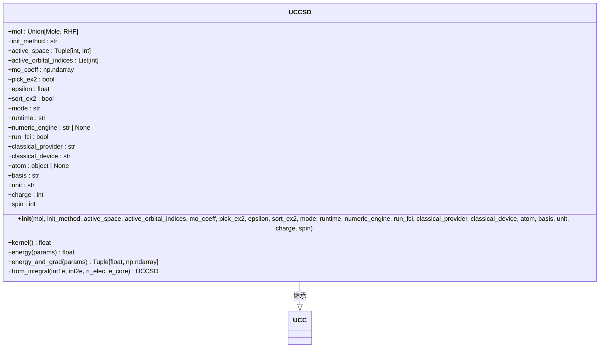
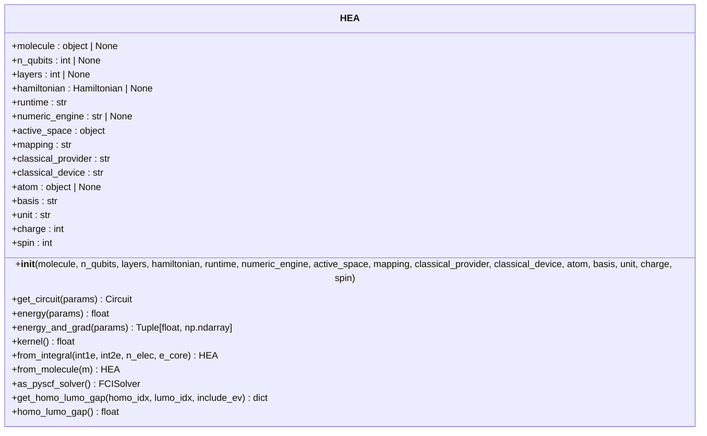
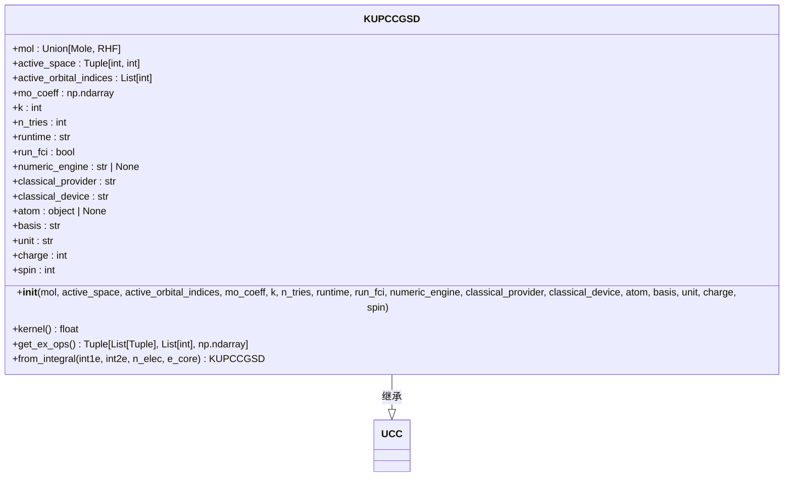
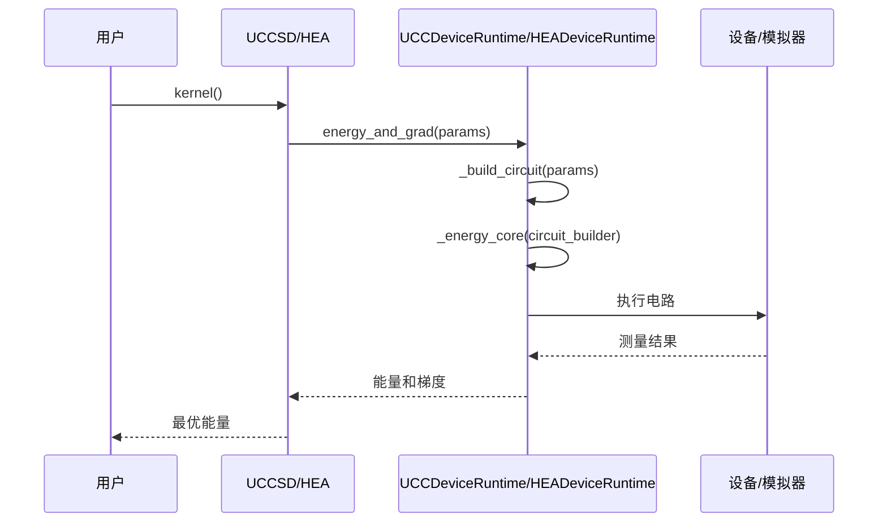
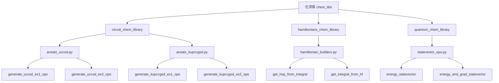
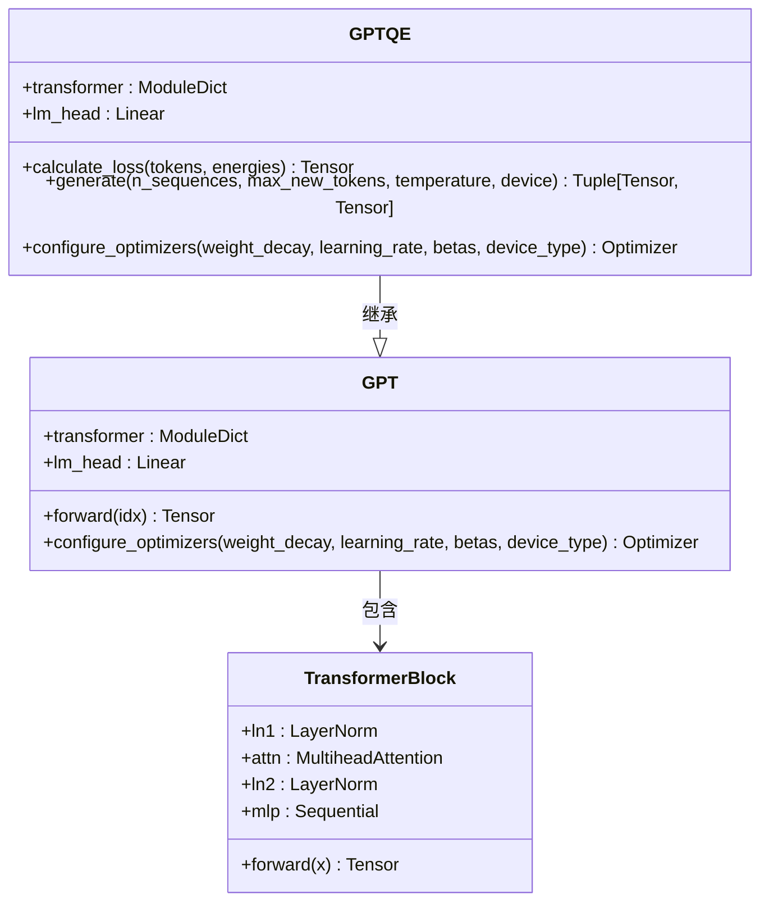
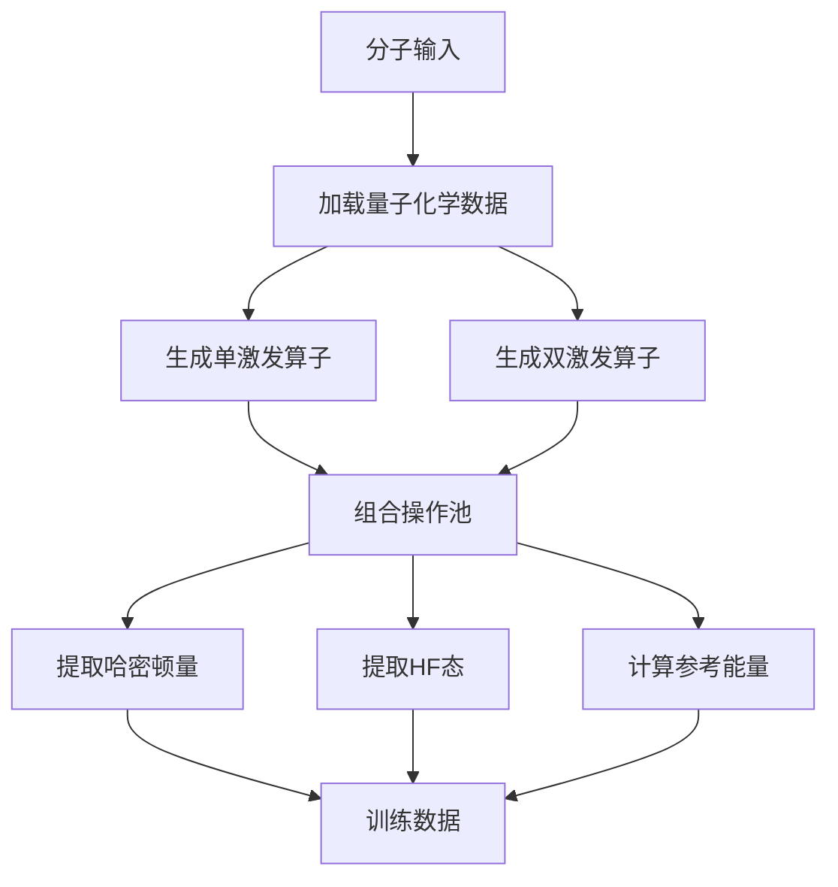
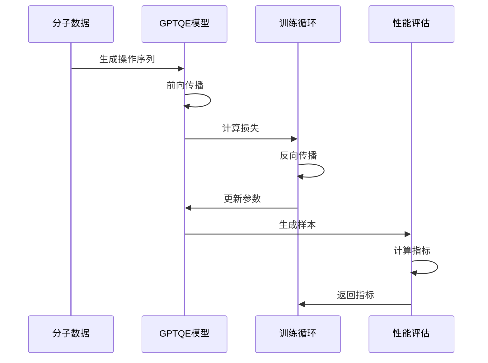

# 量子化学应用

<cite>
**本文档引用的文件**
- [molecule.py](file://src/tyxonq/applications/chem/molecule.py)
- [uccsd.py](file://src/tyxonq/applications/chem/algorithms/uccsd.py)
- [hea.py](file://src/tyxonq/applications/chem/algorithms/hea.py)
- [kupccgsd.py](file://src/tyxonq/applications/chem/algorithms/kupccgsd.py)
- [ucc_device_runtime.py](file://src/tyxonq/applications/chem/runtimes/ucc_device_runtime.py)
- [hea_device_runtime.py](file://src/tyxonq/applications/chem/runtimes/hea_device_runtime.py)
- [ansatz_uccsd.py](file://src/tyxonq/applications/chem/chem_libs/circuit_chem_library/ansatz_uccsd.py)
- [ansatz_kupccgsd.py](file://src/tyxonq/applications/chem/chem_libs/circuit_chem_library/ansatz_kupccgsd.py)
- [hamiltonian_builders.py](file://src/tyxonq/applications/chem/chem_libs/hamiltonians_chem_library/hamiltonian_builders.py)
- [gpt.py](file://research/gqe_drug_design/models/gpt.py)
- [transformer_block.py](file://research/gqe_drug_design/models/transformer_block.py)
- [train_gptqe.py](file://research/gqe_drug_design/training/train_gptqe.py)
- [molecule_data.py](file://research/gqe_drug_design/utils/molecule_data.py)
- [metrics.py](file://research/gqe_drug_design/utils/metrics.py)
- [predict_gptqe.py](file://research/gqe_drug_design/predict_gptqe.py)
- [transfer_gptqe.py](file://research/gqe_drug_design/transfer_gptqe.py)
</cite>

## 更新摘要
**变更内容**
- 新增GQE药物设计研究框架章节，介绍基于Transformer的量子化学计算方法
- 更新算法实现与API部分，增加GPTQE模型和训练管道的详细说明
- 新增GQE训练工作流示例，展示从分子数据生成到模型训练的完整流程
- 增强药物设计优化特性章节，包含基于GQE的迁移学习和预测功能
- 更新架构图以反映GQE与传统量子化学算法的结合

## 目录
1. [引言](#引言)
2. [分子类封装](#分子类封装)
3. [算法实现与API](#算法实现与api)
4. [算法内核统一执行](#算法内核统一执行)
5. [化学库预定义资源](#化学库预定义资源)
6. [GQE药物设计研究框架](#gqe药物设计研究框架)
7. [完整工作流示例](#完整工作流示例)
8. [药物设计优化特性](#药物设计优化特性)
9. [结论](#结论)

## 引言

本文档深入介绍量子化学应用层，重点阐述其为AI药物设计（AIDD）提供的PySCF式用户体验。文档详细分析了UCCSD、HEA和k-UpCCGSD等核心量子化学算法的实现原理、API接口和使用场景。通过分子类（molecule）封装化学信息，简化了用户输入流程。算法内核（kernel）统一处理设备路径和数值路径的执行，确保了计算的一致性和高效性。化学库（chem_libs）提供了预定义的电路、哈密顿量和量子化学算子，为用户提供了丰富的构建模块。

**新增** GQE（Generative Quantum Eigensolver）药物设计研究框架为平台引入了基于Transformer的全新架构，通过语言模型范式处理量子化学问题，实现了从分子结构到量子电路序列的端到端学习。该框架结合了传统量子化学算法与现代机器学习技术，为AI药物设计提供了更强大的工具集。

## 分子类封装

分子类（molecule）是量子化学应用的核心数据结构，负责封装化学信息并简化用户输入。该类继承自PySCF的Mole对象，提供了丰富的分子构建方法和预定义分子实例。

分子类通过`_Molecule`基类实现，该类继承自PySCF的`Mole`，并重写了积分计算方法`intor`以支持自定义积分。用户可以通过多种方式创建分子实例，包括直接指定积分矩阵、使用预定义的分子构造函数（如`h2`, `h2o`, `lih`等），或通过`M`函数自定义原子坐标。

分子类提供了大量预定义的分子实例，如`H2`, `H2O`, `LiH`, `BeH2`, `NH3`, `CH4`等，这些实例可以直接用于计算，无需用户手动输入原子坐标。此外，还提供了`random`方法用于生成随机积分的测试分子。

**Section sources**
- [molecule.py](file://src/tyxonq/applications/chem/molecule.py#L0-L310)

## 算法实现与API

### UCCSD算法

UCCSD（Unitary Coupled Cluster Singles and Doubles）算法是量子化学计算中的核心方法，用于求解分子基态能量。该算法通过单激发和双激发算子构建变分波函数，能够精确描述电子相关效应。

UCCSD类继承自UCC基类，其构造函数接受分子对象（PySCF Mole或RHF）、初始振幅猜测方法、活性空间参数等。算法支持多种初始猜测方法，包括MP2、CCSD和零初始猜测。通过`pick_ex2`和`sort_ex2`参数，可以筛选和排序双激发算子，优化ansatz结构。

UCCSD算法提供了`kernel`方法用于运行变分优化，返回最优能量。`energy`方法用于计算给定参数下的能量，`energy_and_grad`方法用于同时计算能量和梯度。此外，还提供了`from_integral`类方法，允许用户直接从分子积分构建UCCSD实例。


```mermaid
classDiagram
class UCCSD {
+mol : Union[Mole, RHF]
+init_method : str
+active_space : Tuple[int, int]
+active_orbital_indices : List[int]
+mo_coeff : np.ndarray
+pick_ex2 : bool
+epsilon : float
+sort_ex2 : bool
+mode : str
+runtime : str
+numeric_engine : str | None
+run_fci : bool
+classical_provider : str
+classical_device : str
+atom : object | None
+basis : str
+unit : str
+charge : int
+spin : int
+__init__(mol, init_method, active_space, active_orbital_indices, mo_coeff, pick_ex2, epsilon, sort_ex2, mode, runtime, numeric_engine, run_fci, classical_provider, classical_device, atom, basis, unit, charge, spin)
+kernel() float
+energy(params) float
+energy_and_grad(params) Tuple[float, np.ndarray]
+from_integral(int1e, int2e, n_elec, e_core) UCCSD
}
UCCSD --|> UCC : 继承
```

**Diagram sources**
- [uccsd.py](file://src/tyxonq/applications/chem/algorithms/uccsd.py#L25-L433)

**Section sources**
- [uccsd.py](file://src/tyxonq/applications/chem/algorithms/uccsd.py#L25-L433)

### HEA算法

HEA（Hardware-Efficient Ansatz）是一种硬件高效的参数化电路，适用于VQE等变分算法。该算法采用RY-only结构，由初始RY层和多层纠缠层（CNOT链）交替构成。

HEA类的构造函数接受量子比特数、层数、哈密顿量和运行时参数。算法支持从分子积分或PySCF分子对象直接构建，通过`from_integral`和`from_molecule`类方法实现。HEA还支持从外部参数化电路（如Qiskit RealAmplitudes）转换。

HEA提供了`get_circuit`方法用于生成门级电路，`energy`方法用于计算能量，`energy_and_grad`方法用于计算能量和梯度。`kernel`方法用于运行变分优化，返回最优能量。此外，还提供了`as_pyscf_solver`类方法，将HEA封装为PySCF兼容的求解器，便于与CASSCF等方法对接。

**新增 HOMO-LUMO 能隙计算功能**：HEA算法现在支持通过`get_homo_lumo_gap`方法和`homo_lumo_gap`属性计算分子的HOMO-LUMO能隙。此功能通过内部UCC对象实现，仅适用于通过`from_molecule`或直接分子输入构建的HEA实例。`get_homo_lumo_gap`方法返回包含HOMO/LUMO能量、能隙、轨道索引和系统类型（闭壳/开壳）的详细信息字典，而`homo_lumo_gap`属性提供快速访问能隙值。


```mermaid
classDiagram
class HEA {
+molecule : object | None
+n_qubits : int | None
+layers : int | None
+hamiltonian : Hamiltonian | None
+runtime : str
+numeric_engine : str | None
+active_space : object
+mapping : str
+classical_provider : str
+classical_device : str
+atom : object | None
+basis : str
+unit : str
+charge : int
+spin : int
+__init__(molecule, n_qubits, layers, hamiltonian, runtime, numeric_engine, active_space, mapping, classical_provider, classical_device, atom, basis, unit, charge, spin)
+get_circuit(params) Circuit
+energy(params) float
+energy_and_grad(params) Tuple[float, np.ndarray]
+kernel() float
+from_integral(int1e, int2e, n_elec, e_core) HEA
+from_molecule(m) HEA
+as_pyscf_solver() FCISolver
+get_homo_lumo_gap(homo_idx, lumo_idx, include_ev) dict
+homo_lumo_gap() float
}
```

**Diagram sources**
- [hea.py](file://src/tyxonq/applications/chem/algorithms/hea.py#L26-L833)

**Section sources**
- [hea.py](file://src/tyxonq/applications/chem/algorithms/hea.py#L26-L833)

### k-UpCCGSD算法

k-UpCCGSD（k-layer Unitary Pair Coupled Cluster Generalized Singles and Doubles）算法是一种广义的耦合簇方法，通过k层结构增强ansatz的表达能力。该算法特别适用于大分子和复杂电子结构的计算。

k-UpCCGSD类继承自UCC基类，其构造函数接受分子对象、活性空间参数、层数k和初始化尝试次数n_tries。算法生成广义的单激发和配对双激发算子，不依赖于CC振幅，具有更强的灵活性。

k-UpCCGSD提供了`kernel`方法用于运行多次初始化尝试的变分优化，返回最优能量。`get_ex_ops`方法用于获取激发算子，`from_integral`类方法允许用户直接从分子积分构建实例。算法通过多次初始化尝试提高找到全局最优解的概率，特别适用于复杂势能面的搜索。


```mermaid
classDiagram
class KUPCCGSD {
+mol : Union[Mole, RHF]
+active_space : Tuple[int, int]
+active_orbital_indices : List[int]
+mo_coeff : np.ndarray
+k : int
+n_tries : int
+runtime : str
+run_fci : bool
+numeric_engine : str | None
+classical_provider : str
+classical_device : str
+atom : object | None
+basis : str
+unit : str
+charge : int
+spin : int
+__init__(mol, active_space, active_orbital_indices, mo_coeff, k, n_tries, runtime, run_fci, numeric_engine, classical_provider, classical_device, atom, basis, unit, charge, spin)
+kernel() float
+get_ex_ops() Tuple[List[Tuple], List[int], np.ndarray]
+from_integral(int1e, int2e, n_elec, e_core) KUPCCGSD
}
KUPCCGSD --|> UCC : 继承
```

**Diagram sources**
- [kupccgsd.py](file://src/tyxonq/applications/chem/algorithms/kupccgsd.py#L0-L378)

**Section sources**
- [kupccgsd.py](file://src/tyxonq/applications/chem/algorithms/kupccgsd.py#L0-L378)

## 算法内核统一执行

算法内核（kernel）负责统一处理设备路径和数值路径的执行，确保计算的一致性和高效性。对于UCC和HEA算法，分别实现了`UCCDeviceRuntime`和`HEADeviceRuntime`运行时类。

`UCCDeviceRuntime`类负责UCC算法的设备路径执行。它通过`_build_ucc_circuit`方法构建UCC电路，利用`build_ucc_circuit`函数从激发算子和参数生成门级电路。能量计算通过`_energy_core`方法实现，对哈密顿量进行基分组测量，计算各组的期望值并求和。梯度计算采用参数移位法或有限差分法，根据运行时参数自动选择。

`HEADeviceRuntime`类负责HEA算法的设备路径执行。它通过`_build_circuit`方法构建HEA电路，支持RY-only结构和外部电路模板。能量和梯度计算流程与UCC类似，但针对HEA的特定电路结构进行了优化。

两种运行时类都支持模拟器和真实设备，通过`provider`和`device`参数指定。对于模拟器且`shots=0`的情况，采用解析期望值计算，避免采样噪声。对于真实设备或`shots>0`的情况，采用基于计数的期望值估计。


```mermaid
sequenceDiagram
participant 用户 as 用户
participant 算法 as UCCSD/HEA
participant 运行时 as UCCDeviceRuntime/HEADeviceRuntime
participant 设备 as 设备/模拟器
用户->>算法 : kernel()
算法->>运行时 : energy_and_grad(params)
运行时->>运行时 : _build_circuit(params)
运行时->>运行时 : _energy_core(circuit_builder)
运行时->>设备 : 执行电路
设备-->>运行时 : 测量结果
运行时-->>算法 : 能量和梯度
算法-->>用户 : 最优能量
```

**Diagram sources**
- [ucc_device_runtime.py](file://src/tyxonq/applications/chem/runtimes/ucc_device_runtime.py#L0-L269)
- [hea_device_runtime.py](file://src/tyxonq/applications/chem/runtimes/hea_device_runtime.py#L0-L140)

**Section sources**
- [ucc_device_runtime.py](file://src/tyxonq/applications/chem/runtimes/ucc_device_runtime.py#L0-L269)
- [hea_device_runtime.py](file://src/tyxonq/applications/chem/runtimes/hea_device_runtime.py#L0-L140)

## 化学库预定义资源

化学库（chem_libs）提供了预定义的电路、哈密顿量和量子化学算子，为用户提供了丰富的构建模块。该库分为`circuit_chem_library`、`hamiltonians_chem_library`和`quantum_chem_library`三个子模块。

`circuit_chem_library`包含ansatz生成函数，如`generate_uccsd_ex1_ops`和`generate_uccsd_ex2_ops`用于生成UCCSD的单双激发算子，`generate_kupccgsd_ex1_ops`和`generate_kupccgsd_ex2_ops`用于生成k-UpCCGSD的激发算子。这些函数返回激发算子列表、参数ID和初始猜测，确保了不同算法间的一致性。

`hamiltonians_chem_library`包含哈密顿量构建函数，如`get_hop_from_integral`用于从分子积分生成费米子算符哈密顿量，`get_integral_from_hf`用于从PySCF RHF对象提取积分。这些函数为上层算法提供了统一的输入接口。

`quantum_chem_library`包含量子化学算子操作函数，如`energy_statevector`和`energy_and_grad_statevector`用于数值路径的能量和梯度计算。这些函数为数值模拟提供了高效的实现。


```mermaid
graph TD
A[化学库 chem_libs] --> B[circuit_chem_library]
A --> C[hamiltonians_chem_library]
A --> D[quantum_chem_library]
B --> B1[ansatz_uccsd.py]
B --> B2[ansatz_kupccgsd.py]
B1 --> B11[generate_uccsd_ex1_ops]
B1 --> B12[generate_uccsd_ex2_ops]
B2 --> B21[generate_kupccgsd_ex1_ops]
B2 --> B22[generate_kupccgsd_ex2_ops]
C --> C1[hamiltonian_builders.py]
C1 --> C11[get_hop_from_integral]
C1 --> C12[get_integral_from_hf]
D --> D1[statevector_ops.py]
D1 --> D11[energy_statevector]
D1 --> D12[energy_and_grad_statevector]
```

**Diagram sources**
- [ansatz_uccsd.py](file://src/tyxonq/applications/chem/chem_libs/circuit_chem_library/ansatz_uccsd.py#L0-L132)
- [ansatz_kupccgsd.py](file://src/tyxonq/applications/chem/chem_libs/circuit_chem_library/ansatz_kupccgsd.py#L0-L59)
- [hamiltonian_builders.py](file://src/tyxonq/applications/chem/chem_libs/hamiltonians_chem_library/hamiltonian_builders.py#L0-L272)

**Section sources**
- [ansatz_uccsd.py](file://src/tyxonq/applications/chem/chem_libs/circuit_chem_library/ansatz_uccsd.py#L0-L132)
- [ansatz_kupccgsd.py](file://src/tyxonq/applications/chem/chem_libs/circuit_chem_library/ansatz_kupccgsd.py#L0-L59)
- [hamiltonian_builders.py](file://src/tyxonq/applications/chem/chem_libs/hamiltonians_chem_library/hamiltonian_builders.py#L0-L272)

## GQE药物设计研究框架

**新增** GQE（Generative Quantum Eigensolver）药物设计研究框架代表了量子化学应用的一个重大突破，引入了基于Transformer架构的全新训练管道。该框架通过将量子化学问题转化为序列学习任务，实现了从分子结构到量子电路序列的端到端学习。

### GPTQE模型架构

GPTQE（Generative Pretrained Transformer for Quantum Eigensolver）基于标准GPT架构，专门设计用于量子化学计算。模型的核心组件包括：

- **嵌入层（Embedding Layer）**：将量子操作符号映射到高维向量表示
- **位置编码（Positional Encoding）**：保持序列中操作的顺序信息
- **Transformer块（Transformer Blocks）**：多头注意力机制和前馈网络的组合
- **输出头（Output Head）**：将隐藏状态映射到能量预测


```mermaid
classDiagram
class GPTQE {
+transformer : ModuleDict
+lm_head : Linear
+calculate_loss(tokens, energies) Tensor
+generate(n_sequences, max_new_tokens, temperature, device) Tuple[Tensor, Tensor]
+configure_optimizers(weight_decay, learning_rate, betas, device_type) Optimizer
}
class GPT {
+transformer : ModuleDict
+lm_head : Linear
+forward(idx) Tensor
+configure_optimizers(weight_decay, learning_rate, betas, device_type) Optimizer
}
class TransformerBlock {
+ln1 : LayerNorm
+attn : MultiheadAttention
+ln2 : LayerNorm
+mlp : Sequential
+forward(x) Tensor
}
GPTQE --|> GPT : 继承
GPT --> TransformerBlock : 包含
```

**Diagram sources**
- [gpt.py](file://research/gqe_drug_design/models/gpt.py#L16-L92)
- [transformer_block.py](file://research/gqe_drug_design/models/transformer_block.py#L3-L26)

### 分子数据生成

GQE框架通过`generate_molecule_data`函数生成训练所需的分子数据。该函数利用PennyLane的数据加载器，从量子化学数据集中提取分子信息，包括：

- **分子轨道池（Operator Pool）**：包含单激发和双激发算子的时间参数
- **哈密顿量（Hamiltonian）**：分子的费米子哈密顿量
- **HF态（Hartree-Fock State）**：分子的参考态
- **预期基态能量**：FCI计算得到的参考能量


```mermaid
flowchart TD
A[分子输入] --> B[加载量子化学数据]
B --> C[生成单激发算子]
B --> D[生成双激发算子]
C --> E[组合操作池]
D --> E
E --> F[提取哈密顿量]
E --> G[提取HF态]
E --> H[计算参考能量]
F --> I[训练数据]
G --> I
H --> I
```

**Diagram sources**
- [molecule_data.py](file://research/gqe_drug_design/utils/molecule_data.py#L18-L43)

### 训练管道

GQE训练管道采用端到端的学习方式，通过最大化累积能量预测与实际能量之间的平方误差来优化模型。训练过程包括以下关键步骤：

1. **数据准备**：从分子数据生成操作序列和对应的能量标签
2. **模型初始化**：配置GPTQE模型参数和优化器
3. **训练循环**：迭代优化损失函数，定期评估性能
4. **模型保存**：保存最佳性能的模型权重


```mermaid
sequenceDiagram
participant 数据 as 分子数据
participant 模型 as GPTQE模型
participant 训练 as 训练循环
participant 评估 as 性能评估
数据->>模型 : 生成操作序列
模型->>模型 : 前向传播
模型->>训练 : 计算损失
训练->>训练 : 反向传播
训练->>模型 : 更新参数
模型->>评估 : 生成样本
评估->>评估 : 计算指标
评估->>训练 : 返回指标
```

**Diagram sources**
- [train_gptqe.py](file://research/gqe_drug_design/training/train_gptqe.py#L32-L238)

**Section sources**
- [gpt.py](file://research/gqe_drug_design/models/gpt.py#L16-L92)
- [transformer_block.py](file://research/gqe_drug_design/models/transformer_block.py#L3-L26)
- [molecule_data.py](file://research/gqe_drug_design/utils/molecule_data.py#L18-L43)
- [train_gptqe.py](file://research/gqe_drug_design/training/train_gptqe.py#L32-L238)

## 完整工作流示例

以下是一个从分子构建到能量计算的完整工作流示例，展示了如何使用UCCSD算法计算H2分子的基态能量。

```python
from tyxonq.applications.chem.molecule import h2
from tyxonq.applications.chem.algorithms.uccsd import UCCSD

# 1. 构建分子
mol = h2  # 使用预定义的H2分子

# 2. 初始化UCCSD算法
uccsd = UCCSD(mol, init_method="mp2", active_space=None)

# 3. 运行变分优化
energy = uccsd.kernel()

# 4. 输出结果
print(f"H2基态能量: {energy}")
print(f"参考FCI能量: {uccsd.e_fci}")
```

**新增** GQE训练工作流示例，展示从分子数据生成到模型训练的完整流程：

```python
from research.gqe_drug_design.training.train_gptqe import train_gptqe

# 1. 配置训练参数
# 修改molecule_data函数中的分子名称
# molecule_data = generate_molecule_data("H2", use_ucc=True)

# 2. 启动训练
train_gptqe()

# 3. 模型训练完成后进行预测
# python predict_gptqe.py --model_path ./checkpoints/model.pt --molecule H2
```

该工作流展示了GQE框架的端到端训练流程，从分子数据生成到模型优化，再到最终的能量预测。

**Section sources**
- [molecule.py](file://src/tyxonq/applications/chem/molecule.py#L0-L310)
- [uccsd.py](file://src/tyxonq/applications/chem/algorithms/uccsd.py#L25-L433)
- [train_gptqe.py](file://research/gqe_drug_design/training/train_gptqe.py#L32-L238)

## 药物设计优化特性

针对药物设计任务，量子化学应用层提供了多项优化特性，包括定制化ansatz、批处理梯度计算和自适应资源分配。

**传统算法优化特性**：
- 定制化ansatz允许用户根据具体分子特性设计特定的激发算子结构
- 批处理梯度计算通过并行处理多个参数移位，显著提高了梯度计算效率
- 自适应资源分配根据计算需求动态调整资源

**新增 GQE迁移学习特性**：
- **特征映射**：通过`FeatureMapper`类实现不同分子间的操作池映射，支持基于操作相似性的迁移
- **模型适配**：`TransferGPTQE`类提供嵌入层和输出头的动态适配，支持词汇表大小的变化
- **微调策略**：可选的微调模式，仅冻结大部分参数，只微调关键层以减少计算成本

**新增 HOMO-LUMO 能隙分析**：为药物设计提供了关键的电子结构分析功能。通过`get_homo_lumo_gap`方法，用户可以获取分子的HOMO-LUMO能隙、轨道能量和索引等详细信息，这对于预测分子的反应活性、稳定性和电子传输性质至关重要。`homo_lumo_gap`属性提供了能隙值的快速访问，便于在优化循环中进行实时分析。

**Section sources**
- [uccsd.py](file://src/tyxonq/applications/chem/algorithms/uccsd.py#L25-L433)
- [hea.py](file://src/tyxonq/applications/chem/algorithms/hea.py#L26-L833)
- [ucc_device_runtime.py](file://src/tyxonq/applications/chem/runtimes/ucc_device_runtime.py#L0-L269)
- [hea_device_runtime.py](file://src/tyxonq/applications/chem/runtimes/hea_device_runtime.py#L0-L140)
- [transfer_gptqe.py](file://research/gqe_drug_design/transfer_gptqe.py#L26-L127)

## 结论

量子化学应用层为AI药物设计提供了强大的PySCF式用户体验。通过分子类封装化学信息，简化了用户输入。UCCSD、HEA和k-UpCCGSD等算法实现了先进的量子化学计算方法，支持从分子积分到能量计算的完整工作流。算法内核统一处理设备路径和数值路径的执行，确保了计算的一致性和高效性。化学库提供了丰富的预定义资源，支持定制化ansatz设计。针对药物设计任务的优化特性，如批处理梯度计算和自适应资源分配，显著提高了计算效率。

**新增的GQE药物设计研究框架**为平台引入了基于Transformer的全新架构，通过语言模型范式处理量子化学问题，实现了从分子结构到量子电路序列的端到端学习。该框架结合了传统量子化学算法与现代机器学习技术，为AI药物设计提供了更强大的工具集。GQE框架的特征映射、模型适配和迁移学习功能，为跨分子的泛化能力提供了重要支撑。

这些特性共同构成了一个强大而灵活的量子化学计算平台，为AI药物设计提供了坚实的基础，推动了量子计算在药物发现领域的应用发展。