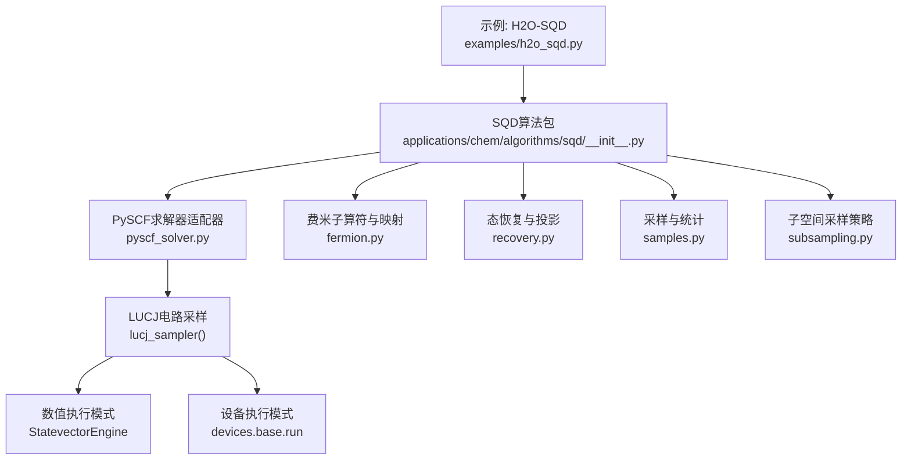
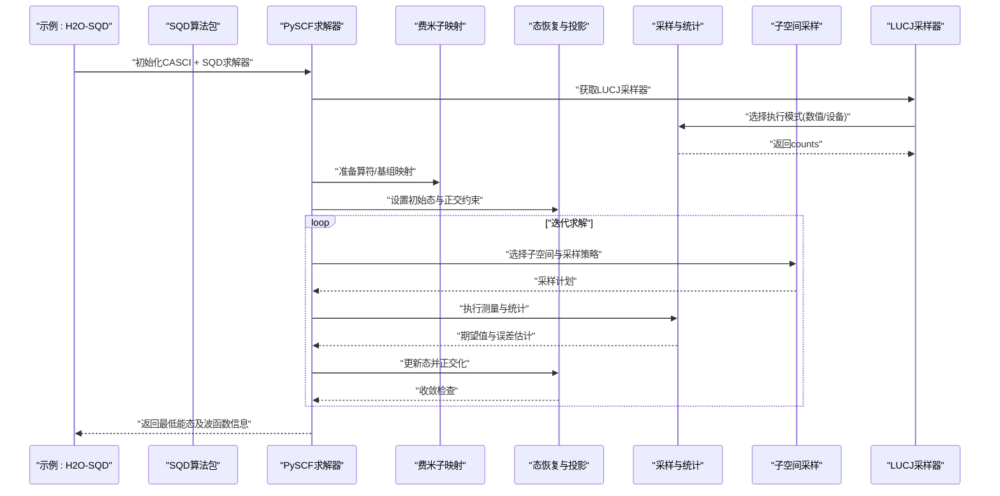
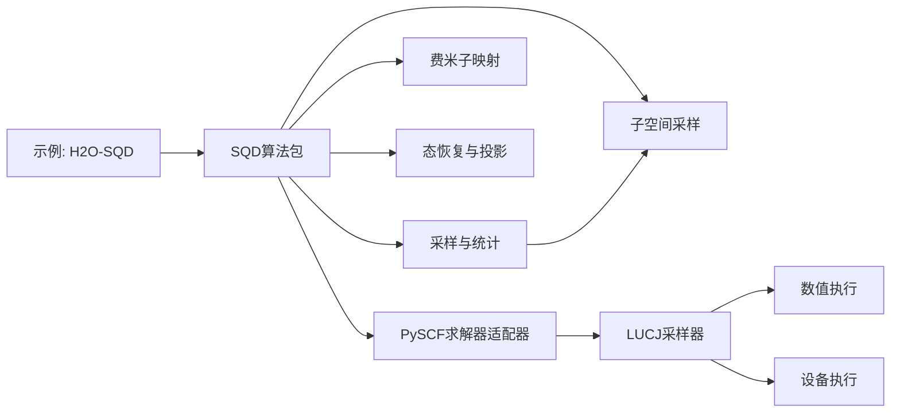

# LUCJ SQD算法

<cite>
**本文引用的文件**
- [h2o_sqd.py](file://examples/h2o_sqd.py)
- [__init__.py](file://src/tyxonq/applications/chem/algorithms/sqd/__init__.py)
- [pyscf_solver.py](file://src/tyxonq/applications/chem/algorithms/sqd/pyscf_solver.py)
- [fermion.py](file://src/tyxonq/applications/chem/algorithms/sqd/fermion.py)
- [recovery.py](file://src/tyxonq/applications/chem/algorithms/sqd/recovery.py)
- [samples.py](file://src/tyxonq/applications/chem/algorithms/sqd/samples.py)
- [subsampling.py](file://src/tyxonq/applications/chem/algorithms/sqd/subsampling.py)
- [test_sqd_pyscf_solver.py](file://tests_applications_chem/test_sqd_pyscf_solver.py)
- [test_lucj_sqd_closed_shell.py](file://tests_applications_chem/test_lucj_sqd_closed_shell.py)
</cite>

## 更新摘要
**变更内容**
- 新增PySCF兼容SQD求解器实现，支持三种子空间策略（冻结、刷新、自适应）
- 集成LUCJ电路采样能力，支持数值模拟和设备执行两种模式
- 增强位串转换和电子数恢复功能，确保与PySCF selected-CI的正确对接
- 添加完整的测试套件验证算法正确性和性能基准

## 目录
1. [简介](#简介)
2. [项目结构](#项目结构)
3. [核心组件](#核心组件)
4. [架构总览](#架构总览)
5. [详细组件分析](#详细组件分析)
6. [依赖关系分析](#依赖关系分析)
7. [性能考量](#性能考量)
8. [故障排查指南](#故障排查指南)
9. [结论](#结论)
10. [附录](#附录)

## 简介
本文档详细介绍TyxonQ中的LUCJ（Local Unitary Coupled Cluster with Jordan–Wigner）与SQD（Selected Configuration Interaction with Dynamical Subspace）算法的完整实现。该实现包含先进的PySCF兼容求解器、LUCJ电路采样能力，以及支持数值模拟和设备执行的统一接口。文档从系统架构、数据流、处理逻辑、集成点与错误处理等维度进行系统化说明，并提供可视化图示与排错建议，帮助读者快速理解并正确使用该算法。

## 项目结构
围绕LUCJ SQD的相关代码主要分布在以下位置：
- 示例入口：用于演示H2O分子的SQD流程
- PySCF求解器适配器：提供与PySCF CASCI接口的无缝集成
- 算法模块：包含费米子映射、态恢复、采样与子空间采样等核心能力
- 应用层封装：对外暴露统一的API接口

**图表来源**
- [h2o_sqd.py:1-376](file://examples/h2o_sqd.py#L1-L376)
- [__init__.py:1-45](file://src/tyxonq/applications/chem/algorithms/sqd/__init__.py#L1-L45)
- [pyscf_solver.py:1-351](file://src/tyxonq/applications/chem/algorithms/sqd/pyscf_solver.py#L1-L351)

**章节来源**
- [h2o_sqd.py:1-376](file://examples/h2o_sqd.py#L1-L376)
- [__init__.py:1-45](file://src/tyxonq/applications/chem/algorithms/sqd/__init__.py#L1-L45)

## 核心组件
- **示例入口（H2O-SQD）**
  - 负责组装分子、构建哈密顿量、配置SQD参数、执行迭代求解与结果输出
- **PySCF求解器适配器**
  - 提供与PySCF CASCI接口的无缝集成，支持三种子空间策略
- **SQD算法包**
  - 提供统一的调用入口与高层流程编排
- **费米子映射模块**
  - 将二次量子化算符转换为可执行的门序列或期望值计算所需形式
- **态恢复与投影模块**
  - 在迭代过程中对目标态进行正交化与能量最小化，避免低能态塌陷
- **采样与统计模块**
  - 管理测量次数、统计误差与收敛判断
- **子空间采样策略**
  - 控制不同子空间的采样分配与调度，提升效率与稳定性

**章节来源**
- [h2o_sqd.py:1-376](file://examples/h2o_sqd.py#L1-L376)
- [__init__.py:1-45](file://src/tyxonq/applications/chem/algorithms/sqd/__init__.py#L1-L45)
- [pyscf_solver.py:1-351](file://src/tyxonq/applications/chem/algorithms/sqd/pyscf_solver.py#L1-L351)

## 架构总览
下图展示了从示例到算法模块的端到端调用关系，以及各模块之间的职责划分。

**图表来源**
- [h2o_sqd.py:1-376](file://examples/h2o_sqd.py#L1-L376)
- [pyscf_solver.py:1-351](file://src/tyxonq/applications/chem/algorithms/sqd/pyscf_solver.py#L1-L351)
- [fermion.py:1-450](file://src/tyxonq/applications/chem/algorithms/sqd/fermion.py#L1-L450)

## 详细组件分析

### PySCF求解器适配器（新增核心功能）
**更新** 新增了完整的PySCF兼容SQD求解器实现，提供三种子空间策略：

- **冻结模式（frozen）**：每个几何都在同一行列式子空间内对角化，能量面光滑，是唯一允许用于解析梯度/MD的模式
- **刷新模式（refresh）**：每个几何都重新采样确定子空间，仅可用于单点能
- **自适应模式（adaptive）**：每隔指定步数重新采样一次，步间冻结

关键特性：
- 支持LUCJ电路采样，自动从CCSD t1/t2振幅初始化LUCJ参数
- 提供数值模拟和设备执行两种运行模式
- 完整的PySCF fcisolver接口实现，包括密度矩阵和自旋平方计算

**章节来源**
- [pyscf_solver.py:1-351](file://src/tyxonq/applications/chem/algorithms/sqd/pyscf_solver.py#L1-L351)

### LUCJ电路采样器（新增功能）
**更新** 新增了LUCJ电路采样能力，支持两种执行模式：

- **数值模式（numeric）**：使用StatevectorEngine精确概率计算，支持噪声模拟和随机种子复现
- **设备模式（device）**：通过devices.base.run提交到真实设备或模拟器，直接获取计数

关键特性：
- 自动从CCSD计算初始化LUCJ参数，复用活性空间冻结轨道
- 支持depolarizing噪声模型，与数值模式保持一致的物理效应
- 自动处理位串顺序转换，确保与PySCF selected-CI的正确对接

**章节来源**
- [pyscf_solver.py:215-330](file://src/tyxonq/applications/chem/algorithms/sqd/pyscf_solver.py#L215-L330)

### 示例入口：H2O-SQD
- **作用**
  - 构造H2O分子与哈密顿量
  - 配置SQD参数（如目标态数量、采样数、收敛阈值等）
  - 驱动迭代求解并输出结果
- **关键流程**
  - 初始化 -> 构建算符 -> 运行SQD -> 结果解析与保存
- **注意事项**
  - 确保分子与哈密顿量定义一致
  - 合理设置采样数以平衡精度与耗时
  - 关注收敛判据以避免过早停止

**章节来源**
- [h2o_sqd.py:1-376](file://examples/h2o_sqd.py#L1-L376)

### 费米子映射（fermion.py）
- **作用**
  - 将费米子算符转换为可在量子电路或数值后端中计算的表达式
- **关键功能**
  - 算符展开与分组
  - 与Jordan–Wigner或其他映射的对接
  - 期望值计算所需的系数与项索引管理
- **复杂度与优化**
  - 算符分组可降低测量开销
  - 缓存中间结果以减少重复计算

**章节来源**
- [fermion.py:1-450](file://src/tyxonq/applications/chem/algorithms/sqd/fermion.py#L1-L450)

### 态恢复与投影（recovery.py）
- **作用**
  - 在SQD迭代中对候选态进行正交化与能量最小化，防止低能态塌陷
- **关键功能**
  - 内积计算与Gram矩阵构建
  - 正交化与归一化
  - 能量评估与收敛判断
- **数值稳定性**
  - 条件数控制与正则化策略
  - 小阈值截断避免数值噪声

**章节来源**
- [recovery.py:1-148](file://src/tyxonq/applications/chem/algorithms/sqd/recovery.py#L1-L148)

### 采样与统计（samples.py）
- **作用**
  - 管理测量次数、统计误差与收敛判定
- **关键功能**
  - 采样计划生成
  - 期望值与方差估计
  - 自适应采样调整（基于误差阈值）
- **性能影响**
  - 采样数与精度成正比
  - 批处理与并行化可显著降低延迟

**章节来源**
- [samples.py:1-214](file://src/tyxonq/applications/chem/algorithms/sqd/samples.py#L1-L214)

### 子空间采样策略（subsampling.py）
- **作用**
  - 在不同子空间之间分配采样资源，提升整体效率与稳定性
- **关键功能**
  - 子空间优先级评估
  - 动态重分配与负载均衡
  - 与采样模块的协同调度
- **适用场景**
  - 多目标态搜索
  - 高维希尔伯特空间探索

**章节来源**
- [subsampling.py:1-82](file://src/tyxonq/applications/chem/algorithms/sqd/subsampling.py#L1-L82)

## 依赖关系分析
SQD算法内部模块之间存在清晰的依赖层次：
- 示例入口依赖算法包
- 算法包依赖PySCF求解器适配器、费米子映射、态恢复、采样与子空间策略
- PySCF求解器适配器依赖LUCJ采样器和数值/设备执行后端
- 采样与子空间策略相互协作以优化资源分配

**图表来源**
- [h2o_sqd.py:1-376](file://examples/h2o_sqd.py#L1-L376)
- [pyscf_solver.py:1-351](file://src/tyxonq/applications/chem/algorithms/sqd/pyscf_solver.py#L1-L351)
- [__init__.py:1-45](file://src/tyxonq/applications/chem/algorithms/sqd/__init__.py#L1-L45)

**章节来源**
- [__init__.py:1-45](file://src/tyxonq/applications/chem/algorithms/sqd/__init__.py#L1-L45)

## 性能考量
- **采样预算**
  - 根据目标精度与噪声水平设定采样数，避免过度采样导致耗时过长
- **算符分组**
  - 利用分组减少测量次数，提高吞吐
- **数值稳定**
  - 在态恢复阶段采用正则化与小阈值截断，避免病态矩阵
- **并行与批处理**
  - 充分利用后端并行能力，缩短单次迭代时间
- **收敛判据**
  - 结合能量变化与误差估计，合理设置阈值，避免过早或过晚停止
- **子空间策略选择**
  - 冻结模式适合梯度计算，刷新模式适合单点能，自适应模式平衡两者

## 故障排查指南
- **常见问题**
  - 收敛不成立：检查采样数是否足够、收敛阈值是否过于严格
  - 能量异常：确认费米子映射是否正确、哈密顿量构建是否一致
  - 内存溢出：减少子空间规模或采样批次大小
  - 数值不稳定：增加正则化强度或放宽条件数阈值
  - 位串顺序错误：确保使用reverse_bitstring_halves进行正确的位串转换
  - 设备执行失败：检查shots参数设置和网络连接状态
- **定位方法**
  - 逐步打印中间变量（如Gram矩阵条件数、期望值方差）
  - 切换更保守的采样策略或增大采样数
  - 验证输入数据（分子几何、基组、电荷/自旋多重度）
  - 使用测试用例验证基本功能

**章节来源**
- [recovery.py:1-148](file://src/tyxonq/applications/chem/algorithms/sqd/recovery.py#L1-L148)
- [samples.py:1-214](file://src/tyxonq/applications/chem/algorithms/sqd/samples.py#L1-L214)
- [fermion.py:1-450](file://src/tyxonq/applications/chem/algorithms/sqd/fermion.py#L1-L450)
- [test_sqd_pyscf_solver.py:1-203](file://tests_applications_chem/test_sqd_pyscf_solver.py#L1-L203)

## 结论
LUCJ SQD在TyxonQ中通过模块化设计实现了高效的低能态搜索，并集成了先进的PySCF兼容求解器。新增的LUCJ电路采样能力支持数值模拟和设备执行两种模式，为量子化学计算提供了灵活的选择。示例入口提供了直观的使用方式，算法包协调费米子映射、态恢复、采样与子空间策略，形成完整的求解流水线。合理的子空间策略选择和参数配置是获得高精度与高效率的关键。

## 附录
- **使用建议**
  - 从小体系开始验证流程，再扩展到大分子
  - 逐步调参：先保证收敛，再优化精度与耗时
  - 记录实验配置以便复现与对比
  - 优先使用冻结模式进行梯度计算，刷新模式用于单点能验证
- **参考路径**
  - 示例入口：[h2o_sqd.py](file://examples/h2o_sqd.py)
  - PySCF求解器：[pyscf_solver.py](file://src/tyxonq/applications/chem/algorithms/sqd/pyscf_solver.py)
  - 算法包入口：[__init__.py](file://src/tyxonq/applications/chem/algorithms/sqd/__init__.py)
  - 核心模块：[fermion.py](file://src/tyxonq/applications/chem/algorithms/sqd/fermion.py)、[recovery.py](file://src/tyxonq/applications/chem/algorithms/sqd/recovery.py)、[samples.py](file://src/tyxonq/applications/chem/algorithms/sqd/samples.py)、[subsampling.py](file://src/tyxonq/applications/chem/algorithms/sqd/subsampling.py)
  - 测试用例：[test_sqd_pyscf_solver.py](file://tests_applications_chem/test_sqd_pyscf_solver.py)、[test_lucj_sqd_closed_shell.py](file://tests_applications_chem/test_lucj_sqd_closed_shell.py)