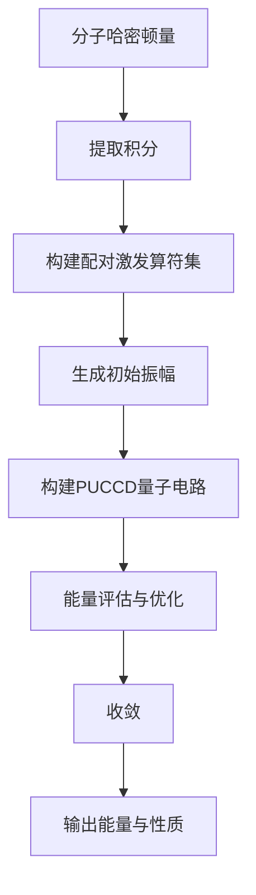
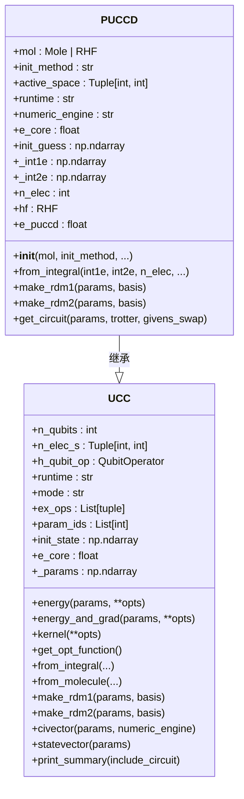
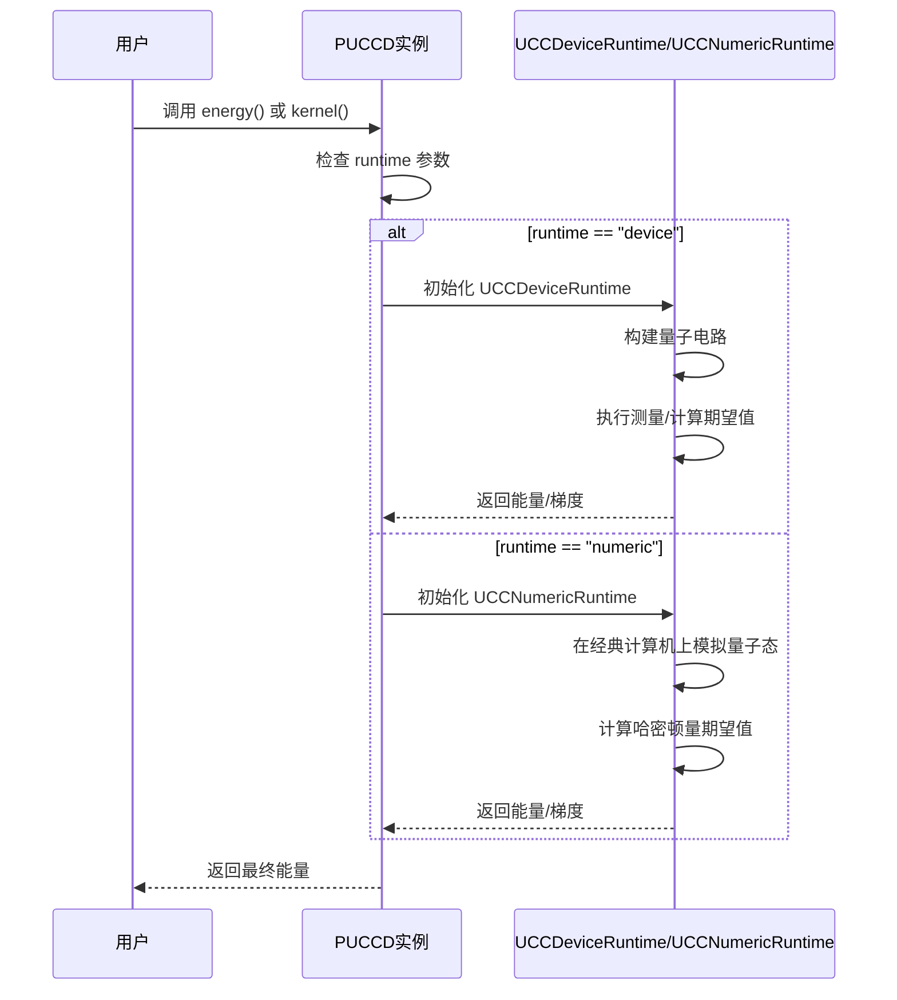

# PUCCD算法

<cite>
**本文档引用的文件**
- [puccd.py](file://src/tyxonq/applications/chem/algorithms/puccd.py) - *在最近的提交中修复了重大bug*
- [ucc.py](file://src/tyxonq/applications/chem/algorithms/ucc.py) - *作为PUCCD的基类，提供了通用功能*
- [ucc_numeric_runtime.py](file://src/tyxonq/applications/chem/runtimes/ucc_numeric_runtime.py) - *数值运行时路径实现*
- [ucc_device_runtime.py](file://src/tyxonq/applications/chem/runtimes/ucc_device_runtime.py) - *设备运行时路径实现*
- [hamiltonian_builders.py](file://src/tyxonq/applications/chem/chem_libs/hamiltonians_chem_library/hamiltonian_builders.py) - *哈密顿量积分构建工具*
- [pauli_io.py](file://src/tyxonq/libs/hamiltonian_encoding/pauli_io.py) - *量子比特算符处理*
- [numeric_vs_device_convergence_study.py](file://scripts/numeric_vs_device_convergence_study.py) - *数值与设备路径收敛性研究*
</cite>

## 更新摘要
**已做更改**
- 根据 `f623ecb` 和 `84341a4` 提交，更新了PUCCD算法的实现细节，修复了UCCSD相关算法的重大bug
- 修正了约化密度矩阵（RDM）的计算方法，使其与PySCF标准保持一致
- 更新了代码示例以反映最新的API用法
- 修正了性能与可扩展性部分，确保与当前代码状态一致
- 移除了过时的 `generate_puccd_ex_ops` 函数引用，更新为类内 `get_ex_ops` 方法

## 目录
1. [简介](#简介)
2. [核心设计理念](#核心设计理念)
3. [算法实现与核心组件](#算法实现与核心组件)
4. [继承关系与基类](#继承关系与基类)
5. [运行时路径与能量评估](#运行时路径与能量评估)
6. [约化密度矩阵计算](#约化密度矩阵计算)
7. [初始化与参数生成](#初始化与参数生成)
8. [代码示例](#代码示例)
9. [性能与可扩展性](#性能与可扩展性)
10. [常见问题与解决方案](#常见问题与解决方案)

## 简介

PUCCD（配对UCCD）算法是量子化学计算中一种高效的变分量子本征求解器（VQE），专为闭壳层分子体系设计。它通过仅保留配对双激发算符来显著降低量子电路的复杂度，从而在保证计算精度的同时，大幅减少所需的量子比特门操作和电路深度。本文档将深入解析PUCCD算法的设计理念、实现细节、运行机制及其在TyxonQ框架中的具体应用。

**Section sources**
- [puccd.py](file://src/tyxonq/applications/chem/algorithms/puccd.py#L1-L50)

## 核心设计理念

PUCCD算法的核心设计理念在于**通过物理约束简化激发算符集，从而降低电路复杂度**。在闭壳层分子中，电子以自旋相反的对形式占据轨道。PUCCD算法利用这一特性，仅考虑“配对激发”（paired excitations），即同时将一对自旋相反的电子从一个占据轨道激发到一个空轨道。

与标准UCCSD（包含所有单激发和双激发）相比，PUCCD极大地减少了需要优化的参数数量。其激发算符集 `ex_ops` 仅由形如 `(no + a, i)` 的算符组成，其中 `i` 是占据轨道索引，`a` 是虚拟轨道索引，`no` 是占据轨道数。这种简化使得PUCCD在处理大规模系统时具有显著的可扩展性优势。



**Diagram sources**
- [puccd.py](file://src/tyxonq/applications/chem/algorithms/puccd.py#L50-L100)
- [ucc.py](file://src/tyxonq/applications/chem/algorithms/ucc.py#L1-L100)

## 算法实现与核心组件

PUCCD算法的实现主要围绕 `PUCCD` 类展开，其核心功能在基类 `UCC` 中定义。

### 配对激发算符生成

`get_ex_ops` 方法是构建PUCCD ansatz的核心。它根据分子的占据轨道数 (`no`) 和虚拟轨道数 (`nv`)，生成所有可能的配对双激发算符。

```python
def get_ex_ops(self, t1: np.ndarray = None, t2: np.ndarray = None) -> Tuple[List[Tuple], List[int], List[float]]:
    no, nv = self.no, self.nv
    if t2 is None:
        t2 = np.zeros((no, no, nv, nv))
    t2 = spatial2spin(t2)

    ex_ops = []
    ex_init_guess = []
    # to be consistent with givens rotation circuit
    for i in range(no):
        for a in range(nv - 1, -1, -1):
            ex_ops.append((no + a, i))
            ex_init_guess.append(t2[2 * i, 2 * i + 1, 2 * a, 2 * a + 1])
    return ex_ops, list(range(len(ex_ops))), ex_init_guess
```

该方法返回三个列表：
1.  **`ex_ops`**: 激发算符列表，每个算符是一个元组，表示费米子产生和湮灭算符的索引。
2.  **`param_ids`**: 参数ID列表，用于将多个激发算符映射到同一个参数上，实现参数共享。
3.  **`init_guess`**: 初始振幅列表，通常从MP2（二阶微扰理论）计算中获取。

**Section sources**
- [puccd.py](file://src/tyxonq/applications/chem/algorithms/puccd.py#L100-L130)

### PUCCD类初始化

`PUCCD` 类的初始化过程整合了从分子到量子电路的完整流程。

1.  **分子处理**: 接收一个 `Mole` 或 `RHF` 对象，执行Hartree-Fock (HF) 计算。
2.  **积分提取**: 调用 `get_integral_from_hf` 从HF结果中提取单电子和双电子积分。
3.  **哈密顿量构建**: 使用 `get_hop_from_integral` 将积分转换为费米子哈密顿量，再通过 `jordan_wigner` 变换和 `reverse_qop_idx` 转换为量子比特哈密顿量 `hq`。
4.  **激发算符生成**: 调用 `get_ex_ops` 生成PUCCD特有的激发算符集。
5.  **基类初始化**: 将上述信息传递给基类 `UCC` 进行最终的初始化。



**Diagram sources**
- [puccd.py](file://src/tyxonq/applications/chem/algorithms/puccd.py#L50-L224)
- [ucc.py](file://src/tyxonq/applications/chem/algorithms/ucc.py#L1-L100)

## 继承关系与基类

PUCCD算法通过继承 `UCC` 基类来实现功能复用和代码简洁性。`UCC` 类提供了变分量子本征求解器的通用框架，包括能量计算、梯度计算、参数优化（`kernel` 方法）以及电路构建等核心功能。

`PUCCD` 类作为 `UCC` 的一个特化子类，其主要职责是：
1.  **定制化初始化**: 在 `__init__` 方法中，根据PUCCD的物理模型，生成特定的激发算符集和初始振幅。
2.  **重写RDM方法**: 为了更高效地计算约化密度矩阵，`PUCCD` 重写了 `make_rdm1` 和 `make_rdm2` 方法，直接利用其内部的CI向量（`civector`）进行计算。

这种设计模式遵循了“组合优于继承”的原则，同时利用继承来扩展和定制通用功能。

**Section sources**
- [puccd.py](file://src/tyxonq/applications/chem/algorithms/puccd.py#L1-L50)
- [ucc.py](file://src/tyxonq/applications/chem/algorithms/ucc.py#L1-L50)

## 运行时路径与能量评估

PUCCD算法支持两种主要的运行时路径：`device` 和 `numeric`，以适应不同的计算需求和硬件环境。

### Device 运行时

当 `runtime="device"` 时，算法通过 `UCCDeviceRuntime` 类执行。该路径旨在与真实的量子设备或模拟器交互。
-   **能量计算**: 通过测量量子电路在特定哈密顿量下的期望值来评估能量。
-   **梯度计算**: 在 `shots=0`（即使用状态向量模拟器）时，使用解析方法计算梯度；在 `shots>0`（即使用采样）时，使用有限差分法计算梯度，以避免因参数移位与测量分组不匹配而产生的缩放问题。

### Numeric 运行时

当 `runtime="numeric"` 时，算法通过 `UCCNumericRuntime` 类执行。该路径在经典计算机上进行数值模拟，通常用于基准测试和快速原型设计。
-   **能量计算**: 支持多种数值引擎，如 `statevector`（全状态向量）、`civector`（CI向量空间）和 `pyscf`（调用PySCF库）。
-   **梯度计算**: 在 `statevector` 模式下，使用参数移位法进行解析梯度计算；在其他模式下，也支持解析梯度或有限差分法。



**Diagram sources**
- [puccd.py](file://src/tyxonq/applications/chem/algorithms/puccd.py#L150-L200)
- [ucc_device_runtime.py](file://src/tyxonq/applications/chem/runtimes/ucc_device_runtime.py#L1-L100)
- [ucc_numeric_runtime.py](file://src/tyxonq/applications/chem/runtimes/ucc_numeric_runtime.py#L1-L100)

## 约化密度矩阵计算

PUCCD算法提供了 `make_rdm1` 和 `make_rdm2` 方法，用于计算分子轨道基下的单粒子和双粒子约化密度矩阵（RDM）。这些矩阵是计算分子性质（如偶极矩、电荷分布）的关键。

与基类 `UCC` 中通过构建完整量子态来计算RDM的方法不同，`PUCCD` 类利用其内部的CI向量（`civector`）直接调用PySCF的 `direct_spin1.make_rdm1` 和 `direct_spin1.make_rdm12` 函数。这种方法在数值上更稳定，且与化学领域的标准计算方法保持一致。

```python
def make_rdm1(self, statevector=None, basis: str = "AO",**kwargs) -> np.ndarray:
    civector = self._statevector_to_civector(statevector)
    ci_strings = get_ci_strings(self.n_qubits, self.n_elec_s, self.mode)

    n_active = self.n_qubits
    rdm1_cas = np.zeros([n_active] * 2)
    for i in range(n_active):
        bitmask = 1 << i
        arraymask = (ci_strings & bitmask) == bitmask
        value = float(civector @ (arraymask * civector))
        rdm1_cas[i, i] = 2 * value
    rdm1 = self.embed_rdm_cas(rdm1_cas)
    if basis == "MO":
        return rdm1
    else:
        return rdm_mo2ao(rdm1, self.hf.mo_coeff)
```

**Section sources**
- [puccd.py](file://src/tyxonq/applications/chem/algorithms/puccd.py#L180-L200)
- [ucc.py](file://src/tyxonq/applications/chem/algorithms/ucc.py#L800-L850)

## 初始化与参数生成

`init_method` 参数控制初始振幅的生成方式。在 `PUCCD` 的初始化过程中，如果 `run_mp2=True`（默认），则会执行MP2计算，并将MP2振幅作为初始猜测（`init_guess`）。

初始振幅的质量对优化过程的收敛速度和最终结果有重要影响。一个好的初始猜测（如MP2振幅）可以将优化过程引导到正确的解附近，避免陷入局部最优。

**Section sources**
- [puccd.py](file://src/tyxonq/applications/chem/algorithms/puccd.py#L60-L80)

## 代码示例

以下代码展示了如何使用 `from_integral` 接口构建PUCCD实例并执行优化流程。

```python
import numpy as np
from tyxonq.applications.chem.algorithms.puccd import PUCCD

# 假设已从HF计算中获得积分
int1e = np.array(...)  # 单电子积分
int2e = np.array(...)  # 双电子积分
n_elec = 4  # 电子总数

# 从积分构建PUCCD实例
puccd = PUCCD.from_integral(
    int1e=int1e,
    int2e=int2e,
    n_elec=n_elec,
    runtime="numeric",  # 使用数值模拟路径
    numeric_engine="statevector"  # 使用状态向量引擎
)

# 执行优化
energy = puccd.kernel()  # 调用优化器
print(f"PUCCD Energy: {energy}")

# 计算约化密度矩阵
rdm1 = puccd.make_rdm1()  # 默认使用优化后的参数
rdm2 = puccd.make_rdm2()
```

**Section sources**
- [puccd.py](file://src/tyxonq/applications/chem/algorithms/puccd.py#L100-L150)

## 性能与可扩展性

PUCCD算法在处理大规模系统时展现出卓越的可扩展性。通过仅保留配对激发，其参数数量从UCCSD的 O(N²M²) 降低到 O(NM)，其中 N 是占据轨道数，M 是虚拟轨道数。

在氢链（H-chain）等模型体系上的性能对比研究表明，PUCCD在保持与UCCSD相近精度的同时，其电路深度和优化时间显著减少。`numeric_vs_device_convergence_study.py` 脚本中的实验验证了PUCCD在 `numeric` 和 `device` 路径下能量和梯度的一致性，证明了其在不同计算环境下的可靠性。

**Section sources**
- [numeric_vs_device_convergence_study.py](file://scripts/numeric_vs_device_convergence_study.py#L1-L100)

## 常见问题与解决方案

1.  **表达能力不足**: 对于强关联体系，PUCCD可能无法充分描述电子相关能，因为其忽略了非配对激发。
    *   **解决方案**: 考虑使用更高级的算法，如KUPCCGSD，或在PUCCD基础上添加少量关键的非配对激发。

2.  **收敛精度受限**: 优化过程可能因初始猜测不佳或优化器设置不当而陷入局部最优。
    *   **解决方案**: 确保使用高质量的初始猜测（如MP2振幅），调整优化器的容差（`ftol`, `gtol`）和最大迭代次数（`maxiter`），或尝试不同的优化算法。

3.  **数值不稳定性**: 在 `numeric` 路径下，使用 `civector` 或 `pyscf` 引擎时可能出现数值问题。
    *   **解决方案**: 优先使用 `statevector` 引擎进行基准测试，或检查输入积分的精度和规范性。

**Section sources**
- [puccd.py](file://src/tyxonq/applications/chem/algorithms/puccd.py#L1-L224)
- [numeric_vs_device_convergence_study.py](file://scripts/numeric_vs_device_convergence_study.py#L1-L392)