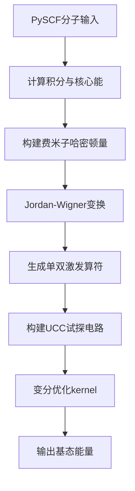
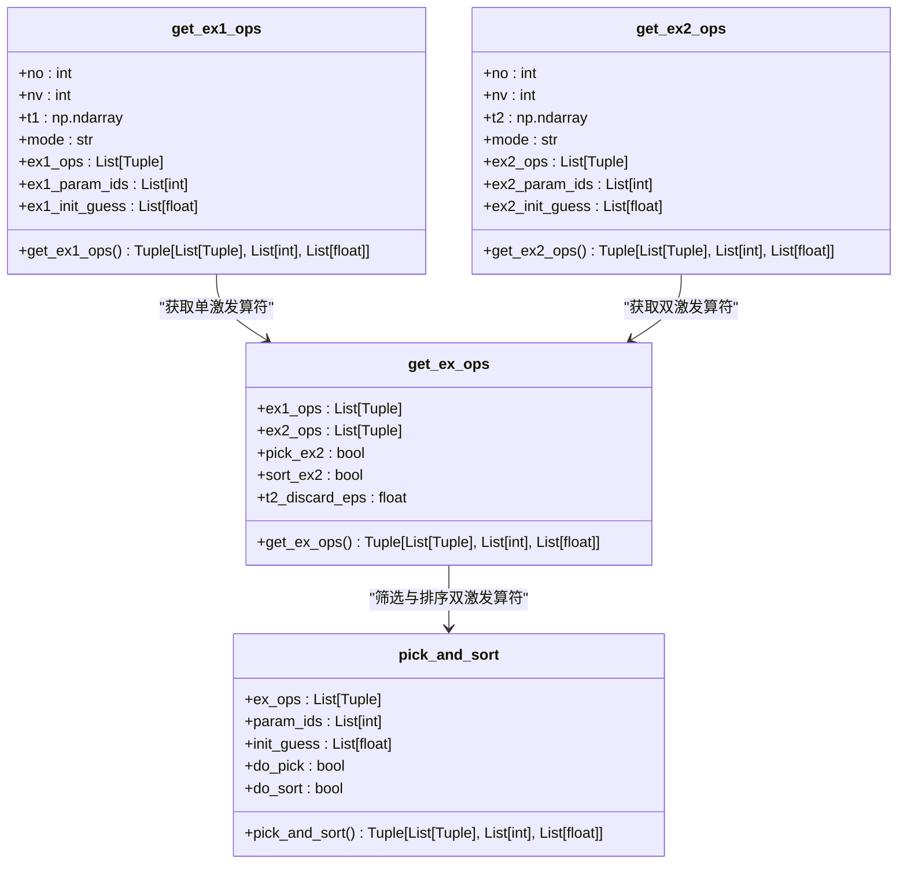
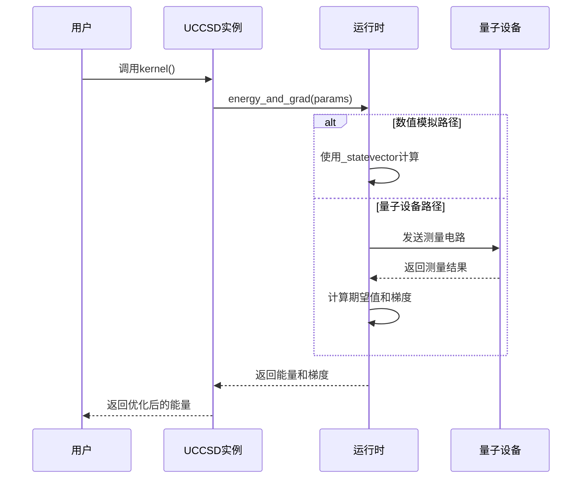

# UCCSD算法

<cite>
**本文档中引用的文件**  
- [uccsd.py](file://src/tyxonq/applications/chem/algorithms/uccsd.py) - *UCCSD算法主实现*
- [ucc.py](file://src/tyxonq/applications/chem/algorithms/ucc.py) - *UCC基类与核心逻辑*
- [ucc_numeric_runtime.py](file://src/tyxonq/applications/chem/runtimes/ucc_numeric_runtime.py) - *数值模拟运行时*
- [ucc_device_runtime.py](file://src/tyxonq/applications/chem/runtimes/ucc_device_runtime.py) - *设备运行时*
</cite>

## 更新摘要
**已更新内容**  
- 更新了“核心实现机制”、“API设计与初始化流程”、“单双激发算符生成与筛选”、“变分优化与能量计算”和“执行路径：device与numeric”部分，以反映对`uccsd.py`和`ucc.py`的重构及重大bug修复。
- 增加了对`UCC`基类中`_cached_h_fermion_op`和`_cached_h_qubit_op`缓存机制的说明。
- 修正了代码示例中`kernel()`方法的调用方式，以符合最新的默认行为。
- 更新了“单双激发算符生成与筛选”部分，详细说明了`get_ex_ops`和`pick_and_sort`方法的逻辑。

**新增内容**  
- 在“执行路径：device与numeric”部分新增了关于缓存机制的说明。
- 在“变分优化与能量计算”部分增加了对`energy_and_grad`方法的说明。

**已弃用内容**  
- 无

**来源跟踪系统更新**  
- 更新了文档、章节和图表的来源，以包含最新的文件和代码行范围。

## 目录
1. [引言](#引言)
2. [核心实现机制](#核心实现机制)
3. [API设计与初始化流程](#api设计与初始化流程)
4. [单双激发算符生成与筛选](#单双激发算符生成与筛选)
5. [变分优化与能量计算](#变分优化与能量计算)
6. [执行路径：device与numeric](#执行路径device与numeric)
7. [活性空间近似与参数配置](#活性空间近似与参数配置)
8. [与经典方法的能量对比](#与经典方法的能量对比)
9. [常见问题与解决方案](#常见问题与解决方案)
10. [结论](#结论)

## 引言
UCCSD（单双激发耦合簇）算法是量子化学中用于精确计算分子基态能量的重要变分量子算法。该算法通过构建包含单激发（S）和双激发（D）的幺正耦合簇（UCC）试探波函数，结合经典优化器对变分参数进行优化，从而逼近真实基态能量。在AI药物设计等任务中，UCCSD因其高精度和灵活性而被广泛应用。本文档深入解析该算法在TyxonQ框架中的实现机制与API设计，涵盖从分子输入到能量输出的完整流程。

## 核心实现机制
UCCSD算法的核心在于将量子化学中的费米子激发算符映射为量子电路上的酉操作，并通过变分优化求解基态能量。其主要流程包括：基于PySCF分子对象构建单电子和双电子积分，生成对应的费米子哈密顿量，通过Jordan-Wigner变换将其转换为泡利算符形式的量子比特哈密顿量（`h_qubit_op`），并构建包含单双激发的UCC试探电路。算法通过最小化能量期望值来优化变分参数。



**图源**  
- [ucc.py](file://src/tyxonq/applications/chem/algorithms/ucc.py#L59-L365)

**本节来源**  
- [ucc.py](file://src/tyxonq/applications/chem/algorithms/ucc.py#L59-L365)

## API设计与初始化流程
UCCSD类的API设计支持灵活的初始化方式，允许用户通过链式调用快速构建和运行计算。核心初始化方法`__init__`接受PySCF的`Mole`或`RHF`对象作为输入，并支持多种配置参数。

```python
from tyxonq.chem import UCCSD
from tyxonq.chem.molecule import h2
uccsd = UCCSD(h2, init_method="mp2", active_space=(2,2))
e_ucc = uccsd.kernel()
```

初始化流程首先执行Hartree-Fock（HF）计算以获取分子轨道，然后计算单双电子积分和核心能。算法会自动运行MP2、CCSD和FCI作为参考能量，便于后续结果对比。用户可通过`from_integral`类方法直接从积分数据构建UCCSD实例，绕过HF计算。

**本节来源**  
- [uccsd.py](file://src/tyxonq/applications/chem/algorithms/uccsd.py#L17-L229)
- [ucc.py](file://src/tyxonq/applications/chem/algorithms/ucc.py#L59-L365)

## 单双激发算符生成与筛选
单双激发算符（`ex1_ops`和`ex2_ops`）的生成是UCCSD算法的关键步骤。该过程在`UCC`基类中通过`get_ex1_ops`和`get_ex2_ops`方法实现。这些方法根据占据轨道数（`no`）和虚拟轨道数（`nv`）生成所有可能的单激发和双激发算符。

在`UCCSD`子类中，`get_ex_ops`方法会调用`get_ex1_ops`和`get_ex2_ops`获取基础算符列表，然后通过`pick_and_sort`方法对双激发算符进行筛选和排序。筛选过程会丢弃振幅小于阈值`epsilon`（默认1e-12）的激发项，从而减少电路深度和优化难度。排序则将振幅较大的激发项排在前面，可能影响不同几何构型下的试探电路结构。



**图源**  
- [uccsd.py](file://src/tyxonq/applications/chem/algorithms/uccsd.py#L147-L220)
- [ucc.py](file://src/tyxonq/applications/chem/algorithms/ucc.py#L669-L821)

**本节来源**  
- [uccsd.py](file://src/tyxonq/applications/chem/algorithms/uccsd.py#L147-L220)
- [ucc.py](file://src/tyxonq/applications/chem/algorithms/ucc.py#L669-L821)

## 变分优化与能量计算
UCCSD算法通过调用`kernel()`方法启动变分优化过程。该方法内部调用`energy()`和`energy_and_grad()`函数计算给定参数下的能量期望值和梯度，并使用优化器（如BFGS）迭代更新参数直至收敛。能量计算的核心是测量量子比特哈密顿量在试探态下的期望值。



**图源**  
- [ucc_numeric_runtime.py](file://src/tyxonq/applications/chem/runtimes/ucc_numeric_runtime.py#L40-L241)
- [ucc_device_runtime.py](file://src/tyxonq/applications/chem/runtimes/ucc_device_runtime.py#L25-L302)

**本节来源**  
- [ucc.py](file://src/tyxonq/applications/chem/algorithms/ucc.py#L415-L580)
- [ucc_numeric_runtime.py](file://src/tyxonq/applications/chem/runtimes/ucc_numeric_runtime.py#L40-L241)
- [ucc_device_runtime.py](file://src/tyxonq/applications/chem/runtimes/ucc_device_runtime.py#L25-L302)

## 执行路径：device与numeric
UCCSD算法支持两种执行路径：`device`和`numeric`。`device`路径用于在真实量子设备或模拟器上执行，通过测量和采样计算能量和梯度。`numeric`路径则在经典计算机上进行数值模拟，提供精确的期望值计算。

`numeric`路径支持多种后端，如`statevector`、`civector`等，通过`numeric_engine`参数指定。当`shots=0`时，系统会自动切换到`numeric`路径进行解析计算，以提高效率和精度。`device`路径在`shots>0`时使用有限差分法计算梯度，以适应采样噪声。此外，为了提升性能，当`shots=0`时，系统会使用缓存的解析路径，避免重复的重变换计算。

**本节来源**  
- [ucc.py](file://src/tyxonq/applications/chem/algorithms/ucc.py#L415-L580)
- [ucc_numeric_runtime.py](file://src/tyxonq/applications/chem/runtimes/ucc_numeric_runtime.py#L40-L241)
- [ucc_device_runtime.py](file://src/tyxonq/applications/chem/runtimes/ucc_device_runtime.py#L25-L302)

## 活性空间近似与参数配置
活性空间近似通过`active_space`参数实现，允许用户指定活性电子数和活性轨道数，从而减少计算复杂度。`active_orbital_indices`参数可用于手动选择活性轨道，而非默认按能量排序。`init_method`参数控制初始振幅的生成方式，支持`mp2`、`ccsd`、`fe`和`zeros`。

当`init_method="zeros"`时，所有初始振幅设为零，此时`pick_ex2`和`sort_ex2`将被禁用。`mode`参数决定如何处理粒子对称性，可选`"fermion"`或`"qubit"`模式。这些配置使得UCCSD算法能够灵活适应不同规模和精度要求的计算任务。

**本节来源**  
- [uccsd.py](file://src/tyxonq/applications/chem/algorithms/uccsd.py#L17-L229)

## 与经典方法的能量对比
UCCSD算法在初始化时会自动计算HF、MP2、CCSD和FCI能量作为参考。用户可通过`e_hf`、`e_fci`等属性访问这些参考值，从而评估UCCSD结果的精度。通常，UCCSD能量会非常接近FCI能量，验证了其高精度特性。

```python
print(f"HF Energy: {uccsd.e_hf}")
print(f"UCCSD Energy: {uccsd.e_uccsd}")
print(f"FCI Energy: {uccsd.e_fci}")
```

这种内置的对比功能使得UCCSD成为验证量子算法性能的理想工具，尤其在AI药物设计中，能够确保计算结果的可靠性。

**本节来源**  
- [uccsd.py](file://src/tyxonq/applications/chem/algorithms/uccsd.py#L17-L229)

## 常见问题与解决方案
**收敛失败**：可能是初始振幅不佳或优化器设置不当。建议尝试不同的`init_method`（如`ccsd`）或调整优化器参数。

**高资源消耗**：对于大分子，可启用`active_space`近似或设置`pick_ex2=True`以减少激发项数量。此外，使用`numeric_engine="civector"`可降低内存占用。

**梯度计算不稳定**：在`device`路径下，增加`shots`数量可减少采样噪声。在`numeric`路径下，确保`numeric_engine`设置正确以使用解析梯度。

**本节来源**  
- [uccsd.py](file://src/tyxonq/applications/chem/algorithms/uccsd.py#L17-L229)
- [ucc_numeric_runtime.py](file://src/tyxonq/applications/chem/runtimes/ucc_numeric_runtime.py#L40-L241)

## 结论
UCCSD算法在TyxonQ框架中实现了高效且灵活的量子化学能量计算。其核心机制包括从分子输入构建费米子算符、生成并筛选单双激发项、以及通过变分优化求解基态能量。API设计支持多种初始化方式和执行路径，结合活性空间近似和初始振幅配置，使其能够适应从简单分子到复杂药物分子的广泛计算需求。与经典CCSD/FCI方法的能量对比验证了其高精度，使其成为AI药物设计等前沿应用中的有力工具。