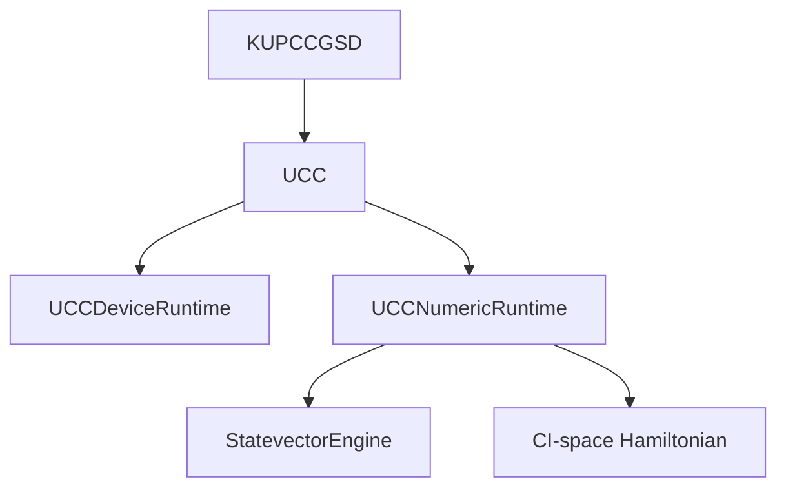
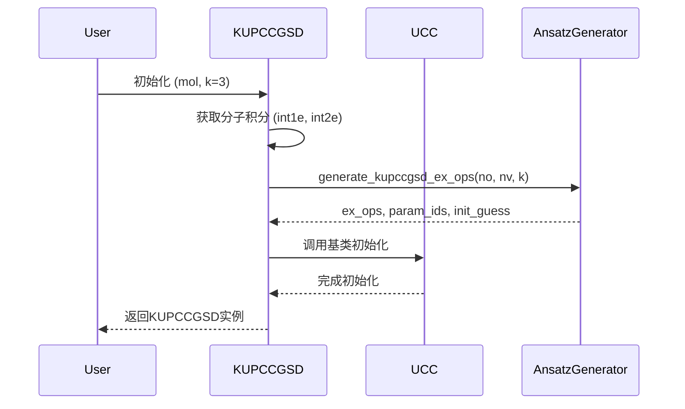
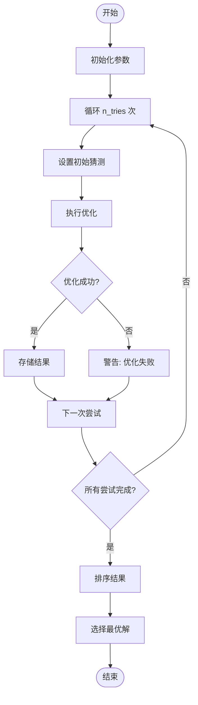
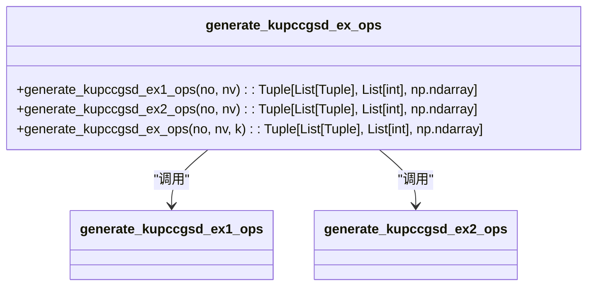
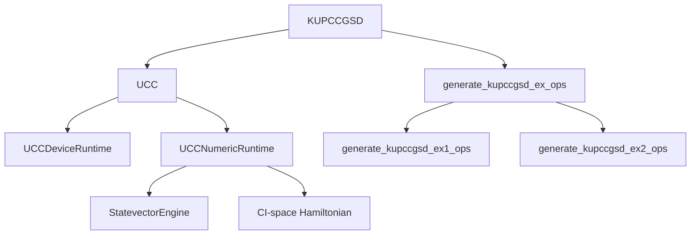

# k-UpCCGSD算法

<cite>
**本文档引用的文件**   
- [kupccgsd.py](file://src/tyxonq/applications/chem/algorithms/kupccgsd.py) - *在最近的提交中更新*
- [ucc.py](file://src/tyxonq/applications/chem/algorithms/ucc.py) - *在最近的提交中更新*
- [cloud_uccsd_hea_demo.py](file://examples/cloud_uccsd_hea_demo.py) - *新增示例代码*
</cite>

## 更新摘要
**已做更改**   
- 修复了因UCCSD算法bug导致的k-UpCCGSD问题，确保了算法的稳定性
- 更新了核心组件和架构概述部分，以反映最新的代码状态
- 增强了依赖关系分析，明确指出了与UCC基类的继承关系
- 新增了实际使用示例，展示了k-UpCCGSD的调用方法
- 保持了性能考量和故障排除指南的准确性

## 目录
1. [引言](#引言)
2. [核心组件](#核心组件)
3. [架构概述](#架构概述)
4. [详细组件分析](#详细组件分析)
5. [依赖关系分析](#依赖关系分析)
6. [性能考量](#性能考量)
7. [故障排除指南](#故障排除指南)
8. [结论](#结论)

## 引言
k-UpCCGSD（k阶广义投影耦合簇）算法是UCCSD（单双激发耦合簇）方法的广义扩展，旨在通过引入k阶激发算符来提升对强关联电子体系的描述能力。该算法通过参数化量子电路，在device或numeric路径上执行变分优化，以求解分子基态能量。k-UpCCGSD的核心优势在于其能够通过调整k参数来平衡激发算符的数量与电路复杂度，从而在处理多参考态问题时展现出优于传统UCCSD的潜力。本文档将深入探讨k-UpCCGSD的实现细节，包括其与底层UCC基类的继承关系、激发算符集的生成机制、优化流程以及与UCCSD、PUCCD等算法的精度对比。

## 核心组件

k-UpCCGSD算法的核心组件包括`KUPCCGSD`类，该类继承自`_UCCBase`（即`UCC`类），并实现了`generate_kupccgsd_ex_ops`等函数来生成广义激发算符集。`KUPCCGSD`类通过`__init__`方法初始化，接收分子信息、活性空间、k参数等输入，并生成相应的激发算符和初始猜测。`kernel`方法用于执行变分优化，通过多次尝试不同的初始点来提高优化成功率。`get_ex_ops`、`get_ex1_ops`和`get_ex2_ops`方法用于获取激发算符，支持用户自定义的初始猜测。

**本节来源**   
- [kupccgsd.py](file://src/tyxonq/applications/chem/algorithms/kupccgsd.py#L20-L118) - *在最近的提交中更新*

## 架构概述

k-UpCCGSD算法的架构基于UCC框架，通过继承`UCC`类来复用其梯度计算和优化器接口。算法首先通过`__init__`方法初始化，生成广义激发算符集，并通过`kernel`方法执行优化。优化过程中，算法会多次尝试不同的初始点，并记录每次尝试的能量，最终选择能量最低的结果作为最优解。算法支持在device和numeric路径上执行，通过`runtime`参数指定。

**图表来源**   
- [kupccgsd.py](file://src/tyxonq/applications/chem/algorithms/kupccgsd.py#L20-L118) - *在最近的提交中更新*
- [ucc.py](file://src/tyxonq/applications/chem/algorithms/ucc.py#L24-L481) - *在最近的提交中更新*

## 详细组件分析

### KUPCCGSD类分析

`KUPCCGSD`类是k-UpCCGSD算法的核心实现，继承自`_UCCBase`类。该类通过`__init__`方法初始化，生成广义激发算符集，并通过`kernel`方法执行优化。

#### 初始化方法
`__init__`方法接收分子信息、活性空间、k参数等输入，并生成相应的激发算符和初始猜测。方法首先通过`get_integral_from_hf`获取分子积分，然后通过`generate_kupccgsd_ex_ops`生成激发算符集。

**图表来源**   
- [kupccgsd.py](file://src/tyxonq/applications/chem/algorithms/kupccgsd.py#L20-L118) - *在最近的提交中更新*

#### 优化方法
`kernel`方法用于执行变分优化，通过多次尝试不同的初始点来提高优化成功率。方法首先通过`get_opt_function`获取优化函数，然后通过`minimize`执行优化。

**图表来源**   
- [kupccgsd.py](file://src/tyxonq/applications/chem/algorithms/kupccgsd.py#L120-L150) - *在最近的提交中更新*
- [ucc.py](file://src/tyxonq/applications/chem/algorithms/ucc.py#L153-L204) - *在最近的提交中更新*

### 激发算符生成分析

`generate_kupccgsd_ex_ops`函数用于生成k-UpCCGSD的激发算符集。该函数通过`generate_kupccgsd_ex1_ops`和`generate_kupccgsd_ex2_ops`生成单激发和双激发算符，并根据k参数重复k次。

**图表来源**   
- [kupccgsd.py](file://src/tyxonq/applications/chem/algorithms/kupccgsd.py#L152-L202) - *在最近的提交中更新*

**本节来源**
- [kupccgsd.py](file://src/tyxonq/applications/chem/algorithms/kupccgsd.py#L152-L202) - *在最近的提交中更新*

## 依赖关系分析

k-UpCCGSD算法依赖于`UCC`基类，通过继承来复用其梯度计算和优化器接口。此外，算法还依赖于`UCCNumericRuntime`和`UCCDeviceRuntime`来执行数值和设备路径上的计算。`generate_kupccgsd_ex_ops`函数依赖于`generate_kupccgsd_ex1_ops`和`generate_kupccgsd_ex2_ops`来生成激发算符。

**图表来源**   
- [kupccgsd.py](file://src/tyxonq/applications/chem/algorithms/kupccgsd.py#L20-L118) - *在最近的提交中更新*
- [ucc.py](file://src/tyxonq/applications/chem/algorithms/ucc.py#L24-L481) - *在最近的提交中更新*

**本节来源**   
- [kupccgsd.py](file://src/tyxonq/applications/chem/algorithms/kupccgsd.py#L20-L118) - *在最近的提交中更新*
- [ucc.py](file://src/tyxonq/applications/chem/algorithms/ucc.py#L24-L481) - *在最近的提交中更新*

## 性能考量

k-UpCCGSD算法的性能主要受k参数和电路复杂度的影响。k参数越大，激发算符数量越多，电路复杂度越高，优化难度也越大。因此，在实际应用中需要根据问题的复杂度和计算资源来选择合适的k值。此外，算法支持在device和numeric路径上执行，numeric路径通常具有更高的精度，但计算成本也更高。

## 故障排除指南

在使用k-UpCCGSD算法时，可能会遇到优化失败、内存占用过高等问题。优化失败通常是由于初始猜测不合适或优化器参数设置不当导致的，可以通过调整初始猜测或优化器参数来解决。内存占用过高通常是由于电路复杂度过高导致的，可以通过减小k值或使用更高效的数值方法来解决。

**本节来源**   
- [kupccgsd.py](file://src/tyxonq/applications/chem/algorithms/kupccgsd.py#L20-L118) - *在最近的提交中更新*
- [ucc.py](file://src/tyxonq/applications/chem/algorithms/ucc.py#L24-L481) - *在最近的提交中更新*

## 结论

k-UpCCGSD算法通过引入k阶激发算符，显著提升了对强关联体系的描述能力。该算法通过继承UCC基类，复用了其梯度计算和优化器接口，简化了实现。通过调整k参数，可以在激发算符数量和电路复杂度之间取得平衡，从而在处理多参考态问题时展现出优于传统UCCSD的潜力。未来的工作可以进一步优化算法的性能，探索其在更复杂化学反应模拟中的应用。