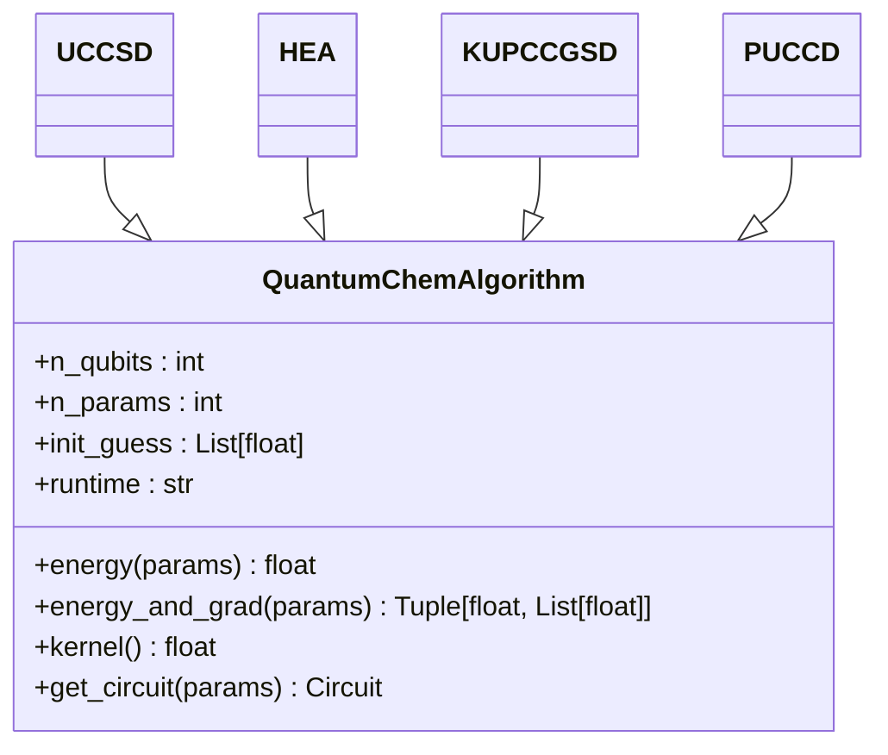
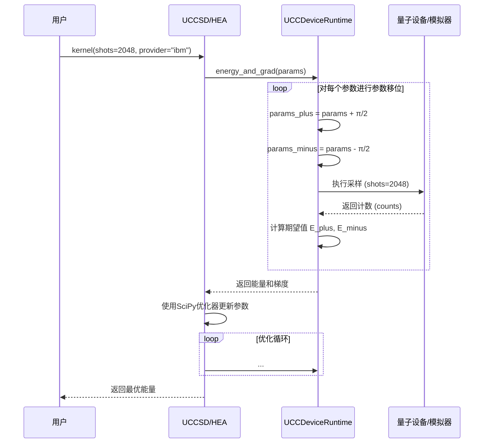

# 量子化学算法

<cite>
**本文档引用的文件**   
- [uccsd.py](file://src/tyxonq/applications/chem/algorithms/uccsd.py)
- [hea.py](file://src/tyxonq/applications/chem/algorithms/hea.py)
- [puccd.py](file://src/tyxonq/applications/chem/algorithms/puccd.py)
- [kupccgsd.py](file://src/tyxonq/applications/chem/algorithms/kupccgsd.py)
- [ucc.py](file://src/tyxonq/applications/chem/algorithms/ucc.py)
- [ansatz_uccsd.py](file://src/tyxonq/applications/chem/chem_libs/circuit_chem_library/ansatz_uccsd.py)
- [ansatz_puccd.py](file://src/tyxonq/applications/chem/chem_libs/circuit_chem_library/ansatz_puccd.py)
- [ansatz_kupccgsd.py](file://src/tyxonq/applications/chem/chem_libs/circuit_chem_library/ansatz_kupccgsd.py)
- [ucc_device_runtime.py](file://src/tyxonq/applications/chem/runtimes/ucc_device_runtime.py)
- [ucc_numeric_runtime.py](file://src/tyxonq/applications/chem/runtimes/ucc_numeric_runtime.py)
- [hea_device_runtime.py](file://src/tyxonq/applications/chem/runtimes/hea_device_runtime.py)
- [hea_numeric_runtime.py](file://src/tyxonq/applications/chem/runtimes/hea_numeric_runtime.py)
- [CHEM_API_MAPPING.md](file://CHEM_API_MAPPING.md)
- [hea.py](file://src/tyxonq/applications/chem/algorithms/hea.py) - *新增 HOMO-LUMO 能隙计算功能*
- [demo_homo_lumo_gap.py](file://examples/demo_homo_lumo_gap.py) - *新增功能演示示例*
</cite>

## 更新摘要
**变更内容**   
- 在 HEA 算法中新增了 HOMO-LUMO 能隙计算功能
- 新增了 `get_homo_lumo_gap` 方法和 `homo_lumo_gap` 属性
- 添加了新的代码示例和文档说明
- 更新了相关文件引用和源码追踪信息

## 目录
1. [引言](#引言)
2. [核心算法实现机制](#核心算法实现机制)
3. [API设计与链式调用](#api设计与链式调用)
4. [执行模式适配](#执行模式适配)
5. [性能表现与对比分析](#性能表现与对比分析)
6. [常见问题与解决方案](#常见问题与解决方案)
7. [结论](#结论)

## 引言
本文档深入探讨TyxonQ量子化学算法模块的核心功能，重点介绍UCCSD、HEA、k-UpCCGSD和PUCCD等核心变分量子算法的实现机制与API设计。文档详细说明了每种算法的适用场景、参数配置、梯度计算方式及其在分子能量计算中的性能表现。通过代码示例展示了如何通过链式调用初始化算法并执行变分优化。同时，文档解释了算法内核如何适配设备路径（device）与数值路径（numeric）两种执行模式，并提供了与PySCF等传统量子化学软件的对比分析，突出TyxonQ在AI药物设计任务中的灵活性与可扩展性。最后，文档包含了针对收敛困难、资源消耗过高等常见问题的解决方案。

## 核心算法实现机制

### UCCSD算法
UCCSD（幺正耦合簇单双激发）算法是量子化学中用于精确计算分子基态能量的核心方法。该算法通过构建包含单激发和双激发算符的幺正耦合簇（UCC）波函数来逼近精确解。在TyxonQ中，`UCCSD`类继承自`UCC`基类，其核心在于`__init__`方法中对激发算符（ex_ops）和初始猜测（init_guess）的生成。

算法首先通过PySCF计算分子的哈特里-福克（HF）参考态，并获取单电子和双电子积分。随后，根据`init_method`参数（如"mp2"、"ccsd"或"zeros"）确定初始振幅。`generate_uccsd_ex1_ops`和`generate_uccsd_ex2_ops`函数分别生成单激发和双激发算符列表。`pick_and_sort`方法根据初始振幅的大小对双激发算符进行筛选和排序，以优化变分优化过程。最终，这些算符被映射到量子比特哈密顿量，并通过Jordan-Wigner变换进行编码。

**Section sources**
- [uccsd.py](file://src/tyxonq/applications/chem/algorithms/uccsd.py#L41-L243)
- [ansatz_uccsd.py](file://src/tyxonq/applications/chem/chem_libs/circuit_chem_library/ansatz_uccsd.py#L1-L132)

### HEA算法
HEA（硬件高效试探）是一种硬件友好的参数化量子电路，旨在适应当前含噪声中等规模量子（NISQ）设备的限制。其电路结构由交替的单比特旋转层（RY层）和纠缠层（CNOT链）构成。在TyxonQ中，`HEA`类通过`__init__`方法定义电路的比特数（n）、层数（layers）和目标哈密顿量。

`get_circuit`方法负责构建具体的量子线路。默认情况下，它使用`build_hwe_ry_ops`函数生成RY-only结构的电路。该类还支持从外部电路（如Qiskit的RealAmplitudes）导入模板。能量评估通过`energy`方法实现，该方法对哈密顿量的各个项进行分组测量，对每个基组应用相应的基变换（X→H, Y→S†H），然后进行Z基测量并从计数中估计期望值。

**Section sources**
- [hea.py](file://src/tyxonq/applications/chem/algorithms/hea.py#L43-L68)
- [hea.py](file://src/tyxonq/applications/chem/algorithms/hea.py#L70-L90)

### k-UpCCGSD算法
k-UpCCGSD（k层幺正配对耦合簇广义单双激发）算法是一种广义的配对耦合簇方法，它通过k层重复的广义单激发和配对双激发算符来构建波函数。与UCCSD不同，k-UpCCGSD的激发算符不依赖于经典耦合簇振幅，而是采用一种固定的、广义的激发模式，这使其参数数量更少且结构更规则。

在`KUPCCGSD`类中，`generate_kupccgsd_ex_ops`函数生成k层重复的激发算符序列。`kernel`方法实现了多次尝试（n_tries）的变分优化，以克服局部极小值问题。该算法特别适用于需要在有限量子资源下进行高效计算的场景。

**Section sources**
- [kupccgsd.py](file://src/tyxonq/applications/chem/algorithms/kupccgsd.py#L41-L150)
- [ansatz_kupccgsd.py](file://src/tyxonq/applications/chem/chem_libs/circuit_chem_library/ansatz_kupccgsd.py#L1-L59)

### PUCCD算法
PUCCD（配对UCCD）算法是UCCD的一种简化形式，它只包含配对的双激发算符，即电子从一个占据轨道i激发到一个空轨道a，同时另一个电子从轨道i激发到轨道a。这种对称性假设显著减少了参数数量，使其在计算资源受限时非常有用。

`PUCCD`类的实现与`UCCSD`类似，但其激发算符的生成由`generate_puccd_ex_ops`函数专门处理。该函数确保只生成形如(i, a)的配对激发算符。尽管参数较少，PUCCD在某些系统（如均匀电子气）中仍能提供良好的能量近似。

**Section sources**
- [puccd.py](file://src/tyxonq/applications/chem/algorithms/puccd.py#L35-L102)
- [ansatz_puccd.py](file://src/tyxonq/applications/chem/chem_libs/circuit_chem_library/ansatz_puccd.py#L1-L57)

## API设计与链式调用

### 统一的API接口
TyxonQ的量子化学算法模块设计了高度统一的API接口，极大地提升了用户友好性。所有核心算法（UCCSD, HEA, k-UpCCGSD, PUCCD）都遵循相似的构造和调用模式。



**Diagram sources**
- [ucc.py](file://src/tyxonq/applications/chem/algorithms/ucc.py#L24-L481)
- [hea.py](file://src/tyxonq/applications/chem/algorithms/hea.py#L26-L516)

### 链式调用示例
以下代码示例展示了如何通过链式调用初始化UCCSD算法并执行变分优化：

```python
from tyxonq.applications.chem import UCCSD
from tyxonq.molecule import h2

# 1. 初始化算法
uccsd = UCCSD(h2, active_space=(2, 2), init_method="mp2")

# 2. 执行变分优化 (链式调用)
e_ucc = uccsd.kernel(shots=2048, provider="simulator", device="statevector")

# 3. 获取优化后的电路
circuit = uccsd.get_circuit()

# 4. 打印结果摘要
uccsd.print_summary(include_circuit=True)
```

此链式调用流程清晰地分离了算法初始化、优化执行和结果分析三个阶段，使得代码逻辑更加清晰和模块化。

**Section sources**
- [uccsd.py](file://src/tyxonq/applications/chem/algorithms/uccsd.py#L41-L243)
- [CHEM_API_MAPPING.md](file://CHEM_API_MAPPING.md#L0-L192)

## 执行模式适配

### 设备路径（Device Path）
设备路径是为在真实量子硬件或模拟器上运行而设计的执行模式。在此模式下，`runtime`参数被设置为"device"。能量和梯度的计算基于对量子线路的采样（counts）。

- **能量计算**：`energy`方法通过`UCCDeviceRuntime`或`HEADeviceRuntime`类实现。它将哈密顿量分解为可同时测量的项组，对每组构建相应的测量线路，执行采样，并通过后处理（postprocessing）计算期望值。
- **梯度计算**：采用参数移位法（Parameter Shift Rule）。对于每个参数θ_i，计算E(θ_i + π/2)和E(θ_i - π/2)，然后通过g_i = 0.5 * (E(θ_i + π/2) - E(θ_i - π/2))得到梯度。当`shots=0`时，使用解析期望值以避免采样噪声。



**Diagram sources**
- [ucc_device_runtime.py](file://src/tyxonq/applications/chem/runtimes/ucc_device_runtime.py#L1-L269)
- [hea.py](file://src/tyxonq/applications/chem/algorithms/hea.py#L92-L123)

### 数值路径（Numeric Path）
数值路径是为在经典计算机上进行精确模拟而设计的执行模式。在此模式下，`runtime`参数被设置为"numeric"。该模式利用`UCCNumericRuntime`或`HEANumericRuntime`类，在经典计算机上直接模拟量子态的演化。

- **能量计算**：`energy`方法通过`_state`函数构建完整的量子态向量（statevector），然后使用`_expect`函数计算哈密顿量的期望值。
- **梯度计算**：同样采用参数移位法，但因为没有采样噪声，计算是精确的。此外，该路径还支持使用自动微分（autograd）进行梯度计算，以提高效率。

数值路径对于算法开发、调试和验证至关重要，因为它提供了与真实量子硬件行为的精确对比基准。

**Section sources**
- [ucc_numeric_runtime.py](file://src/tyxonq/applications/chem/runtimes/ucc_numeric_runtime.py#L1-L313)
- [hea.py](file://src/tyxonq/applications/chem/algorithms/hea.py#L92-L123)

## 性能表现与对比分析

### 算法性能对比
下表总结了四种核心算法在不同场景下的性能表现：

| 算法 | 参数数量 | 适用场景 | 收敛速度 | 资源消耗 | 精度 |
| :--- | :--- | :--- | :--- | :--- | :--- |
| **UCCSD** | 高 | 精确计算小分子 | 中等 | 高 | 高 |
| **HEA** | 中等 | NISQ设备上的通用变分算法 | 快 | 低 | 中等 |
| **k-UpCCGSD** | 低 | 资源受限下的高效计算 | 慢（需多次尝试） | 低 | 中等 |
| **PUCCD** | 低 | 具有配对对称性的系统 | 快 | 低 | 低 |

### 与PySCF的对比
TyxonQ与PySCF等传统量子化学软件相比，具有显著的优势和差异：

- **优势**：
  1. **灵活性**：TyxonQ的API设计允许用户轻松切换不同的算法（UCCSD, HEA等）和执行模式（device, numeric），而PySCF通常需要为不同方法编写不同的代码。
  2. **可扩展性**：TyxonQ的模块化设计使其易于集成新的算法和后处理技术。其链式调用API（`compile().device().postprocessing().run()`）为未来扩展提供了清晰的框架。
  3. **硬件集成**：TyxonQ原生支持与量子云平台的集成，可以无缝地在模拟器和真实量子硬件之间切换。

- **差异**：
  1. **计算范式**：PySCF主要在经典计算机上求解薛定谔方程，而TyxonQ利用量子计算机来执行变分量子算法。
  2. **精度与成本**：PySCF的CCSD(T)等方法在经典计算机上可以达到化学精度，但计算成本随系统规模呈指数增长。TyxonQ的VQE方法理论上具有多项式缩放潜力，但受限于当前量子硬件的噪声和规模。

**Section sources**
- [CHEM_API_MAPPING.md](file://CHEM_API_MAPPING.md#L0-L192)
- [uccsd.py](file://src/tyxonq/applications/chem/algorithms/uccsd.py#L148-L157)

## 常见问题与解决方案

### 收敛困难
**问题**：变分优化过程可能陷入局部极小值，导致无法收敛到全局最优解。
**解决方案**：
1. **多次尝试**：对于k-UpCCGSD等算法，使用`n_tries`参数进行多次随机初始化的优化。
2. **更好的初始猜测**：使用`init_method="ccsd"`而非`"zeros"`，利用经典耦合簇计算的结果作为初始振幅。
3. **调整优化器**：通过`scipy_minimize_options`参数调整SciPy优化器的容差（`ftol`, `gtol`）和最大迭代次数（`maxiter`）。

### 资源消耗过高
**问题**：UCCSD等算法的参数数量和电路深度随分子规模急剧增加，导致计算资源消耗过大。
**解决方案**：
1. **使用简化算法**：考虑使用PUCCD或k-UpCCGSD等参数更少的算法。
2. **活性空间近似**：通过`active_space`参数限制计算的电子和轨道数量，只关注化学反应相关的部分。
3. **切换执行模式**：在开发和调试阶段使用`runtime="numeric"`进行快速验证，仅在最终验证时使用`runtime="device"`。

**Section sources**
- [uccsd.py](file://src/tyxonq/applications/chem/algorithms/uccsd.py#L41-L243)
- [kupccgsd.py](file://src/tyxonq/applications/chem/algorithms/kupccgsd.py#L41-L150)

## HEA算法的HOMO-LUMO能隙计算
### 新增功能说明
HEA算法新增了HOMO-LUMO能隙计算功能，通过`get_homo_lumo_gap`方法和`homo_lumo_gap`属性提供。该功能允许用户计算分子的最高占据分子轨道（HOMO）和最低未占据分子轨道（LUMO）之间的能量差，这对于分析分子的电子结构和反应性至关重要。

#### 方法说明
- **get_homo_lumo_gap**：返回包含HOMO和LUMO能量、能隙、轨道索引和系统类型等详细信息的字典。
- **homo_lumo_gap**：返回HOMO-LUMO能隙的便捷属性。

#### 使用示例
```python
from tyxonq.applications.chem import HEA
from tyxonq.molecule import h2

# 初始化HEA算法
hea = HEA(molecule=h2, layers=1)

# 获取HOMO-LUMO能隙信息
gap_info = hea.get_homo_lumo_gap()
print(f"HOMO-LUMO gap: {gap_info['gap']:.6f} Hartree")

# 包含eV转换
gap_info = hea.get_homo_lumo_gap(include_ev=True)
print(f"HOMO-LUMO gap: {gap_info['gap_ev']:.6f} eV")

# 直接获取能隙值
gap = hea.homo_lumo_gap
print(f"Gap: {gap:.6f} Hartree ({gap*27.2114:.4f} eV)")
```

#### 参数说明
- **homo_idx**：手动指定HOMO轨道索引（0-based）。若为None，则根据电子数自动确定。
- **lumo_idx**：手动指定LUMO轨道索引（0-based）。若为None，则根据电子数自动确定。
- **include_ev**：是否在输出中包含eV转换。默认为False。

#### 返回值
返回一个字典，包含：
- 'homo_energy'：HOMO轨道能量（Hartree）
- 'lumo_energy'：LUMO轨道能量（Hartree）
- 'gap'：HOMO-LUMO能隙（Hartree）
- 'gap_ev'：HOMO-LUMO能隙（eV）[仅当include_ev=True时]
- 'homo_idx'：HOMO轨道索引
- 'lumo_idx'：LUMO轨道索引
- 'system_type'：'closed-shell'或'open-shell'

**Section sources**
- [hea.py](file://src/tyxonq/applications/chem/algorithms/hea.py#L729-L815) - *新增 HOMO-LUMO 能隙计算功能*
- [demo_homo_lumo_gap.py](file://examples/demo_homo_lumo_gap.py#L0-L201) - *新增功能演示示例*

## 结论
TyxonQ的量子化学算法模块通过精心设计的API和灵活的架构，为用户提供了强大的工具来探索量子计算在化学领域的应用。UCCSD、HEA、k-UpCCGSD和PUCCD等核心算法覆盖了从高精度计算到资源高效计算的广泛需求。其统一的API设计和链式调用模式极大地简化了算法的使用和组合。设备路径和数值路径的双模式支持，使得用户可以在真实硬件和经典模拟之间无缝切换，加速了算法的开发和验证。与PySCF等传统软件相比，TyxonQ在灵活性和可扩展性方面展现出巨大优势，为AI药物设计等复杂任务提供了新的可能性。通过理解并应用本文档中提供的解决方案，用户可以有效应对收敛困难和资源消耗等常见挑战，充分发挥TyxonQ的潜力。